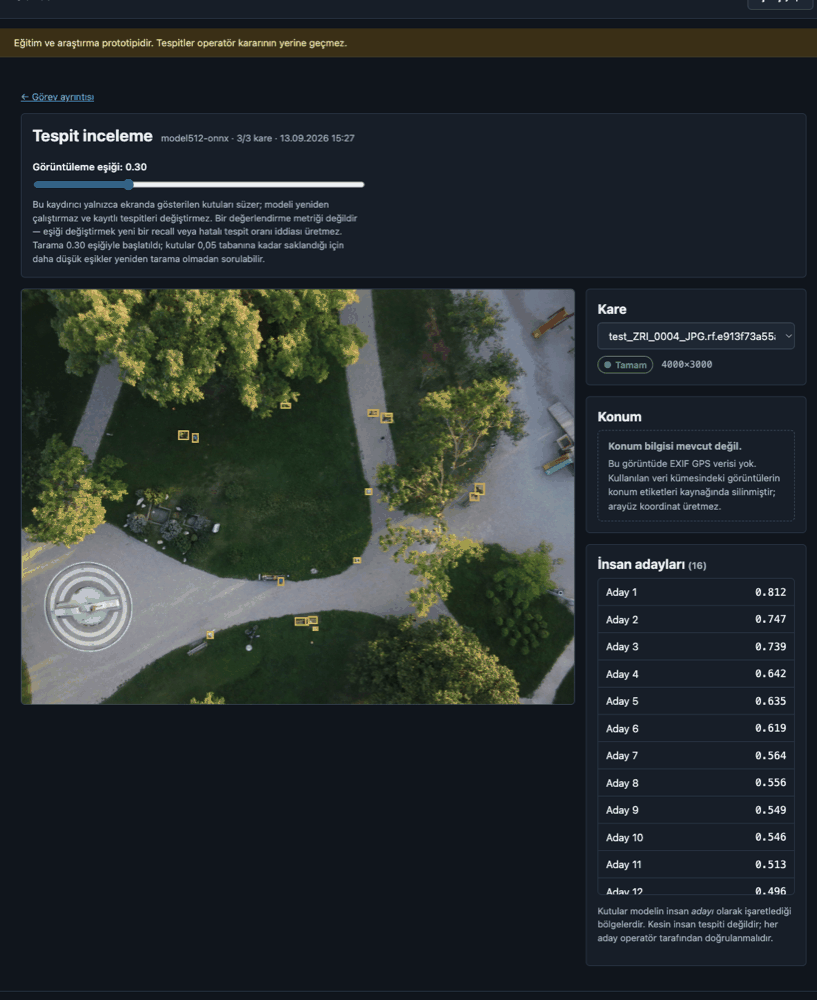
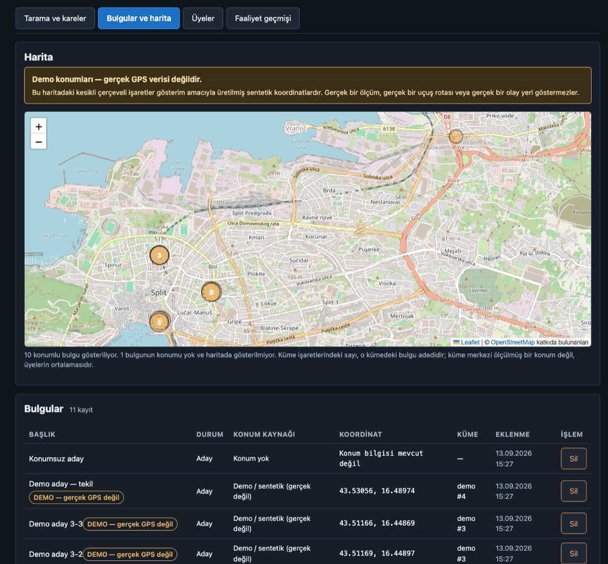
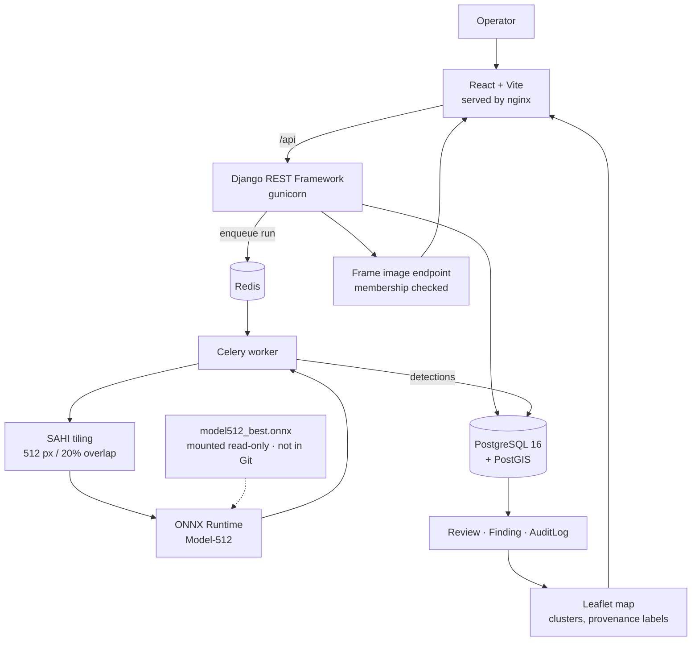

# Gözcü

**Aerial search-and-rescue detection assistant.**

Gözcü scans drone photographs of search areas and marks regions that may contain
a person, so an operator can review them in order instead of scrolling through
hundreds of 12-megapixel images. It does not decide anything — it shows
candidates and keeps a record of what the operator decided about each one.

Undergraduate graduation project. Research and education only.

[English](README.md) · [Türkçe](README.tr.md)

[](https://github.com/onurrkayaa/gozcu/actions/workflows/backend.yml)
[](https://github.com/onurrkayaa/gozcu/actions/workflows/frontend.yml)
[](https://github.com/onurrkayaa/gozcu/actions/workflows/dagitim.yml)
[](LICENSE)

---



*Detection review. Boxes are regions the model marked as human **candidates**, not
confirmed detections. The threshold slider filters what is drawn — it does not
re-run the model. The image carries no EXIF GPS, so the location panel says so
instead of showing a coordinate.*



*Findings on a map, clustered by a 50 m rule. **The coordinates in this
screenshot are synthetic demo data, not real GPS** — the warning above the map
cannot be dismissed, and every record is tagged at the data level too.*

---

## What it is

Photographs from a search flight are large (4000×3000 px) and the person being
looked for is small: the median annotated box in the dataset is 60×59 px, about
0.03% of the image area. Handing such an image straight to a detector downscales
it to the model's 640 px input, which shrinks that median target to under 10 px
across — too small to detect reliably.

Gözcü cuts every image into 512 px tiles with 20% overlap (using SAHI), runs the
detector on each tile, and merges the results, so targets keep their original
scale. Candidates then go into a review queue.

## What it is not

- Not a deployed, certified or field-validated system.
- No claim of fitness for emergency response is made.
- It does not replace search teams or any established SAR procedure.
- Its measured accuracy is far below anything that should be relied on.

Every output is meant for review by a human operator. That sentence is also
printed on every page of the application and cannot be dismissed.

## Measured result

A model trained on our own tiled data (**Model-512**, Ultralytics `yolo11n`
trained on 512 px tiles) compared against an off-the-shelf COCO baseline on the
**same test split, the same protocol and the same false-positive budget**.

Test split: 157 images, 970 targets. Protocol: tile 512, overlap 0.20, IoU 0.30, CPU.

| Run | conf | Recall | FP / image |
|---|---|---|---|
| Baseline-512 (COCO weights, no training) | 0.30 | 0.3804 | 1.81 |
| Model-512 (trained on our data) | 0.53 | 0.6825 | 1.75 |

The comparison point is the **budget, not the threshold**. Comparing two models
at the same confidence value does not guarantee comparing them at the same place
on their curves, and what reaches the operator is not the confidence number but
how many false boxes they have to look at per image. So the baseline's load
(1.81 FP/image) was fixed and the first point on Model-512's curve that fits
inside it was read off — conf 0.53.

At that point recall goes from 0.3804 to 0.6825 (1.79×, 293 more targets found
in the same 157 images) while the false-positive load does not increase
(1.75 vs 1.81).

Sources: `reports/test_taban_cizgisi.csv`, `reports/test_model512.csv`,
`reports/esik_taramasi.csv`, produced by `scripts/01_taban_cizgisi.py`.

This number is **not comparable** to the mAP reported by the training run — that
is a different split, a different protocol and a different metric.

### Read it with these limits

- **Source familiarity.** 939 of the 970 test targets come from a single capture
  source (ZRI), and ZRI also appears in training. The result holds for a model
  familiar with that source; it is not an average over varied terrain. This is
  *not* data leakage: SHA-256 digests of all 1579 images show zero file overlap
  between splits.
- **Model-320 was never trained.** The fourth cell of the 2×2 experiment matrix
  (tile size × model scale) is empty, so the interaction was not measured.
- **No real GPS.** None of the 1579 images carries EXIF GPS, so the interface has
  no real coordinate to show and every map coordinate here is synthetic.
- **The false-positive context study did not reach its own threshold.** The
  protocol required 100 paired comparisons for a finding; 45 valid pairs were
  collected. The result is recorded as *interesting but unproven*, and nothing in
  the product was changed because of it.

The full argument, the refuted hypotheses and every table are in the report
(Turkish): [rapor/GOZCU_RAPOR_TR.md](rapor/GOZCU_RAPOR_TR.md).

## What works

- JWT session; every endpoint requires authentication except the health check.
- Missions, frames and inference runs, with per-frame status.
- Asynchronous scanning: starting a run returns `202` and queues the work in
  Celery/Redis; the interface polls for progress.
- Tiled inference through SAHI on an ONNX Runtime session that is reused across
  frames in a worker process.
- Access is scoped to mission membership (owner / operator / viewer). A
  non-member gets a consistent `404`, so the existence of a mission does not leak.
- `/media/` is closed. Images are served only through an endpoint that checks
  membership and reads the filename from the database, never from the request.
- Operator review stored separately from model output, so the two never mix.
- Findings with explicit location provenance: `exif`, `manual`, `demo` or `none`.
  A missing location stays `NULL` — it is never turned into 0,0.
- Union-Find clustering of nearby findings with a 50 m rule (PostGIS), and a
  Leaflet map that only opens when there is something to show.
- Append-only audit log; updates and deletes are refused at the ORM level.
- Recovery after a killed worker: the frame is redelivered and completes, with no
  lost, stuck or duplicated records.
- Test suites for backend, frontend and the analysis scripts, all run in CI.

Things that are not built are listed under [Status](#status), not here.

## Architecture



More detail: [docs/ARCHITECTURE.md](docs/ARCHITECTURE.md).

## Stack

**Backend** — Python 3.13, Django 5.2, Django REST Framework 3.18, SimpleJWT 5.5,
PostgreSQL 16 + PostGIS 3.5, Celery 5.6, Redis 8, gunicorn 23, whitenoise 6.11

**Model** — Ultralytics `yolo11n` (8.4.144), SAHI 0.12.6, ONNX Runtime 1.30,
trained on Kaggle GPU, measured on CPU

**Frontend** — React 19, TypeScript 5.9, Vite 7, TanStack Query 5, Leaflet 1.9,
Vitest 3

**Infrastructure** — Docker Compose, nginx 1.29, GitHub Actions

## Quick start

### Demo — one command

Docker Desktop is the only prerequisite. Nothing else needs to be installed.

```bash
git clone https://github.com/onurrkayaa/gozcu.git
cd gozcu
./demo.sh
```

The script creates `.env` with a freshly generated secret key and database
password, builds the images, starts five services, applies migrations, seeds an
end-to-end demo (users, a mission, frames, a real scan through Celery,
detections, reviews, findings, clustering, audit entries) and prints the address
and the demo password.

Then open **<http://localhost:8080>**.

If the ONNX weight and a local copy of the dataset are present, the demo runs the
real model on real images; otherwise it falls back to generated images and the
deterministic `fake-v0` test detector, and says so on screen. Either way the
coordinates are synthetic.

```bash
./demo.sh --sentetik   # force the fast synthetic path
./demo.sh --durdur     # stop the services, keep the data
./demo.sh --sil        # remove only the demo data
```

Walkthrough and the full synthetic/real breakdown: [DEMO.md](DEMO.md).

### Development

```bash
cp .env.example .env    # fill in DJANGO_SECRET_KEY and POSTGRES_PASSWORD
docker compose -f docker-compose.yml -f docker-compose.dev.yml up -d
cd frontend && npm install && npm run dev
```

Interface on <http://localhost:5173>, API on <http://localhost:8000/api/>, Django
admin on <http://localhost:8000/admin/>. Health check:
`curl http://localhost:8000/api/health/`.

### Production-like local run

```bash
docker compose up -d
curl http://localhost:8080/api/health/
docker compose down          # add -v to drop the volumes too
```

Django runs under gunicorn, the interface is served built by nginx, PostgreSQL
and Redis are not published to the host, and the only exposed address is
`127.0.0.1:8080`.

**There is no TLS and this is not an internet deployment.** In a real deployment
HTTPS has to be terminated by a reverse proxy in front, with `DJANGO_HTTPS=1`
set. With that flag `manage.py check --deploy` reports zero issues.

## The model file

`agirliklar/model512_best.onnx` is **not in Git** — it is a 10.5 MB binary, and
keeping trained weights out of the repository keeps its size and licensing
simple. The demo does not need it; it falls back to the test detector.

If you have the file, put it in `agirliklar/` and Compose will mount it
read-only at `/models`. Expected identity, recorded in
`reports/model512_onnx_bilgisi.csv`:

| | |
|---|---|
| ONNX SHA-256 | `361731351703f4581f95871c26583eba760f08ed26493869cc864c8c57f55dbd` |
| Source `.pt` SHA-256 | `66a93278a16e1cf720052dbde975f9c5b13ab3881e2416dd1bd78d6815fdf3b7` |
| Input | `images: 1x3x512x512`, opset 18 |
| Output | `output0: 1x5x5376`, class `0:human` |

```bash
shasum -a 256 agirliklar/model512_best.onnx
```

The `model512-onnx` row in `ModelVersion` selects this file at run time. If it is
missing or cannot be loaded, the run fails with an explicit error — the system
does **not** silently fall back to the fake detector, because a broken model that
looks like it is working is worse than one that stops.

The weight is not published for download anywhere yet, so there is no link here.
Training is reproducible from `egitim/`.

## Dataset

[HERIDAL](http://ipsar.fesb.unist.hr/HERIDAL%20database.html) — an aerial human
detection dataset for search and rescue. **It is not in this repository**: it is
large and licensed separately from the code. Scripts expect it under
`data/heridal/` split into `train` / `valid` / `test`, each with `images/` and
label files.

> Božić-Štulić, D., Marušić, Ž., Gotovac, S. (2019). *Deep Learning Approach in
> Aerial Imagery for Supporting Land Search and Rescue Missions.* International
> Journal of Computer Vision, 127, 1256–1278.
> DOI: [10.1007/s11263-019-01177-1](https://doi.org/10.1007/s11263-019-01177-1)

The copy used here came from a [Roboflow](https://universe.roboflow.com/) mirror,
published there under **CC BY 4.0**. The citation above is reproduced unchanged
from the source.

Two things were checked and are worth stating: the images are at their original
4000×3000 size (not re-encoded down by the export), and none of the 1579 images
carries an EXIF block, so there is no GPS in the data at all.

**The dataset licence (CC BY 4.0) is not the code licence (AGPL-3.0).**

## Layout

| Path | What |
|---|---|
| `backend/` | Django API, Celery tasks, tiling, detector, permissions, audit log |
| `frontend/` | React operator interface and the blind labelling tool |
| `scripts/` | Numbered measurement and analysis scripts, plus their tests |
| `reports/` | Measurement output (CSV) — the source of every number in the report |
| `rapor/` | Turkish report: eight chapters and the merged document |
| `egitim/` | Training notebook and the export used for Model-512 |
| `docs/` | Architecture, development guide, security model |
| `demo.sh`, `docker-compose*.yml` | Demo and deployment |

## Tests

```bash
docker compose exec web pytest -q                          # backend
.venv/bin/python -m pytest scripts/tests tests -q           # analysis scripts
cd frontend && npm test                                     # frontend
cd frontend && npm run lint && npm run typecheck && npm run build
python3 scripts/depo_denetimi.py                            # repository hygiene
docker compose exec web python manage.py makemigrations --check --dry-run
docker compose exec web python manage.py check --deploy
```

The same steps run on every push and pull request through the workflows in
`.github/workflows/`. The dataset and the model weights are never downloaded in
CI; behaviour that needs a model is exercised with a stubbed session rather than
skipped.

## Documentation

| Document | Language |
|---|---|
| [Full report — eight chapters](rapor/GOZCU_RAPOR_TR.md) | Turkish |
| [Demo walkthrough](DEMO.md) | Turkish |
| [Architecture](docs/ARCHITECTURE.md) | English |
| [Development guide](docs/GELISTIRME.md) | Turkish |
| [Security model and accepted risks](docs/GUVENLIK.md) | Turkish |
| [Project status and open limits](rapor/PROJE_DURUMU.md) | Turkish |
| [Measurement output index](reports/README.md) | Turkish |
| [Third-party notices](THIRD_PARTY_NOTICES.md) | English |

The report and most internal documents are in Turkish, since that is the language
the project was written in.

## Known limitations

- Research and education prototype. It does not replace an operator's judgement.
- 939 of 970 test targets come from one capture source that also appears in
  training, so the result is not a general terrain average.
- Model-320 was never trained; the experiment matrix is incomplete.
- No real GPS anywhere in the data. Demo coordinates are synthetic and labelled
  as such in the data, in the API response and on screen.
- The session token is kept in browser `localStorage`, because the backend has no
  HTTP-only cookie endpoint. An XSS flaw would mean session theft. The refresh
  endpoint does not rotate tokens either. Both are accepted, documented limits.
- Local, plain-HTTP deployment only. No TLS, no internet deployment, no load
  testing, no penetration testing.
- The false-positive context study ended at 45 valid pairs against its own
  threshold of 100, with a single labeller and no inter-annotator agreement.
- One dataset, limited source diversity, CPU-only timing measurements.

## Status

**Implemented and verified locally and in CI** — the full ingest → tiled
inference → review → finding → map → audit chain, membership-scoped access, the
production-like Docker stack, the one-command demo, and five CI workflows.

**Open research** — training Model-320 and evaluating it against its own scale
baseline; a more source-balanced split; real GPS or flight logs; extending the
false-positive context labelling past 100 pairs; the full baseline FP curve
(currently measured at three thresholds); validation on different terrain and
hardware.

**Outside scope** — internet deployment, a domain, TLS certificates and cloud
hosting. None of these exist and none are planned here.

## Licence and citation

Code is licensed under [AGPL-3.0](LICENSE). Ultralytics YOLO is distributed under
AGPL-3.0 as well, which is why this repository uses the same licence rather than
a permissive one. Leaflet is BSD-2-Clause; map tiles come from OpenStreetMap
contributors under ODbL and are attributed in the interface.

Full list: [THIRD_PARTY_NOTICES.md](THIRD_PARTY_NOTICES.md).

If you cite this work, see [CITATION.cff](CITATION.cff). Please cite the HERIDAL
paper separately for the dataset.

## Acknowledgements

The HERIDAL dataset made the whole project possible, and the Roboflow mirror made
it usable. Ultralytics, SAHI, ONNX Runtime, Django, Celery, React and Leaflet did
the heavy lifting. Training ran on Kaggle's free GPU.

## Contact

Issues and questions: [open an issue](https://github.com/onurrkayaa/gozcu/issues).
Security reports: see [SECURITY.md](SECURITY.md).
