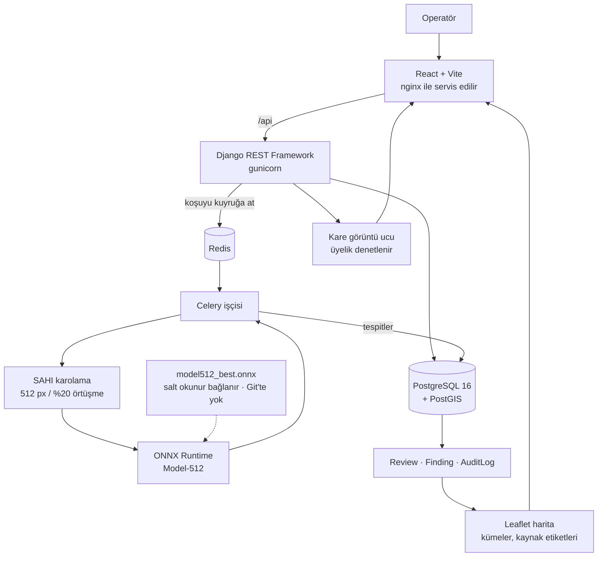

# Gözcü

**Havadan arama-kurtarma görüntülerinde insan adayı tespiti.**

Gözcü, arama bölgesinden çekilen dron fotoğraflarını tarar ve insan bulunabilecek
bölgeleri işaretler; böylece operatör yüzlerce 12 megapiksellik görüntüyü tek tek
gezmek yerine adayları sırayla inceler. Sistem karar vermez — aday bölgeleri
gösterir ve operatörün her aday için ne dediğini kayıt altında tutar.

Lisans bitirme projesi. Eğitim ve araştırma amaçlıdır.

[English](README.md) · [Türkçe](README.tr.md)

[](https://github.com/onurrkayaa/gozcu/actions/workflows/backend.yml)
[](https://github.com/onurrkayaa/gozcu/actions/workflows/frontend.yml)
[](https://github.com/onurrkayaa/gozcu/actions/workflows/dagitim.yml)
[](LICENSE)

---


*Tespit inceleme. Kutular modelin insan **adayı** olarak işaretlediği bölgelerdir,
kesin tespit değildir. Eşik kaydırıcısı yalnızca çizileni süzer; modeli yeniden
çalıştırmaz. Görüntüde EXIF GPS olmadığı için konum paneli koordinat uydurmak
yerine bunu yazar.*


*Bulgular harita üzerinde, 50 metre kuralıyla kümelenmiş. **Bu ekran
görüntüsündeki koordinatlar sentetik demo verisidir, gerçek GPS değildir** —
haritanın üstündeki uyarı kapatılamaz ve her kayıt veri seviyesinde de
etiketlidir.*

---

## Bu proje nedir

Arama uçuşundan gelen fotoğraflar büyüktür (4000×3000 piksel) ve aranan insan
küçüktür: veri kümesindeki etiketli kutuların medyanı 60×59 piksel, yani görüntü
alanının yaklaşık %0,03'ü. Böyle bir görüntüyü doğrudan bir dedektöre vermek onu
modelin 640 piksellik girdisine küçültür ve o medyan hedef 10 pikselin altına
iner — bu boyutta güvenilir tespit yapılamaz.

Gözcü her görüntüyü %20 örtüşmeyle 512 piksellik karolara böler (SAHI ile), her
karoyu ayrı tarar ve sonuçları birleştirir; böylece hedefler kendi ölçeklerinde
kalır. Çıkan adaylar bir inceleme kuyruğuna düşer.

## Bu proje ne değildir

- Dağıtılmış, sertifikalı veya sahada doğrulanmış bir sistem değildir.
- Acil durum müdahalesine uygunluk iddiası taşımaz.
- Arama ekiplerinin veya yerleşik arama-kurtarma yordamlarının yerine geçmez.
- Ölçülmüş doğruluğu, güvenilmesi gereken bir seviyenin çok altındadır.

Her çıktı bir insan operatörün incelemesi içindir. Bu cümle uygulamanın her
sayfasında da yazılıdır ve kapatılamaz.

## Ölçülmüş sonuç

Kendi karolanmış verimizle eğitilen model (**Model-512**, 512 piksellik karolar
üzerinde eğitilmiş Ultralytics `yolo11n`), hazır COCO ağırlığıyla kurulan taban
çizgisiyle **aynı test kümesinde, aynı protokolde ve aynı yanlış pozitif
bütçesinde** karşılaştırıldı.

Test bölümü: 157 görüntü, 970 hedef. Protokol: karo 512, örtüşme 0,20, IoU 0,30, CPU.

| Koşu | conf | Recall | FP / görüntü |
|---|---|---|---|
| Taban-512 (COCO ağırlığı, eğitim yok) | 0,30 | 0,3804 | 1,81 |
| Model-512 (kendi verimizle eğitildi) | 0,53 | 0,6825 | 1,75 |

Karşılaştırma noktası **eşik değil bütçedir**. İki modeli aynı güven değerinde
karşılaştırmak onları eğrilerinin aynı yerinde karşılaştırmayı garanti etmez ve
operatöre yansıyan şey güven sayısı değil, görüntü başına kaç yanlış kutuya
bakmak zorunda kaldığıdır. Bu yüzden tabanın yükü (1,81 FP/görüntü) sabitlendi ve
Model-512'nin eğrisinde bu bütçeye sığan ilk nokta okundu — conf 0,53.

O noktada recall 0,3804'ten 0,6825'e çıkıyor (1,79 kat; aynı 157 görüntüde 293
hedef daha bulunuyor) ve yanlış pozitif yükü artmıyor (1,75 karşı 1,81).

Kaynaklar: `reports/test_taban_cizgisi.csv`, `reports/test_model512.csv`,
`reports/esik_taramasi.csv`; üreteci `scripts/01_taban_cizgisi.py`.

Bu sayı, eğitim koşusunda raporlanan mAP değeriyle **karşılaştırılamaz**: farklı
küme, farklı protokol, farklı metrik.

### Bu sonucu şu sınırlarla okuyun

- **Kaynak aşinalığı.** 970 test hedefinin 939'u tek bir kaynaktan (ZRI) geliyor
  ve ZRI eğitimde de var. Sonuç bu kaynağa aşina bir model için geçerlidir; çeşitli
  arazilerin ortalaması değildir. Bu **veri sızıntısı değildir**: 1579 görüntünün
  SHA-256 özeti hesaplandı, bölümler arasında ortak dosya sıfır.
- **Model-320 hiç eğitilmedi.** 2×2 deney matrisinin dördüncü hücresi (karo boyutu
  × model ölçeği) boş; etkileşim ölçülmedi.
- **Gerçek GPS yok.** 1579 görüntünün hiçbirinde EXIF GPS bulunmuyor, bu yüzden
  arayüzün gösterecek gerçek koordinatı yok ve buradaki her harita koordinatı
  sentetiktir.
- **Yanlış pozitif bağlam çalışması kendi eşiğine ulaşmadı.** Protokol bir bulgu
  için 100 eşleştirilmiş karşılaştırma istiyordu; 45 geçerli çift toplandı. Sonuç
  *ilginç ama kanıtlanmamış* olarak kaydedildi ve üründe hiçbir şey değiştirilmedi.

Tam gerekçe, çürütülen hipotezler ve bütün tablolar raporda:
[rapor/GOZCU_RAPOR_TR.md](rapor/GOZCU_RAPOR_TR.md).

## Neler çalışıyor

- JWT oturumu; sağlık kontrolü dışındaki her uç kimlik doğrulama ister.
- Görev, kare ve tarama koşusu kayıtları, kare bazında durum takibi.
- Asenkron tarama: koşu başlatmak `202` döner ve işi Celery/Redis kuyruğuna atar;
  arayüz ilerlemeyi yoklar.
- SAHI ile karolamalı çıkarım; ONNX Runtime oturumu işçi süreci içinde kareler
  arasında yeniden kullanılır.
- Erişim görev üyeliğine bağlı (sahip / operatör / izleyici). Üye olmayan tutarlı
  biçimde `404` alır, böylece bir görevin varlığı bile sızmaz.
- `/media/` kapalıdır. Görüntüler yalnızca üyeliği denetleyen ve dosya adını
  istekten değil veritabanından okuyan bir uçtan servis edilir.
- Operatör incelemesi model çıktısından ayrı tabloda durur; ikisi hiç karışmaz.
- Bulgularda konum kaynağı açıkça yazılı: `exif`, `manual`, `demo` veya `none`.
  Konumu olmayan kayıt `NULL` kalır — hiçbir zaman 0,0'a çevrilmez.
- Yakın bulguların 50 metre kuralıyla Union-Find kümelenmesi (PostGIS) ve
  yalnızca gösterilecek bir şey varken açılan Leaflet haritası.
- Eklemeli denetim kaydı; güncelleme ve silme ORM seviyesinde reddedilir.
- Öldürülen işçiden sonra kurtarma: kare yeniden teslim edilip tamamlanır; kayıp,
  takılı veya yinelenen kayıt oluşmaz.
- Backend, arayüz ve analiz script'leri için test paketleri; hepsi CI'da koşuyor.

Yapılmayan şeyler burada değil, [Durum](#durum) başlığında.

## Mimari



Ayrıntı: [docs/ARCHITECTURE.md](docs/ARCHITECTURE.md).

## Teknoloji

**Backend** — Python 3.13, Django 5.2, Django REST Framework 3.18, SimpleJWT 5.5,
PostgreSQL 16 + PostGIS 3.5, Celery 5.6, Redis 8, gunicorn 23, whitenoise 6.11

**Model** — Ultralytics `yolo11n` (8.4.144), SAHI 0.12.6, ONNX Runtime 1.30;
eğitim Kaggle GPU'sunda, ölçüm CPU'da

**Arayüz** — React 19, TypeScript 5.9, Vite 7, TanStack Query 5, Leaflet 1.9,
Vitest 3

**Altyapı** — Docker Compose, nginx 1.29, GitHub Actions

## Hızlı başlangıç

### Demo — tek komut

Tek ön koşul Docker Desktop. Başka hiçbir şey kurmanız gerekmez.

```bash
git clone https://github.com/onurrkayaa/gozcu.git
cd gozcu
./demo.sh
```

Betik `.env` dosyasını yeni üretilmiş bir gizli anahtar ve veritabanı parolasıyla
oluşturur, imajları derler, beş servisi başlatır, şemayı uygular, uçtan uca demo
verisini kurar (kullanıcılar, bir görev, kareler, Celery üzerinden gerçek bir
tarama, tespitler, incelemeler, bulgular, kümeleme, denetim kayıtları) ve adresi
ile demo parolasını yazar.

Sonra **<http://localhost:8080>** adresini açın.

ONNX ağırlığı ve veri kümesinin yerel bir kopyası varsa demo gerçek modeli gerçek
görüntüler üzerinde çalıştırır; yoksa üretilmiş görüntülere ve sabit tohumlu
`fake-v0` test dedektörüne düşer ve bunu ekranda yazar. Her iki durumda da
koordinatlar sentetiktir.

```bash
./demo.sh --sentetik   # hızlı sentetik yolu zorlar
./demo.sh --durdur     # servisleri durdurur, veri kalır
./demo.sh --sil        # yalnızca demo verisini siler
```

Senaryo ve sentetik/gerçek ayrımının tamamı: [DEMO.md](DEMO.md).

### Geliştirme

```bash
cp .env.example .env    # DJANGO_SECRET_KEY ve POSTGRES_PASSWORD doldurun
docker compose -f docker-compose.yml -f docker-compose.dev.yml up -d
cd frontend && npm install && npm run dev
```

Arayüz <http://localhost:5173>, API <http://localhost:8000/api/>, Django admin
<http://localhost:8000/admin/>. Sağlık kontrolü:
`curl http://localhost:8000/api/health/`.

### Üretim benzeri yerel çalıştırma

```bash
docker compose up -d
curl http://localhost:8080/api/health/
docker compose down          # birimleri de silmek için -v ekleyin
```

Django gunicorn ile kosar, arayüz derlenmiş olarak nginx'ten gelir, PostgreSQL ve
Redis host'a açılmaz, dışarı açılan tek adres `127.0.0.1:8080`.

**TLS yoktur ve bu bir internet dağıtımı değildir.** Gerçek bir dağıtımda HTTPS'i
önde duran bir ters vekil sonlandırmalı ve `DJANGO_HTTPS=1` verilmelidir. O
bayrakla `manage.py check --deploy` sıfır uyarı verir.

## Model dosyası

`agirliklar/model512_best.onnx` **Git'te yoktur** — 10,5 MB'lık bir ikili dosya;
eğitilmiş ağırlıkları depo dışında tutmak hem boyutu hem lisans tarafını basit
tutuyor. Demo bu dosyaya ihtiyaç duymaz, test dedektörüne düşer.

Dosya elinizdeyse `agirliklar/` klasörüne koyun; Compose onu `/models` altına
salt okunur bağlar. Beklenen kimlik (`reports/model512_onnx_bilgisi.csv`):

| | |
|---|---|
| ONNX SHA-256 | `361731351703f4581f95871c26583eba760f08ed26493869cc864c8c57f55dbd` |
| Kaynak `.pt` SHA-256 | `66a93278a16e1cf720052dbde975f9c5b13ab3881e2416dd1bd78d6815fdf3b7` |
| Girdi | `images: 1x3x512x512`, opset 18 |
| Çıktı | `output0: 1x5x5376`, sınıf `0:human` |

```bash
shasum -a 256 agirliklar/model512_best.onnx
```

`ModelVersion` tablosundaki `model512-onnx` satırı çalışma anında bu dosyayı
seçer. Dosya yoksa veya yüklenemezse koşu açık bir hatayla başarısız olur; sistem
sessizce sahte dedektöre **düşmez**, çünkü bozuk bir modelin çalışıyor gibi
görünmesi hiç çalışmamasından kötüdür.

Ağırlık henüz hiçbir yerde indirilmek üzere yayımlanmadı, bu yüzden burada bağlantı
yok. Eğitim `egitim/` altındaki not defterinden yeniden üretilebilir.

## Veri kümesi

[HERIDAL](http://ipsar.fesb.unist.hr/HERIDAL%20database.html) — arama-kurtarma
için havadan insan tespiti veri kümesi. **Bu depoda yoktur**: büyüktür ve koddan
ayrı bir lisansla gelir. Script'ler onu `data/heridal/` altında `train` / `valid`
/ `test` bölümlerinde, her birinde `images/` ve etiket dosyalarıyla bekler.

> Božić-Štulić, D., Marušić, Ž., Gotovac, S. (2019). *Deep Learning Approach in
> Aerial Imagery for Supporting Land Search and Rescue Missions.* International
> Journal of Computer Vision, 127, 1256–1278.
> DOI: [10.1007/s11263-019-01177-1](https://doi.org/10.1007/s11263-019-01177-1)

Kullanılan kopya bir [Roboflow](https://universe.roboflow.com/) aynasından geldi;
orada **CC BY 4.0** ile yayımlanmış. Yukarıdaki künye kaynaktan değiştirilmeden
aktarılmıştır.

İki şey ölçüldü ve yazmaya değer: görüntüler özgün 4000×3000 boyutunda (dışa
aktarım sırasında küçültülmemiş) ve 1579 görüntünün hiçbirinde EXIF bloğu yok,
yani veride hiç GPS bulunmuyor.

**Veri lisansı (CC BY 4.0) kod lisansı (AGPL-3.0) ile aynı değildir.**

## Klasör düzeni

| Yol | Ne var |
|---|---|
| `backend/` | Django API, Celery görevleri, karolama, dedektör, yetki, denetim kaydı |
| `frontend/` | React operatör arayüzü ve kör etiketleme aracı |
| `scripts/` | Numaralı ölçüm ve analiz script'leri ve testleri |
| `reports/` | Ölçüm çıktıları (CSV) — rapordaki her sayının kaynağı |
| `rapor/` | Türkçe rapor: sekiz bölüm ve birleşik belge |
| `egitim/` | Eğitim not defteri ve Model-512 dışa aktarımı |
| `docs/` | Mimari, geliştirme rehberi, güvenlik modeli |
| `demo.sh`, `docker-compose*.yml` | Demo ve dağıtım |

## Testler

```bash
docker compose exec web pytest -q                          # backend
.venv/bin/python -m pytest scripts/tests tests -q           # analiz script'leri
cd frontend && npm test                                     # arayüz
cd frontend && npm run lint && npm run typecheck && npm run build
python3 scripts/depo_denetimi.py                            # depo denetimi
docker compose exec web python manage.py makemigrations --check --dry-run
docker compose exec web python manage.py check --deploy
```

Aynı adımlar her push ve pull request'te `.github/workflows/` altındaki iş
akışlarıyla koşuyor. Veri kümesi ve model ağırlıkları CI'ya hiç indirilmiyor;
model gerektiren davranışlar atlanmıyor, sahte oturumla sınanıyor.

## Belgeler

| Belge | Dil |
|---|---|
| [Tam rapor — sekiz bölüm](rapor/GOZCU_RAPOR_TR.md) | Türkçe |
| [Demo senaryosu](DEMO.md) | Türkçe |
| [Mimari](docs/ARCHITECTURE.md) | İngilizce |
| [Geliştirme rehberi](docs/GELISTIRME.md) | Türkçe |
| [Güvenlik modeli ve kabul edilen riskler](docs/GUVENLIK.md) | Türkçe |
| [Proje durumu ve açık kısıtlar](rapor/PROJE_DURUMU.md) | Türkçe |
| [Ölçüm çıktıları indeksi](reports/README.md) | Türkçe |
| [Üçüncü taraf bildirimleri](THIRD_PARTY_NOTICES.md) | İngilizce |

## Bilinen sınırlamalar

- Eğitim ve araştırma prototipidir. Operatörün kararının yerine geçmez.
- 970 test hedefinin 939'u eğitimde de bulunan tek bir kaynaktan geliyor; sonuç
  genel bir arazi ortalaması değildir.
- Model-320 hiç eğitilmedi; deney matrisi eksik.
- Veride hiç gerçek GPS yok. Demo koordinatları sentetiktir ve hem veride hem API
  yanıtında hem ekranda öyle etiketlenir.
- Oturum belirteci tarayıcı deposunda (`localStorage`) tutuluyor, çünkü backend'de
  HTTP-only çerez üreten bir uç yok. Bir XSS açığı oturumun çalınması demektir.
  Yenileme ucu da rotasyon yapmıyor. İkisi de kabul edilmiş, yazılı sınırlardır.
- Yalnızca yerel ve düz HTTP dağıtım. TLS yok, internet dağıtımı yok, yük testi
  yok, sızma testi yok.
- Yanlış pozitif bağlam çalışması kendi 100 çift eşiğine karşı 45 geçerli çiftte
  kaldı; tek etiketleyici, annotatorlar arası güvenilirlik ölçülmedi.
- Tek veri kümesi, sınırlı kaynak çeşitliliği, yalnızca CPU üzerinde süre ölçümü.

## Durum

**Uygulandı, yerelde ve CI'da doğrulandı** — kare alımından karolamalı çıkarıma,
incelemeye, bulguya, haritaya ve denetim kaydına kadar tam zincir; üyeliğe bağlı
erişim; üretim benzeri Docker yığını; tek komutluk demo; beş CI iş akışı.

**Açık araştırma** — Model-320'nin eğitilip kendi ölçek tabanına karşı
değerlendirilmesi; kaynak bakımından daha dengeli bir bölümleme; gerçek GPS veya
uçuş günlüğü; yanlış pozitif bağlam etiketlemesinin 100 çiftin ötesine
taşınması; tabanın tam FP eğrisi (şu an üç eşikte ölçülü); farklı arazi ve
donanımda doğrulama.

**Kapsam dışı** — internet dağıtımı, alan adı, TLS sertifikası ve bulut barındırma.
Hiçbiri yok ve burada planlanmıyor.

## Lisans ve atıf

Kod [AGPL-3.0](LICENSE) ile lisanslıdır. Ultralytics YOLO da AGPL-3.0 ile
dağıtılıyor; bu depo izin verici bir lisans yerine aynı lisansı kullanarak uyumlu
kalıyor. Leaflet BSD-2-Clause; harita karoları OpenStreetMap katkıcılarına ait
(ODbL) ve arayüzde atıfları görünüyor.

Tam liste: [THIRD_PARTY_NOTICES.md](THIRD_PARTY_NOTICES.md).

Bu çalışmaya atıf yapacaksanız [CITATION.cff](CITATION.cff) dosyasına bakın. Veri
kümesi için HERIDAL makalesine ayrıca atıf yapın.

## Teşekkür

HERIDAL veri kümesi projeyi mümkün kıldı, Roboflow aynası da kullanılabilir hâle
getirdi. Ağır işi Ultralytics, SAHI, ONNX Runtime, Django, Celery, React ve
Leaflet yaptı. Eğitim Kaggle'ın ücretsiz GPU'sunda koştu.

## İletişim

Sorular ve hatalar: [konu açın](https://github.com/onurrkayaa/gozcu/issues).
Güvenlik bildirimleri için [SECURITY.md](SECURITY.md).
