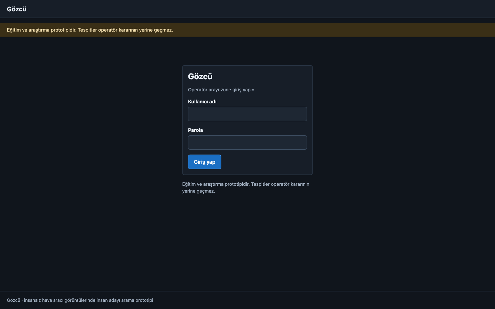
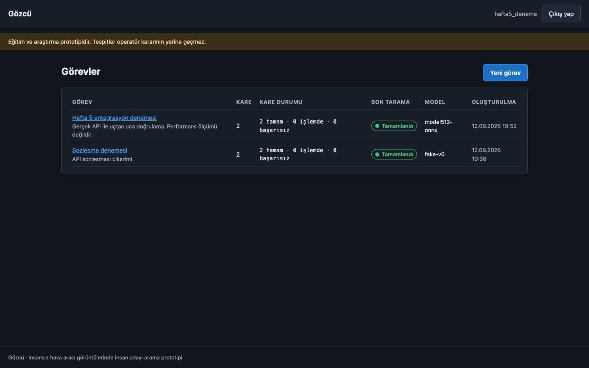
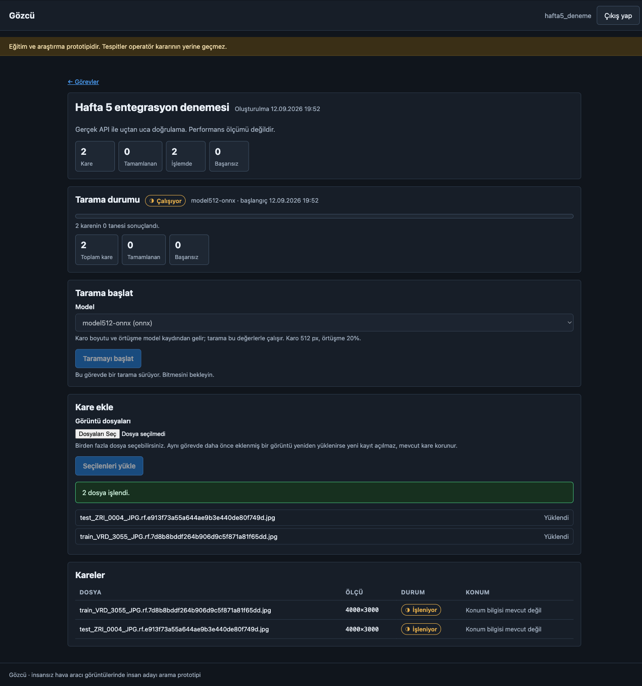
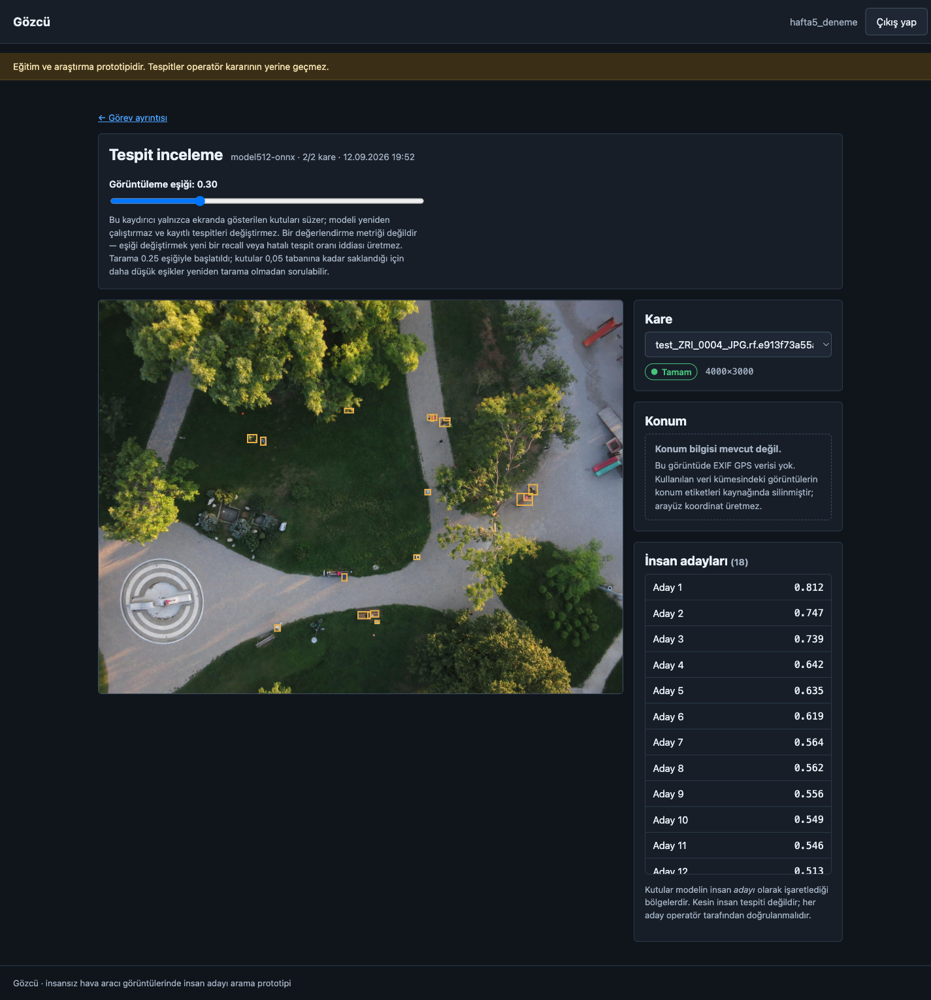
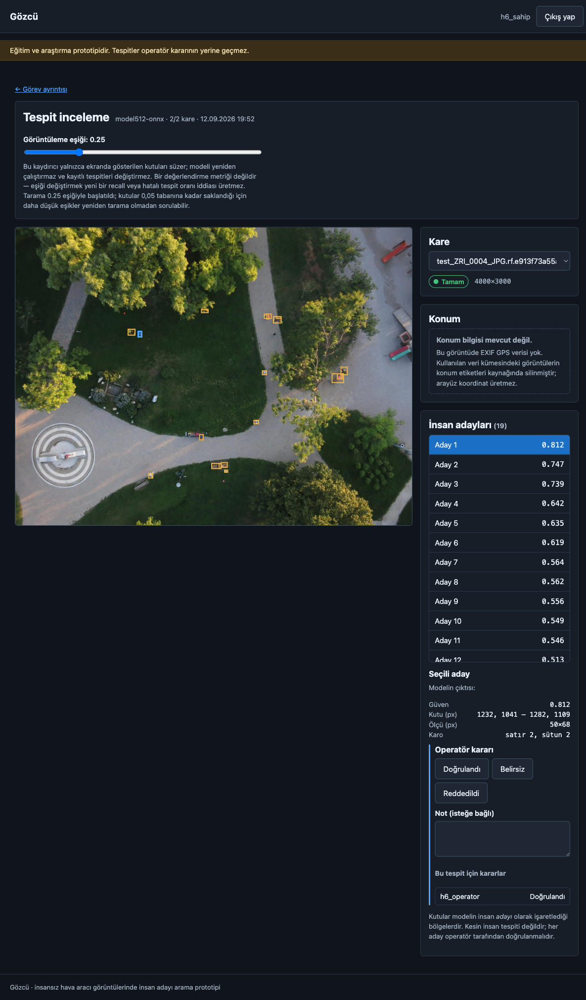
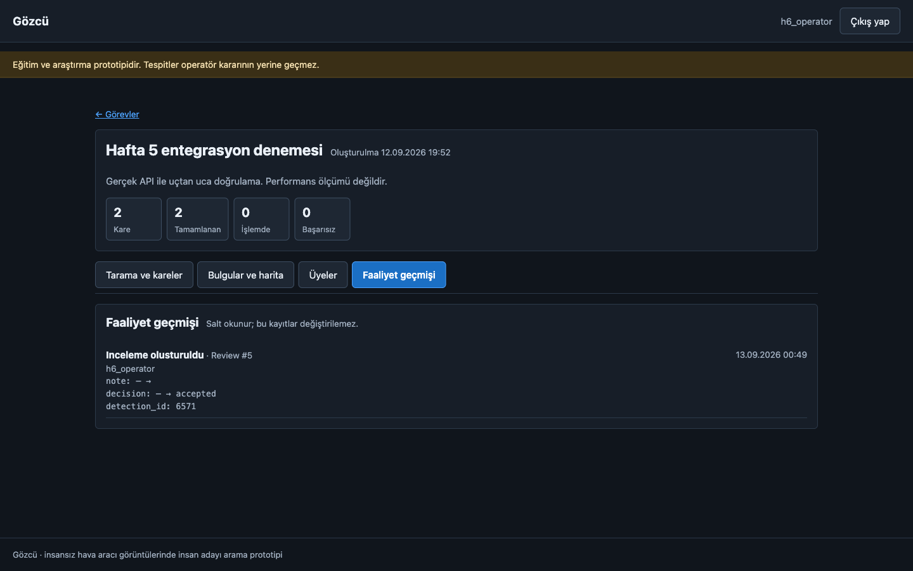
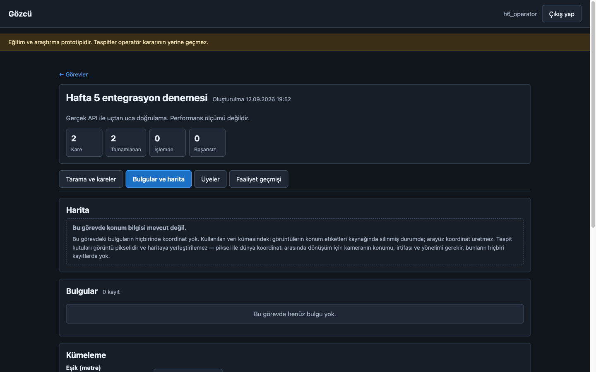
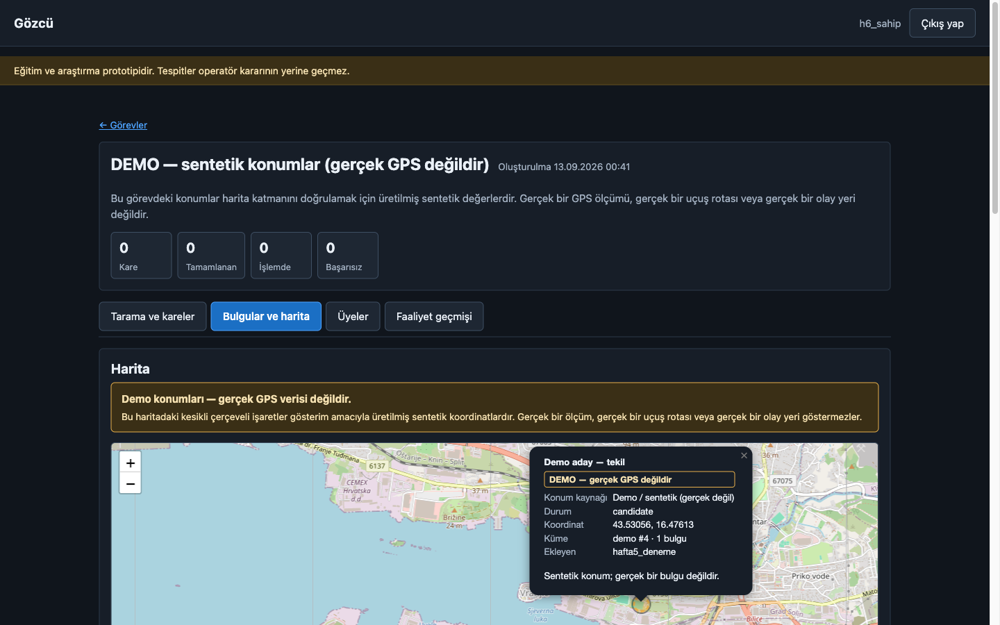

# Gözcü

*Aerial search-and-rescue detection assistant*

**Havadan çekilmiş arama-kurtarma görüntülerinde kayıp insan tespiti**

Bitirme Projesi — Adım 1 / 9

13.09.2026

## 1. Hazırlık ve Taban Çizgisi

*(veri doğrulama, karolama karşılaştırması, taban çizgisi ölçümü, hedef boyutu analizi)*

Bu raporda, hazır bir nesne tespit modelinin havadan çekilmiş arama-kurtarma
görüntülerinde ne kadar başarılı olduğunu ölçtüm. Bu aşamada **hiç model
eğitmedim**. Amacım, projeye devam etmeden önce başlangıç noktasının nerede
olduğunu sayılarla görmekti. Buna *taban çizgisi* (baseline) diyorum: sonraki
çalışmaların kendisiyle karşılaştırılacağı, üzerine iyileştirme yapılacak ilk ölçüm.

Kullandığım tüm sayılar ölçüm scriptlerinin ürettiği çıktı dosyalarından gelir.
Ölçüm çıktıları ve hangi sayının nereden geldiği bölüm 1.15'te listelidir.

---

### 1.1. Problem

Veri kümesindeki görüntüler **4000×3000 piksel**. Aradığımız insanlar ise medyan
olarak **60×59 piksel** — yani tipik bir insan, görüntünün toplam alanının yalnızca
**%0,031**'ini kaplıyor. Bu, on binde üç demek. Ölçülen en küçük kutu genişliği 19, en küçük kutu yüksekliği 20 piksel.

Buradaki asıl zorluk şu: nesne tespit modelleri girdiyi sabit bir boyuta küçültür.
Kullandığım model varsayılan olarak görüntüyü **640 piksele** indiriyor. 4000 piksel
genişliğindeki bir görüntü 640'a inince ölçek 6,25 kat küçülür. 60 pikselik bir insan
bu işlemden sonra **yaklaşık 9 piksele** düşer.

9 piksellik bir lekede insan biçimini tanımak pratikte mümkün değil. Yani görüntüyü
olduğu gibi modele vermek, aradığımız şeyi model onu görmeden önce yok ediyor.

---

### 1.2. Yaklaşım: karolama

**Karolama** (tiling), büyük bir görüntüyü küçük parçalara bölüp her parçayı ayrı ayrı
modele vermek demek. Görüntü küçültülmediği için nesneler orijinal boyutlarında kalır.

Ben görüntüyü **512×512 piksellik** karolara böldüm. Bu seçimin nedeni şu: 512
piksellik bir karo modele verildiğinde 640'a *büyütülür*, küçültülmez. Yani 60
pikselik insan yaklaşık 75 piksele çıkar — kaybolmak yerine belirginleşir.

Karoları **%20 örtüşmeyle** kestim. Örtüşme olmasaydı, tam karo sınırına denk gelen
bir insan ikiye bölünür ve iki karonun hiçbirinde bütün olarak görünmezdi. %20
örtüşme, 512 pikselik karoda yaklaşık 102 piksellik bir bindirme demek; veri
kümesindeki en büyük kutunun (162×190 piksel) yarısından fazlası. Bu, sınıra denk
gelen nesnelerin en az bir karoda bütün olarak yakalanmasını sağlıyor.

Karolama işini SAHI kütüphanesiyle yaptım. SAHI, karolara ayırma ve sonuçları tekrar
birleştirme işini üstleniyor.

Bunun bedeli hız. %20 örtüşmede karolar arası adım 512 − (512 × 0,20) = 410 piksel
olur; 4000×3000 bir görüntü bu adımla yatayda 10, dikeyde 8 karoya, yani toplam **80
karoya** bölünür. Bu sayıyı tahmin etmedim, karolama kütüphanesinin karo koordinatlarını
üreten fonksiyonunu bu boyutlarla çalıştırıp saydırdım. Model her görüntü için 80 kez
çalışıyor. Ölçümlerimde bu, görüntü başına **5,7–6,2 saniye** sürdü (yalnızca CPU,
GPU yok).

---

### 1.3. Ne ölçtüm ve neden

Bir tahminin doğru sayılması için gerçek etikete yeterince benzemesi gerekir. Bunu
**IoU** (Intersection over Union, kesişim/birleşim oranı) ile ölçtüm: iki kutunun
çakışan alanının, kapladıkları toplam alana bölümü. 1,0 tam üst üste, 0 hiç
çakışmıyor demek. Eşiği **0,3** aldım.

Her gerçek kutu en fazla bir tahminle eşleşir. Birden fazla aday varsa güven skoru
yüksek olan öncelikli işlenir.

Ölçtüğüm metrikler:

| Metrik | Anlamı |
|---|---|
| **Recall (duyarlılık)** | Gerçekte var olan insanların yüzde kaçını buldu. 100 kişiden 27'sini bulduysa recall 0,27. |
| **Yanlış pozitif (FP)** | Modelin "burada insan var" dediği ama aslında insan olmayan tespitler. |
| **FP/görüntü** | Görüntü başına ortalama kaç yanlış alarm. |
| **Precision (kesinlik)** | Modelin yaptığı tespitlerin yüzde kaçı doğruydu. |

*Bu tablo ne söylüyor:* Dört metrik iki soruyu ayrı ayrı yanıtlıyor. Recall ve
kaçırılan sayısı "aradığımızı bulabildik mi" sorusunu, yanlış pozitif ve precision
ise "bulduklarımızın ne kadarı işe yarar" sorusunu ölçüyor. Bir eşiği değiştirmek
ikisini zıt yönde etkilediği için, tek bir metrik sistemin durumunu anlatmaya
yetmiyor.

**Recall'ı birincil metrik seçtim.** Sebebi arama-kurtarma bağlamının kendisi:
kaçırılan bir kişi geri gelmez, ama yanlış alarm sadece operatörün birkaç saniyesini
alır. Bu iki hatanın maliyeti eşit değil, dolayısıyla onları eşit ağırlıkta ölçen
metrikler (precision, F1) burada yanıltıcı olur.

FP/görüntü'yü ikincil metrik olarak tuttum, çünkü sınırsız değil. Görüntü başına 20
yanlış alarm üreten bir sistem teknik olarak yüksek recall'a ulaşabilir ama pratikte
operatörü boğar. Yani recall'ı FP bütçesiyle birlikte okumak gerekiyor.

---

### 1.4. Taban çizgisi sonuçları

Modelin bir tespiti bildirmesi için gereken en düşük güven skoruna **güven eşiği**
diyorum. Eşik düştükçe model daha çok şey bildirir: recall artar, yanlış alarm da
artar. Bu yüzden tek bir eşik yerine üçünü birden ölçtüm.

#### 1.4.1 Karolamalı ölçüm — tüm veri kümesi

1.579 görüntü, 3.073 etiketlenmiş insan:

| Güven eşiği | Bulunan | Kaçırılan | Recall | FP/görüntü | Precision |
|---|---|---|---|---|---|
| 0,05 | 1.864 | 1.209 | **0,607** | 13,54 | 0,080 |
| 0,15 | 1.389 | 1.684 | **0,452** | 3,41 | 0,205 |
| 0,30 | 971 | 2.102 | **0,316** | 0,89 | 0,408 |

*Bu tablo ne söylüyor:* Hiç eğitilmemiş, COCO veri kümesiyle gelen hazır bir model,
makul bir yanlış alarm seviyesinde (görüntü başına 0,89) aranan insanların yaklaşık
**üçte birini** buluyor. Eşiği düşürüp recall'ı %61'e çıkarmak mümkün, ama o zaman
görüntü başına 13,5 yanlış alarm oluşuyor — 1.579 görüntüde 21.387 yanlış tespit
demek. Bu, operatörün elemesi gereken hacim olarak gerçekçi değil.

#### 1.4.2 Karolama gerçekten gerekli mi?

Aynı 100 görüntüyü iki şekilde taradım: karolamalı (512 piksellik karolar) ve
karolamasız (tüm görüntü doğrudan modele, model 640'a küçültüyor).

| Yöntem | Güven eşiği | Recall | FP/görüntü | Süre (sn/görüntü) |
|---|---|---|---|---|
| Karolamalı | 0,05 | **0,762** | 16,74 | 5,91 |
| Karolamalı | 0,15 | **0,595** | 4,46 | 5,91 |
| Karolamalı | 0,30 | **0,437** | 1,39 | 5,91 |
| Karolamasız | 0,05 | **0,171** | 0,80 | 0,17 |
| Karolamasız | 0,15 | **0,071** | 0,09 | 0,17 |
| Karolamasız | 0,30 | **0,000** | 0,01 | 0,17 |

*Bu tablo ne söylüyor:* Karolama olmadan sistem çalışmıyor. En düşük eşikte bile
karolamasız yöntem 252 insandan yalnızca 43'ünü buluyor. Güven eşiği 0,30'a
çıkarıldığında **252 kişinin sıfırını** buluyor — tek bir doğru tespit bile yok.

Yanlış alarm bütçesi açısından bakınca: karolamasız yöntemin ulaşabildiği en yüksek
recall 0,171 ve bunu 0,80 FP/görüntü ile yapıyor. Karolamalı yöntem, bütçeyi 1,39
FP/görüntü'ye çıkardığımızda 0,437 recall veriyor — yani yaklaşık 1,7 katı yanlış
alarma karşılık **2,6 katı insan**. İki yöntemi tam olarak aynı FP seviyesinde
karşılaştıramıyorum, çünkü yalnızca üç güven eşiği ölçtüm; aradaki değerler
ölçülmedi.

Bedeli 35 kat işlem süresi (0,17 → 5,91 saniye). Bu ölçüm `--limit 100` ile test
bölümünün ilk 100 görüntüsü üzerinde yapıldı.

**BULGU:** Karolama bu problemde isteğe bağlı bir iyileştirme değil, sistemin
çalışması için ön koşul.

---

### 1.5. Veri kümesinin yapısı — tek sayı neden yanıltıcı

Dosya adları `train_ZRI_3035_...` biçiminde. İkinci parça, görüntünün hangi çekim
bölgesinden geldiğini gösteriyor. Bunlara **kaynak** diyorum. Veri kümesinde
**17 farklı kaynak** var ve dağılımları çok dengesiz.

En çarpıcı olan **ZRI**: 126 görüntüde 1.297 kutu taşıyor, yani veri kümesindeki tüm
etiketlerin **%42'si**. Görüntülerinin yalnızca %5,6'sı boş. Görsel olarak
bakıldığında ZRI bir şehir parkı — çimende oturan ve yatan insanlar. Geri kalan 16
kaynak dağlık ve ormanlık arazi; çoğunda görüntü başına ortalama bir insandan az
etiket var ve boş görüntü oranı %27–67 arasında.

Daha önemlisi, bölünmeler kaynak bazında ayrışmış. `test` bölümü 17 kaynaktan
yalnızca **2'sini** içeriyor (ZRI ve VRD) ve ZRI'nin 126 görüntüsünün 87'si orada.

Bunun sonucu şu: yalnızca test bölümünde ölçüm yapıp "recall 0,38" demek, aslında
"şehir parkında recall 0,38" demek oluyor. Kalan 15 kaynağın hiçbiri o sayının içinde
değil.

Bu yüzden ölçümü tüm veri kümesi üzerinde tekrarladım ve baskın kaynağı dışarıda
bırakan bir özet satırı da ekledim:

| Kapsam | Görüntü | Kutu | Recall (0,30) | FP/görüntü |
|---|---|---|---|---|
| Tüm veri kümesi | 1.579 | 3.073 | 0,316 | 0,89 |
| ZRI hariç | 1.453 | 1.776 | **0,266** | 0,74 |

*Bu tablo ne söylüyor:* Şehir parkı görüntüleri çıkarıldığında recall 0,316'dan
**0,266**'ya iniyor. Yani gerçek arazi koşullarında hazır model, aranan insanların
yaklaşık **dörtte birini** buluyor.

**Raporlanabilir dürüst taban çizgisi %26,6'dır.** Test bölümünden okunan %38'lik
değer, veri kümesinin yapısı nedeniyle iyimserdir.

Not: Bu ölçüm train, valid ve test bölümlerini birleştiriyor. Normalde bu ciddi bir
hata olurdu. Burada geçerli, çünkü model henüz eğitilmedi ve bu görüntülerin hiçbirini
görmedi. **Hafta 3'te eğitim yapıldıktan sonra bu koşu tekrarlanamaz**; o noktadan
sonra yalnızca test bölümü kullanılmalıdır. Bu koşul CSV dosyasına
`kosu_gecerlilik_notu` sütunu olarak da yazılıdır.

---

### 1.6. Hedef boyutu bulgusu

Kaynak bazında recall'lara baktığımda çok geniş bir aralık gördüm: aynı model, aynı
ayarlarla, kaynağa göre recall **0,05 ile 0,61 arasında** değişiyordu. Bunun sebebini
aradım.

Her kaynak için etiket kutularının medyan boyutunu hesapladım ve recall ile
karşılaştırdım. Kutu genişliği ile yüksekliğini tek bir sayıda birleştirmek için
**kutu kenarı** ölçüsünü kullandım: kutu alanının karekökü.

Sonuç, kutu boyutu ile recall arasında güçlü bir ilişki. Aşağıdaki tabloda iki
katsayı var: **Pearson r** iki değişken arasındaki doğrusal ilişkinin gücünü ölçer
(+1 mükemmel pozitif ilişki, 0 ilişki yok demektir); **Spearman ρ** aynı şeyi
değerlerin kendisiyle değil sıralamalarıyla ölçer, bu yüzden uç değerlerden daha az
etkilenir.

| Ölçüm | Pearson r | Spearman ρ |
|---|---|---|
| 17 kaynağın tamamı | **+0,820** | +0,667 |
| En büyük değer (CAP) hariç | +0,759 | +0,600 |
| En az 50 kutusu olan 11 kaynak | **+0,911** | +0,664 |
| En az 100 kutusu olan 8 kaynak | +0,902 | +0,595 |

*Bu tablo ne söylüyor:* İlişki tek bir uç değere dayanmıyor. En önemlisi, **örneklemi
küçük kaynakları çıkardıkça ilişki zayıflamıyor, güçleniyor** (+0,82'den +0,91'e).
Eğer bu sadece gürültü olsaydı tersinin olmasını beklerdik — az veriye dayanan
kaynaklar çıkarıldığında rastgele örüntüler kaybolur. Burada tam tersi oluyor, yani
ilişki gerçek.

**BULGU:** Kaynaklar arası recall farkının büyük kısmını hedef boyutu açıklıyor.
3.073 kutu üzerinden, ≥50 kutulu kaynaklarda r = +0,911.


Aşağıda 17 kaynağın tamamı yer alıyor. Kutu sayısı 50'nin altında olan kaynaklar
**az örnek** olarak işaretlendi; bunların tek tek recall değerleri güvenilir sonuç
çıkarmak için yeterli örneğe dayanmıyor, tabloda bütünlük olsun diye gösteriliyorlar.

| Kaynak | Kutu | Medyan kutu kenarı | Recall (0,30) | FP/görüntü | Not |
|---|---|---|---|---|---|
| ZRI | 1.297 | 64,9 px | 0,384 | 2,59 | |
| MED | 338 | 63,2 px | 0,281 | 0,53 | |
| GOR | 260 | 63,1 px | 0,308 | 2,87 | |
| BRK | 216 | 61,9 px | 0,310 | 0,21 | |
| VRD | 205 | 58,9 px | 0,410 | 0,49 | |
| TRS | 130 | 42,5 px | 0,123 | 0,22 | |
| BRS | 102 | 44,9 px | 0,069 | 0,59 | |
| BRA | 100 | 43,8 px | 0,050 | 0,41 | |
| JAS | 98 | 59,1 px | 0,378 | 0,31 | |
| SB | 96 | 46,6 px | 0,094 | 0,30 | |
| RAK | 51 | 65,0 px | 0,392 | 0,25 | |
| BLI | 46 | 66,9 px | 0,196 | 0,11 | az örnek |
| CAP | 44 | 74,4 px | 0,614 | 0,22 | az örnek |
| CAB | 34 | 53,0 px | 0,088 | 0,00 | az örnek |
| BLA | 22 | 60,7 px | 0,318 | 1,12 | az örnek |
| GRO | 21 | 55,7 px | 0,095 | 0,10 | az örnek |
| MOB | 13 | 58,5 px | 0,385 | 0,60 | az örnek |

*Bu tablo ne söylüyor:* Kutu boyutu ile recall birlikte hareket ediyor. Kutu kenarı 60
pikselin üzerindeki kaynaklar genellikle 0,28–0,41 aralığında recall veriyor; 42–47
piksel aralığındaki dört kaynak ise 0,05–0,12 aralığına düşüyor. Yanlış alarm yükü
boyutla aynı düzenliliği göstermiyor: görüntü başına FP 0,00 ile 2,87 arasında
değişiyor ve en yüksek iki değer (GOR ve ZRI) birbirinden çok farklı recall'lara
sahip. Yani boyut recall'ı açıklıyor, yanlış alarmı açıklamıyor.

---

### 1.7. Hata taksonomisi: iki farklı hata türü

Kutu boyutu modelinden sapmaya bakarak hataları iki gruba ayırdım. Burada **artık**
(residual) terimini kullanıyorum: bir kaynağın gözlenen recall'ı ile, yalnızca kutu
boyutuna bakarak öngörülen recall'ı arasındaki fark.

Öngörüyü şöyle hesapladım: 17 kaynağın tamamı üzerine, medyan kutu kenarından recall'ı
tahmin eden birinci dereceden bir doğru uydurdum (en küçük kareler). Elde edilen model

> recall = 0,01451 × (medyan kutu kenarı, piksel) − 0,57450

biçiminde. Artık ise **gözlenen recall eksi bu formülün öngördüğü recall**. Artık
sıfıra yakınsa o kaynağın performansı tamamen boyutuyla açıklanıyor; belirgin negatifse
kaynak, boyutunun öngördüğünden kötü sonuç veriyor demektir.

#### A türü — çözünürlük kaynaklı

| Kaynak | Medyan kutu kenarı | Recall (0,30) | Artık |
|---|---|---|---|
| BRA | 43,8 px | 0,050 | −0,011 |
| BRS | 44,9 px | 0,069 | −0,008 |
| SB | 46,6 px | 0,094 | −0,008 |
| TRS | 42,5 px | 0,123 | +0,081 |

*Bu tablo ne söylüyor:* Bu dört kaynak veri kümesindeki en küçük kutulara sahip.
BRA, BRS ve SB'nin artık değerleri 0,011'in altında; yani gözlenen recall'ları, yalnızca
kutu boyutuna bakan modelin öngördüğü değerden kayda değer biçimde sapmıyor ve düşük
performansları için başka bir sebep aramaya gerek kalmıyor. TRS ise +0,081 artıkla
boyutunun öngördüğünden **daha iyi** sonuç veriyor.

**BULGU:** A türü hatalar çözünürlük kaynaklıdır. Dört kaynağın her birinde 96 ile 130
arasında etiketli kutu var; bu, kaynak düzeyinde recall karşılaştırması yapmak için
yeterli bir örneklem.

Bu hata türü **çözünürlük problemi**. Çözümü de oradan geçiyor: daha küçük karo
boyutu kullanmak, hedefi modele daha büyük göstermek demek.

#### B türü — görünüm kaynaklı

| Kaynak | Medyan kutu kenarı | Recall (0,30) | Artık |
|---|---|---|---|
| BLI | 66,9 px | 0,196 | **−0,200** |
| GRO | 55,7 px | 0,095 | **−0,138** |
| CAB | 53,0 px | 0,088 | **−0,106** |

*Bu tablo ne söylüyor:* Bu üç kaynağın kutuları küçük değil. BLI'nin kutuları 66,9
piksel — veri kümesindeki en büyük kutulardan. Karşılaştırma için: ZRI'nin kutuları
64,9 piksel ve recall'ı 0,384, RAK'ınki 65,0 piksel ve recall'ı 0,392. BLI aynı kutu
boyutuyla bunların yarısından az recall veriyor.

Burada sorun çözünürlük değil, hedefin **görünümü** gibi görünüyor. Böyle bir sapma
daha küçük karoyla çözülmez; veri kümesine özgü eğitim gerektirir.

**HİPOTEZ:** Bu üç kaynakta toplam 101 kutu var ve üçü de bölüm 1.6'da az örnek olarak
işaretlendi. Boyutun açıklamadığı sapma üç kaynakta birlikte görüldüğü için gerçek bir
örüntü olması muhtemel; ancak tek tek kaynakların recall değerleri genelleme yapmak
için yeterli örneğe dayanmıyor. Bu yüzden B türünü bulgu değil hipotez olarak
sunuyorum; doğrulanması için bu kaynaklardan daha fazla örnek veya kutu bazında bir
analiz gerekiyor.

Bu iki türün ayrılması pratik bir sonuç doğuruyor: karolama parametrelerini
iyileştirmek A türü hatalara yarar, B türüne yaramaz.

---

### 1.8. Çürütülen hipotezler

Bu bölümü kısaltmadım, çünkü yanlış çıkan tahminler doğru çıkanlar kadar bilgi verdi.

#### 1.8.1 "VRD zor arazidir" — ÇÜRÜTÜLDÜ

**Ne tahmin ettim:** Test bölümünde iki kaynak vardı: ZRI (şehir parkı) ve VRD
(dağlık orman). VRD'nin gerçek arama-kurtarma senaryosunu temsil ettiğini ve bu
yüzden zor olacağını düşündüm.

**Nasıl ölçtüm:** Kaynak bazında recall ölçümü, tüm veri kümesi.

**Ne çıktı:** VRD, 205 kutuyla en iyi performans gösterenlerden biri — recall 0,410
(güven eşiği 0,30). Ayrıca boyut modelinden **+0,130** artıkla, boyutunun
öngördüğünden *daha iyi* sonuç veriyor. Tahminim yanlıştı. Zorluk, arazinin ormanlık
olmasından gelmiyor.

#### 1.8.2 "BRA'nın düşük recall'ı arazi zorluğundan" — ÇÜRÜTÜLDÜ

**Ne tahmin ettim:** BRA, BRS, SB ve TRS'nin düşük recall'ının arazi karakterinden
kaynaklandığını düşündüm.

**Nasıl ölçtüm:** Kaynak başına medyan kutu boyutunu hesaplayıp recall ile
karşılaştırdım (`04_kutu_boyutu_analiz.py`).

**Ne çıktı:** Sebep arazi değil, hedef boyutu. Bu dört kaynak veri kümesindeki en
küçük dört kutuya sahip ve artık değerleri sıfıra çok yakın (bölüm 1.7, A türü).
Tahminimin yönü yanlıştı ama ölçüm daha basit ve daha güçlü bir açıklama verdi.

#### 1.8.3 "BLI/GRO/CAB'in sapması düşük kontrasttan" — ÇÜRÜTÜLDÜ

**Ne tahmin ettim:** B türü kaynaklara gözle baktığımda insanların arka plandan zor
ayırt edildiğini gördüm ve bunu düşük kontrasta bağladım.

**Nasıl ölçtüm:** Her kutunun içindeki piksellerin ortalama parlaklığı ile kutuyu
çevreleyen halkanın (kutunun 3 katına genişletilmiş alanından kutunun kendisi
çıkarılmış bölge) ortalama parlaklığı arasındaki farkı hesapladım. 3.073 kutunun
tamamı ölçüldü (`05_kontrast_analiz.py`).

**Ne çıktı:** İlişki yok. Kontrast ile boyut modelinden artık arasında Pearson
r = **−0,068**, Spearman ρ = −0,037 — sıfıra yakın.

Dahası, tahminimin tam tersi bir örnek var: **CAB'in medyan kontrastı 20,5 ile
listedeki en yüksek ikinci değer**, ama artığı −0,106 ile en kötülerden. Buna karşılık
BRA'nın kontrastı listedeki en düşük değer (5,5) ama artığı sıfıra yakın, yani
recall'ı zaten boyutuyla açıklanıyor.

Gözlemim yanlış değildi ama sebebini yanlış adlandırmışım. Görselde gördüğüm şey
ortalama parlaklık farkı değildi.

#### 1.8.4 "Kaçırılanlar yerde yatan insanlar" — HİPOTEZ, ZRI ile çelişiyor

**Ne tahmin ettim:** BLI görsellerinde bulunan kişilerin ayakta, kaçırılanların
çimende yatıyor olduğunu fark ettim. COCO veri kümesinin ağırlıklı olarak ayakta ve
oturan insanlarla eğitildiğini düşünürsek, havadan bakışta yatay uzanmış bir gövdenin
modele tanıdık gelmemesi mantıklı görünüyordu.

**Nasıl ölçtüm:** Ölçmedim. Yalnızca birkaç görsele baktım.

**Ne çıktı:** Hipotez, elimizdeki en büyük kaynakla çelişiyor. ZRI de çimende yatan
ve oturan insanlardan oluşuyor, ancak recall'ı 0,384 ile ortalamanın üstünde. Eğer
yatay duruş tek başına belirleyici olsaydı ZRI'nin de düşük performans göstermesi
gerekirdi.

Bu yüzden duruş hipotezini **doğrulanmamış** sayıyorum. Veri kümesinde duruş etiketi
olmadığı için ölçmek de kolay değil; her kutunun en-boy oranından dolaylı bir gösterge
türetilebilir ama bunu yapmadım.

#### 1.8.5 İşaretli kontrast — İLGİNÇ AMA KANITLANMAMIŞ

Kontrast farkının işaretine (insanın arka plandan koyu mu açık mı olduğuna) baktığımda
recall ile bir ilişki gördüm: Pearson r = −0,581. İnsanların arka plandan koyu olduğu
12 kaynağın ortalama recall'ı 0,311, açık olduğu 5 kaynağınki 0,152.

Ancak bu ilişki, kutu boyutunun açıklamadığı kısmı açıklamıyor: artıkla korelasyon
r = +0,012 (en az 50 kutulu kaynaklarda). Yani insanların arka plandan açık olduğu
kaynaklar aynı zamanda küçük kutulu kaynaklar; iki değişken birbirine karışmış
durumda. Bağımsız bir açıklama olarak kullanılamaz.

---

### 1.9. Açık kalan soru

B türü sapma (BLI, GRO, CAB) bir hipotez olarak duruyor ve **sebebi açıklanamadı**.
Kutu boyutu bu üç kaynağı açıklamıyor, kontrast da ölçülüp elendi.

En güçlü adayım **arka planın doku karmaşıklığı**. CAB görsellerinde arazi, insan
boyutunda ve insan şeklinde açık renkli kaya parçalarıyla dolu. Ortalama parlaklık
farkı bu durumu ölçmüyor: kaya ile insan arasında belirgin parlaklık farkı olabilir,
ama arka plan aynı ölçekte bol miktarda benzer leke içerdiği için hedef yine de
ayırt edilemez hale geliyor.

Bunu ölçmek için uygun görünen iki gösterge var: kutu çevresindeki bölgenin **yerel
piksel varyansı** ve **kenar yoğunluğu**. İkisi de hesaplanabilir ve mevcut altyapıya
eklenmesi zor değil.

**Bu ölçüm yapılmadı.** Doku karmaşıklığı şu an bir hipotez; raporda bulgu olarak
sunulmamalıdır.

#### 1.9.1 Yanlış pozitifler neye benziyor

Doku karmaşıklığı hipotezini destekleyen bir gözlem, hatanın ters yönünden geliyor.

Örnek görselleştirmeye kasten iki **negatif görüntü** dahil ettim — yani hiç etiketli
insan içermeyen görüntüler. Amaç, modelin boş arazide ne ürettiğini görmekti. Bu iki
görüntüde model toplam üç yanlış tespit yaptı (güven eşiği 0,15). Tespitler rastgele
dağılmamıştı: açık renkli kaya parçalarının üzerinde toplanmışlardı ve incelediğim
görüntüde ikisinin güven skoru 0,16 ile 0,17 idi — yani eşiğin hemen üstünde.

Bu gözlem, doku karmaşıklığı hipoteziyle simetrik. Model, açık renkli kaya lekelerini
insan sanıyor; aynı lekelerin arasındaki gerçek insanı ise kaçırıyor. İki hata birbirinin
zıddı gibi görünse de tek bir kök sebepten çıkıyor olabilir: arka planda hedefle aynı
ölçekte ve benzer görünümde bol miktarda leke bulunması.

**GÖZLEM:** Bu, iki görüntüye ve üç yanlış tespite dayanan niteliksel bir izlenim.
Ölçülmedi ve sayısal olarak sınanmadı. Yanlış pozitiflerin gerçekten kaya bölgelerinde
yoğunlaştığını göstermek için, tespit konumlarının arka plan dokusuyla ilişkisini tüm
veri kümesi üzerinde ölçmek gerekir.

---

### 1.10. Ölçüm metodolojisi dersleri

#### 1.10.1 Alt küme yanlılığı

İlk taban çizgisini test bölümünün ilk 100 görüntüsüyle ölçtüm. Sonra tüm bölümle
(157 görüntü) tekrarladım:

| Kapsam | Kutu | Recall (0,30) | Precision (0,30) |
|---|---|---|---|
| İlk 100 görüntü | 252 | 0,437 | 0,442 |
| Tam bölüm (157) | 970 | 0,380 | 0,565 |

*Bu tablo ne söylüyor:* Aynı model ve aynı ayarlarla, yalnızca ölçüme giren görüntü
kümesini büyüttüm. Alt küme **recall'ı yaklaşık 5,6 puan iyimser** (0,437'ye karşı
0,380), **precision'ı ise yaklaşık 12,3 puan kötümser** (0,442'ye karşı 0,565)
gösterdi. İki metrik ters yönde kaydı; yani yanlılık tek yönlü bir hata değil, iki
farklı yanlış izlenim üretiyordu.

İlk 100 görüntüde görüntü başına 2,52 kutu düşüyordu; kalan 57 görüntüde ise 12,60.
Sebep şu: görüntüleri tekrar üretilebilirlik için dosya adına göre sıralıyorum ve
listenin başındaki grup tek bir kaynaktan geliyordu.

**Ders:** Bir ölçümü hızlandırmak için ilk N örneği almak, dosya adları rastgele
dağılmıyorsa yanlı bir örneklem yaratır. Alt küme sonucunu kullanmadan önce, alt
kümenin temel özelliklerini (burada görüntü başına nesne sayısı) bölümün tamamıyla
karşılaştırmak gerekiyor.

#### 1.10.2 SAHI'nin iki varsayılanı

**Birincisi:** `get_sliced_prediction` fonksiyonunda `perform_standard_pred`
parametresi varsayılan olarak açık. Bu, karolara **ek olarak** tüm görüntüyü de
küçültüp bir kez daha tarıyor. Açık bıraksaydım "karolamalı" ölçümüm karolamasız
ölçümü zaten içinde barındıracaktı ve bölüm 1.4.2'deki karşılaştırma anlamsız olacaktı.
Kapattım.

**İkincisi:** SAHI, güven eşiği düşük olduğunda kutu birleştirme yöntemini
kendiliğinden değiştiriyor. Birden fazla eşik ölçerken süreyi üçe katlamamak için
taramayı bir kez en düşük eşikle yapıp yüksek eşikleri sonradan filtreliyorum. Bu
optimizasyonun doğruluğunu tek bir görüntüde kontrol ettiğimde sonuçlar **farklı**
çıktı — çünkü iki tarama farklı birleştirme rejiminde çalışıyordu. Birleştirme tipini
açıkça sabitledikten sonra doğrulama aynı sonucu verdi.

**Ders:** Kütüphane varsayılanları ölçümün ne anlama geldiğini sessizce değiştirebilir.
Ölçüme giren her parametreyi açıkça yazmak ve CSV'ye kaydetmek gerekiyor. Her çıktı
dosyam `kosu_` önekli sütunlarda bu ayarları taşıyor.

#### 1.10.3 Ara sonuçları saklamamanın maliyeti

Kaynak bazında tam ölçüm **2 saat 42 dakika** sürdü. Koşu bittikten sonra kaçırılan
kutuların boyut dağılımına bakmak istedim ve veriyi bulamadım: toplu metrikler *kaç*
kutunun kaçırıldığını söylüyordu ama *hangi* kutunun kaçırıldığını söylemiyordu.
Tahminler bellekteydi ve koşuyla birlikte silinmişti. Aynı soruyu yanıtlamak,
taramayı baştan yapmak anlamına geliyordu.

Kalıcı çözüm olarak `01_taban_cizgisi.py` artık her koşuda `kutu_bazinda_sonuc.csv`
üretiyor: her gerçek kutu için görüntü, kaynak, kutu boyutu, güven eşiği, eşleşip
eşleşmediği, eşleştiyse eşleşen tahminin skoru ve IoU'su. Bu dosya bir seçenek değil,
varsayılan davranış — çünkü veriyi atmanın maliyeti saatlerle ölçülüyor.

**Ders:** Pahalı bir hesabın ara sonuçlarını saklamak neredeyse bedava; saklamamak
ise sonradan akla gelen her soruyu hesabın kendisi kadar pahalı hale getiriyor.

#### 1.10.4 Tekrar üretilemeyen çıktı

Kaynak dağılımı tablosunu ilk kez tek seferlik geçici bir betikle üretmiştim. Çıktı
dosyası duruyordu ama onu üreten kod hiçbir yerde kayıtlı değildi — yani tablo tekrar
üretilemiyordu. Hesabı `00_veri_incele.py` içine taşıdım.

**Ders:** Rapora girecek her sayının, sürüm kontrolündeki bir betikten yeniden
üretilebilmesi gerekiyor.

---

#### 1.10.5 Dağıtım platformunun varsayılanları

Veri kümesini ilk indirdiğimde görüntüler **640×640 piksel** geldi. Oysa HERIDAL'in
orijinal görüntüleri 4000×3000.

Sebep, veri kümesini aldığım dağıtım platformunun dışa aktarımda varsayılan olarak
yeniden boyutlandırma ön işlemesi uygulamasıydı. Bu ön işlemeyi fark etmeseydim, tüm
projenin gerekçesi çökerdi: 640×640 bir görüntüde insanlar zaten küçültülmüş olurdu,
karolama yapmanın hiçbir anlamı kalmazdı ve ölçtüğüm her sayı başka bir sorunun
cevabı olurdu.

Veri kümesinin bir kopyasını (fork) alıp yeniden boyutlandırma ön işlemesini
kaldırdım, yön düzeltmeyi (Auto-Orient) bıraktım ve tam çözünürlüklü sürümü yeniden
dışa aktardım. Ardından varsaymak yerine ölçtüm: `00_veri_incele.py` üç bölümdeki
1.579 görüntünün tamamının 4000×3000 olduğunu doğruladı — genişlik ve yükseklik için
en küçük, medyan ve en büyük değerlerin üçü de aynı çıktı.

**Ders:** Veri kümesinin en temel özelliğini bile varsaymamak gerekiyor. Görüntü
çözünürlüğü bu projede "detay" değil, problemin tanımının kendisi. Dağıtım
platformları veriyi olduğu gibi vermeyebilir; ne indirdiğini ölçmeden işe başlamak,
sonraki bütün ölçümleri geçersiz kılma riski taşıyor.

### 1.11. Kararlar ve gerekçeleri

| Karar | Alternatif | Neden bu |
|---|---|---|
| Karolama için SAHI | Kendi karolama kodumu yazmak | Karolara bölme, koordinat dönüşümü ve sonuçları birleştirme işini hazır ve test edilmiş halde veriyor. Kendi kodum aynı işi yapana kadar geçecek süre ölçüme harcanabilirdi. |
| 512 piksel karo | 640 (küçültme yok) veya 1024 | 512'lik karo modelin 640'lık girdisine *büyütülerek* verilir, yani hedef büyür. 1024 kullansaydım küçültme başlayacaktı. |
| %20 örtüşme | %0 veya %50 | %0'da karo sınırına denk gelen kişi ikiye bölünür. %50 karo sayısını yaklaşık iki katına çıkarıp süreyi de iki katına çıkarırdı. |
| IoU eşiği 0,3 | 0,5 (yaygın standart) | Hedefler 60 piksel civarında; bu boyutta birkaç piksellik kayma IoU'yu hızla düşürür. 0,5 eşiği, insanı doğru bulmuş ama kutusu biraz kaymış tespitleri hata sayardı. |
| Greedy (açgözlü) eşleştirme | Macar algoritması ile en iyi eşleştirme | Yüksek güven skorlu tahmini önceliklendirmek, tespit değerlendirmesinde yaygın davranış. Optimal eşleştirme daha karmaşık ve bu ölçekte sonucu anlamlı ölçüde değiştirmesi beklenmiyor. |
| yolo11n (en küçük model) | Daha büyük YOLO varyantları | Taban çizgisinin amacı en iyi sonucu almak değil, başlangıç noktasını ölçmek. CPU'da tam koşu zaten 2 saat 42 dakika sürdü; daha büyük model bunu katlardı. |
| Yalnızca CPU | GPU kiralamak | Elimdeki donanım. Süre kısıtı ölçüm tasarımını etkiledi (tek tarama + sonradan filtreleme) ama sonuçları etkilemedi. |
| Güven eşiği 0,05 / 0,15 / 0,30 | Tek eşik | Recall ile yanlış alarm arasındaki değiş tokuşu tek sayı göstermiyor. Üç nokta, eğrinin şeklini görmeye yetiyor. |

*Bu tablo ne söylüyor:* Kararların çoğunu belirleyen iki kısıt var: elimdeki donanım
(yalnızca CPU) ve hedeflerin küçüklüğü. Karo boyutu, IoU eşiği ve model seçimi
doğrudan bu iki kısıttan çıkıyor. Hiçbiri "en iyi sonucu almak" için seçilmedi; amaç
başlangıç noktasını makul bir sürede ve savunulabilir varsayımlarla ölçmekti.

---

### 1.12. Sonraki adım

Bu bölümü ikiye ayırıyorum, çünkü iki farklı şeyden söz ediyorlar: ölçüm tarafında
cevapsız kalan sorular ile sıradaki adımda fiilen kurulacak iş. Bir ölçümün açık
kalması, sıradaki işin o ölçüm olduğu anlamına gelmiyor.

#### 1.12.1 Ölçüm tarafında açık kalanlar

Bu ölçümler ileriki **model çalışmalarının** içeriğini belirledi. Aşağıdakiler
cevaplanmayı bekleyen sorular; model üzerinde çalışılan adımlarda ele alınacaklar.

**1. Karo boyutunu optimize etmek (A türü hatalara yönelik).** Hedef boyutu ile recall
arasındaki ilişki (r = +0,911) net olduğuna göre, karoyu küçültmek hedefi modele daha
büyük gösterir. 512'nin yanı sıra 320 ve 256 piksellik karolar denenmeli. Beklenen
sonuç: BRA, BRS, SB, TRS gibi küçük hedefli kaynaklarda recall artışı. Bedeli karo
sayısının ve dolayısıyla sürenin artması; bu değiş tokuş ölçülmeli.

**2. Doku karmaşıklığını ölçmek (bölüm 1.9'daki açık soru).** Kutu çevresindeki yerel
varyans ve kenar yoğunluğu hesaplanıp B türü kaynakların artığıyla karşılaştırılmalı.
Bu, B türü sapmanın hipotez olmaktan çıkıp bulguya dönüşüp dönüşemeyeceğini de
belirleyecek.
İlişki çıkarsa hata taksonomisi tamamlanmış olur; çıkmazsa başka aday aranmalı.

**3. Güven eşiği eğrisini sıklaştırmak.** Şu an elimde üç nokta var. Karolamalı ve
karolamasız yöntemleri eşit yanlış alarm bütçesinde karşılaştıramamamın sebebi bu.
Daha sık eşik örneklemesi bu karşılaştırmayı mümkün kılar.

**4. Eğitim öncesi son ölçüm.** Hafta 3'te eğitime geçilecekse, bölüm 1.5'teki birleşik
ölçüm o noktadan sonra geçersiz hale gelir. Eğitim başlamadan önce yapılacak tüm
eğitimsiz ölçümlerin tamamlanmış olması gerekiyor.

B türü sapma (BLI, GRO, CAB) karolama parametreleriyle çözülmeyecek gibi görünüyor.
Doğrulanırsa, bu kaynaklar için veri kümesine özgü eğitim gerekecek; model eğitimi
adımının gerekçelerinden biri bu hipotez.

#### 1.12.2 Bir sonraki adım: sistem iskeleti

Sıradaki adımda ölçüm yapılmayacak; sistemin kendisi kurulacak.

Gerekçesi şu: taban çizgisi ölçümü geçildi ve yaklaşımın çalıştığı gösterildi.
Bundan sonrası tek seferlik script koşuları olarak sürdürülemez. Ölçümün etrafına,
görüntülerin yüklendiği, işlerin sıraya alındığı ve sonuçların saklandığı bir sistem
gerekiyor.

Bu adımda kurulacak üç şey var:

1. **Konteynerleştirme.** Çalışma ortamının tekrar üretilebilir biçimde
   paketlenmesi. Şu anda ortam tek bir makineye bağlı; sürüm sabitlemesi yapılmış
   olsa da taşınabilir değil.
2. **Web çerçevesi.** Görüntü yükleme, tespit isteği ve sonuç sorgulama için bir
   arayüz katmanı.
3. **Veritabanı şeması.** Görüntülerin, tespitlerin ve koşu bilgilerinin kalıcı
   olarak saklanacağı yapı. Şu anda bu bilgi CSV dosyalarında duruyor; tek koşu için
   yeterli ama üst üste binen koşular ve karşılaştırmalar için değil.

Model tarafındaki iyileştirmeler (1.12.1'deki maddeler) bu iskelet kurulduktan sonra
onun üzerinde yapılacak.

---

### 1.13. Veri ve lisanslar

**Orijinal veri kümesi.** HERIDAL, arama-kurtarma amaçlı havadan insan tespiti
için hazırlanmış bir veri kümesidir. Akademik künyesi:

> Božić-Štulić, D., Marušić, Ž., & Gotovac, S. (2019). Deep Learning Approach in
> Aerial Imagery for Supporting Land Search and Rescue Missions. *International
> Journal of Computer Vision*, 127(9), 1256–1278.
> https://doi.org/10.1007/s11263-019-01177-1

**Kullanılan dağıtım.** Orijinal kümeyi resmî kaynağından almadım; Roboflow Universe
üzerindeki bir aynasını (mirror) kullandım. Ayna CC BY 4.0 lisanslıdır — bu lisans
kullanıma ve değiştirmeye izin verir, karşılığında atıf zorunludur.

- Yukarı kaynak (upstream) ayna: `universe.roboflow.com/drone-internship/heridal-human-detection`, sürüm 4
- Fiilen indirdiğim dışa aktarım: `universe.roboflow.com/onur-kaya/heridal-human-detection-jvf9b`, sürüm 1 — bu, yukarıdaki aynanın kendi Roboflow çalışma alanıma alınmış kopyasıdır. Proje içindeki `data/heridal/data.yaml` bu kaydı taşır.
- Dışa aktarım biçimi: YOLOv8. Ön işleme olarak yalnızca yön düzeltme (Auto-Orient)
  uygulanmıştır; varsayılan olarak gelen yeniden boyutlandırma (Resize) kaldırılmıştır,
  böylece görüntüler 4000×3000 özgün çözünürlüğünde kalmıştır. Veri artırma
  uygulanmamıştır.

Roboflow'un dağıtım künyesi:

```bibtex
@misc{heridal-human-detection_dataset,
  title        = {Heridal Human Detection Dataset},
  type         = {Open Source Dataset},
  author       = {Drone Internship},
  howpublished = {\url{https://universe.roboflow.com/drone-internship/heridal-human-detection}},
  url          = {https://universe.roboflow.com/drone-internship/heridal-human-detection},
  journal      = {Roboflow Universe},
  publisher    = {Roboflow},
  year         = {2023},
  month        = {oct},
  note         = {CC BY 4.0. Erisim tarihi: 09.09.2026}
}
```

**Doğrulama.** Bu projede dağıtım platformu görüntüleri gerçekten yeniden
boyutlandırdı: ilk indirdiğim sürümde görüntüler 4000×3000 yerine 640×640 geldi.
Ayrıntısı bölüm 1.10.5'te. Yeniden boyutlandırma ön işlemesini kaldırıp tam
çözünürlüklü sürümü yeniden dışa aktardım, sonra sonucu varsaymak yerine ölçtüm:
`00_veri_incele.py`, üç bölümdeki 1.579 görüntünün tamamının **4000×3000 piksel**
olduğunu doğruladı (genişlik ve yükseklik için en küçük, medyan ve en büyük değerler
aynı çıktı).

- İçerik: 1.579 görüntü, tek sınıf, 3.073 etiketli kutu.
- Veri kümesindeki sınıf adı `human`, kullandığım COCO modelindeki karşılığı `person`.

**Model:** `yolo11n.pt`, Ultralytics tarafından COCO veri kümesiyle önceden
eğitilmiş ağırlıklar. Ultralytics **AGPL-3.0** lisanslıdır. Bu lisans, yazılımın ağ
üzerinden hizmet olarak sunulması durumunda kaynak kodun paylaşılmasını zorunlu kılar.
Akademik ve kişisel kullanım için sorun yok; ileride bu çalışma bir servise
dönüştürülecekse lisans koşulları yeniden değerlendirilmelidir.

**Ortam:** Python 3.13.1, PyTorch 2.14.0, Ultralytics 8.4.144, SAHI 0.12.6, macOS
(arm64), yalnızca CPU. Sürümler `requirements.txt` içinde sabitlenmiştir ve her
çıktı CSV'sinin `kosu_surum_*` sütunlarında da kayıtlıdır.

---

### 1.14. Araçlar ve yöntem

Bu bölümdeki hiçbir sayıyı doğrulamadan rapora almadım. Uyguladığım doğrulama
adımları şunlar:

- IoU hesabı ve eşleştirme mantığı için **14 birim testi** yazıldı (tam örtüşme, hiç
  örtüşmeme, kısmi örtüşme, eşik sınırı, bir gerçek kutunun en fazla bir tahminle
  eşleşmesi, tekrarlanabilirlik).
- Kutu bazındaki kayıt ile toplu metriklerin tutarlılığı üç güven eşiğinde ayrı ayrı
  karşılaştırıldı ve birebir aynı çıktı.
- Kaynak bazlı özet satırlarının doğruluğu, sonucu elle hesaplanabilen yapay veriyle
  test edildi.
- Tek tarama + sonradan filtreleme optimizasyonu, doğrudan tarama ile karşılaştırılarak
  doğrulandı (bölüm 1.10.2).
- Bütün ölçümler tekrar üretilebilir: görüntü listesi sıralı, çıkarım deterministik,
  parametreler CSV'ye kayıtlı. Tek istisna işlem süresi sütunudur; o makinenin anlık
  yüküne göre değişir.

Kodun tamamı ve her çıktının hangi komutla üretildiği projenin kurulum belgesinde
adım adım yazılıdır.

---

### 1.15. Ek — Ölçüm çıktıları

Bu adımda üretilen çıktı dosyaları, içerikleri ve onları üreten scriptler. Rapordaki
her sayı bu dosyalardan okunmuştur; hiçbiri elle girilmemiştir.

| Dosya | İçerik | Üreten |
|---|---|---|
| `veri_istatistik.csv` | Bölüm başına görüntü sayısı, görüntü en/boy min-medyan-maks, toplam kutu, görüntü başına kutu, kutu en/boy piksel değerleri, kutu alanının görüntü alanına oranı | `00_veri_incele.py` |
| `onek_dagilimi.csv` | Bölüm × kaynak kırılımıyla görüntü sayısı, kutu sayısı, görüntü başına kutu, boş görüntü oranı | `00_veri_incele.py` |
| `taban_cizgisi.csv` | İlk ölçüm: test bölümünün ilk 100 görüntüsü, güven eşiği başına TP/FN/recall/FP/precision | `01_taban_cizgisi.py` |
| `taban_cizgisi_tam.csv` | Aynı ölçüm, test bölümünün tamamı (157 görüntü) | `01_taban_cizgisi.py` |
| `taban_cizgisi_onek.csv` | Ana taban çizgisi tablosu: üç bölüm birleşik (1.579 görüntü), her kaynak × her güven eşiği için bir satır, artı toplam ve baskın kaynak hariç özet satırları | `01_taban_cizgisi.py` |
| `kutu_bazinda_sonuc.csv` | Her gerçek kutu için ayrı satır: görüntü, bölüm, kaynak, kutu boyutu, güven eşiği, eşleşti mi, eşleşen tahminin skoru ve IoU'su | `01_taban_cizgisi.py` |
| `karolama_karsilastirma.csv` | Karolamalı ve karolamasız ölçümün aynı görüntüler üzerinde karşılaştırması | `02_karolama_karsilastir.py` |
| `ornek_secim.csv` | Görselleştirilen örneklerin listesi: tabaka, kaynak, etiket/tahmin/eşleşen/yanlış pozitif sayıları | `03_gorsellestir.py` |
| `ornekler/` | Örnek görüntüler; gerçek kutular yeşil, tahminler güven skoruyla kırmızı | `03_gorsellestir.py` |
| `ornek_secim_BLI.csv`, `ornek_secim_GRO.csv`, `ornek_secim_CAB.csv` | Aynı seçim listesi, boyut modelinden sapan üç kaynak için ayrı ayrı | `03_gorsellestir.py` |
| `ornekler_BLI/`, `ornekler_GRO/`, `ornekler_CAB/` | Boyut modelinden sapan üç kaynağın örnek görselleri | `03_gorsellestir.py` |
| `onek_kutu_boyutu.csv` | Kaynak başına medyan kutu genişliği/yüksekliği/alanı/kenarı, üç eşikteki recall ve FP/görüntü | `04_kutu_boyutu_analiz.py` |
| `recall_vs_kutu_boyutu.png` | Bölüm 1.6'daki dağılım grafiği | `04_kutu_boyutu_analiz.py` |
| `onek_kontrast.csv` | Kaynak başına medyan yerel kontrast, kutu kenarı, recall ve boyut modelinden artık | `05_kontrast_analiz.py` |

*Bu tablo ne söylüyor:* Rapordaki her sayının izi sürülebilir bir kaynağı var. Her
CSV, sonucun hangi koşullarda üretildiğini kendi içinde `kosu_` önekli sütunlarda
taşır: model adı, karo boyutu, örtüşme oranı, eşleştirme eşiği, kütüphane sürümleri,
tarih ve çalıştırılan komutun tam hali. Böylece tablolar rapordan ayrı olarak da
kendini açıklar ve ölçüm aynı koşullarda tekrarlanabilir.

## 2. Taban Çizgisinin Derinleştirilmesi ve Sistem İskeleti

*(ölçümün yeniden üretilebilirliği, başarısızlık türlerinin ayrıştırılması, hedef geometrisi ile recall ilişkisi, etiket kalitesi denetimi, sistem iskeleti, süreç dersleri)*

Bölüm 1'de hazır bir nesne tespit modelinin havadan çekilmiş arama-kurtarma
görüntülerinde ne kadarını bulduğunu ölçtüm. Bu bölümde iki iş birden yaptım. Birincisi,
o ölçümün içine girip **neyin neden kaçırıldığını** ayrıştırdım: kaçırmaların hepsi aynı
sebepten değil ve hangi sebebin hangi payı tuttuğu, bundan sonra nereye yatırım
yapılacağını belirliyor. İkincisi, ölçümün etrafına görüntülerin yüklendiği ve
saklandığı bir **sistem iskeleti** kurdum.

Bu bölümde de **hiç model eğitmedim**. Buradaki bütün sayılar, bölüm 1'de kurulan aynı
taban çizgisi koşusunun çıktılarından türetildi; yeni bir tarama yapılmadı. Tek istisna
2.1'de anlatılan tekrar koşusudur ve onun amacı yeni bir sonuç üretmek değil, eldeki
sonucun tekrar üretilebilir olduğunu göstermekti.

Kullandığım tüm sayılar ölçüm scriptlerinin ürettiği çıktı dosyalarından gelir. Hangi
sayının hangi dosyadan okunduğu bölüm 2.7'de listelidir.

---

### 2.1. Ölçümün yeniden üretilebilirliği

Bölüm 1'in ana tablosu, üç veri bölümünün birleştirilmesiyle elde edilen kaynak bazlı
taban çizgisiydi: 1.579 görüntü, 3.073 etiketli kutu, 17 kaynak, üç güven eşiği. Bu
koşu yalnızca CPU üzerinde **2 saat 42 dakika** sürmüştü.

Aynı koşuyu iki gün sonra, hiçbir parametresini değiştirmeden tekrarladım. Amacım yeni
bir bilgi elde etmek değildi; sonraki bütün karşılaştırmaların dayanacağı zeminin
sağlam olup olmadığını görmekti.

#### 2.1.1 Karşılaştırmanın kapsamı

İki koşunun ürettiği kaynak bazlı sonuç tablosu **57 satır ve 31 sütun** içeriyor. Bu
sütunlardan üçü tasarım gereği karşılaştırma dışında bırakıldı:

| Dışarıda bırakılan sütun | Neden |
|---|---|
| `sure_saniye_goruntu_basina` | İşlem süresi makinenin o anki yüküne göre değişir; deterministik değildir. |
| `kosu_tarih` | Koşunun ne zaman yapıldığı, sonucun kendisi değildir. |
| `kosu_komut` | Çalıştırılan komut satırının tam hali; çıktı yolu farklı verilebilir. |

*Bu tablo ne söylüyor:* Üç sütunun üçü de ölçümün **sonucunu** değil, ölçümün ne zaman
ve nasıl çalıştırıldığını kaydeden alanlar. Bunları karşılaştırmaya dahil etmek, saatin
ilerlemiş olmasını bir tutarsızlık gibi göstermek olurdu. Geriye kalan 28 sütunun
tamamı sonucun kendisidir: kutu sayıları, doğru bulunanlar, kaçırılanlar, recall,
yanlış pozitifler, precision ve koşu parametreleri.

Buna göre karşılaştırılan hücre sayısı **57 × 28 = 1.596**'dır.

#### 2.1.2 Sonuç

| Ölçüt | Sonuç |
|---|---|
| Satır anahtarı farkı (kaynak × güven eşiği) | yok |
| Sütun adı farkı | yok |
| Farklı çıkan hücre | **0 / 1.596** |
| İlk koşu süresi | 162,1 dakika |
| İkinci koşu süresi | 156,8 dakika |

*Bu tablo ne söylüyor:* Süre dışında hiçbir sayı oynamadı. 1.596 hücrenin tamamı
birebir aynı çıktı. İki koşu arasında kütüphane sürümleri de aynıydı: Python 3.13.1,
ultralytics 8.4.144, sahi 0.12.6, torch 2.14.0. Bu sürümler tahmin edilmedi, her iki
çıktı dosyasının `kosu_surum_` önekli sütunlarından okundu ve karşılaştırıldı.

**BULGU:** Taban çizgisi ölçümü bit düzeyinde tekrar üretilebilir. Tekrar
üretilebilirliği sağlayan üç tasarım kararı var: görüntü listesi dosya adına göre
sıralanıyor, çıkarım deterministik çalışıyor ve eşleştirmede skor eşitliği indeks
sırasıyla çözülüyor. Bunların üçü de bölüm 1'de bilinçli olarak konmuştu; bu koşu
onların işe yaradığını gösterdi.

#### 2.1.3 Bunun neden önemli olduğu

Bu, kendi başına ilginç bir sonuç değil. Önemi, bu bölümdeki ve sonraki bölümlerdeki
her karşılaştırmanın bu koşuya göre yapılacak olmasından geliyor.

Somut olarak: bundan sonra karo boyutunu değiştirdiğimde, modeli eğittiğimde veya
eşleştirme eşiğini oynattığımda, elde ettiğim recall'ı bu koşununkiyle
karşılaştıracağım. Eğer taban çizgisinin kendisi koşudan koşuya birkaç ondalık
oynasaydı, gözlediğim farkın müdahaleden mi yoksa gürültüden mi geldiğini
ayıramazdım. Küçük bir iyileştirme — diyelim recall'da 0,01'lik bir artış — ölçüm
gürültüsünün içinde kaybolurdu.

Şimdi gürültü tabanının **sıfır** olduğunu biliyorum. Bu, sonraki ölçümlerde
gördüğüm her farkın gerçek bir fark olduğu anlamına geliyor. Bir müdahale recall'ı
0,3160'tan 0,3170'e çıkarırsa, bu 0,001'lik artış gerçektir; rastlantı değildir.

Bunun bir maliyeti de var ve onu da yazmak gerekiyor: tekrar koşusu 2 saat 42 dakikalık
işlem süresinin ikinci kez harcanması demekti. Bu süreyi neden harcadığım bölüm
2.6'daki birinci derste anlatılıyor — koşuyu zaten tekrarlamak zorundaydım, çünkü ilk
koşu kutu bazındaki kaydı hiç üretmemişti. Tekrar üretilebilirlik kontrolü, mecburen
yapılan bir koşunun yan ürünü olarak elde edildi.

---

### 2.2. Başarısızlık türlerinin ayrıştırılması

Bölüm 1'de kaçırmaları iki türe ayırmıştım. **A türü** çözünürlük kaynaklıydı: hedef
küçüktü, model göremedi. **B türü** ise görünüm kaynaklı görünüyordu: BLI, GRO ve CAB
kaynaklarının kutuları küçük olmamasına rağmen recall'ları, boyutlarının öngördüğünden
belirgin biçimde düşüktü. B türünü bölüm 1'de **hipotez** olarak işaretlemiştim, çünkü
üç kaynakta toplam 101 kutu vardı ve bu, kaynak düzeyinde genelleme için ince bir
örneklem.

Bu bölümde B türünün doğasına dair somut bir soru sordum: bu kaynaklarda kutular
**bulunamıyor mu**, yoksa **bulunuyor ama düşük skorla sıralanıyor** mu?

Bu ayrım pratik bir sonuç doğuruyor. Eğer aday kutular üretiliyor ama skorları eşiğin
altında kalıyorsa, çözüm basit: eşiği düşür. Eğer aday hiç üretilmiyorsa, eşiği
düşürmenin hiçbir faydası olmaz — çünkü sıralanacak bir şey yok.

#### 2.2.1 Yöntem

Soruyu yanıtlamak için en düşük güven eşiğine, yani **0,05**'e baktım. Bu eşik, modelin
bildirdiği en zayıf adayları bile kapsıyor. Bir kutu bu eşikte bile hiçbir adayla
eşleşmiyorsa, o kutu için model hiçbir şey üretmemiş demektir.

Kutuları iki gruba ayırdım:

- **B türü:** BLI, GRO ve CAB kaynaklarının tamamı — 101 kutu.
- **Karşılaştırma grubu:** en az 100 kutusu olan diğer kaynaklar — BRA, BRK, BRS, GOR,
  MED, TRS, VRD ve ZRI; toplam 2.648 kutu.

Karşılaştırma grubuna 100 kutu alt sınırı koydum, çünkü altındaki kaynakların tek tek
oranları güvenilir değil ve karşılaştırmayı gürültüyle kirletirlerdi.

#### 2.2.2 Sonuç

| Grup | Kaynak sayısı | Kutu | Eşleşen | Hiç eşleşmeyen | Hiç eşleşmeyen oranı |
|---|---|---|---|---|---|
| B türü (BLI, GRO, CAB) | 3 | 101 | 37 | **64** | **%63,4** |
| Diğer (≥100 kutu) | 8 | 2.648 | 1.628 | 1.020 | %38,5 |

*Bu tablo ne söylüyor:* Güven eşiği 0,05'e, yani ölçtüğüm en düşük değere
indirildiğinde bile B türü kaynaklardaki kutuların **yaklaşık üçte ikisi** hiçbir
adayla eşleşmiyor. Karşılaştırma grubunda aynı oran %38,5. Aradaki fark 24,9 puan.
Model bu kutular için düşük skorlu bir tahmin bile üretmiyor; ortada sıralanacak bir
aday yok.

**BULGU:** B türü kaçırmaların çoğunluğu sıralama problemi değil, üretim problemidir.
"Güven eşiğini düşürerek bu kaynakları kurtarabiliriz" varsayımı, ölçülen veriyle
uyuşmuyor.

Burada bir örneklem uyarısı koymam gerekiyor. B türü grubu **101 kutu** içeriyor ve bu,
grup düzeyinde karşılaştırma için kabul edilebilir bir büyüklük. Ancak aşağıdaki skor
dağılımı yalnızca **eşleşen** kutular üzerinde hesaplanıyor ve B türünde eşleşen kutu
sayısı 37; bu, 50'lik alt sınırın altında kaldığı için **az örnek** olarak
işaretlenmiştir. Dağılımın kendisini bu uyarıyla birlikte okumak gerekiyor.

#### 2.2.3 Eşleşenlerin skor dağılımı

Eşleşen kutuların hangi güven skoruyla eşleştiğine de baktım. Eğer B türünde bulunan az
sayıdaki kutu eşiğin hemen üstünde toplanıyorsa, bu "eşik biraz daha düşse biraz daha
bulurduk" anlamına gelirdi.

| Skor bandı | B türü (n = 37, az örnek) | Diğer (n = 1.628) |
|---|---|---|
| 0,05 – 0,15 | 15 (%40,5) | 411 (%25,2) |
| 0,15 – 0,30 | 8 (%21,6) | 365 (%22,4) |
| 0,30 – 0,50 | 4 (%10,8) | 378 (%23,2) |
| 0,50 – 1,00 | 10 (%27,0) | 474 (%29,1) |

*Bu tablo ne söylüyor:* B türünde eşleşen kutuların %40,5'i en alt bantta, yani eşiğin
hemen üstünde. Karşılaştırma grubunda bu oran %25,2. B türünde bulunanların daha büyük
bir kısmı zar zor bulunuyor. Ancak bu dağılım yalnızca **37 kutuya** dayanıyor; alt
banttaki 15 kutuluk fark, birkaç kutunun yer değiştirmesiyle oynayabilecek bir
büyüklük. Bu yüzden dağılımı bir bulgu olarak değil, 2.2.2'deki asıl sonucu destekleyen
ikincil bir gözlem olarak sunuyorum.

**İLGİNÇ AMA KANITLANMAMIŞ:** B türünde bulunan kutuların eşiğe daha yakın toplanması,
modelin bu kaynaklardaki hedeflere genel olarak daha düşük güven atadığına işaret
ediyor olabilir. Ancak örneklem bunu bağımsız bir bulgu saymaya yetmiyor.

#### 2.2.4 Eşiği düşürmenin bedeli

Yukarıdaki analiz "eşiği düşürmek B türünü kurtarmaz" diyor. Peki eşiği düşürmek genel
olarak ne kadara mal oluyor?

| Güven eşiği | Recall | Toplam yanlış pozitif | FP/görüntü | Precision |
|---|---|---|---|---|
| 0,30 | 0,3160 | 1.407 | **0,89** | 0,4083 |
| 0,15 | 0,4520 | 5.380 | 3,41 | 0,2052 |
| 0,05 | 0,6066 | 21.387 | **13,54** | 0,0802 |

*Bu tablo ne söylüyor:* Eşiği 0,30'dan 0,05'e indirmek recall'ı 0,3160'tan 0,6066'ya
çıkarıyor — yani neredeyse iki katına. Ama görüntü başına yanlış alarm 0,89'dan 13,54'e
yükseliyor; bu **15 katlık** bir artış. Mutlak sayıyla: 1.407 yanlış tespit yerine
21.387 yanlış tespit. Operatörün elemesi gereken hacim, bulunan insan sayısından çok
daha hızlı büyüyor. Precision 0,4083'ten 0,0802'ye düşüyor; yani her 100 tespitin
yalnızca 8'i gerçek.

Bu tablo 2.2.2 ile birlikte okunduğunda tek bir sonuca varıyor: eşiği düşürmek hem
pahalı hem de B türü için etkisiz. Pahalı, çünkü yanlış alarm bütçesini 15 katına
çıkarıyor. Etkisiz, çünkü B türü kutuların %63,4'ü zaten en düşük eşikte bile
bulunmuyor.

Bu tablodaki üç satır da veri kümesinin **tamamına** aittir: 1.579 görüntü, 3.073 kutu.
Bölüm 1'de belirtildiği gibi, baskın kaynak (ZRI) hariç tutulduğunda sayılar farklıdır
ve bu bölümde de karışmaması için ayrı ayrı verilecektir.

---

### 2.3. Hedef geometrisi ile recall ilişkisi

Bu, bölümün ana bulgusu. Anlatımı üç aşamada kuruyorum: önce gözlediğim şey, sonra ilk
yorumum, sonra o yorumu nasıl sınadığım ve sınamanın onu nasıl elediği.

#### 2.3.1 Gözlem: en-boy oranına göre recall ayrışıyor

Her etiket kutusunun genişliğini yüksekliğine bölerek bir **en-boy oranı** hesapladım.
Oran 1'den büyükse kutu yatay uzanmış, 1'den küçükse dikey uzanmış demektir. Kutuları
üç gruba ayırdım: **yatay** (oran > 1,5), **kare benzeri** (0,8 – 1,5) ve **dikey**
(oran < 0,8). Sınırları veriye bakmadan, geometrik olarak simetrik seçtim.

Güven eşiği 0,30'da, veri kümesinin tamamında:

| Oran grubu | Aralık | Kutu | Bulunan | Recall | Medyan oran |
|---|---|---|---|---|---|
| Yatay | > 1,5 | 481 | 97 | **0,2017** | 1,738 |
| Kare benzeri | 0,8 – 1,5 | 1.737 | 445 | **0,2562** | 1,076 |
| Dikey | < 0,8 | 855 | 429 | **0,5018** | 0,655 |

*Bu tablo ne söylüyor:* Dikey uzanmış kutuların recall'ı, yatay uzanmışların iki
katından fazla (0,5018'e karşı 0,2017). Üç grubun üçü de 481 kutunun üzerinde, yani
hiçbiri az örnek değil. Ayrışma büyük ve örneklem sağlam.

Aynı hesabı baskın kaynak ZRI hariç tutarak tekrarladım, çünkü ZRI tek başına tüm
etiketlerin %42'sini taşıyor ve toplu sayıyı kendi başına belirleyebilir:

| Oran grubu | Kutu | Bulunan | Recall | Medyan oran |
|---|---|---|---|---|
| Yatay | 278 | 40 | 0,1439 | 1,774 |
| Kare benzeri | 947 | 167 | 0,1763 | 1,067 |
| Dikey | 551 | 266 | 0,4828 | 0,641 |

*Bu tablo ne söylüyor:* ZRI çıkarıldığında üç grubun da recall'ı düşüyor ama sıralama
korunuyor ve aradaki fark **büyüyor**: dikey ile yatay arasındaki uçurum 0,3001'den
0,3389'a çıkıyor. Yani gözlenen ayrışma ZRI'nin yarattığı bir yanılsama değil.

Bu iki tablodaki ZRI hariç satırlar, bölüm 1'deki 0,2663 recall ve 0,74 FP/görüntü
değerleriyle aynı kapsamdan gelir: 1.453 görüntü ve 1.776 kutu. Tablodaki üç grubun
kutu sayıları toplandığında (278 + 947 + 551) bu sayı elde edilir.

#### 2.3.2 İlk yorumum: "model ayakta duran insan önseline sahip"

Bu tabloları ilk gördüğümde şöyle düşündüm. Model COCO veri kümesiyle eğitilmiş. COCO'da
"person" sınıfının örneklerinin ezici çoğunluğu yerden çekilmiş fotoğraflarda ayakta
duran veya oturan insanlar. Ayakta duran bir insan görüntüde dikey bir dikdörtgen
kaplar: uzun ve dar.

Havadan bakıldığında ise durum değişir. Dik duran bir insan yukarıdan bakıldığında
kısalır; yere uzanmış bir insan ise yatay bir dikdörtgen olarak görünür. Dolayısıyla
model, kendi eğitim dağılımına benzeyen dikey kutuları buluyor, benzemeyen yatay
kutuları kaçırıyor olabilirdi.

Bu yorum bölüm 1'deki bir gözlemle de örtüşüyordu: BLI kaynağının örneklerine gözle
baktığımda bulunanların dik durduğunu, kaçırılanların neredeyse tamamının çimende
yattığını görmüştüm.

Yorum tutarlıydı, açıklayıcıydı ve elimdeki iki ayrı gözlemle uyumluydu. Tam da bu
yüzden şüphelendim.

#### 2.3.3 Karıştırıcı değişken: yükseklik

Yorumu ilan etmeden önce şunu sordum: en-boy oranı, tek başına bir şey mi ölçüyor,
yoksa başka bir şeyin gölgesi mi?

Buradaki sorun şu. En-boy oranı genişliğin yüksekliğe bölümü. **Dikey bir kutu, tanımı
gereği yüksekliği genişliğinden büyük olan kutudur.** Eğer recall'ı belirleyen şey
aslında kutunun piksel cinsinden yüksekliğiyse, dikey kutular otomatik olarak daha
yüksek recall gösterirdi — duruşla hiç ilgisi olmadan. Yükseklik burada bir
**karıştırıcı değişken** (confounder): hem oranı hem recall'ı aynı anda etkileyen ve
ikisi arasında sahte bir ilişki yaratabilen üçüncü bir etken.

Bunu sınamanın yolu **koşullama**: bir değişkeni sabitleyip diğerinin etkisine bakmak.
Ama tek yönlü koşullama yanıltıcı olabilir, çünkü hangi değişkeni sabitlediğinize göre
sonuç değişir. Bu yüzden testi **simetrik** kurdum: önce oranı sabitleyip yükseklik
etkisine, sonra yüksekliği sabitleyip oran etkisine baktım. Gerçek etken hangisiyse, o
diğeri sabitlendiğinde ayakta kalmalı.

Kutuları yüksekliğe göre üç tabakaya böldüm. Tabaka sınırlarını sabit bir sayı
uydurarak değil, verinin kendi yükseklik dağılımının üçlü çeyreklerinden hesapladım:
veri kümesinin tamamında **52,0** ve **70,0** piksel. Böylece her tabakaya yaklaşık eşit
sayıda kutu düşüyor.

#### 2.3.4 Birinci yön: oran sabit, yükseklik değişiyor

Her oran grubunun içinde, yükseklik tabakaları arasında recall nasıl değişiyor?

| Oran grubu | Kısa (< 52 px) | Orta (52 – 70 px) | Uzun (> 70 px) |
|---|---|---|---|
| Yatay | 0,1603 (n = 312) | 0,2190 (n = 137) | 0,5312 (n = 32, az örnek) |
| Kare benzeri | 0,1464 (n = 690) | 0,2729 (n = 667) | 0,4263 (n = 380) |
| Dikey | 0,2000 (n = 90, az örnek) | 0,4456 (n = 193) | 0,5682 (n = 572) |

*Bu tablo ne söylüyor:* Her satırda, soldan sağa gidildikçe recall artıyor. Bu üç oran
grubunun **üçünde de** geçerli. Yatay kutularda 0,1603'ten 0,5312'ye, kare benzerlerde
0,1464'ten 0,4263'e, dikeylerde 0,2000'den 0,5682'ye. Yani oran ne olursa olsun, kutu
uzadıkça bulunma olasılığı yükseliyor. İki hücre az örnek bayrağı taşıyor (32 ve 90
kutu) ve tek başlarına yorumlanmamalı; ancak kare benzeri satırı 690, 667 ve 380
kutuyla tamamen sağlam ve aynı eğilimi tek başına gösteriyor.

**Yükseklik etkisi, oran sabitlendiğinde ayakta kaldı.**

#### 2.3.5 İkinci yön: yükseklik sabit, oran değişiyor

Şimdi aynı tabloyu diğer yönden okuyorum. Her yükseklik tabakasının içinde, oran
grupları arasında recall nasıl değişiyor?

Koşulsuz halde dikey ile yatay arasındaki fark **+0,3001**'di (0,5018'e karşı 0,2017).
Yükseklik sabitlendiğinde bu fark ne oluyor?

| Yükseklik tabakası | Yatay | Kare benzeri | Dikey | Dikey − Yatay |
|---|---|---|---|---|
| Kısa (< 52 px) | 0,1603 (n = 312) | 0,1464 (n = 690) | 0,2000 (n = 90, az örnek) | **+0,0397** |
| Orta (52 – 70 px) | 0,2190 (n = 137) | 0,2729 (n = 667) | 0,4456 (n = 193) | **+0,2266** |
| Uzun (> 70 px) | 0,5312 (n = 32, az örnek) | 0,4263 (n = 380) | 0,5682 (n = 572) | **+0,0370** |

*Bu tablo ne söylüyor:* Kısa tabakada dikey ile yatay arasındaki fark 0,3001'den
0,0397'ye düşüyor — yani koşulsuz farkın yaklaşık sekizde biri. Uzun tabakada 0,0370;
benzer şekilde çökmüş durumda. Üstelik uzun tabakada sıralama da bozuluyor: yatay
kutuların recall'ı (0,5312) kare benzerlerinkinden (0,4263) **yüksek** çıkıyor, yani
"yatay olmak kötüdür" beklentisi tersine dönüyor. Yalnızca orta tabakada fark büyük
ölçüde korunuyor (+0,2266).

Aynı hesabı ZRI hariç tekrarladığımda tablo şu hale geliyor (tabaka sınırları bu kapsam
için yeniden hesaplandı: 49,0 ve 68,0 piksel):

| Yükseklik tabakası | Yatay | Kare benzeri | Dikey | Dikey − Yatay |
|---|---|---|---|---|
| Kısa (< 49 px) | 0,1011 (n = 178) | 0,0829 (n = 386) | 0,0444 (n = 45, az örnek) | **−0,0567** |
| Orta (49 – 68 px) | 0,0972 (n = 72, az örnek) | 0,1868 (n = 380) | 0,4122 (n = 131) | **+0,3150** |
| Uzun (> 68 px) | 0,5357 (n = 28, az örnek) | 0,3536 (n = 181) | 0,5600 (n = 375) | **+0,0243** |

*Bu tablo ne söylüyor:* ZRI hariç kapsamda kısa tabakada fark **işaret değiştiriyor**:
dikey kutuların recall'ı (0,0444) yatay kutularınkinden (0,1011) düşük. Uzun tabakada
fark yine çökmüş (+0,0243). Orta tabakada ise fark korunuyor, hatta koşulsuz farktan
(+0,3389) biraz küçük ama hâlâ büyük (+0,3150).

**Oran etkisi, yükseklik sabitlendiğinde üç tabakanın ikisinde çöküyor; ZRI hariç
kapsamda kısa tabakada ise tersine dönüyor. Yalnızca orta tabakada ayakta kalıyor.**

İki yönün sonucu asimetrik. Yükseklik, oran sabitlendiğinde üç oran grubunun üçünde de
etkisini koruyor. Oran ise, yükseklik sabitlendiğinde üç tabakanın yalnızca birinde
koruyor. Bu asimetri, hangisinin asıl etken olduğunu gösteriyor.

#### 2.3.6 Kontrol: aynı test alan üzerinden yapılınca

Yüksekliği sabitlemeden önce aynı testi **alan** üzerinden de yapmıştım: kutuları
alanlarına göre üç tabakaya bölüp her tabakanın içinde oran etkisine baktım. Sonucu
buraya koyuyorum, çünkü yükseklikle arasındaki fark öğreticidir.

| Alan tabakası | Yatay | Kare benzeri | Dikey | Dikey − Yatay |
|---|---|---|---|---|
| Küçük (< 2.860 px²) | 0,1172 (n = 128) | 0,1437 (n = 668) | 0,3493 (n = 229) | +0,2321 |
| Orta (2.860 – 4.779 px²) | 0,1890 (n = 164) | 0,2667 (n = 555) | 0,5049 (n = 305) | +0,3159 |
| Büyük (> 4.779 px²) | 0,2698 (n = 189) | 0,3911 (n = 514) | 0,6075 (n = 321) | +0,3377 |

*Bu tablo ne söylüyor:* Alan sabitlendiğinde oran etkisi **üç tabakanın üçünde de**
ayakta kalıyor; üstelik hiçbir hücre az örnek bayrağı taşımıyor. Eğer testi yalnızca
alan üzerinden yapıp bırakmış olsaydım, "oran bağımsız bir etkendir" sonucuna varır ve
2.3.2'deki duruş yorumunu doğrulanmış sayardım. Yüksekliği ayrı bir eksen olarak
sınamak, bu yanlış sonucu engelledi.

Bunun sebebi geometrik: alan genişlik ile yüksekliğin çarpımıdır ve aynı alanı çok
farklı yükseklik değerleriyle elde etmek mümkündür. Alanı sabitlemek yüksekliği
sabitlemez. Yüksekliği sabitlemek ise doğrudan sabitler.

#### 2.3.7 Altı ölçünün doğrudan karşılaştırması

Koşullama testleri "hangisi asıl etken" sorusuna yanıt veriyor ama bir de doğrudan
karşılaştırma yapmak istedim. Altı farklı geometrik ölçünün, kutunun bulunup
bulunmadığını gösteren ikili değişkenle **nokta-çift korelasyonunu** hesapladım. Bu
korelasyon, sürekli bir ölçü ile 0/1 değerli bir değişken arasındaki doğrusal ilişkinin
gücünü verir; değeri 0'a yakınsa ilişki yok, 1'e yakınsa güçlü ilişki var demektir.

| Ölçü | Nokta-çift korelasyon |
|---|---|
| Kutu yüksekliği (piksel) | **0,3258** |
| Yükseklik / genişlik oranı | 0,2809 |
| Maksimum kenar (piksel) | 0,2378 |
| Kutu alanı (piksel²) | 0,2150 |
| Minimum kenar (piksel) | 0,1872 |
| Kutu genişliği (piksel) | **0,0438** |

*Bu tablo ne söylüyor:* Altı ölçü arasında recall ile en güçlü ilişkiyi **yükseklik**
kuruyor (0,3258). Oranın kendisi ikinci sırada (0,2809) — yani oran gerçekten bir sinyal
taşıyor, ama yükseklikten zayıf bir sinyal; ve 2.3.5 bu sinyalin yükseklik sabitlendiğinde
büyük ölçüde kaybolduğunu gösteriyor. Alan (0,2150) yükseklikten belirgin biçimde
geride. En çarpıcısı **genişlik**: 0,0438 ile pratikte sıfır. Kutunun ne kadar geniş
olduğu, bulunup bulunmayacağı hakkında neredeyse hiçbir şey söylemiyor.

Bu farkı iki quintile eğrisi yan yana koyunca daha net görülüyor. Her ölçüyü kendi
dağılımının beşli çeyreklerine bölüp her grupta recall'ı ölçtüm:

| Grup (küçükten büyüğe) | Yükseklik: medyan → recall | Genişlik: medyan → recall |
|---|---|---|
| 1 | 39 px → 0,1123 | 39 px → 0,2730 |
| 2 | 51 px → 0,2088 | 50 px → 0,2982 |
| 3 | 60 px → 0,3023 | 61 px → 0,3434 |
| 4 | 72 px → 0,4173 | 73 px → 0,3361 |
| 5 | 95 px → 0,5584 | 95 px → 0,3317 |

*Bu tablo ne söylüyor:* İki ölçünün medyan değerleri neredeyse aynı aralıkta (39'dan
95 piksele) ama davranışları tamamen farklı. Yükseklik arttıkça recall tekdüze
yükseliyor: 0,1123'ten 0,5584'e, yani beş kattan fazla. Genişlik arttıkça recall önce
hafifçe yükselip sonra düzleşiyor: 0,2730'dan 0,3434'e çıkıp 0,3317'ye geri iniyor. En
geniş kutular, üçüncü gruptakilerden daha iyi bulunmuyor. Her grup 591 ile 637 kutu
arasında; hiçbiri az örnek değil.

#### 2.3.8 Sonuç

**BULGU:** Recall'ı yöneten şey kutunun alanı veya en-boy oranı değil, kutunun piksel
cinsinden **yüksekliğidir**. Genişliğin katkısı ölçülebilir düzeyde değildir
(korelasyon 0,0438; quintile eğrisi düz).

**ÇÜRÜTÜLDÜ — "model ayakta duran insan önseline sahip":**

- *Ne tahmin ettim:* Model COCO'daki dikey insan şekline alışkın olduğu için dikey
  kutuları buluyor, yatay kutuları kaçırıyor. Yani asıl etken hedefin duruşu.
- *Nasıl ölçtüm:* Simetrik koşullama. Önce oranı sabitleyip yükseklik etkisine, sonra
  yüksekliği sabitleyip oran etkisine baktım. Tabaka sınırlarını verinin kendi
  dağılımının üçlü çeyreklerinden hesapladım. Aynı hesabı ZRI dahil ve hariç olmak
  üzere iki kapsamda tekrarladım. Ayrıca altı geometrik ölçünün recall ile
  korelasyonunu karşılaştırdım.
- *Ne çıktı:* Yükseklik etkisi, oran sabitlendiğinde üç oran grubunun üçünde de ayakta
  kaldı. Oran etkisi ise yükseklik sabitlendiğinde üç tabakanın ikisinde çöktü ve ZRI
  hariç kapsamda kısa tabakada işaret değiştirdi. Korelasyon sıralamasında yükseklik
  (0,3258) oranın (0,2809) önünde. Gözlenen oran ayrışması büyük ölçüde yükseklik
  farkının gölgesi.

Duruş yorumunun tamamen yanlış olduğunu iddia etmiyorum; iddia ettiğim şey, elimdeki
veriyle **oran etkisinin yükseklikten bağımsız bir etken olduğunu gösteremediğim**.
Yatay uzanmış bir insan aynı zamanda kısa bir kutu üretir; bu iki özellik veri kümesinde
birbirine gömülü ve mevcut ölçüm onları ayıramıyor.

**AÇIK SORU:** Orta yükseklik tabakasında oran farkı neden ayakta kalıyor? Bu tabakada
dikey ile yatay arasındaki fark veri kümesinin tamamında +0,2266, ZRI hariç kapsamda
+0,3150 — her ikisi de koşulsuz farkın büyük kısmını koruyor. Kısa ve uzun tabakalarda
fark çökerken orta tabakada durması, açıklayamadığım bir düzensizlik. Orta tabakanın
hücreleri örneklem bakımından da zayıf değil (137, 667 ve 193 kutu), yani bunu
gürültüye bağlayamıyorum. Bu soru bu bölümde cevaplanmadı.

---

### 2.4. Etiket kalitesi denetimi

Yukarıdaki analizlerin tamamı bir varsayıma dayanıyor: etiketlerin doğru olduğuna. Eğer
veri kümesindeki bazı kutular aslında insan değilse, modelin onları "kaçırması" hata
sayılmaz ve düşük recall'ın bir kısmı veri hatasından geliyor olurdu.

Bu varsayımı en çok şüphelendiğim yerde sınadım: **CAB** kaynağında. CAB, bölüm 1'de B
türü olarak işaretlenen üç kaynaktan biri ve recall'ı 0,088 ile veri kümesinin en
düşüklerinden. Ayrıca bölüm 1'de görsel incelemede CAB'in arazisinin kayalık olduğunu ve
insanların açık gri kayaların arasında neredeyse kontrastsız durduğunu not etmiştim.

CAB'in örnek görsellerinden birinde, modelin hiçbir adayla eşleştirmediği bir etiket
kutusuna yakınlaştırıp gözle inceledim. Kutunun içindeki nesne insan değildi.

**Sonuç:** Bu tek gözlem, bu kaynaktaki düşük recall'ın veri hatasından kaynaklandığı
anlamına gelmiyor. Tam tersi bir okuma da mümkün değil. Yapabildiğim tek çıkarım şu: bu
kaynakta en azından bir hatalı etiket var ve ölçtüğüm recall değerleri, etiketlerin
tamamının doğru olduğu varsayımıyla hesaplanmış durumda.

**SINIR — bu denetim tek görselde tek nesneyle sınırlıdır.** Bir görseldeki bir kutuya
bakıp bir kaynağın etiket kalitesi hakkında konuşamam. CAB'de 34 etiketli kutu var;
denetlenen oran %3'ün altında. Bu denetim sistematik değil, tesadüfi bir gözlem. Etiket
kalitesinin recall'a katkısını ölçmek için, en az bir kaynağın kutularının tamamının
bağımsız olarak yeniden etiketlenmesi ve iki etiket kümesinin karşılaştırılması
gerekirdi. Böyle bir çalışma yapılmadı.

Bu gözlemi rapora koymamın sebebi, sonraki ölçümlerde etiket kalitesinin akılda
tutulması gereken bir değişken olduğunu işaretlemek. Şu an elimde bu değişkenin
büyüklüğüne dair hiçbir sayı yok.

---

### 2.5. Sistem iskeleti

Bölüm 1'in sonunda, ölçümlerin tek seferlik script koşuları olarak sürdürülemeyeceğini
yazmıştım. Bu adımda ölçümün etrafına bir sistem kurdum. Bu adımda **hiçbir tespit
çalıştırılmadı**; kurulan şey, görüntülerin yüklendiği, doğrulandığı ve saklandığı
boru hattının ilk halkası.

#### 2.5.1 Yığın

| Bileşen | Sürüm | Rolü |
|---|---|---|
| Docker Compose | — | Çalışma ortamının tekrar üretilebilir paketlenmesi |
| Python | 3.13 (slim-bookworm) | Çalışma zamanı |
| Django | 5.2.17 (LTS) | Web çerçevesi |
| Django REST Framework | 3.18.1 | API katmanı |
| SimpleJWT | 5.5.1 | Token tabanlı kimlik doğrulama |
| PostgreSQL + PostGIS | 16 + 3.5 | Veritabanı ve coğrafi veri desteği |
| psycopg | 3.3.5 | Veritabanı sürücüsü |

*Bu tablo ne söylüyor:* Seçimlerin ortak paydası uzun ömürlülük. Django'nun LTS sürümü
seçildi, çünkü proje dokuz adım boyunca sürecek ve ara sürüm yükseltmeleriyle uğraşmak
ölçüm zamanından çalar. PostGIS, veritabanına coğrafi sorgu yeteneği ekler; şu an
kullanılmıyor ama tespit koordinatlarının haritaya bağlanması planlandığı için baştan
kuruldu. Kimlik doğrulamanın token tabanlı olması, ileride bir web arayüzünün aynı API
ile konuşabilmesi içindir.

Gizli anahtarların hiçbiri koda gömülü değil; hepsi ortam değişkeninden okunuyor.
Django'nun gizli anahtarı boş bırakılırsa uygulama açılmıyor — kodda sessiz bir
varsayılan yok. Bu, yanlışlıkla varsayılan anahtarla çalışan bir kurulumun fark
edilmeden ayakta kalmasını engelliyor.

#### 2.5.2 Veri modeli

Beş tablo kurdum:

| Tablo | Ne tutuyor |
|---|---|
| **Mission** | Bir arama görevi: ad, açıklama, oluşturan kullanıcı, tarih |
| **Frame** | Göreve ait tek bir görüntü: dosya, özgün ad, sha256 özeti, genişlik, yükseklik, çekim zamanı, enlem/boylam/irtifa, durum |
| **ModelVersion** | Kullanılan model sürümü: ad, ağırlık dosyası, çerçeve, giriş boyutu, karo boyutu, örtüşme oranı |
| **InferenceRun** | Bir görev üzerinde bir model sürümüyle yapılan koşu: eşikler, karo ayarları, durum, ilerleme sayaçları |
| **Detection** | Tek bir tespit: hangi koşu, hangi kare, skor, kutu koordinatları, karo satır/sütunu |

*Bu tablo ne söylüyor:* Şemanın ayrım noktası **ModelVersion** ve **InferenceRun**'ın
ayrı tablolar olması. Aynı görüntü kümesi üzerinde farklı model sürümleriyle veya
farklı eşiklerle birden çok koşu yapılacak; her koşunun sonucu kendi kaydında durursa
koşular birbirinin üzerine yazmadan karşılaştırılabilir. Bölüm 1'de bu bilgi CSV
dosyalarında duruyordu ve tek koşu için yeterliydi; üst üste binen koşular için değil.

Tespit kutularının koordinatları **orijinal görüntü düzleminde** saklanıyor, karo
düzleminde değil. Karo koordinatları ayrı sütunlarda ayrıca tutuluyor. Bunun sebebi,
bir tespitin hangi karodan geldiğini bilmenin hata ayıklama için gerekli olması, ama
tespiti operatöre gösterirken orijinal görüntü üzerinde konumlandırmak zorunda olmam.

#### 2.5.3 Kısıtlar ve indeksler: neden bu üçü

Şemaya üç kısıt ve indeks koydum. Her biri belirli bir sorguyu veya belirli bir hatayı
hedefliyor.

**(mission, sha256) üzerinde tekillik kısıtı.** Her yüklenen görüntünün içeriğinden bir
sha256 özeti hesaplanıyor ve aynı görev içinde aynı özete sahip ikinci bir kayıt
açılamıyor. Bunun amacı **yeniden yükleme güvenliği**. Saha koşullarında bir yükleme
yarıda kesilip tekrar denenebilir; operatör aynı klasörü ikinci kez seçebilir. Kısıt
olmasaydı aynı fotoğraf iki kayıt olarak girer ve o görüntüdeki insanlar iki kez
sayılırdı — yani metrikler sessizce bozulurdu. Kısıt görev bazında tanımlı, çünkü aynı
fotoğrafın iki farklı görevde bulunması meşru bir durum.

**(mission, status) üzerinde bileşik indeks.** Sistem, bir görevdeki işlenmeyi bekleyen
kareleri bulmak zorunda: "şu görevin durumu *bekliyor* olan kareleri getir". Bu, iş
kuyruğunun her turda çalıştıracağı sorgu. İki sütun birlikte indekslendiğinde
veritabanı bu sorguyu tablonun tamamını taramadan yanıtlıyor.

**(inference_run, -score) üzerinde indeks.** Operatöre tespitler rastgele sırayla
gösterilmez; en yüksek skorlu olanlar önce gösterilir. Bu, "şu koşunun tespitlerini
skora göre azalan sırada getir" sorgusu demek. İndeks skora göre **azalan** yönde
tanımlı, çünkü sorgu her zaman o yönde çalışacak.

Üç kısıtın ortak özelliği, hiçbirinin genel amaçlı olmaması. Her biri, sistemin fiilen
çalıştıracağı belirli bir sorgudan veya fiilen karşılaşılacak belirli bir hatadan
türetildi.

#### 2.5.4 Kapı testi

İskeletin çalıştığını göstermek için uçtan uca bir test yaptım. Buna kapı testi diyorum:
amacı başarımı ölçmek değil, boru hattının her halkasının bağlı olduğunu doğrulamak.

| Adım | Sonuç |
|---|---|
| Gerçek fotoğraf yükleme | 5 fotoğraf yüklendi |
| Çözünürlük doğrulaması | Beşinin de 4000×3000 olduğu kaydedildi |
| Aynı dosyaların ikinci kez yüklenmesi | Yeni kayıt açılmadı, yinelenen olarak bildirildi |
| Otomatik testler | 10 test geçti |

*Bu tablo ne söylüyor:* Boru hattının ilk halkası çalışıyor. Özellikle ikinci satır
önemli: görüntü boyutu varsayılmıyor, yüklenen dosyadan okunup kaydediliyor. Bölüm
1'de veri kümesinin çözünürlüğünün sessizce değiştirilmiş olması tüm projenin
gerekçesini tehdit etmişti; sistem artık her görüntünün boyutunu kendi kaydında
tutuyor. Üçüncü satır, 2.5.3'teki tekillik kısıtının işlediğini gösteriyor.

Testlerin 10 tanesi otomatik ve her değişiklikten sonra çalıştırılabiliyor. Bu sayı
iskeletin kapsamına göre küçük; ölçüm tarafındaki eşleştirme mantığı için bölüm 1'de
yazılan 14 birim testiyle birlikte okunmalı.

#### 2.5.5 Kısıt: konum verisi yok

**KISIT — veri kümesindeki görüntülerde EXIF/GPS alanları boş geliyor.**

Frame tablosunda enlem, boylam, irtifa ve çekim zamanı için sütunlar var. Bu sütunlar
şu anda dolmuyor. Sebebi, veri kümesini bir dağıtım platformu üzerinden almış olmam:
platform dışa aktarım sırasında görüntüleri yeniden kodluyor ve EXIF üstverisi bu işlem
sırasında düşüyor. Bölüm 1'de aynı platformun çözünürlüğü de sessizce değiştirdiğini
anlatmıştım; bu, aynı kaynaktan gelen ikinci üstveri kaybı.

Bunun pratik sonucu şu: bir tespitin görüntü üzerindeki piksel konumunu biliyorum ama
yeryüzündeki konumunu bilmiyorum. Arama-kurtarma bağlamında operatöre "şu fotoğrafın şu
köşesinde bir şey var" demek ile "şu koordinatta bir şey var" demek arasında büyük fark
var.

Koordinat kaynağı **henüz karara bağlanmadı**. Önümde birden fazla yol var: özgün
HERIDAL dağıtımından üstveriyi almak, uçuş kaydı dosyalarıyla eşleştirmek veya konumu
sistemin girdisi olarak dışarıdan almak. Hangisinin seçileceği bu bölümde
belirlenmedi ve bu yüzden PostGIS yetenekleri kurulu ama kullanılmıyor. Sütunları
şimdiden şemaya koydum, çünkü sonradan sütun eklemek, sonradan veri toplamaktan çok
daha kolay.

---

### 2.6. Süreç dersleri

Bu bölümü kısa tutuyorum ama kısaltmak için sansürlemiyorum. Üç dersin üçü de bu
adımda bana zaman kaybettirdi.

#### 2.6.1 Ders 1 — Bir özelliği, ona ihtiyaç duyan koşudan sonra yazmak

Bölüm 1'de, pahalı bir koşunun ara sonuçlarını saklamamanın maliyetini anlatmıştım:
kaynak bazlı tam ölçüm 2 saat 42 dakika sürmüş, koşu bittikten sonra kaçırılan
kutuların dağılımına bakmak istediğimde veri elimde olmamıştı. Çözüm olarak kutu
bazında kayıt üreten bir özellik yazmıştım.

Bu bölüme başlarken o kaydı kullanmak istedim ve dosya yoktu.

Sebebi şuydu: kaynak bazlı tam koşu saat 14.42'de bitmişti; kutu bazında kayıt özelliği
ise saat 15.05'te, yani **23 dakika sonra** yazılmıştı. Özellik, ona ihtiyaç duyan
koşudan sonra hayata geçmişti. Kod doğruydu, test edilmişti, varsayılan olarak
çalışıyordu — ama üretmesi gereken veriyi üretecek koşu çoktan bitmişti.

Sonuç: 2 saat 42 dakikalık koşuyu ikinci kez çalıştırmak zorunda kaldım.

Bu, aynı hatanın **ikinci kez** yapılması. Birincisinde ara sonuçları hiç saklamamıştım;
ikincisinde saklama kodunu yazmıştım ama zamanlaması yanlıştı. İki durumun ortak yanı,
pahalı hesabın ne üreteceğine hesap **başlamadan önce** karar verilmemiş olması.

**Ders:** Pahalı bir koşuyu başlatmadan önce, o koşudan sonra sorulabilecek soruların
listesi çıkarılmalı ve koşunun çıktısı o listeyi karşılayacak şekilde tasarlanmalı.
Koşu başladıktan sonra yazılan hiçbir kayıt özelliği o koşuya yetişmez.

Bu olayın tek olumlu tarafı, mecburi tekrar koşusunun 2.1'deki tekrar üretilebilirlik
kontrolünü bedavaya getirmesi oldu.

#### 2.6.2 Ders 2 — Negatif sonuç veren bir kontrol, bilinen bir pozitifle sınanmadan güvenilmez

Depoyu herkese açık hale getirmeden önce, geçmişteki hiçbir commit'te parola veya gizli
anahtar kalmadığından emin olmak için bir arama yaptım. Arama hiçbir eşleşme
döndürmedi. İlk tepkim bunu "temiz" olarak okumaktı.

Sonra bir şey dikkatimi çekti: depoda, içinde şablon amaçlı bir parola satırı bulunan
bir örnek yapılandırma dosyası olduğunu biliyordum. Arama onu da bulmalıydı. Bulmamıştı.

Sebep, kullandığım arama deseninin boşluk karakteri için kısayol bir gösterim
içermesiydi; kullandığım arama aracı varsayılan olarak bu kısayolu desteklemeyen bir
düzenli ifade motoruyla çalışıyor. Desen hiçbir zaman eşleşmiyordu — deponun içeriğinden
tamamen bağımsız olarak. Yani arama "sır yok" demiyordu; arama hiçbir şey söylemiyordu.

Deseni destekleyen bir motorla tekrar çalıştırdığımda üç eşleşme çıktı. Üçünü de tek tek
inceledim; üçü de zararsızdı. Sonuç aynıydı ama artık dayanağı vardı.

**Ders:** Bir kontrol negatif sonuç verdiğinde, kontrolün kendisinin çalıştığı ayrıca
gösterilmelidir. Bunun yolu, kontrolün **bulması gerektiğini bildiğim** bir örnekle
sınanması. Sessizlik ile temizlik aynı şey değil; bozuk bir kontrol de sessiz kalır.

Bu ders yalnızca güvenlik taramasına özgü değil. Aynı mantık boş dönen bir veritabanı
sorgusu, hiç uyarı üretmeyen bir doğrulama adımı veya hiç hata yakalamayan bir test
için de geçerli.

#### 2.6.3 Ders 3 — Bir bulguyu ilan etmeden önce karıştırıcı değişken aranmalı

2.3'te anlatılan süreç bu dersin kendisi. Elimde büyük örneklemli, tutarlı ve iki ayrı
gözlemle desteklenen bir ayrışma vardı: dikey kutuların recall'ı yatay kutuların iki
katından fazlaydı. Buna bir açıklama da bulmuştum ve açıklama makuldü.

Eğer bu noktada durup bulguyu ilan etseydim, raporda yanlış bir nedensellik iddiası
bulunacaktı. Üstelik bu iddia sonraki adımları da yönlendirirdi: model eğitimi
tasarlanırken "yatay duruşlu örnekleri artır" gibi bir karar alınabilirdi.

Bulguyu kurtaran şey şu soruydu: *bu iki değişken birbirinden bağımsız mı?* En-boy oranı
ile yükseklik bağımsız değil; dikey kutu tanımı gereği yüksek kutudur. Simetrik
koşullama testi, ayrışmanın büyük kısmının yükseklikten geldiğini gösterdi.

**Ders:** İki değişken arasında güçlü bir ilişki gözlendiğinde, ilişkiyi ilan etmeden
önce "ikisini birden etkileyen üçüncü bir değişken var mı" sorusu sorulmalı. Varsa test
simetrik kurulmalı: her iki değişken sırayla sabitlenip diğerinin etkisine bakılmalı.
Tek yönlü koşullama yanıltıcıdır — 2.3.6'da gösterildiği gibi, testi yalnızca alan
üzerinden yapmış olsaydım yanlış sonuca varırdım.

Bu dersin maliyeti düşük oldu, çünkü gerekli veri zaten kutu bazındaki kayıtta duruyordu
ve ek tarama gerekmedi. Maliyeti düşüren şey, 2.6.1'de anlatılan hatanın telafisi olarak
üretilmiş olan o kayıttı.

---

### 2.7. Ek — Bu bölümde kullanılan ölçüm çıktıları

Bu bölümdeki her sayı aşağıdaki dosyalardan okunmuştur; hiçbiri elle girilmemiş veya
yeniden hesaplanmamıştır. Dosyaların tamamı bölüm 1'in taban çizgisi koşusundan veya
o koşunun ürettiği kutu bazındaki kayıttan türetilmiştir; bu bölümde yeni bir model
taraması yapılmamıştır.

| Dosya | Bu bölümde hangi sayılar | Üreten |
|---|---|---|
| `taban_cizgisi_onek.csv` | 2.1'deki tekrar üretilebilirlik karşılaştırmasının iki tarafı; 2.2.4'teki güven eşiği / yanlış pozitif tablosu | `01_taban_cizgisi.py` |
| `kutu_bazinda_sonuc.csv` | 2.2 ve 2.3'teki bütün analizlerin ham girdisi: her gerçek kutu için boyut, kaynak, eşleşme durumu ve eşleşen tahminin skoru | `01_taban_cizgisi.py` |
| `eslesme_skor_dagilimi.csv` | 2.2.2'deki hiç eşleşmeyen oranları; 2.2.3'teki skor bandı dağılımı | `07_gozlem_analiz.py` |
| `enboy_orani_recall.csv` | 2.3.1'deki koşulsuz oran grubu recall'ları, iki kapsam için | `07_gozlem_analiz.py` |
| `oran_boyut_tabakali.csv` | 2.3.6'daki alan tabakası kontrolü | `08_oran_boyut_kontrol.py` |
| `olcu_karsilastirma.csv` | 2.3.7'deki genişlik ve yükseklik quintile eğrileri | `08_oran_boyut_kontrol.py` |
| `oran_yukseklik_tabakali.csv` | 2.3.4 ve 2.3.5'teki yükseklik tabakası tabloları, iki kapsam için | `09_yukseklik_kontrol.py` |
| `olcu_karsilastirma_genis.csv` | 2.3.7'deki altı ölçünün nokta-çift korelasyonları | `09_yukseklik_kontrol.py` |

*Bu tablo ne söylüyor:* Bu bölümün analitik kısmı tek bir pahalı koşunun üzerine
kuruldu. Kutu bazındaki kayıt bir kez üretildikten sonra, 2.2 ve 2.3'teki bütün
tablolar model çalıştırılmadan, saniyeler içinde türetildi. Tabaka ve çeyrek sınırları
sabit sayılar değil; her biri ilgili kapsamın kendi dağılımından hesaplanıp çıktı
dosyasına yazıldı, böylece bir başkası aynı bölmeyi tekrar kurabilir. Her CSV, sonucun
hangi koşullarda üretildiğini `kosu_` önekli sütunlarda taşır.

---

### 2.8. Sonraki adım

Bu bölümü ikiye ayırıyorum, ama bölüm 1'dekinden farklı bir eksende. Orada ayrım
"açık kalan ölçümler" ile "fiilen kurulacak iş" arasındaydı. Burada ayrım
**gerekçenin nereden geldiği** üzerine: bazı adımların dayanağı bu bölümde ölçüldü,
bazılarının dayanağı ise henüz ölçülmedi. İkisini aynı listede tutmak, ölçülmüş bir
gerekçeyle ölçülmemiş bir sezgiyi eşit ağırlıkta göstermek olurdu.

Ayrım pratik bir işe yarıyor: zaman kısıtlı olduğunda önce (a) listesindeki adımlar
yapılır, çünkü onların ne işe yarayacağı hakkında elimde sayı var.

#### 2.8.1 Ölçüme dayanan adımlar

Aşağıdaki üç adımın gerekçesi bu bölümde ölçüldü.

**1. Karo boyutunu küçültme denemesi (320 ve 256 piksel).** Bölüm 2.3.8'de recall'ı
yöneten değişkenin kutunun piksel cinsinden yüksekliği olduğunu ölçtüm. Karo boyutunu
küçültmek, karonun modelin 640 piksellik girdisine daha büyük oranda büyütülmesi
demek; yani hedefin modelin gördüğü düzlemdeki **etkin yüksekliğini** artırıyor. Şu
anda 512 piksellik karo 640'a büyütülüyor. 320 piksellik karo iki kat, 256 piksellik
karo iki buçuk kat büyütülür. Bu, ölçülen açığa doğrudan müdahale: yüksekliği kutunun
kendisinde değiştiremem ama modelin gördüğü ölçekte değiştirebilirim. Bedeli karo
sayısının ve dolayısıyla koşu süresinin artması; bu değiş tokuş ölçülmeli.

**2. Recall'ın yükseklik beştebirlerine göre raporlanması.** Bölüm 2.3.7'deki quintile
eğrisi, yükseklik beştebirleri arasında recall'ın 0,1123'ten 0,5584'e çıktığını
gösteriyor. Tek bir toplam recall sayısı (veri kümesinin tamamında 0,3160) bu
dağılımın ortalamasıdır ve açığın nerede olduğunu gizler. En kısa beştebirde her on
kişiden yaklaşık birini buluyorum; bu sayı toplam içinde görünmüyor. Bundan sonraki
değerlendirmelerde recall tek bir sayı olarak değil, yükseklik beştebirleri kırılımıyla
raporlanmalı. Aksi halde bir müdahalenin hangi hedef boyutunda işe yaradığı
anlaşılamaz.

**3. B türü kaynaklar için eşik ayarı değil, eğitim.** Bölüm 2.2.2'de, güven eşiği
ölçtüğüm en düşük değere (0,05) indirildiğinde bile B türü kaynaklardaki 101 kutunun
**64'ünün** hiçbir adayla eşleşmediğini ölçtüm. Bu, eşik ayarıyla kapatılabilecek bir
açık değil: sıralanacak aday üretilmiyor. Bölüm 2.2.4 aynı eşik indirimi için
görüntü başına yanlış alarmın 0,89'dan 13,54'e çıktığını gösteriyor; yani eşik ayarı
hem etkisiz hem pahalı. Bu kaynaklar için yol, veri kümesine özgü eğitimden geçiyor.

#### 2.8.2 Gerekçesi henüz ölçülmemiş adımlar

Aşağıdaki üç adım denenebilir, ancak **bu bölümdeki ölçümler onları desteklemiyor**.
Buraya koymamın sebebi, akla gelmiş olmaları ve ileride ölçülebilir hale
gelebilecekleri; şu an gerekçeleri yok.

**1. Döndürme artırımı (rotation augmentation).** Bölüm 2.3.2'de en-boy oranı
ayrışmasını "model ayakta duran insan önseline sahip" diye yorumlamıştım; bu yorum
doğru olsaydı, eğitim verisini döndürerek çoğaltmak makul bir müdahale olurdu. Ancak
bölüm 2.3.5'teki koşullu analizde bu gerekçe zayıfladı: yükseklik sabitlendiğinde oran
etkisi tabakaların çoğunda çöktü. Üstelik uzun yükseklik tabakasında yatay kutuların
recall'ı 0,5312 ile kare benzerlerinkinin (0,4263) üzerinde; yani yatay kutular o
tabakada zaten bulunuyor. Döndürme artırımının çözeceği varsayılan problem, ölçtüğüm
yerde görünmüyor.

**2. Yanlış pozitiflerin insan yapısı nesnelere yakınlığının ölçülmesi.** Yanlış
alarmların bir kısmının bina, araç veya yol gibi insan yapısı nesnelerin çevresinde
yoğunlaştığına dair bir izlenimim var. Bu izlenim şu anda **iki görsellik bir
gözleme** dayanıyor; sayısı yok, sistematik değil ve bu bölümde ölçülmedi. Ölçülebilir
hale gelmesi için yanlış pozitif konumlarının bu tür nesnelere uzaklığının
hesaplanması gerekir, bu da o nesnelerin etiketlenmiş olmasını gerektirir. Elimde
böyle bir etiket yok.

**3. Arka plan doku karmaşıklığının ölçülmesi.** Bölüm 1'de B türü sapmanın düşük
kontrasttan gelebileceği hipotezi ölçülüp çürütülmüştü. Geriye kalan adaylardan biri
arka planın doku karmaşıklığı: kutunun çevresindeki yerel varyans ve kenar yoğunluğu.
Bu ölçüm bu bölümde yapılmadı. B türü kaçırmaların üretim problemi olduğunu 2.2.2'de
ölçtüm, ancak **neden** üretilmediğine dair bir ölçüm hâlâ yok; doku karmaşıklığı bu
sorunun aday cevaplarından yalnızca biri ve şu an diğerlerinden daha güçlü bir
dayanağı yok.

#### 2.8.3 Bu bölümde kapatılmayan sorular

Aşağıdaki üç soru bu bölümde açıldı veya açık kaldı; hiçbiri cevaplanmadı.

**1. Orta yükseklik tabakasındaki oran farkı.** Bölüm 2.3.8'de açık soru olarak
yazıldı. Oran etkisi kısa ve uzun yükseklik tabakalarında çökerken orta tabakada
korunuyor: veri kümesinin tamamında +0,2266, ZRI hariç kapsamda +0,3150. Bu
tabakanın hücreleri örneklem bakımından zayıf değil, yani düzensizliği gürültüye
bağlayamıyorum. Açıklaması yok.

**2. Koordinat kaynağı kararı.** Bölüm 2.5.5'te kısıt olarak yazıldı. Veri
kümesindeki görüntülerde EXIF/GPS alanları boş geldiği için tespitlerin yeryüzü
konumu bilinmiyor. Veritabanı şemasında sütunlar hazır ve PostGIS kurulu, ancak
konumun nereden geleceği bu bölümde karara bağlanmadı.

**3. CAB etiket denetiminin kapsamı.** Bölüm 2.4'te sınır olarak yazıldı. Denetim tek
görselde tek nesneyle sınırlı kaldı; CAB'deki 34 kutunun %3'ünden azı incelendi.
Etiket kalitesinin recall'a katkısı ölçülmedi ve bu katkının büyüklüğüne dair elimde
hiçbir sayı yok.

## 3. Asenkron Tarama Boru Hattı ve Dayanıklılık

*(taramanın istek dışına çıkarılması, mimari kararlar ve elenen alternatifler, karolama mantığının saf fonksiyonlara ayrılması, sahte dedektör ve determinizm, eşzamanlılık ve idempotanslık, işçi öldürme testi, kurtarma gecikmesi kısıtı, depolama tabanı kararı, süreç dersleri)*

Bölüm 1 ve 2'de bir ölçüm yaptım ve o ölçümün etrafına görüntülerin yüklendiği bir
iskelet kurdum. Bu bölümde ölçüm yok. Burada anlattığım şey **tasarım kararları** ve o
kararların bir dayanıklılık testiyle sınanması. Bu yüzden bölüm 2'den kısa; ölçüm
tablosu yerine gerekçe ve alternatif tartışması var.

Bu adımda çözdüğüm problem şu: bir tarama, kullanıcının isteğini bekleten bir işlem
olamaz. Taramayı isteğin dışına, arka planda çalışan bir işçiye taşıdım. Operatör
taramayı başlatıyor, iş bir kuyruğa giriyor, ilerleme ayrı bir uçtan sorulabiliyor.

Bu bölümde **gerçek model çalıştırılmadı**. Yerine sahte bir dedektör koydum. Bunun
sebebi tembellik değil, yöntem: boru hattının doğruluğunu, modelin yavaşlığından
bağımsız olarak sınamak istedim. Bu kararın doğrudan bir sonucu var ve baştan yazmam
gerekiyor — **bu bölümdeki hiçbir süre, gerçek modelin süresi değildir.** Sahte
dedektörün ürettiği saniyeler, bir performans iddiası olarak okunamaz. Onlar yalnızca
boru hattının kendi gecikmesini gösterir.

---

### 3.1. Problem: bir tarama neden istek içinde çalıştırılamaz

Bölüm 2'de taban çizgisi ölçümünün tekrar koşusunu anlatmıştım. O koşu, veri
kümesinin tamamını yalnızca CPU üzerinde tarıyordu ve **156,8 dakika** sürdü. Bu sayı,
bu bölümdeki bütün mimari kararların çıkış noktası.

Bir HTTP isteği bu süreyi bekleyemez. Sebebini tek tek saymak gerekiyor, çünkü "yavaş
olduğu için" yeterince kesin bir gerekçe değil.

**Zaman aşımları.** Arada duran her katmanın kendi süre sınırı var: tarayıcı, ters
vekil sunucu, uygulama sunucusunun işçi süreci. Bunların hiçbiri saatlerce açık kalan
bir bağlantıyı normal saymaz. İstek, iş bitmeden kesilir.

**Süreç tüketimi.** Uygulama sunucusunun eşzamanlı işleyebileceği istek sayısı sınırlı.
Tek bir tarama bir süreci saatlerce tutarsa, o süreç başka hiçbir isteğe bakamaz. Beş
operatör aynı anda tarama başlatırsa sistemin tamamı cevap veremez hale gelir.

**İlerleme görünmezliği.** Senkron bir istekte cevap ya hep ya hiçtir. Operatör iki
buçuk saat boyunca işin nerede olduğunu göremez. Arama-kurtarma bağlamında "çalışıyor
mu, kaçta kaç?" sorusunun cevapsız kalması tek başına kabul edilemez.

**Kırılganlık.** Bağlantı koparsa, tarayıcı sekmesi kapanırsa veya sunucu yeniden
başlarsa iş kaybolur. İki buçuk saatlik hesabın tamamı çöpe gider ve baştan başlamak
gerekir.

Bu dört sebebin ortak çözümü aynı: işi isteğin ömründen ayırmak. İstek yalnızca işi
**kaydeder** ve bir kimlik döndürür; işin kendisi ayrı bir süreçte koşar. Operatör o
kimlikle ilerlemeyi sorar.

Bu bölümde kurduğum şey tam olarak bu ayrım. Tarama başlatma ucu artık bir kayıt
oluşturup hemen dönüyor; taramayı arka plandaki işçi yapıyor.

### 3.2. Mimari kararlar ve alternatifleri

Bu alt bölümde üç karar var. Her birinde elediğim alternatifi de yazıyorum, çünkü bir
kararın gerekçesi ancak reddedilenle birlikte anlaşılır.

#### 3.2.1 Kuyruk ve aracı seçimi

Görev kuyruğu olarak Celery'yi, aracı (broker) ve sonuç deposu olarak Redis'i seçtim.

Elediğim birinci alternatif **veritabanı temelli kuyruk** yazmaktı: işleri bir tabloya
yazıp bir döngüyle çekmek. Bunun cazip tarafı yeni bir servis eklememesi. Ama yeniden
deneme, üstel geri çekilme, zaman aşımı, birden çok işçi arasında dağıtım ve
tamamlanmayı toplama gibi şeylerin hepsini elle yazmam gerekirdi. Bunlar çözülmüş
problemler ve kendi yazdığım bir sürüm, iyi ihtimalle Celery'nin yaptığının eksik bir
kopyası olurdu. Bitirme projesinde asıl anlatmak istediğim şey tespit boru hattı, kuyruk
altyapısının yeniden icadı değil.

Elediğim ikinci alternatif **RabbitMQ**'ydu. Mesajlaşma tarafında Redis'ten daha
yetenekli ve bu bölümün 3.7'sinde anlatacağım kısıt onda yok. Buna rağmen Redis'i
seçtim: tek bir konteyner, yapılandırma yükü yok ve sonuç deposu olarak da aynı servisi
kullanabiliyorum. Bir prototipte ayakta tutulması gereken servis sayısını düşük tutmak
gerçek bir kazanç. Bu tercihin bedelini 3.7'de açıkça yazıyorum; kararı savunmuyorum,
maliyetiyle birlikte sunuyorum.

Sürüm tarafında beklemediğim bir kısıt çıktı. Celery'nin Redis eklentisi, Python
istemcisinin sürümünü belirli bir üst sınırın altında tutuyor. Paket deposundaki en
yeni istemci sürümü bu sınırın üzerindeydi ve kurulamıyordu; sınırın altındaki en
yüksek sürüme sabitledim. Bunu not etmemin sebebi şu: "en güncel sürümü kur"
otomatizminin çalışmadığı bir yer burası, ve bağımlılık ağacının izin verdiği sürüm,
deponun sunduğu en yeni sürüm değil.

Redis imajını da yama sürümüne kadar sabitledim. Hareketli bir etiket kullansaydım,
aynı depo farklı bir tarihte farklı bir Redis sürümüyle ayağa kalkardı ve
tekrarlanabilirlik iddiası zayıflardı — bölüm 2'de taban çizgisi ölçümü için savunduğum
şeyin aynısı, altyapı tarafında.

#### 3.2.2 Görev tanesi: neden kare başına

Bir taramayı kaç parçaya bölmeli? Üç seçenek vardı.

**Tarama başına tek görev.** Bütün tarama tek bir kuyruk mesajı olurdu. Yazması en
kolayı. Üç sorunu var: iş tek bir işçiye düşer, yani ikinci bir işçi eklemek hiçbir
şeyi hızlandırmaz; işçi ölürse bütün tarama baştan başlar; ilerleme kare düzeyinde
görünmez, yalnızca "başladı / bitti" olur.

**Karo başına görev.** En ince taneleme. Paralelliği en yükseğe çıkarır. Ama her karo
için ayrı bir mesaj, ayrı bir veritabanı işlemi ve ayrı bir görüntü açma maliyeti
doğar. Tek bir görüntü 512 piksellik karolara 0,2 örtüşmeyle bölündüğünde ortaya
**80 karo** çıkıyor; beş görüntülük küçük bir görevde bile bu 400 mesaj demek. Karo
başına yapılan iş, mesajın kendi maliyetinin yanında küçük kalır.

**Kare başına görev.** Seçtiğim bu. Bir görüntünün bütün karoları tek bir görevde
işleniyor. Paralellik kare düzeyinde: iki işçi iki ayrı kareye aynı anda bakabiliyor.
İlerleme doğal bir birimle ölçülüyor — operatörün sorduğu soru "kaç görüntü tarandı",
"kaç karo tarandı" değil. Bir hata da kare düzeyinde yalıtılıyor: bozuk tek bir görüntü,
taramanın geri kalanını düşürmüyor.

Bu kararın ikinci bir faydası var: yeniden deneme birimi de kare oluyor. Bir kare
başarısız olursa yalnızca o kare tekrar denenir, tarama değil.

#### 3.2.3 Tamamlanmayı toplama: chord

Kareler ayrı görevlerse, "hepsi bitti" bilgisini kim verecek?

İlk akla gelen çözüm **yoklama**: bir görev periyodik olarak sayaçlara bakıp hepsi
tamam mı diye kontrol eder. Bu, boşa dönen iş üretir ve "ne sıklıkla yoklamalı?"
sorusunu doğurur — sık yoklarsan israf, seyrek yoklarsan gecikme.

İkinci çözüm, her karenin bitişinde "acaba sonuncu ben miyim?" diye kontrol etmesi.
Bu, yarış durumuna açık: iki kare aynı anda bitip ikisi de kendini sonuncu sanabilir
ya da ikisi de sanmayabilir.

Celery'nin **chord** yapısını kullandım. Chord, bir görev kümesinin tamamı bittiğinde
tek bir toplayıcı görevi çalıştırır. Kareler başlık (header), taramayı kapatan görev
geri çağırma (callback) oluyor. Sayma işini kuyruk sistemi yapıyor, ben yapmıyorum.

Bu kararın bir kırılganlığı var ve bölüm boyunca birkaç yerde karşıma çıkacak: **başlık
görevlerinden biri istisna fırlatırsa geri çağırma çalışmaz.** Yani bir kare hata
verirse tarama sonsuza kadar "çalışıyor" durumunda asılı kalır. 3.5.4'te ve süreç
derslerinde bunun nasıl ele alındığını yazıyorum.

### 3.3. Karolama

Havadan çekilmiş görüntülerde hedefler küçük. Görüntüyü küçültüp modele vermek, zaten
küçük olan hedefi daha da küçültür. Bunun yerine görüntü örtüşen karolara bölünüyor ve
her karo ayrı taranıyor. Bu bölümün konusu, o bölmenin **nasıl hesaplandığı**.

#### 3.3.1 Saf fonksiyon kararı

Karolama mantığını ayrı bir modüle, **saf fonksiyonlar** olarak yazdım. Saf fonksiyon,
yalnızca kendisine verilen veriye bakan ve yalnızca veri döndüren fonksiyon demek:
veritabanına, diske veya ağa dokunmuyor. Bu modül, web çatısının kendisini bile içeri
almıyor.

Bunu neden yaptığımı yazmak gerekiyor, çünkü ilk bakışta gereksiz bir ayrım gibi
görünüyor. Karolama mantığı bu boru hattının **en kritik parçası**: bir hata varsa,
sonucu yanlış koordinatlı kutular olur ve bu, operatörün yanlış yere bakması demektir.
Böyle bir mantığın testinin, ayakta bir veritabanına, yüklenmiş bir görüntüye ve çalışan
bir işçiye bağlı olması kabul edilemez. O testler yavaş olur, kurulumu kırılgan olur ve
kırılgan test koşulmaz hale gelir.

Saf fonksiyon olarak yazıldığında karolama testleri hiçbir altyapı istemiyor. Girdi
birkaç sayı, çıktı bir liste. Testler milisaniyeler içinde koşuyor.

İkinci faydası şu: bu modülün doğruluğu, sistemin geri kalanından **bağımsız olarak**
iddia edilebiliyor. Karolamanın doğru olduğunu söylediğimde, arkasında duran kanıt
dedektöre, veritabanına veya kuyruğa dair hiçbir varsayım içermiyor.

#### 3.3.2 Adım ile karo sayısı ayrımı

Karolamada iki ayrı büyüklük var ve bunları karıştırmak kolay.

**Adım**, iki komşu karo başlangıcı arasındaki mesafe. Karo boyundan örtüşme payı
çıkarılarak bulunuyor. Örtüşme oranı 0,2 ise, karo boyunun beşte biri kadar bir pay
çıkarılıyor ve kalan mesafe adım oluyor.

**Karo sayısı** ise adımın basit bir bölümü değil. Kenar uzunluğunu adıma bölmek yanlış
sonuç verir, çünkü son karo kenarın bittiği yerde değil, kendi boyu kadar geride
başlamak zorunda. Kenardan örtüşme payını düşüp kalanı adıma bölmek ve yukarı
yuvarlamak gerekiyor.

Bu ayrımı ayrıca yazmamın sebebi, ilk yazdığımda tam olarak bu iki büyüklüğü
karıştırmış olmam. Kenarı doğrudan adıma bölmek, görüntünün sağ ve alt şeritlerinde
eksik karo bırakıyor — yani görüntünün bir kısmı hiç taranmıyor. Böyle bir hata sessiz:
sistem çalışır, sonuç üretir, kimse bir şey fark etmez, ama kenarlardaki hedefler
görünmez olur.

#### 3.3.3 İçeri kaydırma kararı

Son karo neredeyse her zaman görüntü sınırını taşar. Adım, kenar uzunluğunu tam bölmez.
İki seçenek var.

**Kırpmak:** karoyu sınırda kesmek. Sonuç, diğerlerinden küçük bir karo olur.

**İçeri kaydırmak:** karoyu sola ya da yukarı çekip sınıra yaslamak. Karo boyu sabit
kalır, önceki karoyla örtüşmesi artar.

İçeri kaydırmayı seçtim. Gerekçesi dedektörün tarafında: bir tespit modeli, girdi
boyutuna göre ölçekleme yapar. Kırpılmış küçük bir karo modele verildiğinde farklı bir
ölçekte işlenir ve o karodaki hedeflerin görünen büyüklüğü, komşu karolardakinden farklı
olur. Bu, görüntünün kenar şeritlerini geri kalanından sistematik olarak farklı bir
rejimde taramak anlamına gelir. Bölüm 2'de recall'ı yöneten şeyin kutunun piksel
cinsinden yüksekliği olduğunu ölçmüştüm; kenar şeridinde ölçeği değiştirmek, tam da o
büyüklüğü bozar.

İçeri kaydırmanın bedeli, kenarlarda örtüşmenin artması: oradaki bazı pikseller
fazladan bir kez taranıyor. Bu, hesap maliyeti dışında bir zarar vermiyor — aynı hedefin
iki karoda birden bulunması zaten örtüşmenin doğal sonucu ve bunu temizleyen bir
adım var (3.5'te geçen kutu birleştirme).

Bir uç durum daha var: karo boyu görüntüden büyükse içeri kaydıracak yer yok. O zaman
tek bir karo dönüyor ve görüntü sınırına kırpılıyor. Bu, kaydırma kuralının istisnası
değil, kaydırmanın tanımsız olduğu tek durum.

#### 3.3.4 80 karonun bağımsız doğrulanması

Karolama mantığının sınandığı asıl yer testler. Burada önemli olan, testin kodun
söylediğini tekrar etmemesi.

4000×3000 piksellik bir görüntü, 512 karo boyu ve 0,2 örtüşme oranıyla bölündüğünde
**80 karo** çıkıyor — yatayda 10, dikeyde 8. Bu sayı testte sabit olarak yazılı ve
elle hesaplanabilir. Kodun ürettiği sonucu test içinde yeniden hesaplasaydım test hiçbir
şey kanıtlamazdı; aynı yanlış formül iki yerde birden dururdu.

Karo sayısı tek başına yeterli bir kanıt değil, çünkü doğru sayıda ama yanlış yerde
karo üretmek mümkün. Üç şey daha test ediliyor:

- Hiçbir karonun görüntü sınırını aşmaması.
- Karoların görüntünün **bütün piksellerini** kapsaması, yani iki eksende de boşluk
  kalmaması. Bu test, 3.3.2'de anlattığım sessiz hatayı yakalayan test.
- Son karonun kırpılmamış, yani tam boyunda olması — 3.3.3'teki kararın kodda gerçekten
  uygulandığının kontrolü.

Kapsama testini ayrıca yazmak istiyorum, çünkü bu bölümdeki en değerli test o. Karo
sayısı doğru çıktığı halde kapsamanın delik olması mümkün, ve böyle bir hata hiçbir
hata mesajı üretmez. Kapsama testi, karo aralıklarını sıralayıp birleştiriyor ve
kenarın başından sonuna kesintisiz örtülüp örtülmediğine bakıyor.

Karolama modülünde ayrıca kutu geometrisiyle ilgili üç fonksiyon var: karo düzlemindeki
bir kutuyu görüntü düzlemine taşıyan dönüşüm, iki kutunun örtüşme oranını veren hesap ve
örtüşen kutulardan yüksek skorlu olanı tutan eleme. Bunların testlerinde de elle
hesaplanmış değerler kullandım: aynı kutu için örtüşme oranı 1, ayrık kutular için 0 ve
bilinen bir örnek için kâğıt üzerinde çıkardığım kesir.

### 3.4. Sahte dedektör

#### 3.4.1 Arayüz arkasına alma

Bu adımda gerçek model yok. Ama modelin olmaması, model geldiğinde boru hattının
baştan yazılması anlamına gelmemeli.

Bunun için soyut bir dedektör arayüzü tanımladım: bir görüntü yolu ve bir karo alıp
kutu listesi döndüren tek bir işlem. Sahte dedektör bu arayüzü uyguluyor. Görevlerin
içinde dedektör doğrudan seçilmiyor; bir fabrika fonksiyonu üzerinden alınıyor.

Amaç şu: gerçek model geldiğinde değişecek yer **yalnızca o fabrika fonksiyonunun
içi** olacak. Karolama, koordinat dönüşümü, kutu eleme, görev akışı, veritabanına yazma,
uçlar ve testler olduğu gibi kalacak. Bu bir tahmin değil, arayüzün dayattığı bir
kısıt: boru hattının geri kalanı dedektörün ne olduğunu bilmiyor.

#### 3.4.2 sha256 tohumlama

Sahte dedektör her karo için rastgele sayıda kutu üretiyor ve her kutuya rastgele bir
skor veriyor. Ayrıca karo başına kısa bir süre bekliyor, ki gerçek bir modelin karo
başına maliyet doğurduğu görülsün.

Kritik ayrıntı şu: bu rastgelelik **tohumlanmış**. Tohum, görüntünün sha256 özetiyle
karonun satır ve sütun indeksinden türetiliyor. Sonuç olarak aynı görüntünün aynı
karosu, her zaman aynı kutuları ve aynı skorları veriyor. Bekleme süresi de aynı
tohumdan geliyor.

Görüntünün sha256 özeti zaten sistemde vardı — bölüm 2'de aynı görüntünün aynı göreve
iki kez yüklenmesini engellemek için hesaplanıyordu. Burada ikinci bir işe yaradı.

#### 3.4.3 Determinizm neden test edilebilirliğin ön koşulu

Bu, bu bölümdeki en önemli tasarım kararlarından biri ve gerekçesi ilk bakışta görünmüyor.

Bu boru hattının sağlaması gereken temel özelliklerden biri, aynı görevin iki kez
çalışması durumunda tespitlerin ikiye katlanmaması (3.5.3). Bunu test etmenin yolu
görevi iki kez çalıştırıp tespit sayısına bakmak.

Şimdi dedektörün tohumlanmamış olduğunu varsayalım. İkinci koşuda kutular zaten farklı
sayıda ve farklı yerlerde çıkardı. Tespit sayısının değişmemesi ya da değişmesi hiçbir
şey söylemezdi: sayı aynı çıksa tesadüf olabilirdi, farklı çıksa sebebi
idempotansızlık mı yoksa rastgelelik mi olduğu ayrılamazdı. Test, geçse de kalsa da
bilgi taşımazdı.

Tohumlama bunu değiştiriyor. İkinci koşu **aynı** kutuları üretiyor, dolayısıyla tespit
sayısındaki her değişim yalnızca yazma mantığından gelebilir. Test artık tek bir şeyi
ölçüyor.

Genel ilke olarak yazacak olursam: bir davranışı test etmek istiyorsanız, o davranışın
dışındaki her şeyin tekrar edilebilir olması gerekir. Rastgelelik, testin ölçmek
istediği sinyali gürültünün altında bırakır. Bölüm 2'de taban çizgisi ölçümünün bit
düzeyinde tekrar üretilebilir olmasını neden önemsediğimi yazmıştım; buradaki gerekçe
aynı gerekçenin yazılım tarafındaki karşılığı.

### 3.5. Eşzamanlılık ve idempotanslık

Birden çok işçi aynı anda çalıştığında ve mesajlar tekrar edebildiğinde, "aynı kareyi
iki kez işlemek" teorik bir ihtimal değil, beklenen bir durum. Bu alt bölüm o duruma
verilen cevapları anlatıyor.

#### 3.5.1 Satır kilidi

Bir kareyi işleyen görev, işe başlamadan önce o karenin veritabanı satırını
`select_for_update` ile kilitliyor. Bu, PostgreSQL'in satır düzeyinde kilit almasını
sağlayan bir sorgu biçimi: kilidi alan işlem bitene kadar aynı satırı kilitlemek isteyen
ikinci işlem bekler.

Kilit alındıktan sonra görev karenin durumuna bakıyor. Kare zaten tamamlanmışsa dedektör
hiç çalıştırılmadan dönülüyor.

İki işçinin aynı kareye aynı anda uzanması durumunda olan şey şu: ikincisi birincinin
işlemi bitene kadar bekliyor, sonra satırı **yeniden okuyor** ve tamamlanmış olduğunu
görüp çıkıyor. Buradaki kritik nokta, ikinci işçinin kilit sonrası satırı yeniden
okuması. Kilitten önce okunmuş bir değere güvenseydi, beklerken değişen durumu
göremezdi.

#### 3.5.2 Kilidin kapsamının bilinçli daraltılması

Kilidi, görevin tamamı boyunca tutmak en kolay çözüm olurdu. Bilerek yapmadım.

Bir karenin işlenmesi, 80 karonun her biri için dedektörün çağrılması demek. Gerçek
modelle bu, kare başına ciddi bir süre. Kilit bu süre boyunca tutulsaydı, aynı kareye
uzanan ikinci işçi bütün o süre boyunca bloke olurdu — üstelik hiçbir iş yapmayacağı
halde, çünkü sonunda kareyi tamamlanmış bulup çıkacak. Bu, kilidi bir eşzamanlılık
aracından bir darboğaza çevirir.

Onun yerine kilit iki kısa aralıkta tutuluyor. Birincisinde durum okunuyor ve kare
"işleniyor" olarak işaretleniyor. Kilit bırakılıyor. Ağır iş — karolama ve dedektör
çağrıları — **kilidin dışında** yapılıyor. Sonra kilit yeniden alınıyor, sonuçlar
yazılıyor ve kare tamamlandı olarak işaretleniyor.

Bu tasarımın bir bedeli var ve onu da yazmak gerekiyor: ağır iş sırasında kilit açık
olduğu için, o aralıkta ikinci bir işçi aynı kareye girip işi **tekrar yapabilir**.
Yani bu tasarım, işin tekrarlanmasını engellemiyor; yalnızca sonucun bozulmasını
engelliyor. Bunu kabul edilebilir kılan şey bir sonraki başlık.

İkinci kilitte durum yeniden kontrol ediliyor: ağır iş sürerken başka bir işçi kareyi
bitirmişse, sonuçlar yazılmadan çıkılıyor.

#### 3.5.3 Sil-sonra-yaz

Görev, tespitleri yazmadan hemen önce o **koşu–kare çiftine ait** mevcut tespitleri
siliyor, sonra yenilerini yazıyor. Silme ve yazma aynı veritabanı işleminin içinde.

Bunun sonucu şu: aynı görev ikinci kez çalışırsa sonuç **eklenmiyor, yerine
konuyor**. Tespit sayısı değişmiyor.

Elediğim alternatif, her tespite tekil bir anahtar verip çakışmaları yoksaymaktı.
Kutu koordinatları ve skor üzerinden böyle bir anahtar kurmak kırılgan olurdu: kayan
noktalı bir skorun eşitlik karşılaştırması güvenilir değil ve aynı kutunun iki kez
üretilmesi meşru bir durum olabilir. Silme, anahtar tasarımına hiç girmeden aynı
garantiyi veriyor.

Sayaçlar da aynı mantıkla korunuyor. Tamamlanan kare sayısı, yalnızca karenin durumu
gerçekten değiştiğinde artıyor ve artırma, okunan değerin üzerine yazılarak değil,
veritabanının kendi içinde hesaplanan bir artırma ifadesiyle yapılıyor. Okuyup bire
ekleyip geri yazsaydım, iki işçinin aynı anda okuduğu değer aynı olur ve artışlardan
biri kaybolurdu.

#### 3.5.4 acks_late idempotanslığı zorunlu kılıyor

Kuyruk sisteminde bir mesajın ne zaman "alındı" sayılacağı ayarlanabilir bir şey.
Varsayılan davranışta mesaj, işçi onu aldığı anda onaylanır. Ben bunu değiştirdim:
mesaj, görev **bittikten sonra** onaylanıyor.

Gerekçesi dayanıklılık. Varsayılan davranışta işçi iş ortasında ölürse mesaj çoktan
onaylanmıştır ve kaybolur. Kare sonsuza kadar "işleniyor" durumunda asılı kalır, chord
hiçbir zaman tamamlanmaz, tarama bitmez. Geç onaylamada mesaj onaylanmamış olarak durur
ve yeniden dağıtılabilir.

Bunun bedeli doğrudan: **görev iki kez çalışabilir.** İşçi, işi neredeyse bitirip
onaylamadan hemen önce ölürse, mesaj yeniden dağıtılır ve aynı kare baştan işlenir.

Yani 3.5.3'teki sil-sonra-yaz mantığı bir zarafet tercihi değil, bu ayarın **zorunlu
eşi**. İkisini ayrı ayrı düşünmek yanlış; birlikte tek bir karar oluşturuyorlar.
Birini alıp diğerini bırakmak bozuk bir sistem veriyor:

| Geç onaylama | İdempotanslık | Sonuç |
|---|---|---|
| Açık | Yok | İşçi öldüğünde tespitler ikiye katlanır |
| Kapalı | Var | İşçi öldüğünde iş sessizce kaybolur, tarama bitmez |
| Açık | Var | İş kaybolmaz, tekrar çalışsa da sonuç bozulmaz |

*Bu tablo ne söylüyor: geç onaylama ve idempotanslık birbirinden bağımsız iki ayar gibi
görünse de, yalnızca ikisi birlikte açıkken tutarlı bir davranış çıkıyor. Tablodaki ilk
iki satır, bu bölümde kaçınılan iki ayrı hatayı gösteriyor.*

Bir kare bütün deneme haklarını tükettiğinde ne olduğu da bu başlığa ait. Hata,
chord'un dışına **taşırılmıyor**. Taşırılsaydı, 3.2.3'te yazdığım kırılganlık devreye
girer ve toplayıcı görev hiç çalışmazdı — yani tek bir bozuk kare bütün taramayı
sonsuza kadar asılı bırakırdı. Onun yerine kare başarısız olarak işaretleniyor,
başarısız sayacı artıyor ve görev normal dönüyor. Tarama tamamlanıyor, kısmi
başarısızlık sayaçta görünür kalıyor.

Bu kararın gerekçesi teknik olduğu kadar kullanım tarafında. Çok görüntülü bir taramada
bir görüntünün bozuk çıkması yüzünden bütün koşuyu "başarısız" ilan etmek, işlenmiş
görüntülerin sonucunu gizler. Operatörün bakması gereken şey tam olarak o sonuçlar.

### 3.6. Dayanıklılık testi

Yukarıdaki kararların hepsi iddia. Bu alt bölüm, o iddiaların sınandığı testi anlatıyor.

Testin sorusu şu: tarama sürerken işçi öldürülürse tarama kaldığı yerden devam eder mi?

Kurulum: beş görüntülük bir görev. Her görüntü 4000×3000, yani görüntü başına
**80 karo**, toplam **400 karo**. Sahte dedektörün karo başına bekleme süresini
geçici olarak artırdım, ki tarama öldürmeye yetecek kadar uzun sürsün. Bu değişiklik
depoya alınmadı.

Tarama başlatıldı. Tamamlanan kare sayısı **2** olduğunda işçi öldürüldü. O anda
sistemin durumu şuydu: iki kare tamamlanmış ve kendi tespitlerini yazmış, **iki kare
"işleniyor" durumunda yarım**, bir kare kuyrukta bekliyor. İki karenin aynı anda yarım
kalması işçinin aynı anda iki görev işlemesinden.

Öldürmenin gerçekten sert olduğunu ayrıca doğruladım. İşçi önce nazik kapanma sinyali
alıyor, ama yarım kalan kareler bu sinyalin tanıdığı süre içinde bitecek kadar kısa
değildi; süre dolunca süreç zorla sonlandırıldı. Yani bu, işini bitirip düzgünce kapanan
bir süreç değil, iş ortasında kesilen bir süreç.

Öldürme anında aracıdaki onaylanmamış mesaj sayısına baktım: **2**. Bu, yarım kalan iki
karenin mesajlarının kaybolmadığının doğrudan kanıtı. Geç onaylama ayarı, tam olarak
bunun için açıktı.

İşçi yeniden başlatıldı. Kuyrukta bekleyen kare hemen alındı ve işlendi. Yarım kalan iki
kare ise bir süre sonra yeniden dağıtıldı — bu gecikme 3.7'nin konusu — ve sıfırdan
işlendi.

Taramanın sonu:

| Ölçü | Değer |
|---|---|
| Koşu durumu | tamamlandı |
| Tamamlanan kare | 5 |
| Başarısız kare | 0 |
| Kesinti anında yarım kalan karelerin tespitleri | ikisi de yazıldı |
| Toplam tespit | 627 |
| Baştan sona geçen süre | 16 dakika 22 saniye |

*Bu tablo ne söylüyor: tarama kesintiden sonra tamamlandı ve hiçbir kare başarısız
sayılmadı. Kesinti anında tespiti bulunmayan iki kare, yeniden başlatmadan sonra kendi
tespitlerini yazdı — testin asıl kanıtı bu satır. Süre satırı bir performans ölçüsü
değil; içindeki beklemenin sebebi 3.7'de anlatılıyor.*

Testin ikinci kanıtı tutarlılık tarafında. Aynı beş görüntüyle **kesintisiz** koşan bir
taramanın toplam tespit sayısı da **627**'ydi. İki sayının eşit olması tesadüf değil:
sahte dedektör görüntünün sha256 özetinden tohumlu olduğu için aynı görüntüler aynı
kutuları üretiyor (3.4.2). Dolayısıyla bu eşitlik iki şeyi birden gösteriyor — kesinti
hiçbir tespiti **kaybetmedi** ve yeniden işlenen kareler hiçbir tespiti
**çiftlemedi**.

**BULGU:** Geç onaylama ve sil-sonra-yaz idempotanslığı birlikte, işçinin sert biçimde
öldürüldüğü bir kesintide taramanın veri kaybı veya veri çiftlemesi olmadan
tamamlanmasını sağlıyor. Kesinti anında yarım kalan iki kare yeniden işlendi, toplam
tespit sayısı kesintisiz koşuyla birebir aynı çıktı.

Bu bulgunun kapsamını daraltmak gerekiyor. Test **tek bir kesinti senaryosunu** sınadı:
tek işçinin sert biçimde öldürülmesi. Sınanmayanlar: aracının kendisinin ölmesi,
veritabanının kopması, birden çok işçinin ayrı ayrı ölmesi, ağın bölünmesi. Bunların
hiçbiri hakkında bu testten sonuç çıkarılamaz.

Bu bölümdeki testlerin toplam sayısı **41** ve hepsi geçiyor. Bunların bir kısmı
karolama ve kutu geometrisinin saf fonksiyon testleri, bir kısmı uçların ve görev
akışının testleri.

### 3.7. KISIT: kurtarma 15 dakika sürdü

Bu, testin ortaya çıkardığı gerçek bir sınırlama ve bu bölümün en dürüst kısmı.
3.6'daki tablo taramanın tamamlandığını gösteriyor, ama **ne zaman** tamamlandığını da
gösteriyor: baştan sona 16 dakika 22 saniye. Bunun büyük kısmı hesap değil, bekleme.

**KISIT — işçi öldükten sonra yarım kalan kareler hemen değil, aracı zaman aşımı
dolduktan sonra yeniden dağıtılıyor.**

Sebebi Redis'in mesajlaşma modeli. Redis, bir aracı olarak kullanıldığında bir işçinin
öldüğünü **öğrenemiyor**. Bağlantı koptuğunda tetiklenen bir bildirim yok. Onaylanmamış
mesajlar bir kenarda, teslim zaman damgalarıyla birlikte duruyor ve ancak üzerlerinden
belirli bir süre geçtikten sonra kuyruğa geri konuyor. O süre `visibility_timeout`
ayarı ve ben onu **900 saniye** seçmiştim. Testte gözlenen bekleme bu süreden geliyor.

Bu ayarın **çift görevi** var ve problemin kaynağı tam olarak bu:

1. Hâlâ çalışmakta olan bir görevin "ölmüş" sayılıp ikinci bir işçiye verilmesini
   engelliyor. Bu yüzden en uzun görev süresinden büyük olmak zorunda.
2. Ölmüş bir işçinin görevinin ne kadar sonra geri geleceğini belirliyor. Bu yüzden
   küçük olması isteniyor.

Bu iki istek birbirine zıt. Ayarı küçültmek kurtarmayı hızlandırır ama uzun süren bir
kareyi yanlışlıkla yeniden dağıtma riskini doğurur. Büyütmek riski azaltır ama kurtarmayı
yavaşlatır. Ortada bir uzlaşma noktası var ve o nokta, **görevlerin gerçekte ne kadar
sürdüğü** bilinmeden seçilemez.

900 saniyeyi seçerken dayandığım şey ölçüm değil, bir üst sınırdı: görev için tanımlı
katı zaman sınırı **660 saniye**. Bir görev bu süreyi aşarsa kuyruk sistemi tarafından
zaten sonlandırılıyor. Dolayısıyla 900, hiçbir çalışan görevin yanlışlıkla yeniden
dağıtılmayacağını garanti ediyor. Güvenli tarafta duran bir seçim, ama kurtarma
gecikmesi açısından **kötü** bir seçim.

RabbitMQ'da bu problem yok. Orada işçinin bağlantısı koptuğunda onaylanmamış mesajlar
anında kuyruğa dönüyor, çünkü aracı bağlantının koptuğunu görüyor. 3.2.1'de Redis'i
işletme kolaylığı için seçtiğimi yazmıştım; bu kısıt, o seçimin bedeli. Kararı geri
almıyorum ama bedelin ne olduğu artık ölçülmüş durumda.

**Bunu şimdi neden değiştirmiyorum.** Ayarı küçültmek için doğru değeri bilmem
gerekiyor ve doğru değer, gerçek modelle bir karenin ne kadar sürdüğüne bağlı. Elimde
o sayı yok — sahte dedektörün süresi gerçek modelin süresi değil ve bu bölümde ölçülen
hiçbir süreden gerçek modelin kare süresi türetilemez. Şu anda bir değer seçseydim,
tahmine dayanan bir ayar olurdu. Tahmine dayanan bir ayarın yanlış tarafa düşmesi,
çalışan görevlerin yeniden dağıtılması demek — yani 3.6'da gösterilen tutarlılığın
kaybı.

**AÇIK SORU:** Gerçek modelle bir karenin işlenmesi ne kadar sürüyor? Bu sayı
ölçülmeden `visibility_timeout` için doğru değer seçilemez. Hafta 4'te gerçek model
bağlandığında kare süresi ölçülecek, katı zaman sınırı ona göre daraltılacak ve
`visibility_timeout` o yeni sınırın hemen üzerine çekilecek. Kurtarma gecikmesinin ne
kadar düşeceği **ölçülmedi**.

Bir uyarı daha eklemem gerekiyor. Bu kısıt, tarama süresi boyunca bir işçinin ölme
ihtimalinin düşük olduğu varsayımıyla kabul edilebilir. Gerçek modelle bir taramanın
saatler sürdüğü düşünülürse, o pencere içinde bir yeniden başlatma olma ihtimali de
artar. Yani bu kısıt, gerçek modele geçildiğinde daha az değil, **daha çok** önem
kazanacak.

### 3.8. Depolama tabanı kararı: eşiğin okuma anına taşınması

Bu bölümün ikinci önemli tasarım kararı, güven eşiğinin nerede uygulanacağıyla ilgili.

Bir tespit modelinin ürettiği her kutunun bir güven skoru var. Bir eşik seçilip altı
atılıyor. Sorun, bu elemenin **ne zaman** yapılacağı.

Doğal görünen seçenek, koşunun eşiğini kayıt sırasında uygulamak: eşiğin altındaki
kutular hiç saklanmasın. Veritabanı küçük kalır, okuma basitleşir.

Bu seçeneği reddettim. Gerekçesi bölüm 1 ve 2'nin ölçümlerinde.

Bölüm 2'de eşik düşürmenin bedelini ölçmüştüm: en düşük eşikte görüntü başına yaklaşık
**13,5 yanlış alarm** oluşuyor. Yani eşik, sonucu kökten değiştiren bir seçim ve doğru
değeri kullanım koşuluna bağlı. "Hangi eşik doğru?" sorusu bu projede kapanmış bir soru
değil; tersine, cevabı aranan sorulardan biri.

Şimdi 3.1'deki sayıyı hatırlayalım: bir tam tarama **156,8 dakika** sürüyor. Eşik kayda
gömülseydi, "0,15 eşiğinde ne olurdu?" sorusunun tek cevabı baştan taramak olurdu. Her
eşik denemesi iki buçuk saat.

Onun yerine şunu yaptım: kutular sabit ve düşük bir **depolama tabanının** üstündeyse
saklanıyor. Taban bir ayar değeri olarak tanımlı ve koşudan koşuya değişmiyor. Koşunun
kendi eşiği yine kaydediliyor — koşunun hangi niyetle başlatıldığı belli olsun diye —
ama kutuları elemekte kullanılmıyor.

Eleme **okuma anında** yapılıyor. Tespit listeleme ucu, istemci bir değer vermezse
koşunun kendi eşiğini uyguluyor; verirse onu uyguluyor.

Testte doğrulanan davranış şu: aynı koşudan, koşunun eşiği olan 0,25 ile **494** tespit
okunuyor; depolama tabanına inildiğinde **627** tespit okunuyor. İkisi de aynı taramanın
çıktısı ve arada yeniden tarama yok.

*Bu iki sayı ne söylüyor: eşik bir sorgu parametresine dönüştü. Kayda gömülseydi 627'nin
494'e düşen kısmı geri getirilemezdi ve farklı bir eşikte ne olacağı ancak yeni bir
taramayla öğrenilebilirdi.*

Bu kararın bedeli depolama alanı: eşiğin altındaki kutular da saklanıyor, yani tablo
daha hızlı büyüyor. Bunu kabul edilebilir buluyorum, çünkü karşılığında elde edilen şey
tekrar tarama maliyetinden kurtulmak. Depolama ucuz, iki buçuk saatlik hesap değil.

Genelleştirilebilir bir ilke olarak: pahalı bir hesabın çıktısı kaydedilirken, sonradan
değiştirilebilecek her parametre kayda gömülmemeli. Gömülen her parametre, o parametreyi
değiştirmek isteyen herkesi hesabı baştan yapmaya mahkûm ediyor.

**SINIR — depolama tabanının kendisi hâlâ bir gömülü karardır.** Tabanın altına düşen
kutular saklanmıyor, dolayısıyla o bölgeye ait sorular yine ancak yeniden tarayarak
cevaplanabilir. Taban düşük seçildi ama sıfır değil; sıfır seçmek tabloyu modelin ürettiği
her kutuyla doldururdu. Bu tabanın doğru yerde olup olmadığı bu bölümde **ölçülmedi**.

### 3.9. Süreç dersleri

#### 3.9.1 Ders — Bir kütüphanenin hata yolu, belgelendiği gibi davranmayabilir

Başarısız kareyi ele alan kod ilk yazdığımda testte kaldı. Sebebi, yeniden deneme
işlevinin davranışı hakkındaki varsayımımdı.

**ÇÜRÜTÜLDÜ — "deneme hakları tükenince kütüphane kendi tanımladığı istisnayı
fırlatır":**

Varsayımım şuydu: deneme hakları tükendiğinde kuyruk kütüphanesi kendi tanımladığı
"deneme hakkı bitti" istisnasını fırlatır, ben de onu yakalarım. Kodu buna göre yazdım.

Gerçekte olan şey farklı. Yeniden deneme çağrısına özgün hata nesnesi verildiğinde,
haklar tükendiğinde kütüphane kendi istisnasını değil **özgün istisnayı** yeniden
fırlatıyor. Benim yakalamaya çalıştığım istisna hiç ortaya çıkmıyordu, dolayısıyla hata
yakalanmadan yukarı çıkıyor ve chord'u bozuyordu — yani 3.2.3'te yazdığım kırılganlığın
tam olarak gerçekleşmesi.

İkinci bir ayrıntı da testte çıktı: görevler senkron kipte koşturulduğunda yeniden
deneme çağrısı görevi kendi içinde tekrar çalıştırıyor ve davranış gerçek işçidekinden
ayrışıyor.

Düzeltme, istisna türünü yakalamaya çalışmak yerine deneme sayısını doğrudan kontrol
etmek oldu. Alınan ders şu: bir kütüphanenin hata yolu, mutlu yolundan daha az
denenmiştir ve davranışı hakkındaki varsayım, o yol gerçekten çalıştırılmadan
doğrulanmış sayılmaz. Burada hatayı yakalayan şey, başarısız kareyi **bilerek üreten**
bir testti.

#### 3.9.2 Ders — Bir testin geçmesi, test ettiğini sandığınız şeyi test ettiği anlamına gelmez

Entegrasyon testlerini ilk yazdığımda, her testten sonra tabloları tamamen boşaltan bir
kip kullanmıştım. Bu kip, sistemin ilk açılışta kullanılabilir olması için veri
göçüyle oluşturulan model kaydını da siliyordu. Testler kaydı bulamayıp hata verdi.

Buradaki asıl ders hatanın kendisi değil, hatanın **görünür olması**. Eğer testler o
kaydı fixture'dan alsaydı hepsi geçerdi ve veri göçünün gerçekten çalışıp çalışmadığı
hiç sınanmamış olurdu. Çözüm, tabloları boşaltmayan bir kipe geçip taramayı başlatan
işlemin veritabanı işlemi tamamlandıktan sonra tetiklendiğini ayrıca ele almak oldu.

#### 3.9.3 Ders — Ayarların yüklendiğini varsaymak yerine doğrulamak

3.6'daki testte, işçiyi öldürmeden önce dayanıklılık ayarlarının çalışan süreçte
gerçekten yüklü olduğunu kontrol ettim. Bu fazladan bir adım gibi görünüyor ama değil:
eğer geç onaylama ayarı bir sebeple yüklenmemiş olsaydı, test başarısız olurdu ve ben
sebebini idempotanslık mantığında arardım. Ayarın yüklü olduğunu önceden doğrulamak, bir
başarısızlık durumunda arama alanını daraltıyor.

Aynı disiplin imaj seçiminde de işe yaradı. Kullandığım Redis imajının hedef mimariyi
desteklediğini varsaymak yerine imajı çekip mimarisini doğruladım.

### 3.10. Sonraki adım

#### 3.10.1 Ölçüm ve analiz tarafında açık kalanlar

Bunlar cevaplanmamış sorular; sıradaki işin bunlar olduğu anlamına gelmiyor.

**Gerçek modelle kare başına işleme süresi ölçülmedi.** 3.7'deki `visibility_timeout`
kararı bu sayıya bağlı. Ölçülene kadar kurtarma gecikmesi düşürülemez.

**Depolama tabanının doğru yerde olup olmadığı ölçülmedi** (3.8). Tabanın altında
kalan bölgede kaç kutu olduğu ve bunların içinde gerçek hedef bulunup bulunmadığı
bilinmiyor.

**Kutu eleme eşiğinin karo sınırlarındaki davranışı ölçülmedi.** Örtüşen karolarda aynı
hedefin iki kez bulunması bekleniyor ve eleme bunu temizliyor, ama elemenin karo
sınırında hedefin bir kısmını gördüğü durumlarda ne yaptığı bu bölümde sınanmadı. Bunun
için gerçek tespitler gerekiyor; sahte dedektörün kutuları bu soruyu cevaplayamaz.

**Tek kesinti senaryosu dışındaki dayanıklılık soruları açık** (3.6). Aracının ölmesi,
veritabanı kopması ve ağın bölünmesi sınanmadı.

**Bölüm 2'den devreden sorular kapanmadı.** Koordinat kaynağı kararı hâlâ verilmedi ve
etiket kalitesi denetimi tek örnekle sınırlı kaldı.

#### 3.10.2 Hafta 3'te fiilen yapılacak iş

Sıradaki adımda kurulacak olan şey **eğitim tarafı**.

Birincisi, gerçek eğitim koşusunun hazırlanması: veri kümesinin eğitim ve doğrulama
olarak ayrılması, eğitim koşusunun tekrar üretilebilir biçimde kaydedilmesi ve eğitilen
modelin taban çizgisiyle aynı ölçüm yöntemiyle karşılaştırılması. Karşılaştırmanın
bölüm 1'deki ölçümle aynı zemine oturması şart; farklı bir ölçüm yöntemiyle alınan sayı,
taban çizgisine karşı bir iddia oluşturmaz.

İkincisi, **karo küçültme denemesi**. Bölüm 2'de recall'ı yöneten şeyin kutunun piksel
cinsinden yüksekliği olduğunu ölçmüştüm. Karoyu küçültmek, modele giden girdide hedefin
oransal olarak daha büyük görünmesini sağlıyor. Bu denemenin gerekçesi ölçüme dayanıyor
ama sonucu **ölçülmedi**; karo küçültmenin recall'a etkisi bu adımda ölçülecek.
Karolama mantığı karo boyunu parametre olarak aldığı için bu deneme, boru hattında
değişiklik gerektirmiyor.

Üçüncüsü, gerçek dedektörün fabrika fonksiyonunun arkasına bağlanması (3.4.1). Bu iş
Hafta 4'e ait, ama eğitim koşusunun çıktısı doğrudan oraya gideceği için Hafta 3'te
üretilen model dosyasının nasıl sürümleneceği şimdiden kararlaştırılmalı.

Bu bölümde kurulan boru hattı, gerçek model bağlandığında değişmeyecek biçimde
tasarlandı. O iddianın sınanacağı yer Hafta 4; bu bölümde sınanmadı.

## 4. Kendi Verimizle Model Eğitimi

*(Karolanmış eğitim kümesinin hazırlanması, 512 pikselik karolar üzerinde eğitilen modelin taban çizgisiyle aynı protokolde ölçülmesi, karşılaştırma kuralının eşikten yanlış pozitif bütçesine taşınması ve bu ölçümün sınırları.)*

### 4.1. Bu bölümün sorusu

Bu bölümün sorusu tek cümlelik: **kendi verimizle eğitmek ne kazandırıyor?**

Soruyu bu kadar dar tutmamın sebebi var. Hafta 0'da eğitimsiz bir modelle ölçüm yapmış
ve kaçırılan hedeflerin nereden geldiğini aramıştım. Kaynak bazındaki recall farkının
büyük kısmını hedefin piksel cinsinden boyutu açıklıyordu (bölüm 1, "Hedef boyutu
bulgusu"). Bölüm 2'de bu bulguyu daraltıp karıştırıcı değişkeni ayıkladım: recall'ı
yöneten şey en-boy oranı değil, kutunun **yüksekliğiydi** (bölüm 2, "Karıştırıcı
değişken: yükseklik").

Kendi verimizle eğitim, bu iki ölçümün sonucudur. Rastgele bir hiperparametre denemesi
değil. Eğitimsiz modelin zorlandığı yer küçük hedeflerse, elimizdeki en doğrudan
müdahale modele tam olarak o hedefleri göstermek. Bu bölümde yaptığım şey budur:
ölçtüm, ölçüme dayanan bir müdahale seçtim, sonra aynı protokolle tekrar ölçtüm.

İki şeyi baştan sınırlamak istiyorum. Birincisi, bu bölümde eğitilen model bir
**eğitim ve araştırma prototipidir**; operatörün kararının yerine geçmez, operatöre
bakılacak yer önerir. İkincisi, bölümün sonunda çıkacak kazanım sayısı tek bir test
bölümünde, tek bir kaynak dağılımında ölçülmüştür; genellenebilir bir ortalama değil,
bir üst sınırdır. Bunun neden böyle olduğunu 4.8'de tek tek açıyorum.

### 4.2. Ölçüm hatası tuzağı ve karşılaştırılabilir taban

Eğitim sonrası kazanımı ilan etmenin en kolay yolu, elimdeki en eski sayıyı alıp yeni
sayının yanına koymaktı. Hafta 0'ın recall'ı 0,2663 idi. Eğitim sonrası ölçüm 0,8124
verdi. İki sayıyı yan yana koymak üç kat kazanım gibi görünür ve **yanlıştır**.

Yanlış olmasının sebebi, iki sayının aynı şeyi ölçmemesi. 0,2663, güven eşiği 0,30'da,
ZRI kaynağı hariç tutularak, train + valid + test bölümlerinin **birleştirilmiş**
kümesinde ölçülmüştü. Eğitimden sonra train ve valid bölümleri modelin gördüğü veridir;
o bölümlerde ölçüm yapmak kazanım değil ezber ölçer. Geriye yalnızca test bölümü kalır.
Test bölümü ise ne aynı küme ne de aynı kaynak dağılımıdır: veri kümesinin tamamında
kutular 17 kaynağa yayılırken, test bölümünün 970 hedefinin 939'u tek bir kaynaktan
(ZRI) gelir.

Aynı eksene getirdiğimde, yani ZRI hariç bırakma kuralını iki kümede de uyguladığımda,
eğitimsiz modelin recall'ı tüm veride 0,2663, yalnızca test bölümünde ise **0,3548**
çıkıyor. Aradaki fark modelin değişmesinden değil, ölçülen kümenin değişmesinden
kaynaklanıyor. Bu tek gözlem, 0,2663'ü karşılaştırma tabanı olmaktan çıkarmaya yetti.

Bu yüzden eğitimden önce ayrı bir koşu yaptım ve **yalnızca test bölümü** üzerinde yeni
bir taban çizgisi ürettim. Ölçüm mantığını yeniden yazmadım: `10_test_taban_cizgisi.py`
yalnızca protokol parametrelerini (bölüm, IoU eşiği, karo boyutu, örtüşme, güven
eşikleri) sabitleyen ince bir sarmalayıcıdır ve asıl ölçümü Hafta 0'ın script'ine
yaptırır. Aynı protokolün iki kopyası zamanla birbirinden kayar; tek kopya kalsın diye
böyle yaptım.

Protokolün hangi parçalarının sabit tutulduğu da bu yüzden önemli. Bölüm ve eşleşme
IoU'su script'in içinde sabitlenmiş, komut satırından değiştirilemez yapılmıştır;
karo boyutu ve örtüşme ise ayrı tutulmuştur, çünkü "karo küçültmek tek başına ne
kazandırıyor" sorusu ancak ölçeği değiştirip geri kalan her şeyi sabit tutarak
yanıtlanabilir. Eşleşme eşiğini 0,30'da tuttum: 60 piksel civarındaki bir hedefte
birkaç piksellik kayma IoU'yu hızla düşürdüğü için daha yüksek bir eşik, bulunmuş
hedefleri kaçırılmış saymaya başlar.

Ana taban çizgisi bu koşudur: eğitimsiz yolo11n, test bölümü, 157 görüntü, 970 hedef,
karo 512, örtüşme 0,20, eşleşme için IoU 0,30.

| Güven eşiği | TP | FN | Recall | Yanlış pozitif | FP/görüntü | Precision |
|---|---|---|---|---|---|---|
| 0,05 | 690 | 280 | 0,7113 | 2.863 | 18,24 | 0,1942 |
| 0,15 | 532 | 438 | 0,5485 | 856 | 5,45 | 0,3833 |
| 0,30 | 369 | 601 | **0,3804** | 284 | **1,81** | 0,5651 |

*Bu tablo ne söylüyor:* Eğitimsiz model, eşik düşürüldüğünde daha çok hedef buluyor ama
bunun bedeli hızla büyüyor. 0,05'te recall 0,7113'e çıkıyor; aynı noktada görüntü başına
18,24 yanlış pozitif üretiyor ve doğru bulunan her tahmine karşılık dört katından fazla
yanlış tahmin düşüyor (precision 0,1942). 0,7113 ölçülmüş ve gerçek bir değerdir, ama
operatöre 157 görüntüde 2.863 yanlış kutu göstermek anlamına geldiği için çalışma noktası
değildir. Ana çalışma noktası olarak **conf 0,30**'u seçtim: recall 0,3804, FP/görüntü
1,81.

Bu tablodaki her satır, kendi koşu bilgisini de taşıyor. Ölçüm CSV'lerinde metrik
sütunlarının yanında `kosu_` önekli alanlar var: `kosu_model`, `kosu_bolum`,
`kosu_karo_boyutu`, `kosu_ortusme_orani`, `kosu_iou_esigi`, `kosu_cihaz`, paket sürümleri
(`kosu_surum_python`, `kosu_surum_ultralytics`, `kosu_surum_sahi`, `kosu_surum_torch`),
`kosu_tarih` ve çalıştırılan komutun tam metni (`kosu_komut`). Bunu eklememin sebebi
pratik: bir sayının hangi koşudan geldiğini aylar sonra hatırlamak mümkün değil, ama
satırın kendisi söylüyorsa hatırlamak gerekmiyor. Ayrıca `kosu_tarama_notu` ve
`kosu_gecerlilik_notu` alanları, o koşunun bilinen sınırını satırın yanında taşıyor —
örneğin taban çizgisi koşusunda "tek tarama conf=0.05, yüksek eşikler filtrelendi"
yazıyor, yani üç eşik ayrı taramalarla değil tek taramanın süzülmesiyle üretilmiştir.

Bu alanlar ölçümün hangi komutla üretildiğini kayıt altına alır. Aynı ölçümün iki kez
koşulduğunu ve iki koşunun birbirini doğruladığını göstermezler; CSV'lerde her ölçümün
tek koşu kaydı vardır.

### 4.3. Eğitim verisinin hazırlanması

Karolama mekaniğinin kendisini bölüm 3'te kurmuştum; burada tekrar anlatmıyorum. Bu alt
bölüm yalnızca **eğitim verisine özgü** kararları içeriyor.

**Tam görüntü yerine karolanmış eğitim.** Kaynak görüntüler 4000×3000 piksel, hedeflerin
medyan kutu kenarı ise 60 piksel. Tam görüntüyü 512 pikselik girdiye küçültmek hedefi
yaklaşık 8 piksele indirir; o boyutta öğrenilecek bir şey kalmaz. Bu yüzden eğitim
kümesini de karolara kestim.

**Eğitim karosu = çıkarım karosu.** Model 512 pikselik karolarda eğitildi ve ölçümde de
512 pikselik karolarla tarandı. Bu bilinçli bir kısıt: eğitim ile çıkarım arasında ölçek
farkı bırakmak, kazanımın ne kadarının eğitimden ne kadarının ölçek uyumundan geldiğini
ayırt edilemez hale getirirdi.

**%60 min-görünür kenar kuralı.** Karo sınırına denk gelen bir hedefin yalnızca bir
parçası karoya düşer. Kutunun karo içinde kalan alanı orijinalinin %60'ından azsa o
etiketi karoya yazmıyorum. Bu bir ölçüm değil, bir **karardır**: kesilmiş kutuyu tam
kutu gibi etiketlemek modele yanlış geometri öğretir, ama eşiği çok yükseltmek de kenara
düşen hedefleri tamamen kaybettirir. %60'ı bu iki riskin arasında seçtim; en iyi değer
olduğunu ölçmedim.

**Üç kategori: pozitif, belirsiz, negatif.** Kural şu: içinde en az bir hedef %60 eşiğini
geçen karo **pozitif**; içinde hedef var ama hiçbiri eşiği geçemeyen karo **belirsiz**;
içinde hiç hedef olmayan karo **negatif** adayı.

**Belirsiz karolar neden negatif havuzuna alınmadı.** Bu ayrımın tek sebebi bu. Belirsiz
bir karoda gerçekten insan var; sadece kutusu kırpılmış durumda. O karoyu negatif diye
eğitime koymak, modele "bu görüntüde insan yok" demek olurdu — yani doğrudan yanlış
etiket. Belirsiz karoları hiçbir yere koymadım: ne pozitif, ne negatif. Toplamdan
düşürülürler.

**Negatif oranı 3,00.** Negatif adayların hepsini kullanmak mümkün değil; 512 pikselik
karolamada 110.164 negatif aday çıkıyor, yani pozitiflerin kırk katı. Bu oranda bir küme
modele "hiçbir şey bulma" davranışını öğretir. Pozitif karo başına üç negatif karo
seçtim. Oranın kendisi de bir karardır, taranmış bir değer değil.

Negatif karoların neden hiç gerekli olduğu da buraya ait. Çıkarımda 4000×3000 pikselik
bir görüntü 512'lik karolara bölündüğünde seksen karo çıkıyor ve bunların büyük çoğunluğu
boş arazi. Model yalnızca içinde insan olan karolarla eğitilseydi, boş araziyi hiç
görmemiş olurdu; sahada karşılaşacağı karoların ezici çoğunluğu tam olarak o boş
arazidir. Negatif karolar bu yüzden kümenin içinde.

**Sabit tohum.** Negatif seçimi rastgeledir; tohumu 0'a sabitledim ki aynı komut aynı
kümeyi üretsin.

**train ve valid ayrı karolandı.** İki bölümün karoları hiçbir aşamada karışmaz; bir
kaynak görüntünün karoları tek bir bölümde kalır. Test bölümü ise eğitim için hiç
karolanmadı — o bölüm yalnızca ölçümde, tam görüntü + karolamalı tarama protokolüyle
kullanılır.

| Ölçüt | Karo 512 | Karo 320 |
|---|---|---|
| Kaynak görüntü (train + valid) | 1.422 | 1.422 |
| Pozitif karo | 2.771 | 3.128 |
| Negatif aday | 110.164 | 309.352 |
| Seçilen negatif karo | 8.313 | 9.384 |
| Belirsiz karo | 745 | 1.578 |
| Yazılan karo-etiket | 3.327 | 3.560 |
| Atlanan hedef örneği | 964 | 1.871 |
| Hiçbir karoda bütün kalmayan hedef | 0 | 0 |
| train / val karo | 7.924 / 3.160 | 8.872 / 3.640 |
| Toplam karo | 11.084 | 12.512 |
| Negatif oranı | 3,00 | 3,00 |
| Karo-etiket / benzersiz hedef | 1,58 | 1,69 |

*Bu tablo ne söylüyor:* İki küme aynı 1.422 kaynak görüntüden üretildi ve ikisinde de
negatif oranı tam 3,00. En önemli satır en alttaki iki satır değil, sondan üçüncüsü:
**hiçbir karoda bütün kalmayan hedef sayısı iki kümede de sıfır.** Yani %60 kuralı
hiçbir hedefi tamamen kaybetmedi; her hedef en az bir karoda tam olarak kaldı. Karo-etiket
sayısının benzersiz hedef sayısına oranı (1,58 ve 1,69) örtüşmenin doğal sonucudur: aynı
hedef birden fazla karoda tam kaldığında birden fazla kez etiketlenir. Bu oran train ve
valid bölümlerindeki 2.103 benzersiz hedefe göre hesaplandı.

"Atlanan hedef örneği" satırı sık yanlış okunan bir sayı. 964, kaybolan hedef değil;
%60 eşiğini geçemediği için **o karoya yazılmayan hedef örneği** sayısıdır. Aynı hedef
komşu karoda tam kalıp yazılmış olabilir, nitekim kaybolan benzersiz hedef sıfır.

Aynı dikkat "belirsiz karo" sayısı için de gerekli. 512'de 745, 320'de 1.578 belirsiz
karo var ve bu ikiye katlanma %60 kuralının bedelini gösteriyormuş gibi görünüyor. Ama
karonun birimi karodur: karoyu küçülttükçe aynı görüntüden daha çok karo çıkar ve kenara
denk gelen karo sayısı mekanik olarak artar. 745 ile 1.578'i doğrudan mekanizma kanıtı
olarak kullanmadım. Doğru birim, "kaç **benzersiz hedef** yalnızca belirsiz karolarda
göründü" sorusudur ve bu ölçülmedi.

Son olarak karolanmış kümeyi gözle kontrol ettim: seçilmiş karolar, diskteki YOLO etiket
dosyalarından okunan kutularla çizildi. Bunu otomatik bir test yerine yapmadım, otomatik
testin yanına yaptım. Otomatik test geometrinin kendi kendisiyle tutarlı olduğunu
gösterir; kutuları yeniden hesaplayıp çizmek aynı hatayı iki kez yapıp tutarlı görünmekten
ibaret olurdu. Gözle kontrol, üretilen **dosyaların** doğru olduğunu gösterir.

### 4.4. 2x2 deney tasarımı

İki değişken vardı: model (eğitimsiz / kendi verimizle eğitilmiş) ve karo boyutu
(512 / 320). Dört hücrelik bir matris çıkıyor. Bu bölümde dördünü de doldurmadım.

| Hücre | Model | Karo | Durum | conf 0,30'da sonuç |
|---|---|---|---|---|
| 1 | Eğitimsiz | 512 | **ÖLÇÜLDÜ** | recall 0,3804 · FP/görüntü 1,81 |
| 2 | Eğitimsiz | 320 | **ÖLÇÜLDÜ** | recall 0,4402 · FP/görüntü 3,36 · precision 0,4471 |
| 3 | Eğitilmiş | 512 | **EĞİTİLDİ VE ÖLÇÜLDÜ** | ana karşılaştırma, 4.6'da |
| 4 | Eğitilmiş | 320 | **YAPILMADI** | — |

*Bu tablo ne söylüyor:* Matris tamamlanmış değil. Dördüncü hücre için ne eğitim koşusu
yapıldı ne ölçüm; o satırda sayı yok çünkü sayı yok. Bu bölümün ana karşılaştırması
birinci ve üçüncü hücre arasındadır: karo boyutu sabit tutulup yalnızca model
değiştirilir.

Dördüncü hücreyi boş bırakmak bir eksiklik, ama geçme koşulunu şimdiden yazabiliyorum:
Model-320'nin kabul edilmesi için **FP/görüntü ≤ 3,36 bütçesinde recall > 0,4402**
vermesi gerekir. Yani kendi ölçek tabanını, kendi yanlış pozitif bütçesinde geçmeli.

Dördüncü hücrenin bu bölümde yapılmamasının sebebi sıralama. Üçüncü hücre ana soruyu
yanıtlıyor; dördüncüsü ise ancak üçüncüsünün sonucu bilindikten sonra anlamlı bir soru
haline geliyor, çünkü karo küçültmenin eğitilmiş bir modelde de aynı yönde çalışıp
çalışmadığı ancak eğitilmiş bir modele sahipken sorulabilir. Kümenin kendisi hazır
duruyor; eksik olan eğitim koşusu ve ölçüm.

İkinci hücre, karo küçültmenin tek başına ne yaptığını gösteriyor. Aynı eğitimsiz model,
aynı test bölümü, tek fark karo boyutu ve örtüşme oranı:

| Güven eşiği | Karo 512 recall | Karo 512 FP/görüntü | Karo 320 recall | Karo 320 FP/görüntü |
|---|---|---|---|---|
| 0,05 | 0,7113 | 18,24 | 0,7526 | 40,86 |
| 0,15 | 0,5485 | 5,45 | 0,6175 | 10,86 |
| 0,30 | 0,3804 | 1,81 | 0,4402 | 3,36 |
| Süre | — | 6,63 sn/görüntü | — | 16,57 sn/görüntü |

*Bu tablo ne söylüyor:* Karoyu küçültmek her eşikte recall'ı artırıyor — conf 0,30'da
0,3804'ten 0,4402'ye, yani +0,0598. Ama aynı noktada FP/görüntü 1,81'den 3,36'ya
çıkıyor ve görüntü başına tarama süresi 6,63 saniyeden 16,57 saniyeye, yani iki buçuk
katından fazlasına uzuyor. Üç eksenin ikisi kötüleşiyor.

Bu yüzden "karo 320 tek başına bir kazanımdır" demedim ve demiyorum. Recall'ın arttığı
doğru; kazanım olup olmadığı ancak yanlış pozitif ve süre bütçesi sabitlenerek
söylenebilir, bu da yapılmadı.

### 4.5. Model-512 eğitimi ve yakınsama

Eğitimi Kaggle'ın ücretsiz T4 GPU'sunda koştum. Sıfırdan değil, `yolo11n.pt` ağırlıklarından
başlayan bir transfer öğrenmesi. Önemli parametreler: girdi boyutu 512, yığın (batch) 16,
100 epoch, sabır (patience) 20, tohum 0, `deterministic` açık. Veri artırma tarafında
mozaik 1,0 (son 10 epoch'ta kapanıyor), yatay çevirme 0,5, **dikey çevirme 0,0**. Dikey
çevirmeyi kapalı tuttum çünkü havadan çekilmiş bir görüntüde insan figürünün baş-ayak
yönü bilgi taşır.

Başlangıç ağırlığı olarak yolo11n'i seçmemin sebebi de karşılaştırmanın kendisi. Taban
çizgisi eğitimsiz yolo11n ile ölçüldü; aynı aileden başlayıp aynı boyutta bir ağ
eğitince, iki ölçüm arasındaki farkın mimari değişikliğinden gelmediğini biliyorum.
Değişen tek şey modelin gördüğü veri. Daha büyük bir gövde seçmek muhtemelen daha
yüksek bir sayı verirdi, ama bölümün sorusunu — kendi verimizle eğitmek ne kazandırıyor
— bulanıklaştırırdı.

Koşu 100 epoch'un tamamını tamamladı; sabır penceresi devreye girmedi. Log'a göre
**100 epoch 2,025 saatte** tamamlandı. En iyi epoch 82 çıktı. Ölçümde `best.pt`
kullandım, `last.pt` kullanmadım: ikisi aynı boyutta ama farklı dosyalar, ve karşılaştırmanın
hangi ağırlıkla yapıldığı belirsiz kalmamalı. Kullanılan dosya 5.463.834 bayt, SHA-256
özeti `66a93278…f3b7` ile başlıyor, sınıf tablosu `{0: 'human'}`.

Kaggle'ın kendi doğrulama kümesinde, en iyi epoch'ta ölçülen değerler: mAP50 **0,7982**,
mAP50-95 **0,4914**, precision **0,8488**, recall **0,7347**.

Bu dört sayıyı taban çizgisinin yanına koyup kazanım iddiası kurmadım ve kurmuyorum. İki
ölçüm farklı şeyler üzerinde: Kaggle doğrulaması 512×512 karolar üzerinde, kutu başına
IoU 0,7 ile hesaplanan standart bir doğrulama koşusudur; taban çizgisi ise tam görüntü
üzerinde karolamalı tarama, NMS birleştirme ve IoU 0,30 eşleşmesiyle ölçülmüştür. Aynı
ada sahip iki metrik, aynı protokolde ölçülmedikçe yan yana konamaz. Kaggle sayıları
burada yalnızca eğitimin makul bir noktaya yakınsadığını göstermek için var.

| Ölçüt | En iyi değer (epoch) | Epoch 100 | Fark |
|---|---|---|---|
| val/box_loss | 1,3232 (57) | 1,3462 | +0,0230 |
| val/cls_loss | 0,9039 (81) | 0,9177 | +0,0139 |
| val/dfl_loss | 1,2039 (66) | 1,2256 | +0,0218 |
| mAP50-95 | 0,4914 (82) | 0,4845 | −0,0069 |

*Bu tablo ne söylüyor:* Üç doğrulama kaybı da eğitimin sonunda en düşük noktalarının
biraz üstünde kalıyor ve mAP50-95 tepe noktasından 0,0069 geriliyor. Bu bir **sınırlı
ayrışmadır**: eğitim kaybı düşmeye devam ederken doğrulama tarafı son epoch'larda
yükseliyor, ama farklar ikinci ondalıkta kalıyor ve doğrulama metriği çökmüyor.
Buradan "aşırı uydurma yok" gibi mutlak bir sonuç çıkarmıyorum; çıkardığım sonuç,
son epoch yerine en iyi epoch'un ağırlığını kullanma kararının bu tabloyla uyumlu
olduğudur.

### 4.6. Kapı ölçümü ve kapı kuralının düzeltilmesi

Eğitilmiş modeli taban çizgisiyle birebir aynı protokolde ölçtüm: aynı test bölümü, aynı
157 görüntü ve 970 hedef, aynı karo boyutu ve örtüşme, aynı IoU eşiği, aynı script. Tek
değişen şey model ağırlığı.

| conf 0,30 | TP | FN | Recall | Yanlış pozitif | FP/görüntü | Precision |
|---|---|---|---|---|---|---|
| Taban-512 | 369 | 601 | 0,3804 | 284 | 1,81 | 0,5651 |
| Model-512 | 788 | 182 | 0,8124 | 617 | 3,93 | 0,5609 |

*Bu tablo ne söylüyor:* Sabit eşikte recall iki kattan fazla artıyor, ama yanlış pozitif
yükü de artıyor: görüntü başına 1,81'den 3,93'e. Precision ise neredeyse aynı kalıyor
(0,5651 → 0,5609), çünkü hem doğru hem yanlış tahmin sayısı birlikte büyüyor. Model-512'nin
617 yanlış pozitifinin 592'si ZRI kaynağından geliyor; bu dağılımın ne anlama geldiğini
4.8'de ele alıyorum.

Eğitim öncesinde koyduğum kapı kuralı şuydu:

> "Model-512 sabit conf 0,30'da Taban-512'nin recall'ını (0,3804) geçmeli ve
> FP/görüntüyü (1,81) artırmamalı."

Yukarıdaki tabloya göre bu kural **karşılanmadı**: recall koşulu sağlandı, FP koşulu
sağlanmadı. Ama kuralın kendisini yeniden okuduğumda kusurlu olduğunu gördüm.

Kusur şurada: güven eşiği bir model özelliği değil, **çevrilebilir bir hiperparametredir**.
Aynı sayısal eşik iki farklı modelde iki farklı çalışma noktasına denk gelir; skor
dağılımları farklı olduğu için 0,30 birinde ihtiyatlı, diğerinde cömert davranır. Eşiği
sabitlemek, iki modeli aynı yerde karşılaştırmayı garanti etmez. Kullanıcıya yansıyan şey
de zaten eşiğin sayısı değil, **görüntü başına kaç yanlış kutuya bakmak zorunda kaldığı**.
Sabitlenmesi gereken şey budur.

Kuralı şöyle değiştirdim:

> "Model, taban ile aynı FP/görüntü bütçesinde (≤ 1,81) daha yüksek recall vermeli;
> karşılaştırma noktası eşik değil bütçedir."

Bu kuralı uygulayabilmek için Model-512'nin eşik eğrisini çıkardım: conf 0,05'ten
0,95'e 0,01 adımlarla recall ve FP/görüntü. Tabanın 1,81'lik bütçesine denk gelen
noktayı bu eğriden okudum.

| Koşu | conf | TP | FN | Recall | FP/görüntü | Bütçe (≤ 1,81) |
|---|---|---|---|---|---|---|
| Taban-512 | 0,30 | 369 | 601 | 0,3804 | 1,81 | referans |
| Model-512 | 0,52 | 667 | 303 | 0,6876 | 1,83 | bütçe üstü |
| Model-512 | **0,53** | 662 | 308 | **0,6825** | **1,75** | içinde |
| Model-512 | 0,73 | 384 | 586 | 0,3959 | 0,53 | içinde |
| Model-512 | 0,74 | 356 | 614 | 0,3670 | 0,49 | içinde |

*Bu tablo ne söylüyor:* Tabanın yanlış pozitif bütçesine sığan ilk nokta conf 0,53.
Orada Model-512, taban ile karşılaştırılabilir bir yanlış alarm yükü altında recall
0,6825 veriyor. Bir alt satır (0,52) bütçeyi 0,02 ile aşıyor ve bu yüzden geçerli
karşılaştırma noktası değil. Son iki satır ise eşiği yükseltmeye devam edince ne
olduğunu gösteriyor: conf 0,73'te model, tabanın recall'ını (0,3959 karşı 0,3804) hâlâ
geçiyor ama yanlış pozitif yükü 0,53'e, yani tabanın üçte birinin altına iniyor;
0,74'te recall tabanın altına düşüyor. Bu iki satır, 0,53'ün bir uç nokta değil eğri
üzerinde bir seçim olduğunu gösteriyor.

Ana sonuç budur: **tabanın yanlış pozitif bütçesinde recall 0,3804'ten 0,6825'e
çıkıyor.** Bu 1,79 kat ve 293 ek hedef demek. Üstelik bunu yaparken Model-512 tabandan
biraz daha **az** yanlış pozitif üretiyor: 1,75 karşı 1,81.

Bu sonucu okurken iki ayrı şeyi karıştırmamak gerekiyor. Recall'ın artması, aynı 157
görüntüde daha önce hiç işaretlenmemiş 293 hedefin işaretlenmesi demek. FP/görüntünün
1,81'den 1,75'e inmesi ise operatörün bakacağı yanlış kutu sayısının artmadığı anlamına
gelir. İkisi aynı çalışma noktasında birlikte gerçekleştiği için bu, bir eksende
kazanıp diğerinde kaybetme durumu değil. Ama bunun bir **takas eğrisi üzerinde seçilmiş
tek nokta** olduğunu da unutmamak gerekir: eşik 0,52'ye indirildiğinde recall 0,6876'ya
çıkıyor ve bütçe aşılıyor; 0,73'e çıkarıldığında yanlış alarm üçte bire iniyor ve recall
tabanın hemen üstüne düşüyor. Hangi noktanın doğru olduğu ölçümün değil, operasyonun
sorusudur.

conf 0,53 için precision ve mutlak yanlış pozitif sayısı **ölçülmedi**; eşik taraması
CSV'si yalnızca recall ve FP/görüntü sütunlarını taşır.

Bu karşılaştırmayı ilk denemede yapamadım. Sebebi, kutu bazında kaydın yalnızca
**gerçek** kutuları tutmasıydı: her hedefin boyutu ve onu bulan tahminin skoru
kaydediliyordu, ama hiçbir hedefle eşleşmeyen tahminler — yani yanlış pozitiflerin
kendisi — hiçbir dosyaya yazılmıyordu. Bu kayıttan recall(conf) eğrisi türetilebiliyor,
FP(conf) eğrisi türetilemiyordu. Eşit-FP kuralını uygulamak için tam olarak o eğri
gerekiyordu. Boşluğu, ölçüm script'ine NMS sonrası **tüm** tahminleri skor ve
koordinatlarıyla yazan bir tahmin kaydı ekleyerek kapattım; Model-512 koşusu bu kayıtla
tekrarlandı ve eğri oradan türetildi.

### 4.7. Yükseklik bandı kazanımı

Hafta 0'da recall'ı yöneten değişken kutunun piksel cinsinden yüksekliğiydi. Müdahale
kendi verimizle eğitim oldu. Şimdi aynı değişkeni tekrar ölçüyorum: kazanım hangi
yükseklik bandında ne kadar?

Bantlar Hafta 0'da ölçülen kutu yüksekliği beştebirlik sınırlarıdır (44 / 55 / 65 / 80
piksel), yani eğitim sonucuna göre seçilmiş sınırlar değil.

| Yükseklik bandı | Hedef | Taban recall | Model recall | Fark |
|---|---|---|---|---|
| < 44 px | 82 | 0,2073 | 0,7561 | +0,5488 |
| 44–55 px | 173 | 0,2601 | 0,8035 | +0,5434 |
| 55–65 px | 239 | 0,3347 | 0,8201 | +0,4854 |
| 65–80 px | 257 | 0,4397 | 0,8599 | +0,4202 |
| ≥ 80 px | 219 | 0,5205 | 0,7763 | +0,2557 |

*Bu tablo ne söylüyor:* Taban sütununda recall yükseklikle birlikte düzenli olarak
artıyor — 0,2073'ten 0,5205'e. Model sütununda bu düzen büyük ölçüde kayboluyor: beş
bandın dördü 0,75–0,86 aralığında toplanıyor. Kazanım en kısa kutularda en büyük
(+0,5488) ve en uzun kutularda en küçük (+0,2557). Yani müdahale, ölçümün işaret ettiği
yerde en çok işe yaradı ve recall'ın yüksekliğe bağımlılığı azaldı. En küçük bant 82
hedefe dayanıyor; 50'nin üzerinde olduğu için tabloda yorumlanabilir, ama en dar
örneklem odur.

Bantların pratik anlamı şu: 4000×3000 pikselik bir karede 44 pikselden kısa bir kutu,
uçuş yüksekliği arttıkça giderek daha sık karşılaşılacak duruma karşılık gelir. Tabanın
o bantta verdiği 0,2073, beş hedeften dördünün hiç işaretlenmemesi demekti. Aynı bantta
modelin verdiği 0,7561 hâlâ kusursuz değil, ama sıralama tersine dönmüş durumda.

Bu tablo conf 0,30'da üretildi ve şu şerhi taşır: **conf 0,53 için bant eğrisi
türetilmedi; bant kırılımı ile eşit-FP kararı aynı conf noktasında hizalanmış değildir.**
Yani 4.6'daki eşit-bütçe sonucu ile buradaki bant kazanımları iki farklı çalışma
noktasından okunmuştur.

En uzun bandın (≥ 80 px) neden diğerlerinin altında kaldığını da açıklamadım. Akla gelen
bir ihtimal, %60 kenar kuralının uzun kutuları orantısız etkilemesi: kutu büyüdükçe
karo sınırına taşma olasılığı artar, taşan kutu da eşiği geçemeyip o karoya
yazılmaz. Bu bir **HİPOTEZ**; mekanizma ölçülmedi. Bandın kendisi 219 hedefe dayandığı
için gözlemin kendisi sağlam, açıklaması değil.

### 4.8. Zorunlu kısıtlar

Bu bölümün sayıları sekiz kısıtla birlikte okunmalı.

**Bir — test bölümünün neredeyse tamamı tek kaynaktan geliyor.** 970 hedefin 939'u ZRI,
yalnızca 31'i VRD kaynağından. Yani test bölümünün %97'si tek bir veri kümesinin
görüntüleridir. ZRI aynı zamanda eğitim bölümünde de bulunuyor; bölümler görüntü
düzeyinde ayrı ama kaynak düzeyinde değil. Bu iki gerçek birlikte, conf 0,30'daki
0,8124'ün genellenebilir bir ortalama olmadığını söyler. O sayı bir **üst sınırdır**:
modelin eğitimde bolca gördüğü bir kaynağın görüntülerinde ulaştığı değer.

Aynı bölümün bir başka özelliği de görüntü başına hedef yoğunluğu: test bölümünde
görüntü başına ortalama 6,18 kutu var, oysa train bölümünde 1,36. Test bölümü bu
anlamda da veri kümesinin geri kalanını temsil etmiyor.

**İki — ZRI_HARIC satırı bir güvenlik kontrolü değildir.** Kaynak yanlılığını ölçmek
için CSV'lerde ZRI hariç satırı tutuyorum, ama test bölümünde bu satır 31 hedefe çöküyor.
Kendi koyduğum alt sınır 50 hedef; 31 onun altında. Bu satır ilgi çekici olabilir, tek
başına sonuç çıkarılacak bir ölçüm değildir.

**Üç — yanlış pozitiflerin kaynak dağılımı.** conf 0,30'da Model-512'nin 617 yanlış
pozitifinin 592'si ZRI görüntülerinden geliyor. ZRI hariç bakıldığında recall 0,3548'den
0,9032'ye çıkıyor ve FP/görüntü 0,79'dan 0,36'ya **düşüyor** — yani ZRI dışındaki
görüntülerde model hem daha çok buluyor hem daha az yanlış alarm veriyor. Bu **İLGİNÇ
AMA KANITLANMAMIŞ**: arkasında yalnızca 31 hedef ve 70 görüntü var.

**Dört — %60 kenar kuralının bedeli ölçülmedi.** Kural, 512'lik kümede 745, 320'lik
kümede 1.578 belirsiz karo üretti. Bu karolar eğitim kümesine hiç girmedi. Kuralın
≥ 80 px bandındaki düşüşle ilişkisi ölçülmedi; 4.7'deki açıklama hipotez olarak kalıyor.

**Beş — bazı erken ölçümler temsili olmayan alt kümede üretildi.** İlk taban çizgisi
dosyası ve karolamalı/karolamasız karşılaştırma dosyası `--limit 100` ile koşuldu.
Dosyalar ada göre sıralandığı için bu 100 görüntü kaynakları dengesiz temsil ediyor:
70 VRD görüntüsünün tamamı, ZRI'nin 87 görüntüsünden yalnızca 30'u. ZRI veri kümesinin
en kolay kaynağı olduğu için bu alt küme çarpık. O dosyalardan **yön** okunabilir,
mutlak değer okunamaz. Bu bölümdeki taban çizgisi bu dosyalardan hiçbiri değil, test
bölümünün tamamı üzerinde koşulan ayrı ölçümdür.

**Altı — eşik taraması tek taraflı.** Tarama, Model-512 için tam: 273 hücrenin hepsinde
FP/görüntü dolu, çünkü o koşuda tahmin kaydı alındı. Taban-512 için taramanın yalnızca
9 hücresinde FP ölçülü, **264 hücrede `olculmedi` yazıyor**, çünkü taban koşusunda
tahmin kaydı alınmamıştı. Buna rağmen eşit-FP kararı geçerli: karar tabanın **tek** bir
noktasına dayanıyor ve o nokta (conf 0,30 → 1,81 FP/görüntü) ölçülmüş üç noktadan biri.
Tabanın kendi eğrisi bilinmediği için "taban da eşik çevrilerek ne kadar iyileşirdi"
sorusu bu bölümde yanıtsız.

**Yedi — konum alanları boş.** Görüntülerin EXIF/GPS alanları null; gerçek koordinat
verisi yok. Bu yüzden bu bölümde hiçbir yerde "GPS gerçek" denmez, ölçümler yalnızca
görüntü düzlemindedir.

**Sekiz — hız farkının mekanizması ölçülmedi.** Görüntü başına tarama süresi taban
koşusunda 6,63 saniye, Model-512 koşusunda 3,85 saniye. Bu bir **gözlemdir**. Neden
böyle olduğunu ölçmedim: NMS öncesi aday tahmin sayısı kaydedilmedi, iki koşu farklı
zamanlarda aynı CPU'da koştu ve makine yükü kontrol edilmedi. Süre farkını "model daha
az aday üretiyor" gibi bir mekanizmaya bağlamak için elimde ölçüm yok.

### 4.9. Çürütülen varsayımlar ve süreç dersleri

**Aynı eşikte karşılaştırma.** Eğitim öncesinde iki modeli aynı conf değerinde
karşılaştırmanın adil olduğunu varsaymıştım. Kapı kuralını da öyle yazmıştım. Sınamak
için Model-512'nin eşik eğrisini çıkardım ve tabanın FP noktasına denk gelen eşiği
aradım. Çıkan sonuç, aynı yanlış pozitif yükünün iki modelde farklı eşiklere denk
geldiğiydi: tabanda 0,30, modelde 0,53. Varsayım **ÇÜRÜTÜLDÜ**; sabitlenmesi gereken
şeyin eşik değil bütçe olduğuna karar verdim.

**Kutu bazında kaydın yeterli olduğu.** Kutu bazında CSV'nin her iki eğriyi de türetmeye
yeteceğini düşünmüştüm. Sınamak için eşik taramasını yazmaya oturduğumda, dosyanın
yalnızca gerçek kutuları ve onları bulan tahminlerin skorlarını tuttuğunu gördüm;
eşleşmeyen tahminler hiçbir yere yazılmıyordu. recall(conf) türetilebiliyor, FP(conf)
türetilemiyordu. Varsayım **ÇÜRÜTÜLDÜ**; ölçüm script'ine tüm tahminleri yazan bir
kayıt ekledim ve Model-512 koşusunu bu kayıtla tekrarladım.

**Kaggle veri yolunun sabit yazılabileceği.** Veri kümesinin `/kaggle/input/<slug>`
altına bağlanacağını varsayıp yolu doğrudan yazmıştım. Sınama kendiliğinden oldu: eğitim
başladı ve saniyeler içinde `IndexError` ile durdu, çünkü gerçek bağlanma yolu farklıydı
— Kaggle özel kümeleri başka bir dizin altına bağlıyor. Varsayım **ÇÜRÜTÜLDÜ**. Yolu
sabit yazmak yerine `glob` ile `data.yaml` aramaya geçtim ve tek aday bulunduğunu
doğrulayan bir `assert` koydum; birden fazla küme bağlıysa sessizce yanlış kümeyle eğitmek
mümkün olurdu. Ayrıca eğitimden önce koşan ucuz bir yapı kontrolü ekledim: görüntü listesi
boşsa önce anlaşılır bir hata veriyor, çünkü boş liste kontrolü olmadan asıl sebep
`IndexError`'ın arkasında gizleniyordu.

**Sınıf adının önemsiz olduğu.** Notebook'ta sınıf adını `insan`, karolama script'i ise
`human` yazıyordu. Tek sınıflı bir modelde adın sonucu değiştirmediğini düşünmüştüm, ama
iki farklı `data.yaml` üreticisinin farklı ad yazması, script bir daha koşulduğunda
çatışmanın geri gelmesi demekti. Notebook'u üretecin değerine uydurdum; elle yazılmış
değer değil, üretecin değeri esas alındı.

**Dört basamak yuvarlamanın etkisiz olduğu.** Tahmin kaydındaki skorlar dört ondalık
basamağa yuvarlı. Bunun sayımları etkilemeyeceğini varsaymıştım. Sınamak için türetilen
eğriyi ölçülmüş noktalarla karşılaştırdım: conf 0,30'da türetilen FP/görüntü 3,94,
ölçülen 3,93. Varsayım kısmen **ÇÜRÜTÜLDÜ** — etki sıfır değil. Etkisi ikinci ondalık
basamakta kalıyor ve eşik tam bir skor değerine denk geldiğinde bir-iki tahmin fazladan
sayılmasından kaynaklanıyor; eşit-FP kararını değiştirecek büyüklükte değil, ama
türetilmiş sayıları ölçülmüş sayı gibi sunmamak gerektiğini gösteriyor.

**Görüntü sayısını kutu bazında kayıttan saymak.** Test bölümünün görüntü sayısını
doğrulamak için kutu bazında CSV'deki benzersiz görüntü adlarını saydım ve 112 buldum;
oysa bölümde 157 görüntü var. Sebep basit ve kayıt tasarımının doğrudan sonucu: dosya
gerçek kutuları listeliyor, hedefi olmayan 45 görüntü hiç satır üretmiyor. Varsayım
**ÇÜRÜTÜLDÜ**; görüntü sayısı özet CSV'den okunmalı. Bu, dördüncü dersin tersinden
tekrarı: bir dosyadan ancak içine yazılan şey sayılabilir.

**"Karo 320 tek başına bir kazanımdır."** Karo küçültmenin recall'ı artırdığını
görünce bunu kazanım saymıştım. Aynı koşunun diğer sütunlarına baktığımda recall
+0,0598 artarken FP/görüntünün 1,81'den 3,36'ya, sürenin 6,63'ten 16,57 saniyeye
çıktığını gördüm. Varsayım **ÇÜRÜTÜLDÜ**: üç eksenin birinde iyileşip ikisinde
kötüleşen bir değişiklik, bütçe sabitlenmeden kazanım olarak adlandırılamaz.

**Karo boyutu ile adımın aynı şey olduğu.** 512 ile 320 karşılaştırmasının yalnızca karo
boyutunu değiştirdiğini varsaymıştım. Kayıtlara baktığımda iki koşunun örtüşme
oranlarının da farklı olduğunu gördüm: 512'de örtüşme 102 piksel, yani kaydırma adımı
410; 320'de örtüşme 80 piksel, adım 240. Adım oranı 1,71. Yani o deneyde iki değişken
birden değişti ve gözlenen farkın ne kadarının karo boyutundan, ne kadarının adımdan
geldiği **ayrıştırılamaz**. Varsayım **ÇÜRÜTÜLDÜ**. Doğru deney, adımı sabit tutup
yalnızca karo boyutunu değiştirmektir: 512'yi 0,53125 örtüşmeyle, 320'yi 0,25 örtüşmeyle
koşmak ikisinde de 240 pikselik adım verir. Bu deney yapılmadı.

### 4.10. Sonraki adım

#### 4.10.1 Ölçüm ve analiz tarafında açık kalanlar

Model-320 hiç eğitilmedi ve ölçülmedi; 2x2 matrisin dördüncü hücresi boş. Bu bölüm
kapanırken şu üç ölçüm de açıktı: eğitim ve test bölümlerinin kaynak öneki kesişimi
sayısal olarak çıkarılmamıştı (ZRI'nin iki bölümde birden bulunduğunu biliyordum ama
etkisini ölçmemiştim), ≥ 80 px bandındaki düşüşün %60 kenar kuralıyla ilişkisi hipotez
halindeydi ve adım sabitlenerek yapılacak karo boyutu deneyi yapılmamıştı. "Belirsiz
karolar kaç **benzersiz hedefi** etkiliyor" sorusunun doğru metriği de tanımlanmış ama
ölçülmemişti. Bu dört ölçümü sonraki adımda yaptım; sonuçları Bölüm 5'te sunuyorum.
Taban çizgisinin tam eşik eğrisi hâlâ çıkarılmadı; tabanın FP tarafı yalnızca üç noktada
ölçülü. conf 0,53 için yükseklik bandı kırılımı türetilmedi. NMS öncesi aday tahmin
sayısı hiçbir koşuda kaydedilmedi, bu yüzden hız farkının mekanizması açık.

#### 4.10.2 Bir sonraki adımda fiilen yapılacak iş

Birincisi, hazır bekleyen karo 320 kümesini bu bölümdeki akışın aynısıyla eğitmek:
aynı transfer başlangıcı, aynı tohum, aynı epoch sayısı, aynı kayıt düzeni. Kümenin
kendisi zaten üretildi.

İkincisi, çıkan Model-320'yi kendi ölçek tabanına karşı değerlendirmek. Kapı şimdiden
yazılı: FP/görüntü ≤ 3,36 bütçesinde recall > 0,4402. Kapının eşik değil bütçe üzerinden
tanımlanmış olması, bu bölümde öğrenilen şeyin doğrudan uygulanmasıdır.

Üçüncüsü, modeli ONNX biçimine çevirmek ve gerçek çıkarım süresini ölçmek. Bu bölümdeki
süre sayıları CPU üzerinde, ölçüm script'inin içinden alınmış gözlemlerdir; dağıtılacak
biçimdeki gerçek gecikme ayrıca ölçülmelidir.

## 5. ONNX Dağıtımı ve Gerçek Hat Doğrulaması

*(bu bölümde önceki bölümden kalan üç veri sorusunu ölçüyor, eğitilmiş modeli ONNX biçimine aktarıp iki motorun eşdeğerliğini sınıyor, modeli gerçek görev hattında çalıştırıp süresini ve hata dayanıklılığını ölçüyor ve bulduğum bir kod kusurunu tek değişkenli bir deneyle düzeltiyorum)*

### 5.1. Bu bölümün sorusu

Önceki bölümün sonunda elimde eğitilmiş bir ağırlık vardı. Model-512, tabanla aynı yanlış
pozitif bütçesinde (görüntü başına ≤ 1,81) conf 0,53'te recall 0,6825 ve FP/görüntü 1,75
veriyordu; taban aynı bütçede recall 0,3804'te kalıyordu. Bu sayılar `scripts/13`'ün
ürettiği eşik taramasından okunur.

O bölüm bir soruyu cevapladı: model, kendi verimizle eğitildiğinde eşit yanlış alarm
yükünde daha çok hedef buluyor mu? Cevap evetti. Ama o cevabın verildiği yer bir ölçüm
script'iydi. Modelin bir dosya olarak var olması ile bir sistemin içinde çalışması aynı
şey değildir.

Bu bölümde yeni bir doğruluk kazanımı aramıyorum. Model ağırlığı değişmiyor, eğitim
tekrarlanmıyor, eşikler oynatılmıyor. Sorduğum soru şu:

> Kendi verimizle eğitilen model, dağıtılabilir bir biçimde, gerçek görev hattında,
> ölçülebilir ve hata karşısında dayanıklı biçimde çalışıyor mu?

Bu soru tek parça değil. Dört ayrı kapıya ayrılır ve her kapı ayrı ölçülür:

- **Dışa aktarım kapısı.** Ağırlık, çalışma zamanında PyTorch gerektirmeyen bir biçime
  çevrilebiliyor mu ve çıkan dosyanın kimliği kayıt altında mı?
- **Eşdeğerlik kapısı.** Aynı görüntülerde, aynı protokolde, yalnızca çıkarım motorunu
  değiştirdiğimde ölçülen metrikler aynı kalıyor mu?
- **Hat kapısı.** Model, sahte dedektörün yerine gerçek görev kuyruğuna takıldığında
  bütün kareler sonuçlanıyor mu ve süresi ne?
- **Dayanıklılık kapısı.** İşçi süreci iş ortasında öldürüldüğünde kare kayboluyor mu,
  iş yeniden teslim ediliyor mu, tespitler ikiye katlanıyor mu?

Bir noktayı baştan söylemek gerekir: **ONNX dosyasının oluşması tek başına hiçbir şeyin
kanıtı değildir.** Dosya oluşur, açılır, hatta bir şeyler de üretir; ama ürettiğinin
eğitilen modelin ürettiğiyle aynı olduğunu göstermek ayrı bir ölçümdür. Bu bölümün
ağırlığı o ölçümdedir.

Bölüme, önceki bölüm kapanırken açık bıraktığım üç veri sorusuyla başlıyorum; onlar
modelin değil, verinin ve eğitim kümesinin sorularıdır.

### 5.2. Önceki bölümden kalan veri soruları

#### 5.2.1. Kaynak öneki kesişimi ve dosya çakışması

Önceki bölümde şunu yazmıştım: test bölümünün neredeyse tamamı ZRI kaynağından geliyor ve
ZRI eğitim verisinde de var; ama bunun sayısal dökümünü çıkarmamıştım. `scripts/14` bu
dökümü iki ayrı ölçüm olarak üretir ve sonuçları `egitim_test_onek_kesisimi.csv` ile
`egitim_test_hash_kontrolu.csv` dosyalarına yazar.

Kaynak öneki, dosya adının ikinci parçasıdır (`train_ZRI_3035_...` → ZRI) ve görüntünün
hangi çekim kümesinden geldiğini söyler. Tüm veride 17 önek var.

| Önek | Train görüntü | Train hedef | Valid görüntü | Valid hedef | Test görüntü | Test hedef |
|---|---|---|---|---|---|---|
| ZRI | 34 | 319 | 5 | 39 | 87 | 939 |
| VRD | 253 | 164 | 17 | 10 | 70 | 31 |

*Bu tablo ne söylüyor:* Test bölümünde yalnızca iki kaynak var ve ikisi de eğitim
verisinde bulunuyor. Testteki 970 hedefin 939'u, yani neredeyse tamamı ZRI'dir. ZRI
eğitim tarafında da 34 görüntü ve 319 hedefle temsil edilmiştir. Diğer 15 önek test
bölümünde hiç geçmez. Sayılar `scripts/14`'ün ürettiği `egitim_test_onek_kesisimi.csv`
dosyasından okunur.

Bunun adı **KISIT**'tır: model, test ettiğim araziye eğitim sırasında da bakmıştır. Buna
kaynak aşinalığı diyorum. Kaynak aşinalığı, ölçülen recall'ın "hiç görülmemiş bir arazide"
geçerli olduğunu söylememi engeller.

Ama bu, aynı görüntünün iki bölümde birden bulunduğu anlamına **gelmez**. Ortak önek
"aynı kamera, aynı arazi, benzer koşullar" demektir; "aynı dosya" demek değildir. Bu ikisi
karıştırıldığında ortaya asılsız bir sızıntı iddiası ya da asılsız bir temizlik iddiası
çıkar. Ayırmanın tek yolu dosyaların kendisine bakmaktır.

Bunun için her görüntünün **baytlarından** SHA-256 özetini hesapladım. Dosya adından ya da
yolundan değil; içerikten. Aynı görüntü farklı adla iki bölümde bulunuyorsa bu yöntem onu
yakalar.

| Ölçüm | Sonuç |
|---|---|
| Toplam görüntü (train + valid + test) | 1579 |
| Benzersiz SHA-256 | 1579 |
| Train–test ortak hash | 0 |
| Train–valid ortak hash | 0 |
| Valid–test ortak hash | 0 |

*Bu tablo ne söylüyor:* 1579 görüntünün 1579'u birbirinden farklı; hiçbir bölüm çifti
ortak bir dosya paylaşmıyor. `egitim_test_hash_kontrolu.csv` bütün benzersiz hash'leri
satır satır tutar, yalnızca çakışanları değil — böylece sonuç sonradan denetlenebilir.
Bu bir **BULGU**'dur: incelenen dosyalarda birebir görüntü kopyası yok.

İddianın sınırı burada biter. Hash kontrolü yalnızca **birebir aynı dosyayı** yakalar.
Yeniden sıkıştırılmış, kırpılmış, döndürülmüş veya aynı sahnenin bir saniye sonra çekilmiş
karesi olan bir görüntü farklı bir hash verir ve bu ölçümde görünmez. Dolayısıyla
"her tür veri sızıntısı imkânsızdır" diyemem; diyebileceğim şey, aynı dosyanın iki
bölümde birden bulunmadığıdır.

İki ölçümü bir arada okumak gerekir: **dosya düzeyinde sızıntı yok, kaynak düzeyinde
aşinalık var.** Recall sayıları bu ikinci cümlenin gölgesinde okunmalıdır.

#### 5.2.2. ≥ 80 px bandı ve %60 kenar kuralı

Önceki bölümde bir gözlem vardı: eğitim, en büyük kazancı küçük hedeflerde veriyor ve
kazanım hedef büyüdükçe azalıyordu; ≥ 80 px bandı en düşük kazanımı gösteriyordu. Bunu
açıklamak için bir hipotez kurmuştum: eğitim verisini hazırlarken kullandığım %60
min-görünür kuralı büyük hedefleri daha çok eziyor olabilir.

Kural şu: bir hedef bir karonun içine alanının en az %60'ıyla giriyorsa o karoda etiket
olarak yazılır; girmiyorsa o karoda atlanır. Hedef silinmiş olmaz — başka bir karoda bütün
kalabilir. Büyük bir kutu karo sınırına daha kolay taşar, dolayısıyla kuraldan daha çok
etkilenmesi beklenir.

`scripts/15` bunu eğitim verisi tarafında ölçer. Karolama geometrisi yeniden yazılmaz;
karo koordinatları çıkarım tarafındaki `karolari_hesapla` işlevinden, %60 kararı ise
eğitim kümesini üreten script'in kendi hesabından gelir. Ölçüm yalnızca train ve valid
bölümlerini kapsar, karo 512'dir ve hiçbir karo diske yazılmaz. Bant sınırları
`yukseklik_kazanim.csv` dosyasındaki mevcut sınırlardan okunur, ikinci kez tanımlanmaz.

| Yükseklik bandı | Benzersiz hedef | En az bir kez etkilenen | Etkilenen oranı | Hedef başına geçerli karo-etiket | Tamamen kaybolan |
|---|---|---|---|---|---|
| < 44 px | 505 | 105 | 0,2079 | 1,5307 | 0 |
| 44–55 px | 465 | 119 | 0,2559 | 1,5914 | 0 |
| 55–65 px | 363 | 122 | 0,3361 | 1,6088 | 0 |
| 65–80 px | 361 | 113 | 0,3130 | 1,6094 | 0 |
| ≥ 80 px | 409 | 178 | 0,4352 | 1,5868 | 0 |
| TOPLAM | 2103 | 637 | 0,3029 | 1,5820 | 0 |

*Bu tablo ne söylüyor:* ≥ 80 px bandı iki metrikte birden en olumsuz durumda. Etkilenen
hedef oranı 0,4352 ile bütün bantların en yükseği ve bir önceki bandın (65–80 px, 0,3130)
belirgin biçimde üzerinde. Hedef başına geçerli karo-etiket sayısı ise 1,5868 ile bir
önceki bandın altında (1,6094). Yani ≥ 80 px hedefleri hem daha sık kenar kuralına
takılıyor hem de eğitim kümesine daha az örnekle giriyor. Son sütun da önemli: hiçbir
bantta bir hedef bütün karolarda birden elenmiş değil — örtüşme payı bu işi yapıyor.
Sayılar `scripts/15`'in ürettiği `kenar_kurali_yukseklik.csv` dosyasından okunur.

Bu sonuç **HİPOTEZ** etiketiyle kalır. Ölçtüğüm şey eğitim verisinin davranışıdır: ≥ 80 px
hedefleri kenar kuralından daha çok etkileniyor ve bu, recall düşüşüyle aynı yöndedir.
Ölçmediğim şey nedenselliktir. Eğitim örneği azaldığı için mi recall düşüyor, yoksa büyük
hedeflerde başka bir şey mi oluyor — bunu ayırmak için kuralı değiştirip modeli yeniden
eğitmek ve test recall'ını yeniden ölçmek gerekir. O deney yapılmadı. Eğitimdeki etkilenme
ile testteki recall arasında doğrudan sebep-sonuç kurmuyorum.

Bir ayrıntı da ölçümün kendi doğrulamasındadır: `scripts/15`, ürettiği toplamları eğitim
kümesini gerçekten üreten koşunun kaydıyla karşılaştırır — benzersiz hedef 2103, geçerli
karo-etiket 3327, atlanan hedef örneği 964, tamamen kaybolan hedef 0. Dördü de uyuşmasaydı
script CSV yazmadan duracaktı.

#### 5.2.3. Adım sabitlenerek karo boyutu deneyi

Önceki bölümde karo 320 ve karo 512 kümelerini karşılaştırırken bir sorun vardı: bu iki
koşulda yalnızca karo boyutu değil, karolar arası adım da farklıydı. Adım değişince
görüntü başına düşen karo sayısı ve kenar yoğunluğu da değişir; iki değişken birbirine
karışır.

`scripts/16` bu karışıklığı kaldırır. Karo 320 / örtüşme 0,25 ile karo 512 /
örtüşme 0,53125 seçilir; iki koşulda da adım aynı çıkar. Adım, mevcut karolama kodunun
ürettiği ardışık karolar arasındaki mesafeden geri okunur, ayrı bir formülle
hesaplanmaz — ikisi de **240 piksel**.

| Ölçü | Karo 320 / 0,25 | Karo 512 / 0,53125 |
|---|---|---|
| Adım | 240 px | 240 px |
| Benzersiz hedef | 2103 | 2103 |
| Planlanan toplam karo | 314.058 | 272.832 |
| Belirsiz karo | 1578 | 2032 |
| En az bir belirsiz karoya düşen benzersiz hedef | 974 | 851 |
| Belirsize düşen hedef oranı | 0,4631 | 0,4047 |
| Hedef başına geçerli karo-etiket | 1,6928 | 4,1959 |
| Tamamen kaybolan hedef | 0 | 0 |

*Bu tablo ne söylüyor:* Karo 512 koşulunda ham belirsiz karo sayısı daha yüksek (2032'ye
karşı 1578), ama benzersiz hedef düzeyinde tablo tersine dönüyor: belirsiz karoya düşen
hedef oranı karo 320'de 0,4631, karo 512'de 0,4047. Hedef başına geçerli karo-etiket de
karo 512'de belirgin biçimde daha yüksek (4,1959'a karşı 1,6928), çünkü büyük karo aynı
hedefi daha çok karoda bütün görüyor. İki metrikte de karo 320 daha fazla etkileniyor.
Sayılar `scripts/16`'nın ürettiği `adim_sabit_karsilastirma.csv` dosyasından okunur.

Burada bir metrik dersi var. Ham belirsiz karo sayısı tek başına mekanizma kanıtı
değildir: karo sayısı karo boyutuyla mekanik olarak değişir, iki koşulda planlanan toplam
karo zaten 314.058'e karşı 272.832'dir. Doğru soru "kaç karo belirsiz" değil, "kaç
**benzersiz hedef** belirsiz karoya düşüyor"dur. Bu metriği önceki bölümde tanımlamış ama
ölçmemiştim; burada ölçtüm.

Sonucun kapsamı dardır ve bunu açıkça yazmak gerekir. Ölçülen şey **eğitim verisi üretme
davranışıdır**: hangi koşul kaç hedefi belirsiz karoya düşürüyor, hedef başına kaç etiket
üretiyor. Ölçülmeyen şey model başarısıdır. Bu deneyde hiçbir model eğitilmedi, hiçbir
recall hesaplanmadı. "Hangi karo boyutu daha iyi model verir?" sorusu bu tabloyla
cevaplanamaz; cevaplamak için iki koşulda da eğitim yapıp aynı protokolde ölçmek gerekir.
Karo 512 / örtüşme 0,53125 satırı da yeni bir sayımdır — eğitimde kullanılan karo 512 /
örtüşme 0,20 kümesinin sonucu değildir.

### 5.3. Model-512'nin ONNX'e aktarılması

ONNX, model grafiğini çerçeveden bağımsız bir dosyada tutan bir değişim biçimidir. Amaç
şuydu: çalışma zamanında PyTorch ve Ultralytics kurulu olmasın, servis yalnızca bir
çalıştırıcıyla modeli çalıştırabilsin.

Dışa aktarımı `scripts/17` yapar ve tek satırlık bir kimlik kaydı üretir. Script önce
kaynağı doğrular: `agirliklar/model512_best.pt` dosyasının boyutunu ve SHA-256 özetini
diskten hesaplar, sonra Kaggle eğitim çıktısındaki özgün `best.pt` ile karşılaştırır.
İkisi **UYUŞTU**; yani dışa aktarılan ağırlık, eğitim koşusunun ürettiği dosyanın ta
kendisidir. Uyuşmasaydı export hiç çalışmayacaktı.

Giriş boyutu da tahmin edilmez: eğitim koşusunun `args.yaml` kaydından okunur ve 512
çıkar. Bu, rapordan veya hatırlanan bir değerden değil, eğitimin kendi kaydından gelir.

| Alan | Değer |
|---|---|
| Kaynak ağırlık | 5.463.834 bayt, SHA-256 `66a93278a16e1cf7…` |
| Özgün `best.pt` ile eşleşme | UYUŞTU |
| ONNX dosyası | 10.544.114 bayt, SHA-256 `361731351703f458…` |
| Opset | 18 |
| Girdi | `images`, 1x3x512x512, FLOAT |
| Çıktı | `output0`, 1x5x5376, FLOAT |
| Sınıf eşlemesi | `0: human` |
| `onnx.checker` | GEÇTİ |
| Export ayarları | imgsz 512, batch 1, dynamic False, simplify True, half False, device cpu |

*Bu tablo ne söylüyor:* Dosya oluştu, boş değil, açıldı ve yapısal denetimden geçti.
Girdi şekli sabit: model tek bir 512×512 karo bekliyor. Çıktı 5376 aday kutu taşıyor ve
her aday için 5 değer var (dört koordinat ve bir skor) — tek sınıflı bir model olduğu için
sınıf olasılığı tek sütundur. Sınıf eşlemesi `human`; yani dosyanın içindeki etiket, eğitim
verisindeki etiketle aynı. Bütün bu alanlar `scripts/17`'nin ürettiği
`model512_onnx_bilgisi.csv` dosyasından okunur.

Şekil kararı bilinçlidir. `dynamic False` verildiği için grafik sabit 1x3x512x512 girdiyle
üretildi. Dinamik şekil, değişken boyutlu görüntüleri tek grafikle işlemeyi sağlar; ama bu
projede çıkarım zaten sabit boyutlu karolar üzerinde yapılıyor ve sabit şekil, çalışma
zamanında hangi girdinin beklendiğini belirsiz bırakmıyor. Opset değeri de tahmin edilmez:
kurulu kütüphanenin bu Torch sürümü için seçtiği değer koda sorularak alınır, dışa
aktarımdan sonra da oluşan grafikten geri okunur.

Doğrulama bilinçli olarak **yapısaldır**: dosya var mı, boş mu, açılıyor mu, denetleyici
geçiyor mu, opset okunuyor mu, girdi-çıktı adları ve türleri okunuyor mu. Bu adımda ONNX
üzerinde hiçbir tahmin çalıştırılmadı. Sebebi basit: "dosya çalışıyor" ile "dosya doğru
sonucu veriyor" farklı iddialardır ve ikincisi bir sonraki başlığın konusudur.

ONNX dosyası depoya girmez. Sebebi boyutu (10,5 MB) ve ikili bir yapı olması; ağırlık
dosyaları zaten depo dışında tutuluyor. Bunun bedeli, dosyanın kaybolması hâlinde geri
getirilebilmesidir; onu da üç kayıt birlikte sağlar: dışa aktarımı yapan script, çıkan
dosyanın CSV'ye yazılmış SHA-256 özeti ve kaynak ağırlığın kendi özeti. Aynı script aynı
kaynakla çalıştırıldığında üretilen dosyanın kimliği bu kayıtla karşılaştırılabilir.
Nitekim sonraki bütün ölçümler işe bu karşılaştırmayla başlar: özet uyuşmazsa ölçüm hiç
başlamaz.

Son bir uyarı: bu başlıktaki hiçbir sayı hız ya da doğruluk kanıtı değildir. Dosya
boyutunun `.pt` dosyasının iki katı olması da bir performans bilgisi taşımaz.

### 5.4. PyTorch ile ONNX eşdeğerliği

Asıl soru şuydu: aynı görüntülerde, aynı protokolde, yalnızca çıkarım motorunu
değiştirirsem sonuç değişiyor mu?

Bu deneyin tek değişkenli olması için geri kalan her şeyin aynı kalması gerekiyordu:
görüntü kümesi ve sırası, karo boyutu ve örtüşme, karolar arası birleştirme, koordinat
taşıma, IoU eşiği, gerçek kutu eşleştirmesi ve metrik hesabı. `scripts/18` bunu şöyle
sağlar: PyTorch tarafı mevcut ölçüm yolunu olduğu gibi kullanır, ONNX tarafı ise karolamayı
ve karolar arası son işlemi aynı kütüphaneye bırakır, yalnızca karo başına çıkarımı
değiştirir. Protokol değerleri de script'e yazılmaz; eğitilmiş modelin mevcut ölçüm
CSV'sinin koşu sütunlarından okunur — karo 512, örtüşme 0,20, IoU 0,30, cihaz CPU,
eşikler 0,05 / 0,15 / 0,30.

Bir tasarım kararı burada önemlidir. ONNX tarafında hazır bir sarmalayıcı yerine servisin
kendi çalıştırıcısını ölçtüm. Sebebi, bir sonraki başlıkta kuyruğa bağlanacak motorun tam
olarak bu olmasıdır; ölçümde başka, üretimde başka bir yol kullanmak eşdeğerlik iddiasını
boşa çıkarırdı.

Doğrulama iki katmanlıdır. Birinci katman operasyonel metriklerdir.

| conf | Motor | TP | FN | FP | Recall | FP/görüntü | Precision |
|---|---|---|---|---|---|---|---|
| 0,05 | PyTorch | 902 | 68 | 2134 | 0,9299 | 13,59 | 0,2971 |
| 0,05 | ONNX | 902 | 68 | 2134 | 0,9299 | 13,59 | 0,2971 |
| 0,15 | PyTorch | 859 | 111 | 1110 | 0,8856 | 7,07 | 0,4363 |
| 0,15 | ONNX | 859 | 111 | 1110 | 0,8856 | 7,07 | 0,4363 |
| 0,30 | PyTorch | 788 | 182 | 617 | 0,8124 | 3,93 | 0,5609 |
| 0,30 | ONNX | 788 | 182 | 617 | 0,8124 | 3,93 | 0,5609 |

*Bu tablo ne söylüyor:* Ölçülen üç eşiğin hepsinde iki motorun bütün metrikleri birebir
aynı. `scripts/18`'in ürettiği `pytorch_onnx_metrik.csv` dosyasında ayrıca fark sütunları
da tutulur ve hepsi sıfırdır. Yani eşik nereye konursa konsun, iki motor aynı sayıda hedefi
buluyor, aynı sayıda hedefi kaçırıyor ve aynı sayıda yanlış kutu üretiyor.

İkinci katman tahmin düzeyidir. Metrikler eşit çıksa bile alttaki kutular kaymış olabilir;
bunu görmek için iki motorun tahminlerini görüntü görüntü eşleştirdim.

| Ölçü | Değer |
|---|---|
| Eşleşen tahmin | 3036 |
| Yalnız PyTorch'ta bulunan | 0 |
| Yalnız ONNX'te bulunan | 0 |
| En büyük skor farkı | 2,29e-06 |
| En büyük koordinat farkı | 0,000244 piksel |

*Bu tablo ne söylüyor:* Taban eşikte üretilen 3036 tahminin tamamı karşı tarafta bir
eşleşme buluyor; tek bir motorda görülüp diğerinde görülmeyen tahmin yok. Skorlar
milyonda iki mertebesinde, koordinatlar ise pikselin on binde ikisi mertebesinde farklı.
Sayılar `pytorch_onnx_fark.csv` dosyasından okunur.

Doğru sonuç şudur: **ölçülen metriklerde eşdeğerlik var, sayısal farklar ise küçük ama
sıfır değil.** Bu yüzden "iki motor bit düzeyinde aynı sonucu veriyor" demiyorum; öyle bir
şey ölçülmedi ve yukarıdaki iki fark değeri zaten bunun aksini gösteriyor. Söylenebilecek
olan, bu farkların üç ölçülmüş eşikte hiçbir metriği değiştirmediğidir.

Bir denetim noktası daha var. Böyle bir karşılaştırmada en kolay hata, sonucu gördükten
sonra toleransı gevşetip "yeterince yakın" demektir. Burada gevşetilecek bir tolerans
yoktur: karşılaştırma tam eşitlik üzerinden yapılır, fark sütunları CSV'ye ham hâliyle
yazılır ve tek bir metrik bile ayrılsaydı script kapıyı kapatıp duracaktı. Deneyin ayrıca
bir ön koşulu vardır: PyTorch tarafının yeni koşusu, eğitilmiş modelin mevcut ölçüm
CSV'sindeki sayıları yeniden üretmelidir. 24 alanın hepsi uyuştu; uyuşmasaydı ONNX sonucu
hiç yorumlanmayacaktı.

### 5.5. Modelin gerçek görev hattına alınması

İkinci haftada kurduğum hat şuydu: görüntü yüklenir, kare kaydı oluşur, tarama başlatılır,
görev kuyruğa girer, işçi süreci kareyi karolar ve tespitleri veritabanına yazar. O
haftada gerçek model yoktu; hattın doğruluğunu sahte bir dedektörle sınamıştım.

Bu bölümde sahte dedektörün yerini gerçek model aldı. Seçim açık bir veriye dayanır: model
sürümü kaydındaki çerçeve alanı. Alan `onnx` ise gerçek dedektör kurulur, `fake` ise sahte
dedektör kullanılmaya devam eder. Sahte dedektör silinmedi; testlerde hâlâ kullanılıyor.

Üç davranış kuralını baştan koydum:

- **Model yolu koda gömülmez.** Yol ayardan, ayar da ortam değişkeninden gelir; ağırlık
  dosyası depoda olmadığı için konteyner içindeki yeri host'takinden farklıdır.
- **Oturum karo başına yeniden kurulmaz.** Çalıştırıcı oturumu süreç başına bir kez
  açılır ve kareler arasında yeniden kullanılır.
- **Model yüklenemezse sessizce sahte dedektöre düşülmez.** Hata yükselir ve kare, mevcut
  durum makinesine göre başarısız işaretlenir. Bunun tersi, model bozukken sistemin
  çalışıyor görünmesi olurdu.

Ölçüm koşusunda 157 test görüntüsü yeni ve ayrı bir göreve alındı; görev adı
`olcum-onnx-sure-20260912-142859`. Görev fonksiyonu doğrudan çağrılmadı: kayıtlar arayüzün
kullandığı yolun aynısıyla oluşturuldu, koşu gerçek kuyruğa bırakıldı ve işi çalışan işçi
yaptı. Ölçülen şey bu yüzden gerçek kuyruk davranışıdır.

| Kontrol | Sonuç |
|---|---|
| Test görüntüsü = Frame sayısı | 157 = 157 |
| Frame son durumları | 157 done, 0 failed, 0 takılı |
| Kullanılan çerçeve | `onnx` (sahte dedektör çalışmadı) |
| Model SHA-256 | dışa aktarım kaydıyla aynı |
| Toplam Detection (veritabanı = CSV) | 2450 = 2450 |
| İşçi süreci | 2 |
| Soğuk başlangıç | 2 kare |
| Aynı oturumla işlenen en çok kare | 79 |

*Bu tablo ne söylüyor:* Bütün kareler sonuçlandı, hiçbiri yarıda kalmadı ve tespit sayısı
veritabanıyla ölçüm dosyası arasında birebir tutuyor. Soğuk başlangıç sayısının 2 olması,
çalıştırıcı oturumunun süreç başına yalnızca bir kez kurulduğunu gösterir: iki işçi süreci
var, iki oturum açıldı ve bir süreç aynı oturumla 79 kareyi işledi. Kontroller
`scripts/19` tarafından yapılır; biri bile geçmeseydi script CSV yazmadan dururdu.

Aşama sürelerini ölçebilmek için görevin içine zamanlama noktaları ekledim. Bu ölçüm bir
ayarla açılıp kapanır ve kapalıyken tek bir ayar okumasına iner; açıkken kare başına tek
bir satır yazılır, karo başına değil. Ölçtüğü aşamalar: kuyrukta bekleme, görüntü okuma,
karo planlama, çıkarım, karolar arası birleştirme ve koordinat taşıma, veritabanına yazma,
karenin toplam işlenme süresi ve görevin uçtan uca süresi.

Bir ayrımı baştan yapmak gerekir: **kuyrukta bekleme, karenin çalışma süresi değildir.**
Bütün kareler tek seferde kuyruğa girdiği için sondaki kareler sırasını uzun süre bekler;
bu süre işçinin meşguliyetini gösterir, modelin hızını değil. Aşağıdaki tabloda bu yüzden
ayrı tutuluyor ve zaman aşımı kararında hiç kullanılmıyor.

### 5.6. Gerçek süre ve zaman aşımı kararı

| Aşama (saniye) | min | medyan | p95 | maks |
|---|---|---|---|---|
| Görüntü okuma | 7,2005 | 10,1187 | 15,1177 | 19,5873 |
| Karo planlama | 0,0000 | 0,0001 | 0,0001 | 0,1640 |
| ONNX çıkarım | 6,3205 | 9,3633 | 12,5423 | 18,0256 |
| NMS ve koordinat | 0,2946 | 0,3895 | 0,4907 | 0,5730 |
| Veritabanına yazma | 0,0054 | 0,0173 | 0,0402 | 0,0559 |
| Kare toplam | 14,8069 | 19,8840 | 28,2916 | 37,3691 |
| Uçtan uca görev | 14,8069 | 19,8840 | 28,2917 | 37,3692 |

*Bu tablo ne söylüyor:* Bir karenin işlenmesi medyanda 19,88 saniye sürüyor ve bu sürenin
neredeyse tamamı iki aşamadan geliyor: görüntü okuma (medyan 10,12 sn) ve çıkarım
(medyan 9,36 sn). Karo planlama, birleştirme ve veritabanı yazma toplamda yarım saniyenin
altında kalıyor; yani veritabanı bu hatta darboğaz değil. Görüntü okumanın çıkarımla aynı
büyüklük sınıfında çıkması beklediğim bir sonuç değildi ve 5.8'in konusu oldu. Sayılar
`scripts/19`'un ürettiği `gercek_onnx_celery_sure_ozet.csv` dosyasından okunur; ham kare
kayıtları `gercek_onnx_celery_sure.csv` dosyasındadır.

| Ayrı tutulan ölçü (saniye) | min | medyan | p95 | maks |
|---|---|---|---|---|
| Kuyrukta bekleme | 0,2179 | 845,4332 | 1545,7425 | 1620,7126 |

*Bu tablo ne söylüyor:* Kuyrukta bekleme medyanda 845 saniye, yani kare toplam süresinin
kırk katından fazla. Bu sayı modelin yavaşlığını değil, 157 karenin iki işçiyle sırayla
işlenmesini anlatır: sıranın sonundaki kare, kendinden öncekiler bitene kadar bekler.
Bu yüzden aşağıdaki zaman aşımı hesabına katılmıyor.

Zaman aşımı tarafında üç ayar var: görevin nazikçe sonlandırılmasını isteyen yumuşak
sınır, süreci kesen sert sınır ve onaylanmamış bir mesajın yeniden dağıtılması için
beklenen süre. İkinci haftada bu değerleri makul tahminlerle koymuştum; artık gerçek
ölçüm var.

Kararın dayandığı ölçüm, **soğuk başlangıç dâhil en yavaş görev**: 37,3692 saniye.
Buradan sonrası ölçüm değil **KARAR**'dır ve ayrımı korumak gerekir. Seçtiğim kural şu:
ölçülen en yavaş göreve on kat pay, yumuşak sınırın üstüne temiz kapanma için 60 saniye,
yeniden dağıtım süresine de sert sınırın 1,5 katı. Bu çarpanlar ölçülmedi; geçici makine
yükü, daha yavaş bir kare ve kapanma payı düşünülerek seçildi. Ölçüm dosyasında da bu
alan "karar (ölçüm değil)" olarak işaretlidir.

| Ayar | Kuralın gerektirdiği en az | Mevcut değer | Sonuç |
|---|---|---|---|
| Yumuşak sınır | 374 sn | 600 sn | yeterli |
| Sert sınır | 434 sn | 660 sn | yeterli |
| Yeniden dağıtım süresi | 651 sn | 900 sn | yeterli |

*Bu tablo ne söylüyor:* Mevcut değerlerin üçü de kuralın gerektirdiği alt sınırların
üzerinde ve aralarındaki sıralama korunuyor: yumuşak sınır (600) < sert sınır (660) <
yeniden dağıtım süresi (900). Sıralama önemlidir; yeniden dağıtım süresi sert sınırdan
kısa olsaydı, hâlâ çalışan bir görev "ölmüş" sayılıp ikinci kez dağıtılabilirdi. Karar
bu yüzden **KORUNDU**: hiçbir ayar değiştirilmedi. Sayılar `gercek_onnx_celery_sure_ozet.csv`
dosyasından okunur.

Ayarları düşürmemek bilinçli bir tercihtir. Ölçülen en yavaş görev 37 saniyeyken 600
saniyelik bir sınır cömert görünür; ama sınırı ölçüme yaklaştırmanın tek kazancı hatalı
bir görevi daha erken kesmektir, bedeli ise yoğun bir makinede sağlıklı bir görevi yarıda
kesmektir. Ölçüm, sınırların daraltılmasını gerektiren bir durum göstermedi.

Bu değerlerin her donanımda yeterli olduğunu iddia etmiyorum. Ölçüm tek bir makinede, iki
işçiyle ve o anki yük altında yapıldı; daha yavaş bir makinede kural yeniden çalıştırılıp
karar yeniden verilmelidir.

### 5.7. İşçi öldürüldüğünde ne oluyor

İkinci haftada iki ayarı bilerek birlikte seçmiştim: mesaj, görev bittikten sonra
onaylanır ve görev yeniden çalıştırılabilir olacak şekilde yazılır. İlki işçi ölürse
mesajın kaybolmamasını sağlar, ikincisi aynı görevin iki kez çalışması hâlinde tespitlerin
ikiye katlanmamasını. O hafta bu sözleşme sahte dedektörle sınanmıştı. Burada gerçek
modelle tekrarladım.

Deney için ayrı bir görev oluşturdum (`sigkill-dayaniklilik-20260912-151442`, 4 kare); süre
ölçümünün görevini yeniden kullanmadım. Akış şöyle ilerledi:

1. İşçi ve mesaj aracısının çalıştığı doğrulandı, koşu gerçek kuyruğa bırakıldı.
2. En az bir kare işlenmeye başlayana kadar beklendi; 338 numaralı kare "işleniyor"
   durumundaydı ve o anda kayıtlı tespit sayısı 0'dı.
3. İşçi konteyneri **gerçek SIGKILL** ile öldürüldü. Nazik kapatma kullanılmadı; kanıt
   konteynerin 137 çıkış koduyla durmasıdır (128 + 9, yani öldürme sinyali). Öldüğü
   doğrulanmadan test devam etmedi.
4. Aynı işçi hizmeti yeniden başlatıldı.
5. Bütün kareler sonuçlanana kadar kontrollü aralıklarla veritabanı sorgulandı. Bekleme
   üst sınırı sonsuz değil; yeniden dağıtım süresi ve sert sınır kararından türetildi.

| Ölçü | Sonuç |
|---|---|
| Toplam kare | 4 |
| SIGKILL anındaki kare / durumu | 338 / işleniyor |
| Öldürme kanıtı | çıkış kodu 137, konteyner durmuş |
| Öldürülen karenin son durumu | done |
| Yeniden teslim süresi | 1017,5 sn |
| Son durumlar | 4 done, 0 failed |
| Takılı kare (bekleyen / kuyrukta / işleniyor) | 0 |
| Kayıp kare | 0 |
| Kontrolsüz yinelenen Detection | 0 |
| Toplam Detection | 44 |
| Koşunun son durumu | done |
| Toplam test süresi | 1026,72 sn |

*Bu tablo ne söylüyor:* İşçi iş ortasında öldürüldüğü hâlde hiçbir kare kaybolmadı ve
hiçbiri yarı durumda asılı kalmadı. Öldürülen kare, öldürme anından 1017,5 saniye sonra
tamamlandı; bu süre yeniden dağıtım ayarıyla (900 sn) uyumludur, çünkü onaylanmamış mesaj
ancak o süre dolduktan sonra yeniden dağıtılır. Aynı tespitin iki kez yazılması anlamına
gelecek kontrolsüz yineleme sayısı sıfır. Sayılar `scripts/20`'nin ürettiği
`onnx_sigkill_dayaniklilik.csv` dosyasından okunur.

Ölçümün bir sınırını açıkça yazmak gerekir. Bir karenin **kaç kez işlenmeye başlandığı**
doğrudan ölçülmedi. Sebebi şu: zamanlama kaydı kare bittiğinde yazılır, SIGKILL ile ölen
girişim ise iş ortasında durduğu için hiç satır yazamadı. Bu yüzden "tekrar işlenen kare
sıfırdı" demiyorum; öyle bir ölçüm yok. Ölçülen şeyler şunlardır: öldürülen karenin
yeniden teslim edilip tamamlanması, bütün karelerin son duruma ulaşması, kayıp kare
bulunmaması ve kontrolsüz yinelenen tespit bulunmaması.

Bu tek senaryonun kapsamı da dardır. Sınanan şey, işçi sürecinin ani ölümüdür. Mesaj
aracısının çökmesi, veritabanı bağlantısının kopması, ağ bölünmesi, disk dolması veya aynı
anda birden çok işçinin ölmesi sınanmadı. Bir dağıtık sistemin bütün hata türleri için
kanıt sunmuyorum; sunduğum kanıt, işçi ölümü karşısında bu hattın kare kaybetmediğidir.

### 5.8. Görüntüyü kare başına bir kez okumak

Süre tablosunda beklemediğim bir şey vardı: görüntü okuma, çıkarımla aynı büyüklük
sınıfındaydı (medyan 10,12 sn karşı 9,36 sn). Kodu okuyunca sebebi göründü. Dedektörün
karo başına çağrılan işlevi, her çağrıda kaynak görüntüyü diskten yeniden açıp çözüyordu.
Test görüntüleri 4000×3000 ve bu protokolde bir görüntü 80 karoya bölünüyor; yani bir kare
işlenirken aynı JPEG dosyası 80 kez açılıp 80 kez çözülüyordu.

Bu bir kusurdur ve düzeltmesi tek değişkenlidir: kaynak görüntüyü kare başına bir kez
okumak, karoları o bellekteki görüntüden kesmek. Model, oturum, karo protokolü, eşikler,
işçi sayısı ve kuyruk ayarları değişmedi.

Düzeltmeden önce davranışı sabitleyen testleri yazdım; ikisi kırmızı başladı ve düzeltmeden
sonra yeşile döndü. Testlerin doğruladıkları:

- Bir karede kaç karo işlenirse işlensin kaynak görüntü yalnızca bir kez açılıyor; yeni bir
  kare geldiğinde yeniden okunuyor.
- Bellekten kesilen karonun pikselleri, diskten kesilenle birebir aynı.
- Modele verilen tensörün şekli ve veri türü değişmiyor.
- Karo koordinatları ve tespitlerin tam görüntü düzlemine taşınması değişmiyor.
- Aynı sahte model çıktısı için eski ve yeni akış aynı kutuları üretiyor.
- Çıkarım hata verse bile açılan dosya kaynağı açık kalmıyor.
- Çalıştırıcı oturumunun kareler arasında yeniden kullanılması sürüyor.

Sonra aynı 157 görüntüyle, aynı protokolde ve aynı model özetiyle ölçümü tekrarladım; yeni
görev adı `olcum-onnx-tek-okuma-20260912-153715`. Karşılaştırmadaki bütün yüzdeler iki
ölçülmüş değerden `scripts/21` tarafından hesaplanır.

| Aşama | Medyan önce → sonra | Değişim | p95 önce → sonra | Değişim |
|---|---|---|---|---|
| Görüntü okuma | 10,1187 → 0,2774 | −%97,26 | 15,1177 → 0,5107 | −%96,62 |
| ONNX çıkarım | 9,3633 → 15,3550 | +%63,99 | 12,5423 → 30,5586 | +%143,64 |
| NMS ve koordinat | 0,3895 → 0,2245 | −%42,36 | 0,4907 → 0,3724 | −%24,11 |
| Veritabanına yazma | 0,0173 → 0,0260 | +%50,29 | 0,0402 → 0,0590 | +%46,77 |
| Kare toplam | 19,8840 → 16,0092 | −%19,49 | 28,2916 → 31,6530 | +%11,88 |

*Bu tablo ne söylüyor:* Hedeflenen yer düzeldi — görüntü okuma medyanı 10,12 saniyeden
0,28 saniyeye indi. Karenin toplam süresi medyanda 19,88'den 16,01 saniyeye düştü. Ama
tablo tek yönlü değil: aynı karenin kuyruk sonu davranışı kötüleşti, kare toplam p95
28,29'dan 31,65 saniyeye çıktı. Çıkarım süresi de arttı; medyanda +%63,99, p95'te
+%143,64. Sayılar `scripts/21`'in ürettiği `tek_okuma_karsilastirma.csv` dosyasından
okunur; ham kayıtlar iki koşunun kare CSV'lerindedir.

| Kontrol | Önce | Sonra |
|---|---|---|
| Kare sayısı | 157 | 157 |
| Toplam Detection | 2450 | 2450 |
| Tespit sayısı farklı görüntü | — | 0 |
| Soğuk başlangıç | 2 | 2 |
| Aynı oturumla en çok kare | 79 | 79 |
| done / hatalı kare | 157 / 0 | 157 / 0 |

*Bu tablo ne söylüyor:* Düzeltme tespit davranışını değiştirmedi. Yalnızca toplam tespit
sayısı değil, görüntü bazında tespit sayısı da aynı: 157 görüntünün hiçbirinde sayı
farklı çıkmadı. Oturum paylaşımı da bozulmadı.

Bu sonucun nasıl yazılacağı önemlidir. Yazılabilecek olan: **medyan görev süresi azaldı ve
tespit davranışı değişmedi.** Yazılamayacak olan: "sistem bütün yüzdeliklerde hızlandı" ya
da "genel performans kesin olarak iyileşti". Kare toplam p95 yükseldi; bu, en yavaş
karelerin daha da yavaşladığı anlamına gelir ve medyandaki iyileşme onu kapsamaz.

Çıkarım süresindeki artışın **sebebi ölçülmedi**. Akla gelen açıklamalar var — örneğin
görüntü çözme işi ortadan kalkınca iki işçinin aynı işlemciyi daha yoğun paylaşması — ama
bu deneyde hiçbiri sınanmadı ve tahmini sonuç diye yazmıyorum. Mekanizmayı ayırmak için
işçi sayısını tek değişken yapan ayrı bir ölçüm gerekir; o ölçüm yapılmadı.

Kuyrukta bekleme süresi de değişti (medyan 845,4332 → 614,4650 sn), ama bunu kod kazanımı
saymıyorum: kuyruk beklemesi işçi zamanlamasına ve görev sırasına bağlıdır, karenin
çalışma süresini ölçmez.

### 5.9. Süreçte bulunan ve düzeltilen kusurlar

Bu bölümdeki işlerin çoğu ölçüm yaparken ortaya çıkan kusurları düzeltmekle geçti. Dördü
kayda değer.

**Test paketi ölçüm kaydını kirletiyordu.** Aşama sürelerini toplayan ayar ortamdan
geliyor; ölçüm sırasında açık olduğu için backend testlerini çalıştırdığımda testlerin
kendi görevleri de aynı dosyaya satır yazdı. Test veritabanının koşu numaraları gerçek
koşununkilerle çakışabildiği için ölçüm satırları karıştı. Bunu, kayıtta beklenmeyen
sayıda satır görünce fark ettim. Düzeltme testlerin ortak hazırlık dosyasına eklendi:
testler bu kaydı kapatır, ihtiyacı olan test ayarı kendisi doldurur. Kirlenmiş koşuyu
kullanmadım; kuyruk temizlenip ölçüm baştan alındı. Ders: ölçüm açıkken test çalıştırmak
da bir müdahaledir.

**Dedektör görüntüyü karo başına açıyordu.** 5.8'in konusu. Bunu koddan değil ölçümden
fark ettim: görüntü okumanın çıkarımla aynı büyüklükte çıkması kodu okumamı sağladı.
Düzeltme tek değişkenli tutuldu ve önce/sonra aynı protokolde ölçüldü. Ders: aşamaları
ayrı ölçmek, yalnızca raporlamaya değil, kusur bulmaya da yarıyor.

**Ölçüm script'i mevcut çıktının üzerine yazabiliyordu.** Süre ölçümünün çıktı yolları
sabit varsayılanlara bağlıydı; argümansız ikinci bir koşu, saatler süren bir ölçümün
dosyasını sessizce değiştirebilirdi. Kusuru, ikinci koşuyu farklı bir dosyaya yazmak için
elle yol vermek zorunda kalınca gördüm. Artık yol verilmezse görev adından çakışmayan bir
ad üretiliyor, var olan bir dosyanın üzerine ise ancak açık bir bayrakla yazılabiliyor.
Ders: pahalı çıktıları koruyan varsayılan, dikkatli kullanıcıdan daha güvenilirdir.

**Görev adını sohbetten aktarmak.** Süre ölçümünün görev adını bir ara yanlış aktardım:
iptal ettiğim kirli denemenin adını kullandım. Kapanış denetiminde adları CSV'den okuyunca
fark ettim. Kural netleşti: ad, sayı ve komut hatırlanan yerden değil, üretilen dosyadan
okunur; metinle CSV çeliştiğinde CSV kazanır.

İki ayrım da bu bölümde yerleşti. Birincisi, **ölçüm ile karar** ayrımı: en yavaş görev bir
ölçümdür, ona uygulanan güvenlik payı bir karardır ve ikisi aynı cümlede eşit ağırlıkla
sunulamaz. İkincisi, **kuyrukta bekleme ile çalışma süresi** ayrımı: ilki işçinin
meşguliyetini, ikincisi işin maliyetini gösterir; zaman aşımı kararı yalnızca ikincisine
dayanır.

### 5.10. Kısıtlar

Bu bölümde ölçülenlerin sınırları şunlardır:

- **Kaynak aşinalığı.** Testteki 970 hedefin 939'u ZRI kaynağından ve ZRI eğitim
  verisinde de var. Sonuçlar bu kaynağa aşina bir model için geçerlidir.
- **Hash kontrolünün kapsamı.** Yalnızca birebir aynı dosyayı yakalar; yeniden
  sıkıştırılmış veya benzer ama farklı bir kare bu ölçümde görünmez.
- **≥ 80 px açıklaması.** Eğitim verisi tarafı ölçüldü, nedensellik kurulmadı.
- **Adım-sabit deney.** Yalnızca veri hazırlama davranışını anlatır; hangi karo boyutunun
  daha iyi model verdiği ölçülmedi.
- **Model-320 yok.** İkili deney matrisinin dördüncü hücresi hâlâ boş; karo 320 kümesiyle
  eğitim yapılmadı.
- **Motor eşdeğerliği.** Ölçülen üç eşikte metrikler aynı; sayısal farklar küçük ama sıfır
  değil. Bit düzeyinde eşitlik ölçülmedi.
- **Süre ölçümlerinin kapsamı.** Tek bir makine, iki işçi ve o anki yük altında alındı.
  Başka bir donanımda tekrarlanmalıdır.
- **Kuyrukta bekleme.** Görev süresi değildir; sistemin doluluğunu gösterir.
- **Zaman aşımı payı.** Ölçüm değil karardır; çarpanlar ölçülmedi.
- **Tek SIGKILL senaryosu.** Yalnızca işçi sürecinin ani ölümü sınandı.
- **İşleme girişimi sayısı.** Ölen girişim kayıt yazamadığı için doğrudan ölçülemedi.
- **Tek okuma deneyi.** Çıkarım süresindeki artışın ve kare toplam p95'teki yükselmenin
  mekanizması ölçülmedi.
- **Tabanın FP eğrisi.** Eğitimsiz modelin yanlış pozitif tarafı hâlâ yalnızca üç eşikte
  ölçülü; tam eğri çıkarılmadı.

### 5.11. Sonraki adım

#### 5.11.1. Ölçüm ve analiz tarafında açık kalanlar

Çıkarım süresindeki artışın mekanizması ölçülmedi; bunu ayırmak için işçi sayısını tek
değişken yapan bir ölçüm gerekir. Kare toplam p95'teki yükselmenin hangi karelerden
geldiği de çıkarılmadı. Model-320 eğitilmedi ve ölçülmedi. ≥ 80 px bandındaki düşüşün
kenar kuralıyla nedensel bağı, kural değiştirilip model yeniden eğitilmeden kurulamaz.
Eğitimsiz tabanın tam eşik eğrisi hâlâ eksik. Dayanıklılık tarafında işçi ölümü dışındaki
hata türleri sınanmadı.

#### 5.11.2. Bir sonraki adımda fiilen yapılacak iş

Sıradaki iş, sistemin operatöre dönük yüzünü kurmaktır: React, Vite ve TypeScript ile bir
arayüz, sunucu durumunu yönetmek için TanStack Query. Arayüz mevcut API'ye bağlanacak;
görüntü yükleme, görev oluşturma, tarama başlatma, ilerleme takibi ve tespitlerin görüntü
üzerinde incelenmesi bu akışın parçaları.

Bir tasarım kolaylığı hazır: tespitler sabit bir depolama tabanıyla saklandığı ve güven
eşiği okuma anında uygulandığı için arayüzde eşiği kaydırmak yeni bir tarama gerektirmez;
aynı koşunun sonucu farklı eşiklerde gösterilebilir.

Konum tarafında bir karar verilmesi gerekiyor. Şu an kullandığım veri kümesindeki
görüntülerin EXIF alanlarında koordinat yok; kare kayıtlarının konum alanları boş kalıyor.
Boş bir alanın üzerine gerçek koordinat varmış gibi yazmak, haritada var olmayan bir
kesinlik göstermek olur. Bu yüzden sonraki adımın ilk işi koordinat kaynağına karar
vermektir: gerçek uçuş kaydı olan bir veri mi kullanılacak, yoksa arayüz gösterimi için
üretilmiş koordinatlarla mı çalışılacak. İkincisi seçilirse bu veriler arayüzde ve raporda
**demo verisi** olarak açıkça etiketlenecek.

Arayüzün ayrıntılı tasarımı bu bölümün konusu değil; burada yalnızca geçişi kuruyorum.

## 6. Operatör Arayüzü ve Konum Kaynağı Kararı

*(bu bölümde çalışan backend'in sözleşmesini koddan ve gerçek isteklerden çıkarıyor, operatörün görev açıp tarama başlatabildiği bir arayüz kuruyor, tespit kutularının gerçek görüntü üzerinde doğru oturduğunu ölçüyor, elimdeki veride konum bilgisi olup olmadığını sayarak karara bağlıyor ve süreçte bulduğum kusurları düzeltiyorum)*

---

### 6.1. Bu bölümün sorusu

Önceki bölümün sonunda elimde çalışan bir tarama hattı vardı: eğitilmiş model ONNX
biçiminde dışa aktarılmış, iki motorun aynı sonucu verdiği ölçülmüş, model gerçek
Celery kuyruğuna bağlanmış ve bir işçi öldürüldüğünde işin kaybolmadığı
gösterilmişti. Ama o hattı yalnızca ben, komut satırından çalıştırabiliyordum.
Hattın kendisi hazırdı; kullanıcısı yoktu.

Bu bölümün sorusu şu: **operatör, gerçek backend üzerinden görev oluşturabiliyor,
görüntü ekleyebiliyor, taramayı izleyebiliyor ve tespitleri yanıltıcı bir konum
iddiası olmadan inceleyebiliyor mu?**

Sorunun içindeki "yanıltıcı konum iddiası olmadan" kısmı sonradan eklenmiş bir
süs değil. Arama kurtarma bağlamında bir arayüzün en tehlikeli davranışı, olmayan
bir bilgiyi varmış gibi göstermektir. Bir harita üzerinde duran işaret, onu gören
kişiye "burada bir şey bulundu" der. Elimdeki veride o "burası" yoksa, işareti
koymak bilgi değil zarar üretir. Bu yüzden arayüz kodunu yazmadan önce, elimde
gerçekten koordinat olup olmadığını saydım.

Modelin bu akıştaki rolünü de baştan sınırlamak gerekiyor. Model karar vermiyor.
Model, bir operatörün tek tek bakması gereken kare yığınını önceliklendiriyor:
hangi karelerde insan olabilecek bölgeler var, bunlar karenin neresinde. Nihai
yargı operatörde. Arayüzün dili bu sınırı yansıtmak zorunda, çünkü arayüz
"tespit edildi" derse kullanıcı modeli hakem sanır. Bunu koda da yazdım:
kutuların başlığı "insan adayları", ve her sonuç ekranında kesin tespit
olmadığını söyleyen bir not duruyor.

Haftayı beş doğrulama kapısına böldüm: API sözleşmesi, konum dürüstlüğü, operatör
akışı, geometri ve kalite. Kapılar bölüm 6.8'de tek tabloda. Bir kapı kalırsa
haftanın kapandığını yazmıyorum.

---

### 6.2. API sözleşmesinin çıkarılması

Arayüz yazmaya başlamadan önce bir şeyi bilerek yapmadım: backend'in ne
döndürdüğünü tahmin etmedim. Frontend'i uydurma bir JSON'a göre yazmak, sonra
gerçek API'ye bağlandığında alan adlarının tutmadığını görmek, bu tür projelerde
en sık kaybedilen zamandır. Onun yerine sözleşmeyi iki bağımsız kaynaktan
çıkardım.

Birinci kaynak kod: URL tanımları, view'lar, serializer'lar, izin sınıfları ve
sayfalama ayarları. İkinci kaynak çalışan sistemin kendisi: yerel Docker
yığınını ayağa kaldırıp geçici bir kullanıcıyla her uca gerçek istek attım ve
dönen gövdeyi okudum. İki kaynak çelişirse kazanan çalışan sistemdir, çünkü
frontend koda değil yanıta bağlanır.

Bu çalışmanın çıktısı `hafta5_api_sozlesmesi.csv` dosyası: on dört işlem, her
biri için yöntem, yol, kimlik doğrulama gereksinimi, istek ve yanıt alanları,
başarı kodu, beklenen hata kodları, sayfalama davranışı, kaynak kod konumu ve
doğrulama biçimi. Doğrulama biçimi sütunu önemli — her satırın kodla mı, çalışan
istekle mi, testle mi doğrulandığını ayrı ayrı söylüyor, böylece "bu alan gerçekten
var mı" sorusu açık kalmıyor.

On dört işlemi okunabilirlik için gruplayarak veriyorum.

| Grup | İşlemler | Kimlik doğrulama | Sayfalama |
|---|---|---|---|
| Kimlik | `POST /api/auth/token/`, `POST /api/auth/token/refresh/` | Hayır (kimlik bilgisi gövdede) | Yok |
| Sistem | `GET /api/health/` | Hayır | Yok |
| Görev | `GET /api/missions/`, `POST /api/missions/`, `GET /api/missions/{id}/` | Evet | Liste uçlarında sayfa başına 20 |
| Kare | `GET /api/missions/{id}/frames/`, `POST /api/missions/{id}/frames/`, `GET /api/frames/{id}/image/` | Evet | Liste ucunda sayfa başına 20 |
| Model | `GET /api/models/` | Evet | Sayfa başına 20 |
| Tarama | `POST /api/missions/{id}/runs/`, `GET /api/missions/{id}/runs/`, `GET /api/runs/{id}/` | Evet | Liste ucunda sayfa başına 20 |
| Tespit | `GET /api/runs/{id}/detections/` | Evet | Sayfa başına 20 |

*Bu tablo ne söylüyor: Arayüzün ihtiyaç duyduğu her şey on dört işleme sığıyor ve
kimlik doğrulaması istemeyen yalnızca üç uç var — ikisi token alma, biri sistem
sağlığı. Geri kalan her uç `Authorization` başlığı istiyor, yani arayüzün
oturumsuz erişebileceği hiçbir görev verisi yok. Liste uçlarının hepsi sayfalı,
bu da arayüzün "hepsini çektim" varsayamayacağı anlamına geliyor.*

#### 6.2.1. Eksik çıkan üç uç

Sözleşmeyi çıkarırken arayüzün zorunlu akışını mevcut uçlarla tamamlayamadığım
üç yer buldum.

Birincisi görev ayrıntısı. `GET /api/missions/{id}/` diye bir uç yoktu; o adres
404 dönüyordu. Görev listesi vardı, ama operatör bir görev sayfasını yeniden
yüklediğinde veya adresi yer imine aldığında arayüzün o tek görevi okuyabilmesi
gerekiyor. Listeyi çekip içinden süzmek, sayfalama yüzünden doğru bile değil:
aranan görev ikinci sayfadaysa bulunamaz.

İkincisi koşu listesi. Tarama başlatma yolu yalnızca `POST` kabul ediyordu; aynı
adrese `GET` atınca 405 dönüyordu. Tarama başlatıldığında koşu kimliği yanıtla
geliyor, ama o kimliği yalnızca istemci belleğinde tutarsam sayfa yenilendiğinde
kayboluyor ve arayüz "bu görevde bir tarama var mı, hangi durumda" sorusunu
cevaplayamıyor.

Üçüncüsü görüntü erişimi. Kare serializer'ı `image` alanında bir adres
döndürüyor, ama o adres medya klasörünün altında ve **kimlik doğrulaması
olmadan** servis ediliyor. Token'ı adrese sorgu parametresi olarak eklemek çözüm
değil: adres tarayıcı geçmişinde, sunucu günlüğünde ve `Referer` başlığında
kalır. Arayüzün görüntüyü `Authorization` başlığıyla okuyabileceği bir uca
ihtiyacı vardı.

Üçünü de ekledim. Ekleme kararını dar tuttum: **yeni veri modeli ve yeni
migration yok.** Üçü de mevcut modellerin üzerinde duruyor, mevcut alanların
anlamını değiştirmiyor ve sahiplik süzgeci mevcut uçlardaki kalıbı izliyor —
başkasının kaydı 403 değil 404 dönüyor, böylece kaydın varlığı bile sızmıyor.

Görüntü ucunda dosya yolunun istemciden gelmemesine ayrıca dikkat ettim. Uç
yalnızca kare birincil anahtarını alıyor, dosya adını veritabanı kaydından
okuyor. Bu, yol gecişi (path traversal — kullanıcının `../` gibi parçalarla
izinsiz dosyalara ulaşması) yüzeyini tamamen ortadan kaldırıyor, çünkü
kullanıcının yol üzerinde hiçbir etkisi yok.

#### 6.2.2. Serializer'a eklenen salt okunur özetler

Görev listesinin operatöre işe yarar bir şey söylemesi için kare sayısı, kare
durumlarının kırılımı ve son taramanın durumu gerekiyordu. Bunların hiçbiri
serializer'da yoktu.

Üçünü de **salt okunur** alan olarak ekledim. Mevcut alanların anlamına
dokunmadım, yazma yüzeyini değiştirmedim. Sayımları tek sorguda toplu hesaplattım
ve koşuları önceden yükledim; aksi halde listedeki her görev için ayrı sorgu
çalışır ve görev sayısı arttıkça sorgu sayısı da artardı.

Kare sayımları sözlüğünde bir ayrıntı var: sıfır olan durum da anahtar olarak
bulunuyor. Backend'in beş kare durumunun hepsi her yanıtta yer alıyor, değeri
sıfır olsa bile. Böylece istemci "bu anahtar var mı" diye savunma kodu yazmak
zorunda kalmıyor.

#### 6.2.3. Sözleşmenin kısıtları

Sözleşmeyi çıkarırken arayüzü şekillendiren üç kısıt buldum.

Tarama başlatma ucu 202 dönüyor. Bu "kabul edildi", "bitti" değil. Yanıttaki
durum alanı daima bekliyor durumunda; gerçek ilerleme ayrı bir uçtan izleniyor.
Arayüzün 202'yi başarı mesajı olarak göstermemesi gerekiyor, çünkü henüz hiçbir
kare işlenmedi.

Toplu dosya yükleme ucu, gönderilen dosyalardan biri geçersizse **isteğin
tamamını** 400 ile reddediyor. Yani beş dosyadan biri bozuksa diğer dördü de
yüklenmiyor. Bunu backend'de değiştirmek yerine arayüzde çözdüm: dosyalar tek tek
gönderiliyor. Böylece kısmi başarı korunuyor ve kullanıcı hangi dosyanın neden
eklenemediğini görebiliyor.

Tarama iptali veya yeniden başlatma ucu yok. Arayüze böyle bir düğme koymadım.
Çalışmayan bir düğme, olmayan bir özellikten daha kötüdür.

---

### 6.3. Frontend mimarisi

Arayüzü React, Vite ve TypeScript ile kurdum; sunucu durumunu TanStack Query
tutuyor, sayfa geçişini bir yönlendirici sağlıyor. Arayüz dili Türkçe.

Yığın seçimi bu haftanın araştırma konusu değildi, bu yüzden kararı kısa
tutuyorum: TypeScript'i, sözleşmeyi derleme zamanında zorlamak için seçtim —
backend bir alan adı değiştirirse arayüz çalışma anında bozulmak yerine derlemede
hata versin istiyorum. TanStack Query'yi, sunucu durumunu elle yönetmenin
ürettiği hata sınıfını (bayat önbellek, yarış koşulları, unutulmuş yükleme
durumları) tekrar yazmamak için seçtim.

Tipler gerçek serializer çıktılarından yazıldı. Bunu bir kural olarak uyguladım:
arayüzde geçen hiçbir alan, gerçek bir yanıtta görmediğim bir alan değil. Durum
değerleri backend'in kendi değerleriyle birebir aynı ve **çevrilmiyor**. Türkçe
etiketler ayrı bir eşlemede duruyor. Böylece bir durum değerinin yazımı Türkçe
metin yüzünden bozulmuyor ve backend yeni bir durum eklerse eşleme eksik kalıp
fark ediliyor.

Sorgu anahtarlarını tek bir dosyada topladım. Bunun nedeni pratik: bir yazma
işleminden sonra hangi sorguların geçersiz kılınacağı, anahtarlar kodun içine
dağılmışsa kolayca yanlış hedeflenir ve arayüz sessizce bayat veri gösterir.
Anahtarlar tek yerdeyken bu hata görünür oluyor.

Her veri çeken ekranda dört durum ayrı ayrı ele alındı: yükleniyor, boş, hata ve
veri. Hata durumunda kullanıcıya ham JSON gösterilmiyor; backend'in hata gövdesi
okunabilir bir cümleye çevriliyor ve yanına "Yeniden dene" düğmesi konuyor. Boş
durum da yönlendirici: görev yoksa "Henüz görev yok" deyip ne yapılacağını
söylüyor.

#### 6.3.1. Yoklama ve yoklamanın durması

Tarama sürerken arayüzün koşu durumunu düzenli aralıklarla sorması gerekiyor.
Buradaki asıl tasarım kararı sormak değil, **durmak**.

Koşu durumu sorgusunun yenileme aralığı sabit bir sayı değil, koşunun durumuna
bakan bir fonksiyon. Koşu terminal duruma (tamamlandı veya başarısız) ulaştığında
fonksiyon "yenileme yok" döndürüyor ve zamanlayıcı duruyor. Kare listesi sorgusu
da aynı şarta bağlı: yalnızca aktif bir tarama varken yokluyor.

Bunun ölçülmesi gerekiyordu, çünkü durmayan bir yoklama sessizce çalışır ve
kimse fark etmez. Tarayıcıda gerçek koşu üzerinde ölçtüm: koşu tamamlandıktan
sonraki **10 saniyede koşu durumu ucuna giden istek sayısı 0**. Aynı davranışı
otomatik test de koruyor.

#### 6.3.2. Varsayılan modelin seçimi

Tarama başlatma formunda hangi modelin varsayılan geleceği küçük ama kritik bir
karar. Model adını veya kimliğini koda yazmak, model kaydı değiştiğinde arayüzün
sessizce yanlış modeli seçmesi demek.

Onun yerine arayüz, model listesinden **çerçeve alanına** bakıyor: gerçek ONNX
dedektörünü çalıştıran kaydı tercih ediyor, yoksa listenin ilkine düşüyor.
Çerçeve alanı zaten backend'in dedektör seçiminde kullandığı alan, yani arayüz
backend'le aynı ölçüte bakıyor. Tarayıcıda doğruladım: form açıldığında gerçek
model seçili geliyor, sahte dedektör kaydı değil.

#### 6.3.3. Görüntüleme eşiği bir metrik değildir

Sonuç ekranında bir güven eşiği kaydırıcısı var. Bunun ne **olmadığını** yazmak,
ne olduğunu yazmaktan daha önemli.

Bu kaydırıcı yalnızca ekranda çizilen kutuları süzüyor. Modeli yeniden
çalıştırmıyor, kayıtlı tespitleri değiştirmiyor ve **bir değerlendirme metriği
değil**. Eşiği kaydırmak yeni bir recall veya yanlış pozitif oranı iddiası
üretmez; önceki bölümlerdeki metrikler belirli bir protokolle, belirli bir veri
kümesi üzerinde ölçüldü ve arayüzdeki bir kaydırıcı onları değiştirmez.

Kaydırıcının başlangıç değeri de koda yazılmıyor, koşunun kendi eşik değerinden
geliyor. Arka planda kutular sabit ve düşük bir tabanla saklandığı için tek bir
pahalı taramadan daha düşük eşikler yeniden tarama yapmadan sorulabiliyor — bu,
önceki bölümde verilmiş bir tasarım kararının arayüzdeki karşılığı. Bütün bunlar
kaydırıcının hemen altında kullanıcıya de yazıyor.

---

### 6.4. JWT oturumu ve güvenlik sınırı

Backend kimliği `Authorization` başlığında bekliyor. Bu, arayüzün token'ı bir
yerde tutması gerektiği anlamına geliyor ve burada kolay bir cevap yok.

Uyguladığım davranışlar şunlar. Giriş, access ve refresh token'larını alıyor.
Herhangi bir istek 401 alırsa istemci katmanı token'ı bir kez yeniliyor ve isteği
tekrarlıyor; kullanıcı bir şey görmüyor. Yenileme de başarısız olursa oturum
kapanıyor, saklanan her şey siliniyor ve sorgu önbelleği temizleniyor. Çıkış aynı
temizliği yapıyor. Token hiçbir yerde adrese konmuyor — görüntüler bile başlıkla,
ikili veri olarak indiriliyor.



Bu görsel, kapsam uyarısının oturum açılmadan önce de göründüğünü kanıtlıyor:
kullanıcı sistemi ilk gördüğü anda bunun bir prototip olduğunu okuyor.

Oturumun sayfa yenilemesinde sürmesi bilinçli bir tercih. Operatör bir tarama
izlerken sayfayı yenilediğinde yeniden giriş yapmak zorunda kalırsa arayüz
kullanılamaz hâle gelir. Yenilemeden sonra arayüz saklanan token'la devam ediyor;
token gerçekten geçersizse ilk korumalı istek 401 alıyor ve yenileme akışı
devreye giriyor. Bunu tarayıcıda, saklanan token'ı kasten bozarak doğruladım:
arayüz kullanıcıyı giriş ekranına atmadan listeyi getirdi.

Aynı anda birden fazla isteğin 401 alması ayrı bir sorun. Her 401 kendi
yenilemesini başlatırsa backend'e aynı refresh token'ıyla birden çok istek gider
ve yarış oluşur. İstemci katmanında uçuştaki yenilemeyi paylaştırdım: eşzamanlı
401'lerin hepsi **tek** yenileme isteğini bekliyor. Testte dört eşzamanlı istekle
doğruladım, yenileme sayısı 1.

Şimdi sınırı açıkça yazıyorum, çünkü bu bölümün en kolay gizlenecek kısmı.

Token'ı `localStorage` içinde tutuyorum. Backend'de HTTP-only çerez desteği yok —
oturum çerezi üreten bir uç mevcut değil. Seçenek yalnızca bellekle
`localStorage` arasındaydı. Bellekte tutmak her sayfa yenilemesinde oturumu
kapatır ve operatör için kullanılamaz; üstelik siteler arası betik çalıştırma
(XSS — saldırganın sayfaya kendi kodunu sokması) karşısında belirgin bir kazanç
da sağlamaz, çünkü sayfada kod çalıştırabilen biri zaten kullanıcı adına istek
atabilir. `localStorage`'ı seçtim ve bedeli şu: **bu arayüzde bir XSS açığı,
oturumun çalınması demektir.**

Buna bir şey daha eklemek gerekiyor: yenileme ucu **rotasyon yapmıyor.** Yanıt
yalnızca yeni bir access token döndürüyor, refresh token değişmiyor. Yani çalınan
bir refresh token'ı kendi ömrü boyunca geçerli kalıyor ve kullanımı tespit
edilmiyor.

Bu düzeni güvenli bir üretim kimlik doğrulaması olarak sunmuyorum. Bir eğitim
prototipinde kabul edilmiş bir sınır. Gerçek dağıtım için HTTP-only çerez,
refresh rotasyonu ve token iptali gerekir; hiçbiri bu haftanın kapsamında değil.

---

### 6.5. Operatör görev akışı

Arayüzün kurduğu akış şu: giriş, görev listesi, görev oluşturma, kare ekleme,
model seçimi ve tarama başlatma, ilerleme izleme, sonuçların incelenmesi, çıkış.

Görev listesi her görev için adı, kare sayısı, kare durumlarının kırılımı, son
taramanın durumu, kullanılan model ve oluşturulma zamanını gösteriyor. Taraması
olmayan görevde "Tarama yapılmadı" yazıyor — uydurma bir durum rozeti değil.



Bu görsel iki şeyi kanıtlıyor: serializer'a eklenen salt okunur özetlerin gerçek
veriyle dolduğunu, ve kapsam uyarısının kaydırmadan görünür olduğunu.

Görev oluşturma formunda ad zorunlu ve boşken gönderim düğmesi kapalı. Başarılı
oluşturmadan sonra arayüz doğrudan görev ayrıntısına geçiyor. İstek uçarken düğme
kilitleniyor; üç kez tıklandığında giden istek sayısını testle ölçtüm, 1.

Kare ekleme bölüm 6.2.3'te anlattığım nedenle dosyaları tek tek gönderiyor.
Kullanıcı her dosya için ayrı sonuç görüyor: yüklendi, zaten ekliydi veya hata
mesajı. "Zaten ekliydi", backend'in aynı görevde aynı dosya özetine ikinci kayıt
açmaması davranışının arayüzdeki karşılığı.

Tarama başlatıldığında düğme ve model seçimi kilitleniyor, ilerleme çubuğu
gerçek kare sayılarından hesaplanıyor ve kare tablosu durumları backend'in kendi
değerleriyle gösteriyor.



Bu görsel, yoklamanın çalıştığını ve çift tarama korumasının etkin olduğunu
gösteriyor: durum "Çalışıyor" iken tarama düğmesi kapalı ve nedeni yazılı.

Sayfa yenileme davranışını ayrıca doğruladım, çünkü koşu kimliği yalnızca
istemci belleğinde tutulsaydı yenileme sonrası kaybolurdu. Görev ayrıntısı
yeniden yüklendiğinde arayüz koşu listesi ucundan görevin son koşusunu buluyor ve
durumunu olduğu gibi gösteriyor. Bölüm 6.2.1'de eklediğim koşu listesi ucunun
gerekçesi tam olarak bu.

Akışın tamamını gerçek backend üzerinde uçtan uca çalıştırdım. Entegrasyon koşusu
gerçek ONNX modeliyle, gerçek iki veri kümesi görüntüsüyle yapıldı; koşu
tamamlandı, iki kare işlendi, başarısız kare olmadı.

Bu koşunun ne olmadığını açıkça yazıyorum: **bu bir performans ölçümü değildir.**
Önceki bölümdeki 157 karelik süre koşusunu tekrarlamadım ve buradan hiçbir hız
sayısı türetmedim. İki karelik koşu yalnızca "arayüzden başlatılan tarama gerçek
model hattında baştan sona çalışıyor mu" sorusunun işlevsel cevabıdır. Model
doğruluğu hakkında da yeni bir iddia kurmuyorum; önceki bölümlerin metrikleri
olduğu gibi geçerli.

---

### 6.6. Tespit kutularının görüntü üzerinde gösterilmesi

Backend tespit kutularını **orijinal görüntü pikselinde** veriyor. Kullandığım
görüntüler 4000×3000 piksel; ekranda ise görüntü çok daha küçük çiziliyor ve
boyutu pencereye göre değişiyor. Kutuyu doğru yere koymak bir ölçek problemi.

İki yol vardı. Birincisi, görüntünün ekrandaki piksel boyutunu JavaScript ile
ölçüp kutuları piksel cinsinden yerleştirmek. Bu yol her yeniden boyutlandırmada
yeniden ölçüm ister ve ölçüm bir kare geç kalırsa kutular kayar. İkincisi,
kutuları **yüzde** olarak vermek: yüzdeyi tarayıcı, sarmalayıcının o anki
boyutuna göre kendisi çözer, pencere büyüyüp küçülürken hiçbir JavaScript
çalışmadan hiza korunur.

İkincisini seçtim. Dönüşüm saf bir fonksiyonda duruyor ve doğrudan test
edilebiliyor: kutu koordinatı ile karenin doğal ölçüsü girip yüzde yerleşimi
alıyorum. Fonksiyon ayrıca kutuyu görüntü sınırlarına kırpıyor. Backend zaten
kırpıyor, ama arayüz buna güvenmiyor — bozuk veya eski bir kayıt görüntünün
dışına taşmasın diye ikinci kez kırpılıyor. Ölçüsü sıfır kalan veya tamamen
görüntü dışında olan kutu hiç çizilmiyor, çünkü sıfıra bölmek kutuyu ekranın
rastgele bir yerine düşürür.

#### 6.6.1. En-boy oranı hatası ve 1 piksellik kayma

Tarayıcıda sayısal ölçüm yaparken bir hata buldum. Kutuların oturduğu
sarmalayıcıya, görüntü yüklenirken düzen zıplamasın diye en-boy oranı vermiştim.
802 piksel genişlikte sarmalayıcının yüksekliği 601 piksele yuvarlanıyordu;
görüntü ise kendi doğal oranıyla 602 piksel çiziliyordu. Kutular yüzdeyi
sarmalayıcının kutusuna göre çözdüğü için aradaki **1 piksellik fark** alt
kenarda hizayı kaydırıyordu.

Oranı sarmalayıcıdan alıp **görüntünün kendisine** verdim. Böylece sarmalayıcı
tam görüntü kadar oluyor, yükleme sırasında yer ayırma davranışı da korunuyor.

Düzeltmeden sonra hizayı gerçek görüntü ve gerçek tespitler üzerinde ölçtüm: 18
kutunun hepsi görüntü sınırları içinde ve ölçtüğüm kutularda beklenen konumdan
sapma **0,01 pikselin altında**. Yeniden boyutlandırma dayanıklılığını da
ölçtüm: pencere daraltıldığında görüntü **802 pikselden 333 piksele** indi ve
bütün kutular hizalı kaldı.



Bu görsel bölümün üç iddiasını birden kanıtlıyor: kutular gerçek görüntü üzerinde
oturuyor, konum paneli yokluğu açıkça söylüyor, ve aday listesi "insan adayları"
dilini kullanıyor.

#### 6.6.2. Tespit bulunmadığında ne yazıyor

Bir karede aday yoksa arayüz "Bu karede, seçilen görüntüleme eşiğinde insan adayı
bulunmadı" diyor. Cümlenin iki parçası da kasıtlı. "İnsan adayı bulunmadı",
"insan yok" demek değil — model bulmadı, o kadar. "Seçilen görüntüleme eşiğinde"
ise sonucun eşiğe bağlı olduğunu hatırlatıyor; kullanıcı eşiği düşürürse aday
görebilir.

Aynı temkinli dil kutuların kendisinde de var. Panel başlığı "İnsan adayları",
ve altında her adayın operatör tarafından doğrulanması gerektiği, bunun kesin bir
insan tespiti olmadığı yazıyor. Kutuların erişilebilir adı da aynı dili
kullanıyor, yani ekran okuyucuyla gezen bir kullanıcı "insan adayı" ifadesini
duyuyor.

Erişilebilirlik tarafında iki şeyi daha ölçtüm. Klavyeyle gezerken odak her
denetimde görünür kalıyor: tarayıcıda odak zincirini gezdim ve denetimlerin
hepsinde belirgin bir odak çerçevesi bulduğumu doğruladım. Dar ekranda düzen de
bozulmuyor: 390 piksel genişlikte yatay kaydırma oluşmuyor, taşan öge yok ve
tespit kutuları küçülmüş görüntü üzerinde hizalı kalıyor. Durum rozetlerinde renk
tek başına anlam taşımıyor; her rozet renkle birlikte metin de gösteriyor, böylece
renk ayrımı yapamayan bir operatör durumu yine okuyabiliyor.

---

### 6.7. GPS kaynağı kararı

Haritayı yazmadan önce şu soruyu sayıyla cevapladım: elimde gerçekten koordinat
var mı?

Taramayı `scripts/22` yapıyor. Script hiçbir çıkarım çalıştırmıyor, yalnızca
metadata okuyor; bu yüzden ucuz ve veri kümesinin tamamı tek koşuda taranabildi.
Sonuçlar `hafta5_gps_kaynak_karari.csv` dosyasında, ölçüm satırlarıyla karar
satırları ayrı sütunda işaretli.

| İncelenen kaynak | Bölüm | İncelenen | EXIF bulunan | GPS bulunan | Enlem/boylam bulunan |
|---|---|---|---|---|---|
| Görüntü dosyası | train | 1106 | 0 | 0 | 0 |
| Görüntü dosyası | valid | 316 | 0 | 0 | 0 |
| Görüntü dosyası | test | 157 | 0 | 0 | 0 |
| **Görüntü dosyası** | **toplam** | **1579** | **0** | **0** | **0** |
| Veritabanı kare kaydı | yerel | 494 | 0 | — | 0 |
| Yan dosya (uçuş günlüğü vb.) | depo | — | — | — | 0 |

*Bu tablo ne söylüyor: Veri kümesinin üç bölümünün tamamında, 1579 görüntünün
hiçbirinde EXIF bloğu yok. EXIF olmadığı için GPS alt bloğu ve enlem/boylam da
yok — sıfırlar birbirinden bağımsız üç ayrı eksiklik değil, aynı eksikliğin üç
sonucu. Alım hattından geçmiş 494 kare kaydında da konum alanları boş, yani
eksiklik veri kümesinden veritabanına olduğu gibi taşınmış. Depoda koordinat
taşıyan bir uçuş günlüğü veya yan dosya da bulunmuyor.*

#### 6.7.1. Ölçüm, açıklama ve karar

Bu üç şeyi birbirine karıştırmamak gerekiyor.

**EXIF yokluğu bir ölçümdür (BULGU).** 1579 görüntü tarandı, sayılar yukarıdaki
tabloda ve üreten script belli. Bu sayı tartışmaya açık değil.

**Bu yokluğun nedeni bir hipotezdir (HİPOTEZ).** Depoda, veri kümesinin bir
Roboflow dışa aktarımıyla geldiğini söyleyen bir künye dosyası var; dışa aktarım
tarihi de yazılı. Yani veri zincirinde böyle bir adımın bulunduğu kanıtlı. Ama
"EXIF'i o adım sildi" iddiası kanıtlı değil: özgün HERIDAL yayınındaki
görüntülerde EXIF olup olmadığını ölçmedim, elimde o kopya yok. Kaynakta hiç
EXIF olmaması da, aktarımda silinmesi de aynı gözlemi üretir. Bu yüzden nedeni
olası bir veri zinciri açıklaması olarak yazıyorum, kesin sebep olarak değil.
Ayrımın pratik sonucu şu: özgün veri bulunabilirse konum kazanma ihtimali var,
ama bu ihtimal ölçülmedi.

**Konumu kullanmamak bir karardır (KARAR).** Ölçüm "koordinat yok" diyor; buna
karşılık ne yapılacağı mühendislik kararı. Kararım şu: arayüz koordinat
üretmiyor. Kayıtta gerçek değer varsa gösteriliyor ve kaynağı yazılıyor, yoksa
"Konum bilgisi mevcut değil" deniyor ve nedeni kısaca açıklanıyor.

#### 6.7.2. Üretilmeyecek koordinatlar

Koordinat üretmenin cazip ama yanlış birkaç yolu var; hepsini açıkça dışarıda
bıraktım.

Dosya adından üretmek: adlar kaynak önekini ve sıra numarasını taşıyor, konum
taşımıyor. Ondalık derece kalıbına uyan ad sayısını da saydım, sıfır.

Dosya sırasından veya karo indeksinden üretmek: bunlar veri kümesi içi
düzenleme bilgisi, coğrafi bilgi değil. Sıra numarasını enleme çevirmek, sayının
sayı olmasından başka hiçbir gerekçesi olmayan bir uydurma olur.

Görüntü pikselinden üretmek: bir tespit kutusunun merkezini dünya koordinatına
çevirmek için kameranın konumu, irtifası, yönelimi ve görüş açısı gerekir.
Bunların hiçbiri elimde yok. Piksel ile dünya arasında jeoreferans olmadan
kurulan her dönüşüm, doğru görünen ama tamamen uydurma bir sayı üretir. Arama
kurtarma bağlamında bunun maliyeti yüksek.

Gelecekte gösterim amaçlı demo koordinat kullanılırsa, sentetik olduğu hem
veride hem arayüzde görünür olmalı ve gerçek bir uçuş kaydı gibi sunulmamalı.
Koordinat saklanmaya başlandığında değerin yanında **kaynağının** da saklanması
gerektiğini not ettim; bu alan bu hafta eklenmedi.

---

### 6.8. Doğrulama kapıları

Haftayı beş kapıya bölmüştüm. Kapıların sonucu aşağıda; sayılar test
çıktılarından ve doğrulama kaydından okundu.

| Kapı | Ne soruyor | Sonuç | Dayanak |
|---|---|---|---|
| A — API | Kullanılan her uç gerçek kod veya çalışan istekle doğrulandı mı, uydurma alan var mı | Geçti | 14 işlem, her satırda doğrulama biçimi işaretli |
| B — Konum | Koordinat kaynakları ölçüldü mü, olmayan konum varmış gibi gösteriliyor mu | Geçti | 1579 görüntü + 494 kare kaydı tarandı, arayüz koordinat üretmiyor |
| C — Operatör akışı | Giriş, görev, kare, tarama, sonuç ve hata durumları çalışıyor mu | Geçti | 34 kontrolün tamamı geçti |
| D — Geometri | Kutular gerçek görüntüde doğru oturuyor, yeniden boyutlandırmada hizalı kalıyor mu | Geçti | Sapma < 0,01 piksel; 802 → 333 piksel yeniden boyutlandırmada hiza korundu |
| E — Kalite | Testler, lint, tip denetimi, derleme ve gerçek entegrasyon geçiyor mu | Geçti | Aşağıdaki tablo |

*Bu tablo ne söylüyor: Beş kapının beşi de geçti, yani bu haftanın kapandığını
yazabiliyorum. Kapıların hepsinin bir dayanağı var ve dayanaklar ya sayılmış ya
da bir dosyaya yazılmış; "çalışıyor gibi görünüyor" tek başına kapı geçirmiyor.*

Kalite kapısının ayrıntısı:

| Denetim | Sonuç |
|---|---|
| Arayüz testleri | 7 dosyada 63 test, tamamı geçti |
| Arayüz lint denetimi | 0 hata |
| TypeScript tip denetimi | Geçti |
| Arayüz üretim derlemesi | Geçti |
| Backend testleri | 97 test, tamamı geçti |
| Ölçüm script'i testleri | 145 test, tamamı geçti |
| Terminal durumdan sonra yoklama | 10 saniyede 0 istek |
| Tarayıcı konsolu | Uygulama kaynaklı hata yok |
| Ağ istekleri | Beklenmeyen başarısız istek yok |

*Bu tablo ne söylüyor: Üç ayrı test paketi de geçiyor ve arayüz üretim derlemesi
alınabiliyor. Backend testlerinin 97'ye çıkması bu haftanın eklemesi — önceki
bölüm sonunda 80 testti, eklenen üç uç için 17 test yazıldı. Yoklama satırı
önemli çünkü durmayan bir yoklama hata vermez, yalnızca sessizce kaynak tüketir;
ölçülmeseydi fark edilmezdi.*

Doğrulamanın 34 kontrolü `hafta5_frontend_dogrulama.csv` dosyasında. Her satır
beklenen davranışı, gerçekleşeni, doğrulama türünü ve kanıtı taşıyor.
Kontrollerin 16'sı hem tarayıcıda hem otomatik testle, 9'u yalnızca tarayıcıda,
geri kalanı otomatik testle doğrulandı.

Konsol satırına bir açıklama borçluyum. Sessiz token yenileme senaryosunda
tarayıcının kendi günlüğünde bir 401 satırı görünüyor. Bu uygulamanın hatası
değil: tarayıcı başarısız her yanıtı günlüğe yazar, uygulama o isteği yenileyip
tamamlıyor ve kullanıcı hiçbir kesinti görmüyor. Bunu gizlemek yerine doğrulama
kaydına not olarak yazdım.

---

### 6.9. Süreçte bulunan kusurlar

Bu bölümde bulduğum kusurları, ne beklediğim ve ne öğrendiğimle birlikte
yazıyorum.

**Eksik üç uç.** Arayüzün zorunlu akışının mevcut API ile tamamlanacağını
varsaymıştım. Sözleşmeyi çıkarırken görev ayrıntısının 404, koşu listesinin 405
döndüğünü ve görüntünün kimlik doğrulamalı bir yolu olmadığını gördüm. Üçünü de
en küçük yüzeyle ekledim; yeni model veya migration gerekmedi. Ders: sözleşmeyi
frontend kodundan **önce** çıkarmak bu üç eksiği ilk günde görünür yaptı. Kod
yazdıktan sonra keşfedilseydi üçü de yeniden yazım gerektirirdi.

**1 piksellik kutu kayması.** Kutuların hizalı olduğunu düşünüyordum, çünkü gözle
bakınca hizalı görünüyorlardı. Tarayıcıda kutu dikdörtgenini beklenen piksel
konumuyla sayısal olarak karşılaştırınca sarmalayıcı ile görüntünün yüksekliği
arasında 1 piksel fark olduğunu gördüm. En-boy oranını sarmalayıcıdan görüntüye
taşıdım. Ders: geometri gözle doğrulanmaz. Gözle bakmak 1 pikseli yakalamaz, ama
1 piksel küçük bir hedefin kutusunu hedefin dışına taşıyabilir.

**Zorunlu çıkışta kalan kullanıcı adı.** Çıkış davranışını doğrularken, elle
çıkışın her şeyi temizlediğini ama yenileme başarısız olunca tetiklenen zorunlu
çıkışın kullanıcı adını tarayıcı deposunda bıraktığını gördüm. Gizli bir veri
değil, ama iki çıkış yolunun farklı davranması bir tutarsızlık ve bu tür
tutarsızlıklar zamanla büyür. İki yolu aynı temizlik fonksiyonuna bağladım ve
testle sabitledim. Ders: aynı işi yapan iki yol varsa ikisi de test edilmeli.

**Bayat konteyner imajı.** Backend testleri bir noktada hiç toplanamadı: bir
bağımlılık eksikti. Kodda değil ortamda sorun vardı — web konteyneri, bağımlılık
listesine yeni paketler eklenmeden önce üretilmiş bir imajla çalışıyordu. İmajı
yeniden ürettim. Ders: "testler çalışmıyor" bulgusunun kaynağı her zaman kod
değil; ortamın kodla aynı sürümde olduğunu doğrulamak ayrı bir adım.

**Kimlik doğrulamasız medya erişimi — bu bölüm yazılırken hâlâ açık.** Arayüze
kimlik doğrulamalı görüntü ucunu ekledim ve arayüz yalnızca onu kullanıyor. Ama
eski medya yolu geliştirme ayarında hâlâ açık: adresi bilen biri, oturum açmadan
görev görüntüsünü indirebiliyor. Bunu bu hafta kapatmadım, çünkü doğru çözümü
kullanıcı bazlı erişim modeliyle birlikte kurmak gerekiyor — şu an her kullanıcı
yalnızca kendi oluşturduğu görevleri görüyor, ama görev üyeliği diye bir kavram
yok. Kısıt olarak kaydettim ve sıradaki adımın parçası yaptım.

---

### 6.10. Kısıtlar

Bu bölümün sonuçları aşağıdaki sınırlar içinde geçerli.

**Token tarayıcı deposunda.** HTTP-only çerez desteği olmadığı için token
`localStorage` içinde. Bir XSS açığı oturumun çalınması demektir. Kabul edilmiş
bir prototip sınırı, güvenli üretim kimlik doğrulaması değil.

**Yenileme rotasyonu yok.** Yenileme ucu yalnızca yeni access token döndürüyor;
refresh token değişmiyor ve iptal edilemiyor.

**Medya yolu açık.** Kimlik doğrulamasız medya erişimi geliştirme ayarında hâlâ
mümkün. Arayüz kullanmıyor ama açık duruyor.

**Toplu yükleme atomik.** Tek bozuk dosya, aynı istekteki bütün dosyaların
reddedilmesine yol açıyor. Arayüz dosyaları tek tek göndererek bunu aşıyor, ama
backend davranışı değişmedi ve çok sayıda dosyada tek tek gönderim yavaş.

**Tarama iptali yok.** Başlatılan bir taramayı durdurma veya yeniden başlatma ucu
bulunmuyor.

**Gerçek GPS yok.** Taranan 1579 görüntünün hiçbirinde koordinat yok. Bu yüzden
harita kurulmadı ve konum doğruluğu hakkında hiçbir iddia yok.

**Entegrasyon koşusu performans ölçümü değil.** Gerçek modelle yapılan koşu iki
karelik. İşlevsel kanıt üretir, hız veya doğruluk sayısı üretmez.

**Harita ve çok kullanıcılı yetkilendirme yok.** Görev üyeliği, rol ayrımı ve
harita bu haftanın kapsamı dışında kaldı. Şu an erişim tek ölçüte bağlı: görevi
kim oluşturduysa onu görüyor.

**Görüntüleme eşiği bir değerlendirme aracı değil.** Kaydırıcı yalnızca görünürlüğü
değiştirir; recall veya yanlış pozitif oranı hakkında sonuç üretmez.

---

### 6.11. Sonraki adım

#### 6.11.1. Ölçüm ve analiz tarafında açık kalanlar

Önceki bölümlerden devreden ve bu hafta kapanmayan ölçümler duruyor: ONNX çıkarım
süresindeki artışın mekanizması tek ve iki işçiyle ayrı ayrı ölçülmedi; kare
toplam süresinin üst dilimindeki yükselmenin hangi karelerden geldiği
belirlenmedi; 320 piksellik karolarla eğitilmiş model ve kendi ölçek tabanına
karşı değerlendirmesi yapılmadı; büyük hedef bandındaki düşüşün kenar kuralıyla
nedensel bağı yalnızca eğitim verisi tarafında ölçüldü, model tarafı ölçülmedi.

Bu haftanın eklediği açık ölçüm şu: özgün HERIDAL yayınındaki görüntülerde EXIF
bulunup bulunmadığı ölçülmedi. Elimdeki kopyada yok, ama yokluğun kaynağı
ölçülmüş değil. Özgün veri erişilebilir olursa bu ölçüm konum kazanma ihtimalini
netleştirir.

Ayrıca arayüzün yoklama davranışı yalnızca tek oturumda ölçüldü. Aynı görevde
ikinci bir oturumun başlattığı taramanın birinci oturumda ne kadar sürede
göründüğü ölçülmedi.

#### 6.11.2. Bir sonraki adımda fiilen yapılacak iş

Sıradaki adım, operatörün **kararını** sisteme yazabilmesi ve erişimin görev
bazına oturtulmasıdır.

Görev üyeliği modeli kurulacak: bir görevin sahibi, işlem yapabilen kullanıcıları
ve yalnızca okuyabilen kullanıcıları ayrı roller olarak tanımlanacak, mevcut görev
sahipleri veri kaybı olmadan bu modele taşınacak. Erişim denetimi bütün görev
verisine — kareler, koşular, tespitler ve görüntü dosyaları dâhil — aynı sınırdan
uygulanacak.

Operatör incelemesi ayrı bir kayıt olarak saklanacak: bir tespitin doğrulanıp
doğrulanmadığı, kimin karar verdiği ve isteğe bağlı notu. Bu kayıt tespitin
kendisini değiştirmeyecek, çünkü model çıktısıyla insan yargısını aynı alana
yazmak ikisini de geri dönülmez biçimde karıştırır.

Coğrafi bulgu kaydı, veritabanının coğrafi nokta tipiyle ve uygun bir uzamsal
indeksle kurulacak. Bu kaydın taşıyacağı en kritik alan koordinatın kendisi değil,
**kaynağı**: koordinatın gerçek bir EXIF'ten mi, bir uçuş günlüğünden mi,
operatörün elle girişinden mi geldiği, yoksa demo amaçlı sentetik bir değer mi
olduğu ayırt edilebilir olacak. Konumu olmayan kayıt ile koordinatı sıfır olan
kayıt birbirine karışmayacak.

Kritik işlemler için değiştirilemez bir işlem kaydı tutulacak: üyelik
değişiklikleri, inceleme kararları ve bulgu değişiklikleri kim tarafından ne
zaman yapıldığıyla kaydedilecek, kayıt normal API üzerinden değiştirilemeyecek.

Aynı görevdeki coğrafi bulgular, metre cinsinden bir mesafe kuralıyla bağlı
bileşenlere ayrılacak. Birleştir-bul (Union-Find) yapısının geçişli davranışı
burada kasıtlı: iki nokta eşik içindeyse aynı kümeye girer, ve bu ilişki zincir
hâlinde yayılır. Mesafe eşiği bir ölçüm değil, açıkça yazılacak bir karardır.

Harita katmanı eklenecek, ama bölüm 6.7'deki karara tabi olarak: konum yoksa
harita boş dünya gösterip konum varmış izlenimi vermeyecek, demo veri kullanılırsa
sentetik olduğu kalıcı ve görünür biçimde yazacak.

Son olarak, bölüm 6.9'da açık bıraktığım medya yolu kapatılacak. Bu iş üyelik
modeliyle birlikte anlam kazanıyor: üyelik denetimini dolaşan bir dosya yolu,
üyelik modelini baştan anlamsız kılar.

## 7. Coğrafi İnceleme, Yetkilendirme ve Denetim İzi

*(bu bölümde erişimi görev üyeliğine oturtuyor, operatör kararını model çıktısından ayrı bir kayda alıyor, koordinatı değil koordinatın kaynağını modelin merkezine koyuyor, yakın bulguları metre tabanlı bir kuralla kümeliyor, haritayı yalnızca gösterilecek konum varken açıyor ve yetki denetimini dolaşan bir açığı kapatıyorum)*

---

### 7.1. Bu bölümün sorusu

Önceki adımda çalışan bir arayüz kurmuştum: operatör görev açıyor, kare yüklüyor, tarama başlatıyor ve modelin bulduğu kutuları görüntü üzerinde inceleyebiliyordu. Ama o arayüz tek bir şeyi yapamıyordu: **operatörün gördüğü hakkında ne düşündüğünü kaydetmek.** Ekranda 6622 tespit vardı ve hiçbirinin yanında "buna baktım, bu bir insan değil" diyebileceğim bir yer yoktu.

Bu bölümün sorusu şu: *Bir model tespiti, gerçek olmayan koordinat üretmeden, rol tabanlı inceleme ve denetlenebilir coğrafi bulgu akışına dönüştürülebiliyor mu?*

Sorunun üç ayrı zorluğu var ve üçünü birbirinden ayırmak gerekiyor.

**Birincisi tespit ile karar arasındaki ayrım.** Model bir kutu üretir; bu kutu bir ölçümdür ve modelin o anki ağırlıklarıyla yeniden üretilebilir. Operatör o kutuya bakıp "doğrulandı" der; bu bir yargıdır ve yeniden üretilemez. İkisini aynı alana yazmak, geçmiş ölçümleri geri dönülmez biçimde bozar: üç ay sonra "model bu karede kaç aday buldu" sorusunun cevabı, aradan geçen insan düzenlemeleriyle değişmiş olur. Bu yüzden kararı ayrı bir tabloya koydum.

**İkincisi çok kullanıcılı erişim.** O ana kadar erişim tek ölçüte bağlıydı: görevi kim oluşturduysa onu görüyordu. Arama kurtarma gibi ekip işi bir bağlamda bu yetersiz. Bir görevi birden fazla operatör izler, bazıları yalnızca bakar, koordinasyonu yürüten kişi kimin ne yaptığını görmek ister. Tek kullanıcılı bir model bunların hiçbirini karşılamıyordu.

**Üçüncüsü ve en kritiği coğrafi dürüstlük.** Önceki adımda elimdeki 1579 görüntünün tamamını tarayıp **hiçbirinde EXIF GPS bulunmadığını** ölçmüştüm. Yani haritaya konabilecek gerçek bir koordinat yok. Buna rağmen harita kurmam gerekiyordu, çünkü sistemin coğrafi bulgu akışını gösterebilmesi gerekiyor. Buradaki tehlike açık: gerçek olmayan bir koordinatı gerçekmiş gibi göstermek. Piksel koordinatını enleme çevirmek, dosya sırasını konuma dönüştürmek veya demo veriyi etiketsiz bırakmak — üçü de haritaya bakan kişiyi yanıltır ve arama kurtarma bağlamında yanıltmanın bedeli yüksektir.

Bu bölümün işini yedi kapıya bağladım: veri modeli, yetkilendirme, inceleme ve denetim, konum dürüstlüğü, kümeleme, harita ve genel kalite. Kapıların sonucu bölüm 7.9'da.

Bir de kapsam dışı bıraktığım bir şey var: bu bölümde **hiçbir yeni model iddiası kurmadım.** Kullandığım koşu önceki adımdan kalan iki karelik koşudur; 157 karelik süre ölçümünü tekrarlamadım ve doğruluk hakkında yeni bir sayı üretmedim. Buradaki her ölçüm erişim, kayıt ve arayüz davranışı hakkındadır.

---

### 7.2. MissionMember ve rol modeli

Görev ile kullanıcı arasına bir üyelik kaydı koydum. Üç rol var:

- **Sahip (owner):** üyelik ve rol yönetir, ayrıca operatörün yapabildiği her şeyi yapar.
- **Operatör (operator):** kare ekler, tarama başlatır, inceleme ve bulgu yazar, kümeleme çalıştırır. Üye yönetemez.
- **İzleyici (viewer):** yalnızca okur. Görevi, kareleri, tespitleri, incelemeleri, bulguları ve denetim geçmişini görür; hiçbirine yazamaz.

Rolleri bu üçle sınırlı tuttum çünkü dördüncü bir rolün ne yapacağını ölçemezdim. Rol sayısını artırmak matrisin hücrelerini çarpar ve her hücrenin gerçekten sınanması gerekir.

#### 7.2.1. Sahiplik bilgisini taşımak, silmemek

Eski `created_by` alanını silmedim. O alan hâlâ bir soruyu cevaplıyor: bu görevi kim açtı. Ama **artık yetki taşımıyor.** Erişim sorgusu yalnızca üyelik tablosuna bakıyor.

Bu ayrım göründüğünden önemli. İki yerden birden okusaydım — "ya üyesi ya da oluşturanı" — üyelikten çıkarılmış bir kullanıcı `created_by` üzerinden erişimini sürdürürdü. Yani üyelikten çıkarma işlemi sessizce işlevsiz olurdu. Yetkinin tek bir kaynağı olmalı.

Mevcut görevlerin sahipleri bir veri taşıma adımıyla üyelik tablosuna yazıldı. Bu adım olmasaydı üyelik devreye girdiği anda **mevcut bütün görevler sahipleri dâhil herkese kapanırdı** — kimse üye olmadığı için hiç kimse hiçbir şey göremezdi. Taşıma iki yönlü yazıldı: geri alma yönü yalnızca kendi ürettiği sahiplik kayıtlarını siliyor, elle eklenmiş üyeliklere dokunmuyor.

Taşımadan sonra veri sayımlarını doğruladım: **10 görev, 496 kare, 6622 tespit** korundu ve on görevin onu da sahiplik kaydını aldı. Hiçbir kayıt kaybolmadı, hiçbir görev sahipsiz kalmadı.

#### 7.2.2. Kuralı view'a değil modele bağlamak

İlk yazdığımda sahiplik kaydını görev oluşturma API ucuna koymuştum. Testleri çalıştırdığımda **28 test düştü.** Sebep ilginçti ve bir tasarım hatasını gösteriyordu: test verisi görevleri API'den değil doğrudan veri katmanından açıyor. O yoldan açılan görevlerin sahibi olmuyordu, dolayısıyla hiçbir testin kullanıcısı kendi açtığı görevi göremiyordu.

Kolay çözüm test verisini yamamaktı. Yapmadım, çünkü asıl sorun testlerde değildi: görev yalnızca API'den oluşturulmuyor. Yönetim komutları, veri yükleme adımları ve ileride yazılacak her kod parçası da doğrudan veri katmanından görev açabilir. Kural API ucunda kalsaydı bu yolların hepsi sahipsiz görev üretirdi.

Kuralı modele bağladım: görev kaydı ilk kez yazıldığında, oluşturanı varsa, sahiplik üyeliği kendiliğinden oluşuyor. Böylece *"oluşturanı olan her görevin bir sahibi vardır"* değişmezi bütün kod yollarında geçerli oluyor. Bu düzeltmeden sonra 28 testin hiçbirine dokunmadan hepsi geçti — ki bu, doğru katmanı bulduğumun kanıtı: testler yanlış olsaydı onları değiştirmem gerekirdi.

#### 7.2.3. Son sahip koruması

Bir görevin sahipsiz kalabilmesi, o görevin bir daha yönetilememesi demektir: üye eklenemez, rol değiştirilemez, kimse yetki veremez. Kayıt veritabanında durur ama kimse ona erişemez.

Bu yüzden son sahibi düşürmeyi ve çıkarmayı engelledim. İkisi de 400 dönüyor ve bu bir yetki reddi değil bir **kural engeli**: isteği yapan kullanıcının yetkisi tamdır, yapmak istediği şey tutarsızdır. Arayüzde de aynı ayrım korunuyor — denetimler kilitli ve neden kilitli olduğu yazılı.

#### 7.2.4. Üye olmayana 403 değil 404

Üye olmayan kullanıcı bir görevi istediğinde 403 değil **404** alıyor.

403 "böyle bir kayıt var ama senin değil" bilgisini sızdırır. Bu bilgiyle kimlik numarası deneyerek sistemde kaç görev olduğu, hangi numaraların kullanıldığı ve dolaylı olarak başka ekiplerin ne kadar iş yaptığı sayılabilir. 404 bu bilgiyi de vermiyor: üye olmayan için o kayıt hiç yok.

Kural görevin kendisi kadar altındaki her şey için de geçerli: kareler, kare görüntü dosyaları, koşular, tespitler, incelemeler, bulgular ve denetim kayıtları. Erişim denetimini tek bir yardımcı fonksiyonda topladım, böylece her uç kendi kuralını uydurmuyor.

---

### 7.3. Review: model çıktısı ile operatör kararının ayrılması

`Review` kaydı bir tespit için operatörün kararını tutuyor: doğrulandı, reddedildi veya belirsiz. Bir not alanı da var.

En önemli özelliği ne yaptığı değil, **ne yapmadığı**: `Detection` kaydına hiç dokunmuyor. Modelin ürettiği kutu, skor ve karo bilgisi olduğu gibi duruyor. Bu sayede "model bu karede ne buldu" sorusunun cevabı aradan geçen insan kararlarıyla değişmiyor ve geçmiş ölçümler yeniden üretilebilir kalıyor.

**Tekillik (tespit, inceleyen) çiftinde.** Her operatör kendi kararını günceller, başkasınınkini ezmez. Bu kasıtlı bir tasarım: iki operatörün aynı tespit hakkında anlaşamadığı bilgisi, arama kurtarmada atılacak bir bilgi değil. Tek bir "karar" alanı olsaydı ikinci bakan kişi birincinin yargısını sessizce silerdi ve anlaşmazlığın var olduğu bile görünmezdi.

Bu davranış ölçümde bir kez beni yanılttı. Yetki matrisini çıkarırken "aynı tespite hem sahip hem operatör inceleme yazarsa ikincisi 400 almalı" diye bir beklenti yazmıştım. Ölçüm ikisinin de 201 döndüğünü gösterdi. Sistem doğruydu, beklentim yanlıştı: ikisi de kendi kaydını açıyor, çakışma yok. Beklentiyi düzelttim.

**İzleyici salt okunur.** İnceleme listesini görüyor, kendi kararını yazamıyor; API 403 dönüyor ve arayüzde karar düğmeleri hiç çizilmiyor. Salt okunur kullanıcıya tıklayınca hata veren bir düğme göstermek kötü bir tasarım: kullanıcı yetkisinin sınırını ancak hatayı aldıktan sonra öğrenir.

**Review bir ground truth değildir ve yeni bir model metriği kurmaz.** Reddedilen bir aday gerçekten yanlış pozitif olabilir, ama operatör de yanılmış olabilir. Elimdeki etiketli test kümesiyle operatör kararı iki ayrı kaynaktır ve aynı sayıya karıştırılmaları gerekmiyor. Bu bölümde inceleme kayıtlarından hiçbir doğruluk değeri türetmedim; yalnızca kaydın tutulduğunu ve erişim kurallarına uyduğunu ölçtüm.



---

### 7.4. Finding ve konum provenance

`Finding`, haritada gösterilebilen bulguyu tutuyor. Konum alanı `geography(Point, 4326)` tipinde ve uzamsal indeksi kuruldu; veritabanında `gist (location)` olarak doğruladım.

`geography` seçimi bir kolaylık değil, bir doğruluk kararı. Bu tiple mesafe sorguları doğrudan **metre** cinsinden çalışıyor. Düzlemsel `geometry` kullansaydım aynı sorgu **derece** dönerdi ve "50 metre" diye yazdığım eşik sessizce yanlış olurdu: 1 derece boylam ekvatorda yaklaşık 111 km, 60. enlemde yaklaşık 55 km'dir. Yani derece cinsinden sabit bir eşik, enleme göre anlamını değiştiren bir eşiktir.

#### 7.4.1. Modelin en kritik alanı koordinat değil kaynağı

Beş kaynak değeri ayırt ediliyor:

| Kaynak | Anlamı | Ölçülmüş sayılır mı | Arayüzden seçilebilir mi |
|---|---|---|---|
| `none` | Konum bilgisi yok | — | — |
| `exif` | Görüntünün EXIF GPS bloğu | Evet | Hayır |
| `flight_log` | Uçuş günlüğü | Evet | Hayır |
| `manual` | Operatörün elle girdiği koordinat | Hayır | Evet |
| `demo` | Gösterim amacıyla üretilmiş koordinat | Hayır | Evet (demo akışında) |

*Bu tablo ne söylüyor: Beş değerin ikisi ölçülmüş konum sayılıyor ve tam da bu ikisi arayüzden seçilemiyor. Sebep basit: elle girilen bir koordinatın "EXIF'ten geldi" diye kaydedilmesi, haritaya bakan kişinin o noktaya ölçülmüş bir veri gözüyle bakmasına yol açardı. Ölçülmüş kaynak yalnızca gerçekten ölçümden gelen bir kod yolundan yazılabilir. Elimdeki veride EXIF GPS hiç bulunmadığı için bugün bu iki satır boş — ama boş olduğu görünüyor, gizlenmiyor.*

#### 7.4.2. Konum yokluğu bir değerdir

Bir veritabanı kısıtı iki durumu birbirinden ayırıyor: konum boşsa kaynak `none` olmak **zorunda**, konum doluysa kaynak `none` **olamaz**.

Bunun nedeni şu: konum yokluğu ile "0, 0" birbirine karışmamalı. 0,0 Gine Körfezi'nde gerçek bir noktadır. Boş bir koordinat alanı sessizce sıfırlanırsa harita Afrika'nın batısında var olmayan bir bulgu gösterir ve bunu gerçek bir kayıt gibi sunar. Kısıt bu karışmayı uygulama katmanında değil **veritabanı seviyesinde** engelliyor; yani hatalı bir kod yolu bile böyle bir kaydı yazamıyor.

#### 7.4.3. Piksel dünya koordinatına çevrilmiyor

Tespit kutusundan otomatik koordinat **üretilmiyor.** Bu, yazmadığım kod olduğu için görünmez bir karar; bu yüzden burada açıkça yazıyorum.

Piksel ile dünya arasında dönüşüm yapabilmek için kameranın konumu, irtifası, yönelimi ve görüş açısı gerekir. Bunların hiçbiri kayıtlarda yok. Olmayan bu bilgileri varsayarak bir dönüşüm yazmak mümkündü ve çıktısı da inandırıcı görünürdü — haritada işaretler belirirdi. Ama o işaretlerin yeri uydurma olurdu. Aynı şekilde dosya sırasını veya karo indeksini koordinata çevirmek de teknik olarak kolay, anlam olarak yanlıştır.

#### 7.4.4. Demo verisinin görünür biçimde ayrılması

Haritayı gösterebilmek için demo koordinatlara ihtiyacım vardı. Bunları üç yerde birden etiketledim:

1. **Veritabanında:** kaynak alanı `demo`.
2. **API'de:** her bulgu kaydı bir `is_demo` ve bir `has_measured_location` alanı taşıyor; istemcinin kaynak kodunu yorumlamasına gerek yok.
3. **Arayüzde:** harita üstünde kapatılamayan bir uyarı, kesikli çerçeveli işaretler ve balonda kaynak satırı.

Demo verisi ayrı ve adı kendini söyleyen bir görevde duruyor — adında "sentetik konumlar (gerçek GPS değildir)" yazıyor — ve bir yönetim komutuyla sabit bir tohumdan üretiliyor. **Gerçek görüntülerden türetilmiyor**; yani gerçek bir kareye sahte bir koordinat iliştirilmiş olmuyor.

---

### 7.5. AuditLog

Denetim kaydı on işlem türünü izliyor: üye eklendi, üye rolü değişti, üye çıkarıldı, inceleme oluşturuldu, inceleme güncellendi, bulgu oluşturuldu, bulgu güncellendi, bulgu silindi, kümeleme çalıştırıldı, tarama başlatıldı. Her kayıt işlemi yapan kullanıcıyı, ilgili görevi, nesne türünü ve kimliğini, bir de değişiklik özetini taşıyor.

**Eklemeli ve kilitli.** Kayıt bir kez yazıldıktan sonra değiştirilemiyor ve hiçbir koşulda silinemiyor; API'de yazma ucu zaten yok. Yetki matrisinde denetim yazma satırı her rolde 405: sahip bile yazamıyor.

**İşlemle aynı veritabanı işlemi içinde yazılıyor.** Bu, denetim kaydının en kolay gözden kaçan özelliği. Kayıt ayrı bir işlemde yazılsaydı, asıl işlem sonradan geri alındığında denetim geçmişinde **olmamış bir şey** yazılı kalırdı. Bunu doğrudan ölçtüm: son sahibi düşürme isteği 400 ile reddedildiğinde denetim kaydı sayısı değişmedi.

**Hassas veri girmiyor.** `changes` alanına ham nesne dökülmüyor; yalnızca gerçekten değişen alanların önceki ve sonraki değerleri yazılıyor. Parola, token, oturum anahtarı, çerez, e-posta ve benzeri anahtarlar bir engel listesiyle eleniyor; uzun metinler kırpılıyor. Tarayıcıda beş yasak dizgeyi ayrı ayrı aradım, hiçbiri görünmüyor ve ham JSON ekrana basılmıyor.

**Sınırı da yazmak gerekiyor: bu tablo bütün güvenlik olaylarının eksiksiz kanıtı değildir.** İki nedenle. Birincisi kapsam: yalnızca yukarıdaki on işlem izleniyor; okuma istekleri, başarısız giriş denemeleri ve token kullanımı izlenmiyor. İkincisi koruma katmanı: değiştirilemezlik uygulama katmanında sağlanıyor, veritabanına doğrudan erişimi olan biri yine de geçmişe müdahale edebilir. Amaç, uygulama kodunun veya bir API ucunun kazara ya da kötü niyetle geçmişi bozmasını engellemek — bundan fazlası değil.



---

### 7.6. Yetki matrisi ve görüntü erişimi

Rol matrisini bir niyet beyanı olarak bırakmak istemedim. Yirmi işlemi dört ayrı kullanıcı sınıfıyla **gerçekten çağırdım** ve dönen HTTP kodlarını kaydettim.

| İşlem | owner | operator | viewer | üye değil |
|---|---|---|---|---|
| Görev listeleme | 200 | 200 | 200 | 200 (liste boş) |
| Görev görüntüleme | 200 | 200 | 200 | 404 |
| Üye listeleme | 200 | 200 | 200 | 404 |
| Üye ekleme | 201 | 403 | 403 | 404 |
| Rol değiştirme | 200 | 403 | 403 | 404 |
| Üye çıkarma (son sahip) | 400 | 403 | 403 | 404 |
| Kare listeleme | 200 | 200 | 200 | 404 |
| Kare ekleme | 201 | 201 | 403 | 404 |
| Kare görüntü dosyası | 200 | 200 | 200 | 404 |
| Koşu listeleme | 200 | 200 | 200 | 404 |
| Koşu görüntüleme | 200 | 200 | 200 | 404 |
| Tespit listeleme | 200 | 200 | 200 | 404 |
| İnceleme okuma | 200 | 200 | 200 | 404 |
| İnceleme yazma | 201 | 201 | 403 | 404 |
| Bulgu okuma | 200 | 200 | 200 | 404 |
| Bulgu yazma | 201 | 201 | 403 | 404 |
| Kümeleme çalıştırma | 200 | 200 | 403 | 404 |
| Denetim okuma | 200 | 200 | 200 | 404 |
| Denetim yazma girişimi | 405 | 405 | 405 | 405 |
| Görüntüye doğrudan dosya yolundan erişim | 404 | 404 | 404 | 404 |

*Bu tablo ne söylüyor: Yirmi işlemin hepsinde gerçekleşen kod beklenen kodla uyuştu; hiçbir satır kalmadı. Üç satır ayrıca açıklama istiyor. Görev listeleme satırında üye olmayan da 200 alıyor — çünkü liste ucunun kendisi herkese açık, ama dönen liste boş; "senin görevin yok" ile "böyle bir uç yok" farklı şeylerdir. Son sahip çıkarma satırındaki 400 bir yetki reddi değil kural engeli: sahibin yetkisi tam, istediği şey tutarsız. Denetim yazma satırındaki 405 her rolde aynı, çünkü yazma ucu hiç yok; üye olmayanın da 405 alması bilgi sızdırmaz, zira 405 görevin var olup olmadığını söylemez.*

#### 7.6.1. Üyelik denetimini dolaşan açık

Önceki bölümde açık bir kısıt olarak kaydettiğim bir davranış vardı: geliştirme kipinde sunucu, yüklenen dosyaların bulunduğu dizini **kimlik doğrulaması istemeden** servis ediyordu. O zaman bu yalnızca bir geliştirme kolaylığıydı.

Üyelik devreye girdiği anda aynı davranış nitelik değiştirdi. Yukarıdaki matrisin tamamı bir anlam taşıyabilmek için tek bir şeye dayanır: göreve ait verilere yalnızca üyelerin ulaşabilmesi. Görüntüler dosya yolundan herkese açıksa, üyelik denetimi **anlamsızlaşır** — çünkü korunmak istenen asıl içerik zaten dışarıda durur. Kare kaydını göremeyen bir kullanıcı, kareye ait görüntüyü doğrudan indirebilir.

Yolu tamamen kaldırdım. Görüntüye tek erişim, üyelik denetleyen uç üzerinden: istek başlığındaki kimliği okuyor, karenin görevine üyeliği doğruluyor ve **dosya adını istemciden değil veritabanından** alıyor. Bu sonuncusu yol geçişi denemelerini baştan geçersiz kılıyor; uç yalnızca bir birincil anahtar alıyor. Yine de denedim: yol parçası içeren istekler ve bunların kodlanmış biçimleri 404 dönüyor.

Ölçüm sonucu: kimliksiz istek 404, kimlikli üyenin aynı yola isteği de 404 (yol kapalı), güvenli uçtan üye 200 ve üye olmayan 404.

---

### 7.7. Union-Find kümeleme

Aynı hedef birden fazla bulgu üretebilir. Örtüşen karolar aynı kişiyi iki kez bulabilir, iki operatör aynı noktaya ayrı bulgu açabilir. Haritada bunlar ayrı işaretler olarak görünürse operatör tek bir hedefi birden fazla hedef sanar — arama kurtarmada bu, kaynağın yanlış dağıtılması demektir.

Çözüm olarak birbirine belirli bir mesafeden yakın bulguları aynı bağlı bileşene koyuyorum. Bunun için birleştir-bul (Union-Find) yapısını kullandım: her bulgu başta kendi kümesinde başlar, eşik içindeki her çift birleştirilir, sonuçta kalan gruplar kümelerdir.

**Aday çiftlerini veritabanı buluyor.** Python'da her çifti karşılaştırmak bulgu sayısının karesiyle büyürdü. Bunun yerine her bulgu için yalnızca eşik içindeki komşular sorgulanıyor ve uzamsal indeks aday sayısını baştan daraltıyor.

**Eşik bir KARARDIR, ölçüm değildir.** Varsayılan 50 metre ve bu değer hiçbir alan ölçümünden türetilmedi. Dayanağı bir varsayım: insan boyu bir hedefin çevresinde bu yarıçapta ikinci bir işaret görülürse operatörün bunu ayrı bir hedef değil aynı hedefin tekrarı sayacağı varsayımı. Gerçek uçuş verisi elde edilirse yeniden değerlendirilmesi gerekir.

**Geçişlilik kasıtlıdır.** A ile B eşik içindeyse ve B ile C eşik içindeyse, A ile C arasındaki mesafe eşikten büyük olsa bile üçü aynı kümeye girer. Bu bir hata değil, bağlı bileşen tanımıdır. Ama bedeli var ve kullanıcıya söylenmesi gerekiyor: **eşik, kümenin çapı değildir.** "Eşik 50 metre" ifadesi kümenin 50 metreye sığdığını düşündürür; oysa uzun bir yakınlık zinciri tek küme olarak görünebilir.

| Senaryo | Beklenen küme | Gerçek küme | Deterministik | İdempotent |
|---|---|---|---|---|
| Tek nokta | 1 | 1 | evet | evet |
| İki yakın nokta (10 m) | 1 | 1 | evet | evet |
| İki uzak nokta (500 m) | 2 | 2 | evet | evet |
| Geçişli üçlü (40 + 40 m, uçlar 80 m) | 1 | 1 | evet | evet |
| Aynı koordinat (üç kayıt) | 1 | 1 | evet | evet |
| Eşik sınırının hemen içinde (49 m) | 1 | 1 | evet | evet |
| Eşik sınırının hemen dışında (51 m) | 2 | 2 | evet | evet |
| Demo ve gerçek yan yana (5 m) | 2 | 2 | evet | evet |
| Konumsuz kayıt dâhil | 1 | 1 | evet | evet |
| Farklı görevlerde aynı koordinatlar | 2 | 2 | evet | evet |

*Bu tablo ne söylüyor: On senaryonun onunda da beklenen ve gerçek küme sayısı uyuştu ve hepsi hem deterministik hem idempotent çıktı. Üç satır ayrı ayrı bir şeyi kanıtlıyor. 49 ve 51 metre satırları mesafenin gerçekten metre cinsinden ölçüldüğünü gösteriyor — derece tabanlı bir hesap bu iki metrelik farkı ayırt edemezdi. Geçişli üçlü satırı kasıtlı davranışın kanıtı: uçları birbirinden 80 metre uzak olduğu hâlde zincir tek küme üretiyor. Demo–gerçek satırında iki nokta yalnızca 5 metre arayken bile ayrı kümelerde kalıyor, çünkü ayrım mesafeye değil kaynağa bakıyor.*

Üç ayırma kuralı daha var. **Görev sınırı:** kümeler görevi aşmıyor; iki ayrı görevdeki aynı koordinatlar birleşmiyor. **Demo/gerçek ayrımı:** sentetik bir nokta gerçek bir bulguyu kendine çekemiyor, aksi hâlde harita üzerinde uydurma bir yoğunlaşma oluşurdu. **Konumsuz kayıtlar dışarıda:** konumu olmayan bulgularda kümelenecek bir şey yok ve bunları tek bir "konumsuzlar" kümesine toplamak aralarında coğrafi bir ilişki varmış izlenimi verirdi.

**İdempotanslık** şuradan geliyor: küme kimlikleri her koşuda sıfırdan, sıralı bir kuraldan türetiliyor; önceki koşunun kimliklerine hiç bakılmıyor. **Determinizm** ise birleştirmede eşit rütbedeki iki kökten küçük anahtarlının seçilmesinden geliyor; aynı girdi her zaman aynı kökleri üretiyor.

**Küme sonucu bir doğruluk ölçüsü değildir.** Üç bulgunun tek kümeye düşmesi, orada bir kişi olduğunu değil, üç kaydın birbirine yakın olduğunu söyler. Kümenin merkezi de üyelerin aritmetik ortalamasıdır ve ölçülmüş bir konum değildir; API bu notu her küme kaydının içinde taşıyor.

---

### 7.8. Leaflet arayüzü

Haritayı Leaflet ile ekledim. En önemli davranışı ne gösterdiği değil, **ne zaman hiç açılmadığı.**

**Konumlu bulgu yoksa harita kabı hiç oluşturulmuyor.** Boş bir dünya haritası göstermek "konum verisi var ama işaret yok" izlenimi verirdi; oysa gerçek durum "konum verisi hiç yok". Onun yerine açıklayıcı bir boş durum çıkıyor ve piksel koordinatının haritaya konmadığı orada yazıyor. Elimdeki gerçek görevde durum tam olarak budur.



**Demo uyarısı kapatılamıyor.** Harita üstündeki uyarının kapatma düğmesi yok; kaydırmayla veya tıklamayla kaybolmuyor. Kapatılabilir bir uyarı, kapatıldıktan sonra sentetik koordinatları gerçek gibi bırakırdı.

**İşaretler ve balonlar.** Her bulgu bir işaret; balonda başlık, demo rozeti, kaynak, durum, koordinat, küme bilgisi ve bulguyu ekleyen kullanıcı görünüyor. Demo işaretleri kesikli çerçeveyle çiziliyor, yani uyarıyı görmeyen biri bile işaretin farklı olduğunu fark ediyor.

**Katman atfı görünür:** harita köşesinde OpenStreetMap katkıda bulunanlarının atfı duruyor.

**Karo servisi erişilemezken uygulama çökmüyor.** Tarayıcıda karo hatası olayını tetikledim: "Harita karoları yüklenemedi" mesajı çıktı, harita kabı ve bulgu tablosu ayakta kaldı. Harita dış bir servise bağlı olduğu için bu yolun sınanması gerekiyordu.

**Üretim derlemesinde ayrıca doğruladım.** Leaflet'in varsayılan işaret ikonu üretim paketlemesinde kaybolan bilinen bir davranıştır ve tam olarak geliştirme kipinde görünmez. Bu yüzden ikonları kod içinde çizdim ve ölçümü üretim derlemesi üzerinde yaptım: harita kabının konumlandırması uygulanmış, 10 işaret çizilmiş, 18 karo yüklenmiş, atıf ve demo uyarısı yerinde.



---

### 7.9. Doğrulama kapıları

| Kapı | Konu | Ölçüt | Sonuç |
|---|---|---|---|
| A | Veri modeli | Üyelik, inceleme, bulgu ve denetim tabloları kuruldu; veri taşıma kayıpsız; uzamsal indeks doğrulandı | geçti |
| B | Yetkilendirme | 20 işlem × 4 kullanıcı sınıfı gerçek çağrılarla ölçüldü; görüntü yolu kapatıldı | geçti |
| C | İnceleme ve denetim | Karar ayrı tabloda; kayıt eklemeli ve kilitli; başarısız işlem kayıt üretmiyor; hassas veri girmiyor | geçti |
| D | Konum dürüstlüğü | Kaynak alanı zorunlu; kısıt konum yokluğunu 0,0'dan ayırıyor; pikselden koordinat türetilmiyor; demo üç yerde etiketli | geçti |
| E | Kümeleme | 10 senaryonun hepsi beklenen sonucu verdi; deterministik ve idempotent | geçti |
| F | Harita | Konum yokken açılmıyor; demo uyarısı kalıcı; karo hatasına dayanıklı; üretim derlemesinde doğrulandı | geçti |
| G | Kalite | Üç test paketi, lint, tür denetimi, derleme ve veri taşıma tutarlılığı | geçti |

*Bu tablo ne söylüyor: Yedi kapının yedisi de geçti, dolayısıyla bu haftanın işi kapanabilir durumda. Kapıların hiçbiri model doğruluğu hakkında değil; hepsi erişim, kayıt ve arayüz davranışını ölçüyor. D kapısı özellikle bir "yapmama" kapısı: geçmesi için yazılmayan kodun gerçekten yazılmamış olduğunu doğrulamak gerekiyordu.*

Test sayıları:

| Denetim | Sonuç |
|---|---|
| Sunucu tarafı testleri | 215 test, tamamı geçti (önceki bölüm sonunda 97 idi) |
| Ölçüm script'i testleri | 145 test, tamamı geçti |
| Arayüz testleri | 9 dosyada 105 test, tamamı geçti (önceki bölüm sonunda 63 idi) |
| Arayüz lint | 0 hata |
| Tür denetimi | Geçti |
| Arayüz üretim derlemesi | Geçti |
| Veri taşıma tutarlılığı | Bekleyen adım yok |
| Uzamsal indeks | `gist (location)` doğrulandı |
| Rol/işlem matrisi | 20 işlem, tamamı beklenen kodu döndü |
| Kümeleme senaryoları | 10 senaryo, tamamı geçti |
| Uçtan uca tarayıcı doğrulaması | 26 kontrol, tamamı geçti |
| Tarayıcı konsolu ve ağ | Uygulama kaynaklı hata yok; API isteklerinin hepsi 200 |

*Bu tablo ne söylüyor: Sunucu testleri 97'den 215'e çıktı; artışın tamamı bu bölümde eklenen üyelik, inceleme, bulgu, denetim ve kümeleme testlerinden geliyor — sırasıyla 23, 13, 20, 19, 22 ve rol matrisi için 21 test. Uçtan uca doğrulama dört ayrı kullanıcı sınıfıyla gerçek tarayıcıda yürütüldü, yani matristeki kodlar hem sunucu tarafında hem kullanıcı akışında sınandı. Bu tabloda hiçbir satır model performansı hakkında değil; kullanılan koşu önceki bölümden kalan iki karelik koşudur.*

---

### 7.10. Süreçte bulunan kusurlar ve ölçüm artefaktları

Bu ikisini karıştırmak kolay ve karıştırmak zararlı: ölçüm aracımın hatasını sistem kusuru gibi sunmak, düzeltilmesi gereken bir şey varmış izlenimi verir; tersi ise gerçek bir kusuru ölçüm gürültüsü sayıp bırakmak olur. Ayrı ayrı yazıyorum.

#### 7.10.1. Sistem kusurları

**İngilizce 404 metni ve kaydın varlığını ima etmesi.** Tarayıcıda üye olmayan bir kullanıcıyla gezinirken ekranda çerçevenin kendi İngilizce mesajı göründü: bir görevin sorguyla eşleşmediğini söyleyen teknik bir cümle. İki sorun birden vardı. Birincisi dil ve okunabilirlik: son kullanıcıya gösterilecek bir metin değil. İkincisi ve daha önemlisi anlam: metin, aranan şeyin ne olduğunu söylüyor ve dolaylı olarak kayıt uzayı hakkında bilgi veriyor — oysa 404 tercihimin bütün amacı bu bilgiyi vermemekti. Sunucunun 404 gövdesini kullanıcıya hiç göstermeyip uygulamanın kendi genel mesajını koydum ve iki testle sabitledim.

**Kırılgan yoklama testi.** Tarama ilerlemesini yoklayan arayüz testi, sunucu testleriyle aynı anda çalışırken bir kez düştü; tek başına üç kez arka arkaya geçti. Sebep testin kendisiydi: sabit bir duvar saati süresi bekleyip "bu süre içinde şu kadar istek gitmiş olmalı" diye ölçüyordu. Yüklü bir makinede o süre yetmiyor. Süre beklemeyi kaldırdım; test artık istek sayacının arka arkaya turlarda sabit kalmasını kontrol ediyor, yani zamana değil davranışa bakıyor.

#### 7.10.2. Yanlış ölçüm veya test beklentileri

| Gözlem | Ne bekliyordum | Nasıl sınadım | Ne çıktı |
|---|---|---|---|
| Üye ekleme satırı "kaldı" | Sahip için 201 | Matris script'ini çalıştırdım | Eklenecek aday kullanıcıları hiç oluşturmamıştım; kurulumu düzeltince 201 |
| İnceleme yazma satırı "kaldı" | İkinci inceleyen çakışma alır | İki rolle aynı tespite yazdım | İkisi de 201: her inceleyen kendi kaydını açıyor, tasarım böyle |
| Denetim yazma satırı "kaldı" | Üye olmayan 404 alır | Dört kullanıcı sınıfıyla POST denedim | Dördü de 405: çerçeve yöntem denetimini yetkiden önce yapıyor; 405 görevin varlığını söylemiyor |
| Matrisin ilk koşusunda her istek 400 | Gerçek yetki kodları | Script'i çalıştırdım | Test istemcisinin sunucu adı izinli adlar listesinde yoktu; istek yetkiye hiç ulaşmadan reddediliyordu |
| Klavye odağı görünmüyor sanmak | Odaklanan denetimde çerçeve | Odak durumunu kodla tetikleyip ölçtüm | Tarayıcı odak görünürlüğünü gerçek klavye girdisine bağlıyor; gerçek sekme tuşuyla ölçünce 3 px'lik çerçeve göründü |

*Bu tablo ne söylüyor: Beş gözlemin beşi de sistemde değil ölçümümde kusurluydu. İlk üçü matris script'inin ilk koşusunda "kaldı" satırı olarak göründü ve düzeltilen şey beklenti ya da kurulum oldu, ürün kodu değil. Dördüncüsü bütün satırları aynı anda bozduğu için kolay fark edildi — bir ölçümün hepsini birden bozması genellikle ölçüm aracını işaret eder. Sonuncusu en sinsisi: ölçüm aracının kendisi ölçtüğü şeyi değiştiriyordu, çünkü tarayıcı odak çerçevesini ancak gerçek klavye kullanımında gösteriyor.*

---

### 7.11. Kısıtlar ve sonraki adım

Bu bölümün sonunda ürün, girişteki soruyu karşılıyor: bir tespit, gerçek olmayan koordinat üretilmeden rol tabanlı incelemeye ve denetlenebilir bir coğrafi bulguya dönüşebiliyor. Ama bunun etrafındaki sınırlar dar ve hepsini yazmak gerekiyor.

- **Gerçek GPS yok.** Elimdeki 1579 görüntünün hiçbirinde EXIF GPS bulunmadığı için ölçülmüş kaynak iki değeri de kullanılmadı. Harita bugün yalnızca elle girilen veya demo koordinatlarla çalışabiliyor.
- **Demo konumu saha kanıtı değildir.** Sentetik koordinatlar gösterim içindir; hiçbir gerçek görüntüden türetilmemiştir ve hiçbir arazi hakkında bilgi taşımaz.
- **50 metre eşiği bir karardır.** Hangi eşiğin doğru olduğu ölçülmedi, çünkü ölçmek için gerçek uçuş verisi gerekiyor.
- **Geçişlilik uzun zincir üretebilir.** Aralarında yakınlık zinciri olan noktalar, uçları birbirinden çok uzak olsa da tek küme görünür. Bu davranış kasıtlı ama sınırı ölçülmedi; gerçek veride ne kadar uzayabileceğini bilmiyorum.
- **İnceleme kararı ground truth değildir.** Operatör de yanılabilir; bu kayıtlardan model doğruluğu hesaplanamaz.
- **Denetim kaydının kapsamı sınırlıdır.** On işlem türü izleniyor; okuma istekleri ve kimlik doğrulama olayları izlenmiyor. Koruma uygulama katmanındadır.
- **Tek yerel bütünleşme ortamı.** Bütün ölçümler tek bir yerel kurulumda yapıldı; farklı bir dağıtımda davranışın aynı kalacağı sınanmadı.
- **Harita dış bir karo servisine bağlı.** Servis erişilemezken uygulamanın çökmediğini ölçtüm, ama harita o durumda işlevsiz kalıyor.
- **Rol modeli üç rolle sınırlı.** Sınanan matris bu üç rol içindir; başka bir rol eklenirse matrisin yeniden ölçülmesi gerekir.
- **Kümeleme elle tetikleniyor.** Yeni bulgu eklendiğinde kümeler kendiliğinden yeniden hesaplanmıyor.

#### 7.11.1. Ölçüm ve analiz tarafında açık kalanlar

1. ONNX çıkarım süresindeki artışın mekanizması; tek işçiyle ve iki işçiyle ayrı ölçüm gerekiyor.
2. Kare toplam süresinin üst yüzdeliğindeki yükselmenin hangi karelerden geldiği.
3. Model-320'nin eğitilmesi ve kendi ölçek tabanına karşı değerlendirilmesi; deney matrisinin dördüncü hücresi hâlâ boş.
4. Büyük kutu bandındaki düşüşün kenar kuralıyla nedensel bağı; eğitim verisi tarafı ölçüldü, model tarafı ölçülmedi.
5. Taban çizgisinin yanlış pozitif eğrisi yalnızca üç eşikte ölçülü.

#### 7.11.2. Bir sonraki adımda fiilen yapılacak iş

Sıradaki iş **yanlış pozitiflerin görsel bağlamının ölçülmesidir.** Buradaki gözlem şu: bazı yanlış pozitifler insan faaliyetiyle ilişkili görsel yapılarda ortaya çıkıyor olabilir. Gözlemi doğuran örnek, bir kaynakta modelin bir arabayı insan adayı olarak işaretlemesiydi. **Tek örnek kanıt değildir**; bir sonraki adımın işi tam olarak bu gözlemi tek örnek olmaktan çıkarmak.

Somut olarak şunları yapacağım:

- **Karşılaştırma paydası kurmak.** Yalnızca yanlış pozitiflerin kategorilerini saymak bir ilişki ölçmez; her yanlış pozitif için aynı görüntüden eşleştirilmiş bir kontrol bölgesi üretmek gerekiyor.
- **Körlenmiş etiketleme.** Görsel içerik etiketleri, etiketi koyan kişi bölgenin hangi modele ait olduğunu, yanlış pozitif mi kontrol mü olduğunu ve skorunu görmeden atanmalı.
- **Kaynak ve model ayrımı.** Görülen bir ilişkinin tek bir kaynaktan mı taşındığı ayrıca incelenmeli; iki modelin yanlış pozitifleri eşit bir bütçede karşılaştırılmalı.
- **Sonucun inceleme akışına etkisinin değerlendirilmesi.** Ölçüm doğrudan bir sıralama kuralına çevrilmeyecek; önce gözlemin ölçülmesi, sonra ürün davranışının ayrı bir kararla ele alınması gerekiyor.

Bu analiz yapılırken korunacak ayrım bu bölümde kurulanla aynı: operatör kararı bir etiket değildir, kümeleme bir doğruluk ölçüsü değildir ve bir kategorinin sayısı tek başına bir ilişki kurmaz.

## 8. Yanlış Pozitiflerin Görsel Bağlamı

*(bu bölümde tek bir gözlemi ölçülebilir bir soruya çeviriyor, yanlış pozitif bölgeleri aynı görüntüden seçilmiş kontrol bölgeleriyle körlenmiş biçimde karşılaştırıyor, aracımdaki bir kusurun ölçümün yarısını nasıl götürdüğünü anlatıyor ve elimde kalan kanıtın neyi söyleyip neyi söylemediğini sınırlarıyla yazıyorum)*

---

### 8.1. Bu bölümün sorusu

Dördüncü haftada, eğitilmiş modelin çıktılarını gözle kontrol ederken bir şey dikkatimi çekmişti: yanlış pozitiflerden biri bir arabanın üzerine oturmuştu. Model orada bir insan gördüğünü söylüyordu, ama görüntüde bir araç vardı.

Bu tek bir kareydi. O zaman not aldım ve bıraktım, çünkü **tek bir örnek kanıt değildir.** Bir şeyin bir kez olması, sistematik olduğunu göstermez; benzer bir kareyi arayan biri neredeyse her hipotezi destekleyen bir örnek bulabilir.

Yanlış pozitiflerin neden önemli olduğunu hatırlatmak gerekiyor. Bu projede her tespit, operatörün bakması gereken bir adaydır; model bir hedefi işaretlediğinde iş bitmiyor, oradan bir insan kararı başlıyor. Elimdeki çalışma noktalarında görüntü başına yaklaşık 1,8 yanlış pozitif düşüyor. Yüz elli yedi görüntülük bir test kümesinde bu, iki yüz seksenin üzerinde boşa bakılan bölge demek; gerçek bir arama görevinde binlerce kare olacağı düşünülürse, yanlış pozitif sayısı doğrudan operatörün yorulma hızıdır. Eşiği yükselterek bu sayıyı düşürmek mümkün, ama bedeli kaçırılan hedeflerdir — önceki bölümlerde ölçtüğüm ödünleşim tam olarak budur.

Bu yüzden yanlış pozitiflerin **nerede** ortaya çıktığını bilmek, yalnızca kaç tane olduğunu bilmekten farklı bir soru. Sistematik bir örüntü varsa, ileride ele alınabilir; yoksa geriye yalnızca eşik ayarı kalır.

Yine de gözlem bir soru doğuruyordu: *yanlış pozitifler, insan faaliyetiyle ilişkili görsel yapıların bulunduğu yerlerde mi ortaya çıkıyor?* Sezgisel olarak makul: araç, çatı, direk ve yol gibi insan yapımı nesneler doğal arka plandan farklı kenar, kontrast ve geometri üretir; insan boyu bir hedefi arayan bir model bunlara takılabilir.

Bu bölümün işi o sezgiyi ölçmekti. Sorunun ölçülebilir hâli şu: **Modelin yanlış pozitif bölgeleri, aynı görüntülerden seçilmiş karşılaştırma bölgelerine göre insan faaliyeti işareti içerme bakımından farklı mı?**

Sonucu baştan söylüyorum: beklediğim yönde bir sinyal ölçtüm, ama **bağımsız bir sonuç kuracak kadar örnek toplayamadım.** Bunun sebebi verinin ya da yöntemin değil, kendi yazdığım etiketleme aracındaki bir kusurun ölçüm kapsamının yarısını götürmesidir. Bölüm 8.4'te bunu ayrıntısıyla anlatıyorum, çünkü bu haftanın en önemli dersi orada.

---

### 8.2. Neden yalnızca yanlış pozitif kategorilerini saymak yetmez

İlk aklıma gelen tasarım basitti: yanlış pozitiflerin bulunduğu yerlere bak, kaçında araç, çatı veya yol var say, oranı yaz. Bu tasarım yanlıştır ve neden yanlış olduğu bu bölümün yöntem tarafının özüdür.

#### 8.2.1. Payda problemi

Diyelim ki yanlış pozitiflerin %79'unda insan faaliyeti işareti buldum. Bu sayı tek başına hiçbir şey söylemez, çünkü karşılaştıracak bir şey yoktur. Görüntülerin kendisi insan faaliyeti bakımından zengin olabilir — arama kurtarma görüntüleri çoğu zaman yerleşim yakınında, yol kenarında veya tarım alanında çekilir. Eğer rastgele seçilmiş herhangi bir bölgede de %79 oranında insan faaliyeti görünüyorsa, ölçülen şey model hakkında değil **arazi hakkındadır.**

Bir orana anlam veren şey, karşılaştırıldığı paydadır. Bu yüzden her yanlış pozitif için bir **kontrol bölgesi** ürettim.

#### 8.2.2. Eşleştirilmiş kontrol

Kontrol bölgesi rastgele bir yerden değil, **yanlış pozitifin geldiği görüntünün kendisinden** seçiliyor. Böylece arazi türü, kaynak, çözünürlük, ışık ve çekim yüksekliği iki taraf için de aynı oluyor; geriye yalnızca "modelin işaret ettiği yer" ile "işaret etmediği yer" farkı kalıyor.

Kontrolün kuralları, sonuçlar görülmeden önce sabitlendi: yanlış pozitif kutusuyla aynı genişlik ve yükseklikte olacak, görüntü sınırları içinde kalacak, hiçbir gerçek insan kutusuyla çakışmayacak, ilgili modelin o görüntüdeki hiçbir tahminiyle anlamlı biçimde örtüşmeyecek ve **konumu rastgele, sabit tohumla seçilecek.**

Son kural en kritiği: kontrolün yeri **içeriğine bakılarak seçilmiyor.** İçeriğe bakarak seçseydim — örneğin "boş görünen bir yer" arasaydım — kontrolü tanımı gereği insan faaliyeti olmayan bir bölge hâline getirir ve farkı kendi elimle üretmiş olurdum.

#### 8.2.3. Örneklemin katmanlı olması ve ağırlıklandırma

Bütün yanlış pozitifleri etiketlemek iki model için yaklaşık 570 kutu artı bir o kadar kontrol demekti; bu, tek bir kişi için taşınabilir bir yük değil. Bu yüzden model başına 110 yanlış pozitif örneklendi.

Örnekleme rastgele değil **katmanlı** yapıldı. Test bölümünde iki kaynak var ve yanlış pozitiflerin büyük çoğunluğu ZRI'dan geliyor. Oransal bir örnekleme yapsaydım küçük kaynaktan yaklaşık yirmi kutu gelir ve kaynak sorusu daha başlamadan cevapsız kalırdı. Bunun yerine, yanlış pozitif sayısı belirli bir tabanın altında kalan kaynağın **tamamı** alındı, kalan kontenjan büyük kaynaktan sabit tohumlu rastgele örneklemeyle dolduruldu.

Bunun bir bedeli var: örneklem artık popülasyonun oranlarını yansıtmıyor, küçük kaynak olduğundan fazla temsil ediliyor. Birleşik oranlar bu yüzden düz ortalama değil, her çiftin kendi katmanının **seçilme olasılığının tersiyle** ağırlıklandırılmış ortalaması olarak hesaplanıyor. Kaynak bazındaki oranlar ise ayrıca, ağırlıksız hâlleriyle veriliyor.

#### 8.2.4. Görüntü düzeyinde bağımlılık

Üçüncü sorun daha sinsi. Aynı görüntüden birden fazla yanlış pozitif çıkabiliyor. Bunları bağımsız gözlemler gibi saymak, elimdeki bağımsız bilgi miktarını olduğundan büyük gösterir ve güven aralığını yapay olarak daraltır: on farklı görüntüden gelen on çift ile tek bir görüntüden gelen on çift aynı ağırlıkta değildir.

Bu yüzden güven aralığını **görüntü düzeyinde küme bootstrap** ile ürettim: yeniden örneklenen birim çift değil, görüntüdür; bir görüntü seçildiğinde o görüntünün bütün çiftleri birlikte geliyor. Test tarafında da eşleştirilmiş tasarıma uygun olanı, yani uyumsuz çiftler üzerinden çalışan McNemar'ı kullandım; iki bağımsız oranı karşılaştıran bir test burada geçerli olmazdı, çünkü çiftin iki üyesi aynı görüntüden geliyor.

Bütün bu kurallar — örnekleme, kontrol tanımı, taksonomi, dışlama, istatistik yöntemi ve hangi sonucun hangi kanıt etiketini alacağı — **hiçbir aday görüntü açılmadan ve hiçbir dağılım hesaplanmadan** yazıldı ve kayda geçirildi. Sonradan iki kural düzeltildi ve ikisi de eski hâliyle birlikte kaydedildi; ikisi de sonuçlara bakılmadan, yalnızca işleyiş sorunları yüzünden değişti.

---

### 8.3. Körleme ve etiket taksonomisi

Görsel içerik etiketini bir insanın koyması gerekiyordu. Bu, ölçümün en kırılgan yeri: etiketi koyan kişi hangi bölgenin yanlış pozitif hangisinin kontrol olduğunu bilirse, beklentisi etiketi çeker ve ölçüm kendi hipotezini doğrular.

Bu yüzden etiketleme körlendi. Etiketleyenin gördüğü tek şey **kör bir kimlik** ve iki kırpımdı. Model adı, bölgenin yanlış pozitif mi kontrol mü olduğu, güven skoru, kaynak öneki ve gerçek dosya adı ne ekranda görünüyor ne de arayüze gönderilen veride bulunuyor. Kör kimlikler, iki modelin yanlış pozitifleri ve kontrolleri tek havuzda karıştırıldıktan sonra veriliyor, dolayısıyla kimlik sırası gruptan bağımsız. Çözüm anahtarı ayrı bir dosyada duruyor ve etiketleme aracı o dosyayı hiç açmıyor.

Her aday için iki kırpım üretildi. **Sıkı kırpım** kutunun kendisini gösteriyor: modelin tam olarak neye baktığını. **Bağlam kırpımı** kutu merkezli, kutunun uzun kenarının sekiz katı (en az 512 piksel) kenarlı bir pencere: çevrede araç, çatı, yol veya çit olup olmadığını değerlendirmeye yetecek alan. Bu katsayı bir karardır, ölçümden türetilmedi. Kırpımların üzerine kutu **çizilmedi** — çizilseydi kutunun içeriğe oturma biçimi yanlış pozitif ile kontrolü ayırt etmede ipucu verebilirdi.

Etiket şeması iki katmanlı. Birincil alan ikili bir yargı: **insan faaliyeti var / yok / belirsiz.** "Var" için araç, bina veya çatı, yol veya patika, çit veya direk, makine, düzenli tarım izi ya da başka açık bir insan yapımı nesne yeterli. İkinci katman tek ve zorunlu bir alt kategori; birden fazla öğe varsa kutuya en yakın olan seçiliyor. Ayrıca güven düzeyi, "görüntü yeterli mi" işareti ve serbest bir not alanı var.

Körlemenin gerçekten kurulduğunu etiketleme başlamadan önce denetledim: 440 adayın 880 kırpımının hepsi diskte var, bozuk dosya yok, kör kimlikler tekil, manifest ile çözüm anahtarı birebir eşleşiyor, her adayın eşi karşılıklı ve karşıt türde, hiçbir kontrol bölgesi gerçek insan kutusuyla çakışmıyor. Ayrıca hem dosya adlarında hem manifest alanlarında model adı, kaynak öneki ve özgün dosya adı aranıp bulunamadığı doğrulandı. Denetimlerden biri bile kalsaydı etiketlemeye başlanmayacaktı.

İki tasarım tercihi ayrıca önemli. Birincisi, **araç için özel bir kategori yaratılmadı**: araba gözlemi genel `araç` kategorisine doğal olarak düşsün diye. Kendi gözlemime özel bir kutu açsaydım, o kutunun dolması bir keşif değil bir kendini gerçekleştiren tasarım olurdu. İkincisi, **belirsiz etiketler zorla bir sınıfa sokulmuyor.** Birincil analizde belirsiz içeren çift dışlanıyor; ayrıca belirsizleri "yok" ve "var" sayan iki duyarlılık analizi ayrı ayrı raporlanıyor, böylece sonucun bu tercihe ne kadar duyarlı olduğu görünüyor.

---

### 8.4. Etiketleme aracındaki StrictMode kusuru

Etiketleme aracını, alt kategori tuşuna basıldığında kaydın kendiliğinden yazılıp bir sonraki adaya geçmesi üzerine kurdum: hızlı olsun diye, 484 ekran için tuş sayısı önemliydi.

Kaydetme işlemini, taslak durumunu güncelleyen fonksiyonun **içine** koydum. Bu bir hata. React, durum güncelleyicisini saf bir fonksiyon sayar ve geliştirme kipindeki katı denetim altında onu **iki kez** çalıştırır — bunu, saf olmayan güncelleyicileri yakalamak için kasten yapar. Sonuç şuydu: her etikette kayıt ve ilerleme iki kez tetiklendi. Kayıt doğru yazıldı, ama imleç bir yerine iki aday ileri gitti ve **aradaki aday hiç gösterilmeden atlandı.**

Kusur, kapsam dosyasında çıplak gözle görülebilen bir desen bıraktı: ilk on iki adaydan sonra bir dolu bir boş, düzenli biçimde. Bu düzenlilik kusurun kendisini ele verdi; bir insanın etiketleme davranışı böyle metronom gibi olmaz.

**Testim bunu neden yakalamadı?** Çünkü test, aracı katı denetim sarmalayıcısı olmadan kuruyordu. Üretimde araç o sarmalayıcının içinde çalışıyor, testte çalışmıyordu; yani test, ürünü gerçekten çalıştığı koşulda sınamıyordu. Kusurun kendisi kadar öğretici olan bu: **bir testin geçmesi, test ettiği şeyin üretimdeki hâlini test ettiği anlamına gelmiyor.**

Düzeltme iki parçalı oldu. Yan etki durum güncelleyicisinin dışına, tek sefer çalışacak yere alındı. Test, aracı üretimdekiyle aynı biçimde katı denetim altında kuracak şekilde yeniden yazıldı ve üç regresyon testi eklendi: bir etiketin tam bir adım ilerletmesi, art arda üç etiketin üç ardışık adayı kapsaması ve düğmeyle etiketlemenin de tek adım ilerletmesi. Düzeltmeyi geri alıp testleri çalıştırdığımda üçü de düştü ve kaydedilen kimlik dizisi tam olarak gerçek dosyadaki deseni verdi.

**Ölçüm kapsamına etkisi ağır oldu.** Etiketlenen kayıtların kendisi geçerli: her biri gerçekten ekranda görülmüş bir adaya ait, hiçbir veri bozulmadı. Ama eşleştirilmiş tasarımda kayıp, etiket sayısındaki eksilmenin iki katı hızda büyüyor. Atlamalar bir çiftin iki üyesini rastgele biçimde birbirinden ayırdı; bir çiftin kullanılabilmesi için **hem yanlış pozitifin hem kendi kontrolünün** etiketli olması gerekiyor, dolayısıyla yarı yarıya bir kapsam, dörtte bire yakın bir çift oranına dönüştü.

---

### 8.5. Etiket kapsamı ve kalite

Ölçüm için iki modelden 110'ar yanlış pozitif örneklendi ve her birine aynı görüntüden bir kontrol bölgesi eşleştirildi: 220 çift, 440 aday, 880 kırpım. Etiketleme turu buna kalite turunu da ekliyordu.

| Büyüklük | Planlanan | Gerçekleşen |
|---|---|---|
| Ana tur ekranı | 440 | 226 |
| Kalite turu ekranı | 44 | 22 |
| Her iki üyesi etiketli çift | 220 | 55 |
| Belirsiz yüzünden düşen çift | — | 10 |
| Birincil analizde geçerli çift | ≥ 100 | **45** |
| Geçerli çiftlerin geldiği görüntü | — | 35 |

Kaynak: `reports/hafta7_fp_insan_faaliyeti_analizi.csv` ve `reports/hafta7_fp_gorsel_etiketler.csv`

*Bu tablo ne söylüyor: Etiketlenen ekran sayısı planın yaklaşık yarısı, ama kullanılabilir çift sayısı dörtte biri. Aradaki fark eşleştirilmiş tasarımdan geliyor: 165 çiftte üyelerden yalnızca biri etiketli kaldı ve bunlar karşılaştırmaya hiç giremedi. Geriye kalan 55 çiftin 10'u da belirsiz etiket içerdiği için düştü. Sonuç olarak birincil analiz 45 çift üzerinde çalışıyor ve bu, önceden yazılmış 100 çiftlik ana bulgu eşiğinin altında kalıyor.*

Kalite tarafında tek etiketleyiciyle bir **yeniden-test** turu yapıldı: aynı adaylar, farklı sırayla ve önceki cevap gösterilmeden yeniden etiketlendi. Kalite turu da atlama kusurundan etkilendiği için karşılaştırılabilen kayıt sayısı 14'te kaldı.

| Ölçüm | Uyuşan / karşılaştırılan | Oran |
|---|---|---|
| İnsan faaliyeti (ikili alan) | 14 / 14 | 1,0000 |
| Güven düzeyi | 14 / 14 | 1,0000 |
| Alt kategori | 10 / 14 | 0,7143 |
| Üç alan birden (tam uyum) | 10 / 14 | 0,7143 |
| Ana turda belirsiz oranı | 16 / 226 | 0,0708 |
| "Görüntü yetersiz" işareti | 0 / 226 | 0,0000 |
| "Yeniden incele" işareti | 0 / 226 | 0,0000 |

Kaynak: `reports/hafta7_fp_etiket_kalite.csv` (`scripts/27_fp_analiz.py`)

*Bu tablo ne söylüyor: Birincil ikili alanda aynı kişi 14 kaydın 14'ünde aynı kararı verdi, alt kategoride 10'unda. Bu **tek etiketleyici yeniden-test tutarlılığıdır; annotatorlar arası güvenilirlik değildir** ve öyle adlandırılamaz — iki farklı kişinin aynı görüntüye aynı etiketi verip vermeyeceği bu projede hiç ölçülmedi. Üstelik 14 kayıt, tutarlılık hakkında güçlü bir iddia için de az. İkili alandaki yüksek uyumun bir kısmı, o alanın alt kategoriye göre daha kaba ve daha kolay olmasından gelebilir. Belirsiz oranının %7 civarında kalması ve "görüntü yetersiz" işaretinin hiç kullanılmaması, kırpımların değerlendirmeye elverişli olduğunu gösteriyor.*

---

### 8.6. Birincil yanlış pozitif – kontrol sonucu

45 geçerli çift, 35 görüntü üzerinden:

| Büyüklük | Değer |
|---|---|
| Yanlış pozitif bölgelerinde insan faaliyeti (ağırlıklı oran) | 0,7930 |
| Kontrol bölgelerinde insan faaliyeti (ağırlıklı oran) | 0,3180 |
| Ağırlıklı eşleştirilmiş fark | +0,4751 |
| %95 güven aralığı (görüntü düzeyinde küme bootstrap) | [0,2623; 0,6609] |
| Uyumsuz çift: yalnızca yanlış pozitifte işaret var | 23 |
| Uyumsuz çift: yalnızca kontrolde işaret var | 3 |
| Eşleştirilmiş odds oranı | 7,6667 |
| McNemar (tam binom) p | 9·10⁻⁵ |
| Duyarlılık: belirsizler "yok" sayılırsa | +0,4369 |
| Duyarlılık: belirsizler "var" sayılırsa | +0,4678 |

Kaynak: `reports/hafta7_fp_insan_faaliyeti_analizi.csv` (`scripts/27_fp_analiz.py`)

*Bu tablo ne söylüyor: Sinyal beklenen yönde ve tek tek bakıldığında güçlü görünüyor — yanlış pozitif bölgelerinde insan faaliyeti işareti, kendi kontrollerine göre yaklaşık iki buçuk kat sık; uyumsuz 26 çiftin 23'ü yanlış pozitif lehine; güven aralığı sıfırı dışlıyor ve belirsizleri hangi yöne saydığım sonucu değiştirmiyor. Buna rağmen bu bir bulgu değildir, çünkü 45 çift, önceden yazılmış 100 çiftlik eşiğin altındadır.*

Tablodaki uyumsuz çift satırlarının neden ayrıca yazıldığını açıklamak gerekiyor. Eşleştirilmiş bir karşılaştırmada bilgi taşıyan çiftler, iki üyesinin **farklı** etiket aldığı çiftlerdir. Kırk beş çiftin on dokuzunda hem yanlış pozitif hem kontrol aynı yanıtı aldı — ikisinde de işaret var ya da ikisinde de yok — ve bu çiftler hangi tarafın daha sık işaret taşıdığı sorusuna hiçbir şey söylemez; yalnızca o görüntünün genel olarak zengin veya boş olduğunu gösterirler. Geriye kalan yirmi altı çift ayrışıyor ve karar bunlara dayanıyor: yirmi üçünde işaret yalnızca modelin gösterdiği yerde, üçünde yalnızca rastgele seçilen kontrolde. Yazı tura atılıyor olsaydı bu ayrışmanın yaklaşık yarı yarıya olması beklenirdi; testin ölçtüğü şey, gözlenen dağılımın rastlantıyla ne kadar uyuştuğu.

Bu ayrımın üzerinde durmak gerekiyor, çünkü en kolay kendimi kandıracağım yer burasıdır. Küçük p değeri ve sıfırı dışlayan aralık, **örnek sayısı kuralının yerine geçmez.** Aralık, verinin içindeki değişkenliği tarif eder; örnek sayısı kuralı ise o verinin ne kadar temsil edici olduğu hakkındaki şüpheyi tarif eder. 45 çift 35 görüntüden geliyor ve bu görüntüler, atlamalar yüzünden benim seçmediğim, aracın kusurunun belirlediği bir alt küme. Kusurun etiketlerle bir ilişkisi yok — deseni mekanik ve düzenli — ama "ilişkisi olmadığını düşünüyorum" ile "ölçtüm" aynı şey değil.

Bu yüzden bu bölümün ana sonucu şu etiketi taşıyor:

**İLGİNÇ AMA KANITLANMAMIŞ.** Bu test kümesinde ve önceden tanımlanmış görsel bağlam kuralında, yanlış pozitif bölgelerinde insan faaliyeti etiketi eşleştirilmiş kontrol bölgelerinden daha sık çıktı; yön beklenen biçimdeydi ve duyarlılık analizleri aynı yönü verdi. Ancak geçerli çift sayısı, önceden belirlenmiş eşiğin altında kaldığı için bağımsız bir sonuç kurulmuyor.

Hipotezin **doğrulandığı** söylenemez. Hipotezin **çürütüldüğü** de söylenemez: çürütme, beklenen yönün çıkmaması ya da farkın pratikte sıfıra yakın olduğunun gösterilmesi demektir; ölçülen bunun tam tersidir. Sonuç ikisinin arasında, açıkça işaretlenmiş bir yerde duruyor.

Bir noktanın altını ayrıca çiziyorum: **etiketlemenin burada durdurulması bir kapsam ve iş yükü kararıdır, ölçümün bir sonucu değildir.** Sayılar "yeterli veri toplandı, sonuç bu" demiyor; "toplanabilen veri bu kadar" diyor.

---

### 8.7. Eksik etiket ihtimali

Kategori dağılımına bakarken beklemediğim bir şey çıktı ve sonucun yorumunu doğrudan etkiliyor.

Geçerli çiftlerdeki 45 yanlış pozitifin **20'si**, alt kategori olarak "gerçek insan olabilir veya etiket şüphesi" seçeneğini aldı — yani etiketleyen, o bölgede gerçekten bir insan bulunabileceğini ya da veri kümesindeki etiketin eksik olabileceğini düşündü. Bu 20 kaydın hepsi birincil alanda "insan faaliyeti var" sayıldı; bir insan, tanımı gereği insan faaliyetidir.

Bunun anlamı şu: ölçülen farkın bir bölümü, "modelin insan yapımı nesnelere takılması"ndan değil, **veri kümesinde etiketlenmemiş gerçek insanlardan** geliyor olabilir. Böyle bir durumda o kutular aslında yanlış pozitif değil, eksik etiket yüzünden yanlış pozitif **sayılan** doğru tespitlerdir.

Bu iki mekanizma birbirinden çok farklı sonuçlar doğurur. Birincisi doğruysa, modelin öğrendiği görsel ipuçlarıyla ilgili bir sorun vardır. İkincisi doğruysa, sorun modelde değil **ölçüm hedefinin kendisindedir** ve o zaman bu projedeki bütün yanlış pozitif sayıları bir miktar şişkin demektir.

**Bu ayrım ölçülmedi.** Ayırmak için bu 20 kutunun gerçekten insan içerip içermediğini bağımsız biçimde belirlemek, yani veri kümesinin etiketlerini o karelerde yeniden değerlendirmek gerekir. Bu, ayrı bir iştir ve bu bölümün kapsamında yapılmadı. Burada yapabileceğim tek doğru şey, sayıyı yazmak ve farkın ne kadarının hangi mekanizmadan geldiğini **bilmediğimi** söylemektir.

Veri kalitesi ile model hatasını aynı sayıya karıştırmamak, bu projenin baştan beri taşıdığı ilkenin bu haftaki karşılığı.

---

### 8.8. Model ve kaynak kırılımları

İkinci soru, iki modelin yanlış pozitiflerinin bağlam bakımından farklı olup olmadığıydı. Bunun için iki modeli benzer bir yanlış pozitif yoğunluğunda çalıştırmak gerekiyordu; aynı güven eşiğinde karşılaştırmak anlamsız olurdu, çünkü aynı eşik iki modelde bambaşka çalışma noktalarına denk geliyor.

Burada bir engel vardı: tabanın yanlış pozitif **koordinatları** elimizde yoktu. Önceki bölümlerdeki kutu bazında kayıt yalnızca gerçek hedefleri ve onların eşleşip eşleşmediğini tutuyor; hiç eşleşmemiş bir tahminin nerede olduğunu söylemiyor. Kırpım üretebilmek için o koordinatlara ihtiyaç vardı, dolayısıyla taban bir kez daha tarandı — aynı karolama, aynı örtüşme, aynı eşleştirme ölçütü ve aynı cihazla, yalnızca bu kez tahmin kaydı da yazdırılarak. Tarama 16,8 dakika sürdü ve **önceki ölçümü birebir yeniden üretti**: üç güven eşiğinde de doğru bulunan ve yanlış pozitif sayıları eskisiyle aynı çıktı. Eski dosyaların hiçbirinin üzerine yazılmadı.

Model tarafında yeni bir tarama yapılmadı; önceki bölümden kalan tahmin kaydı kullanıldı. Onun da doğru okunduğunu aynı çapraz kontrolle sınadım ve altı kontrol noktasının beşinde sayılar birebir uyuştu. Altıncısında bir kutuluk fark çıktı ve sebebi öğretici: tahmin kayıtlarında skorlar dört basamağa yuvarlanarak saklanıyor. Ham skoru eşiğin hemen altında olan bir tahmin, yuvarlandıktan sonra eşiğe tam eşit görünüyor ve "eşikten büyük veya eşit" kuralından geçiyor. Fark tam olarak böyle bir tahminden geliyordu. Bunu bir ölçüm tutarsızlığı saymak yanlış olurdu; dosya biçiminin bilinen bir sınırı. Çapraz kontrol kuralını, farkın **yalnızca** bu yuvarlamayla açıklanabildiği durumda geçecek biçimde netleştirdim ve kuralın eski hâlini de kayda geçirdim.

Model eşiği, taban noktasının yanlış pozitif yoğunluğuna mutlak farkı en küçük yapan eşik olarak, önceden yazılmış bir kuralla seçildi. Eşik yükseltildiğinde eşleştirme baştan çalıştırılıyor; kayıttaki doğru/yanlış etiketi filtrelenmiyor, çünkü o etiket yalnızca kaydın yazıldığı taban eşiğinde geçerlidir.

| Model | Çalışma eşiği | Doğru bulunan | Yanlış pozitif | FP / görüntü | Recall |
|---|---|---|---|---|---|
| Taban-512 | 0,30 | 369 | 284 | 1,8089 | 0,3804 |
| Model-512 | 0,52 | 667 | 288 | 1,8344 | 0,6876 |

Kaynak: `reports/hafta7_esit_fp_adaylari.csv` (`scripts/25_esit_fp_adaylari.py`)

*Bu tablo ne söylüyor: İki nokta **yakın** ama eşit değil. Model-512'nin çalışma noktası tabanın yanlış pozitif yoğunluğunu 0,0255 kadar, yani görüntü başına yaklaşık %1,4 oranında aşıyor — mutlak olarak 4 kutu. Bu yüzden karşılaştırmayı "eşit yanlış pozitif bütçesi" diye adlandırmıyorum; doğru ifade **yakın yanlış pozitif çalışma noktalarıdır.** Aynı yoğunlukta Model-512'nin recall'ı tabanın neredeyse iki katı, ama bu bölümün konusu doğruluk değil; bu satırlar yalnızca karşılaştırmanın hangi noktada yapıldığını gösteriyor.*

Eşiği 0,53'e çekseydim model noktası tabanın altına inerdi. Bunu yapmadım: yeni bir çalışma noktası, yeni bir aday listesi ve yeni bir etiketleme turu demek olurdu ve etiketleme yükü burada durduruldu. Uyumsuzluğu düzeltmek yerine **kısıt olarak kaydediyorum.**

Bu kısıt yalnızca ikincil model karşılaştırmasını değil, birincil sonucu da ilgilendiriyor: 45 çift, iki modelin **yakın fakat tam eşit olmayan** çalışma noktalarından gelen örneklerin birleştirilmesiyle oluşuyor. Bu, birincil sonucu güçlendiren değil, ona bir belirsizlik daha ekleyen bir durumdur ve öyle yazılmalıdır.

| Grup | Geçerli çift | FP oranı | Kontrol oranı | Fark | %95 aralık | Örnek |
|---|---|---|---|---|---|---|
| Model-512 | 19 | 0,8353 | 0,3048 | +0,5305 | [0,1856; 0,8241] | bağımsız sonuç değil |
| Taban-512 | 26 | 0,7682 | 0,3257 | +0,4426 | [0,1642; 0,6870] | bağımsız sonuç değil |
| ZRI | 32 | 0,8398 | 0,3456 | +0,4942 | [0,2512; 0,7007] | bağımsız sonuç değil |
| ZRI hariç (VRD) | 13 | 0,3846 | 0,0769 | +0,3077 | [0,0000; 0,6154] | bağımsız sonuç değil |

Kaynak: `reports/hafta7_fp_insan_faaliyeti_analizi.csv` ve `reports/hafta7_fp_kaynak_kirilimi.csv`

*Bu tablo ne söylüyor: Dört grubun dördü de 50 çiftin altında, yani hiçbiri bağımsız olarak yorumlanamaz. Dolayısıyla **iki modelin bağlam dağılımının farklı olup olmadığı bu veriyle söylenemez** — aradaki 0,09'luk fark, her iki grubun kendi aralığının genişliği yanında anlamsızdır. Aynı şekilde ilişkinin tek bir kaynağa bağlı olup olmadığı da ayrılamadı: yön iki kaynakta da aynı, ama VRD tarafında 13 çift var ve aralığın alt ucu sıfıra değiyor. Burada dikkat edilecek bir nokta daha: VRD kaynağının test bölümünde 31 gerçek hedefi bulunuyor; bu sayı ile buradaki 13 çift farklı büyüklüklerdir ve birbirinin yerine kullanılamaz.*

---

### 8.9. Kategoriler ve araba örneği

Alt kategoriler, birincil ikili alanın altında açıklayıcı bir katman. 45 çiftin iki tarafındaki dağılım şöyle:

| Alt kategori | Yanlış pozitif bölgelerinde | Kontrol bölgelerinde |
|---|---|---|
| Gerçek insan olabilir / etiket şüphesi | 20 | 0 |
| Altyapı / ekipman | 14 | 0 |
| Başka | 8 | 0 |
| Belirsiz | 2 | 3 |
| Doğal bitki | 1 | 19 |
| Yol / patika | 0 | 12 |
| Kaya / toprak | 0 | 6 |
| Tarımsal / düzenli iz | 0 | 5 |
| **Araç** | **0** | 0 |

Kaynak: `reports/hafta7_fp_kategori_kirilimi.csv` (`scripts/27_fp_analiz.py`)

*Bu tablo ne söylüyor: İki taraf birbirinden belirgin biçimde ayrışıyor — yanlış pozitif tarafında insan şüphesi ve altyapı, kontrol tarafında doğal bitki ve yol öne çıkıyor. Ama **her hücre 50'nin altında**, dolayısıyla hiçbir kategori bağımsız bir sonuç taşımıyor; tablo yalnızca sinyalin nereden gelebileceğini gösteren bir betimlemedir. En büyük iki yanlış pozitif kategorisinin, bölüm 8.7'de anlattığım etiket şüphesi ile arazi üstü yapılar olması dikkat çekici, fakat ölçülmüş bir açıklama değil.*

Şimdi bu bölümü başlatan soruya dönüyorum. **Araç kategorisi, etiketlenen yanlış pozitiflerin hiçbirinde görülmedi.** Sayı sıfır.

Üstelik bunun yapısal bir sebebi de var: araba gözlemi GRO kaynaklı bir görüntüden geliyordu ve **test bölümünde GRO kaynaklı görüntü bulunmuyor.** Test bölümü 157 görüntüden oluşuyor ve biri ZRI (87 görüntü), diğeri VRD (70 görüntü) olmak üzere yalnızca iki kaynak içeriyor. Yani o örneğin kendisi bu ölçümde yeniden değerlendirilemezdi; ölçülebilecek tek şey, araç kategorisinin **başka görüntülerde tekrar edip etmediğiydi.**

Cevap: bu örneklemde tekrar etmedi. Dolayısıyla **dördüncü haftadaki araba gözlemi tekil bir gözlem olarak kalıyor ve genellenemiyor.** Yanlış pozitiflerin araçlarla ilişkili olduğu yönünde bir iddia bu bölümden çıkarılamaz. Ölçülen sinyal insan faaliyetiyle ilgilidir ve o sinyalin taşıyıcıları — görülebildiği kadarıyla — araçlar değil, altyapı öğeleri ve etiket şüphesi taşıyan bölgelerdir.

Protokolde önceden açıklayıcı olarak işaretlenmiş bir bakış daha var: insan faaliyeti işareti bulunan yanlış pozitiflerin ortalama güven skoru 0,5991, bulunmayanların 0,4855. Bu satır **bulgu etiketi taşımaz**; sonucu gördükten sonra bir eşik aranmadı ve bundan bir kural türetilmedi.

---

### 8.10. Ürün kararı

Ölçülen sinyal beklenen yöndeydi. Buna rağmen **operatör arayüzünde hiçbir şey değişmedi.**

- Aday sıralaması değişmedi.
- İnsan faaliyeti bağlamına dayanan yeni bir kural veya sezgisel eleme eklenmedi.
- Otomatik bir "insan faaliyeti skoru" yazılmadı.
- İnceleme kaydının ve model çıktısının anlamı aynı kaldı.

Bunun sebebi basit: **elimdeki kanıt bir müdahaleyi haklı çıkarmaya yetmiyor.** 45 çiftlik, tek etiketleyicili, kaynak ayrımı yapılamamış ve bir bölümü muhtemelen eksik etiketten gelen bir sinyalden yola çıkıp sıralamayı değiştirmek, operatörün gerçek adayları görme sırasını ölçülmemiş bir varsayıma bağlamak olurdu. Arama kurtarma bağlamında bunun bedeli, kaçırılan bir hedeftir.

Bundan daha temel bir sebep de var: **bir ilişki ölçümü, bir müdahalenin işe yarayacağının kanıtı değildir.** Yanlış pozitiflerin insan faaliyeti yakınında yoğunlaştığını göstermek, "insan faaliyeti olan yerleri aşağı sıralarsak sistem iyileşir" demek değildir; tam tersine, gerçek insanlar da çoğu zaman insan faaliyetinin yakınında bulunur. Böyle bir kuralın etkisi ancak ayrı bir müdahale deneyiyle ölçülebilir.

Bu haftanın kararı, gözlemi ölçmekle yetinmek oldu.

---

### 8.11. Kısıtlar ve sonraki adım

Bu bölümün ürettiği kanıt dar, ve sınırlarının tamamını yazmak sonucun kendisi kadar önemli:

- **45 geçerli çift**, önceden belirlenmiş 100 çiftlik eşiğin altında.
- **Görsel etiketleme tamamlanmadı**; kapsam bir iş yükü kararıyla durduruldu.
- **Tek etiketleyici**; annotatorlar arası güvenilirlik hiç ölçülmedi.
- **Yeniden-test yalnızca 14 kayıt** üzerinden yapılabildi.
- **Yanlış pozitiflerin 20'si etiket şüphesi taşıyor**; farkın ne kadarının eksik etiketten geldiği ölçülmedi.
- **Çalışma noktaları yakın ama eşit değil**; Model-512 tabanın yanlış pozitif yoğunluğunu %1,4 aşıyor ve birincil sonuç bu iki noktanın örneklerini birleştiriyor.
- **Kaynak grupları 50'nin altında**; ilişkinin kaynağa bağlı olup olmadığı ayrılamadı.
- **Bütün alt kategoriler 50'nin altında**; kategori dağılımı betimlemedir.
- **GRO kaynağı test bölümünde yok**; araba örneği yapısal olarak yeniden değerlendirilemezdi.
- **Tek veri kümesi ve iki kaynak**; başka arazi türlerine genelleme yapılamaz.
- **Nedensellik kurulmadı**; ölçülen bir birliktelik, bir mekanizma değil.

#### 8.11.1. Ölçüm ve analiz tarafında açık kalanlar

1. Yanlış pozitif ile kontrol bölgeleri arasındaki farkın, örnek sayısı eşiğini geçen bir kümede de sürüp sürmediği. Protokol, adaylar, kırpımlar ve analiz zinciri hazır ve değiştirilmedi; çalışma ileride genişletilirse aynı karar kuralı yeniden uygulanabilir. Bu bir **araştırma borcudur**, sıradaki zorunlu iş değildir.
2. Etiket şüphesi taşıyan yanlış pozitiflerin gerçekte eksik etiket olup olmadığı; bu ayrım yapılmadan farkın kaynağı bilinemez.
3. İki modelin bağlam dağılımının farklı olup olmadığı; gruplar 19 ve 26 çiftte kaldı.
4. İlişkinin kaynağa bağlı olup olmadığı; ZRI 32, VRD 13 çift.
5. Önceki bölümlerden devreden açık ölçümler: ONNX çıkarım süresindeki artışın mekanizması, kare toplam süresinin üst yüzdeliğindeki yükselmenin kaynağı, Model-320'nin eğitilip kendi ölçek tabanına karşı değerlendirilmesi ve büyük kutu bandındaki düşüşün kenar kuralıyla nedensel bağı.

#### 8.11.2. Bir sonraki adımda fiilen yapılacak iş

Sıradaki iş **projenin kapanışıdır** ve ölçüm değil mühendislik ve derleme işidir:

- **Güvenlik:** oturum belirtecinin saklanma biçimi, yenileme rotasyonunun bulunmayışı ve üretim ayarlarının gözden geçirilmesi. Bunlar önceki bölümlerde açık kısıt olarak kaydedilmişti.
- **Sürekli entegrasyon:** üç test paketinin, lint ve tür denetiminin her değişiklikte otomatik çalışması.
- **Dağıtım:** sistemin tek komutla ayağa kalkacak biçimde paketlenmesi ve kurulum adımlarının yazılması.
- **Gösterim:** uçtan uca çalışan bir tanıtım akışı.
- **Rapor bütünlemesi:** sekiz bölümün tek bir belgede birleştirilmesi, numaralandırmanın ve çapraz atıfların tutarlı hâle getirilmesi.
- **İngilizce çeviri** ve son kanıt denetimi: her sayının kaynağının ve her bağlantının yerinde olduğunun doğrulanması.

Bu bölümün bıraktığı en somut ders, ölçümle ilgili değil ölçüm aracıyla ilgili: **ölçüm aracı da ölçülmelidir.** Bir kusuru veriyi bozmadan, yalnızca kapsamı daraltarak da bir ölçümü sonuçsuz bırakabilir; üstelik böyle bir kusur, ürettiği veri tutarlı göründüğü için kolayca fark edilmeden kalır. Aracı üretimde çalıştığı koşulda sınamak, bu haftadan sonra ayrı bir adım değil, aracın kendisinin bir parçası.
